:author: The KiCad Team
:doctype: article
:toc:
:ascii-ids:

CvPcb
=====

*CvPcb*

_Reference manual_

[[copyright]]
*Copyright*

This document is Copyright © 2010–2015 by it’s contributors as listed
below. You may distribute it and/or modify it under the terms of either
the GNU General Public License (http://www.gnu.org/licenses/gpl.html),
version 3 or later, or the Creative Commons Attribution License
(http://creativecommons.org/licenses/by/3.0/), version 3.0 or later.

All trademarks within this guide belong to their legitimate owners.

[[contributors]]
*Contributors*

Jean-Pierre Charras, Fabrizio Tappero, Wayne Stambaugh.

[[feedback]]
*Feedback*

Please direct any comments or suggestions about this document to the
KiCad mailing list: _https://launchpad.net/~kicad-developers_

[[acknowledgments]]
*Acknowledgments*

None

[[publication_date_and_software_version]]
*Publication date and software version*

Published on may 22, 2015.

[[note-for-mac-users]]
*Note for Mac users*

The KiCad support for the Apple OS X operating system is experimental.

//Since docbook "article" is more compact, I have to separate this page
<<<<

Introduction to CvPcb
---------------------

CvPcb is a tool that allows you to associate components in your
schematic to component footprints used when laying out the printed
circuit board. This association is added to the net list file created by
the schematic capture program Eeschema.

Typically the net list file generated by Eeschema does not specify which
printed circuit board footprint is associated with each component in the
schematic.

Although this is not always the case as component footprints
can be associated during schematic capture by setting the component’s
footprint field.

CvPcb provides a convenient method of associating
footprints to components. It provides footprint list filtering,
footprint viewing, and 3D component model viewing to help ensure the
correct footprint is associated with each component.

Components can be assigned to their corresponding footprints manually or
automatically by creating equivalence files (.equ files).
Equivalence files are look up tables associating each component with it’s footprint.

This interactive approach is simpler and less error prone than directly
associating the footprints in the schematic editor.

CvPcb allows you to see the list of available footprints and display them
on the screen to ensure you are associating the correct footprint.

CvPcb Features
--------------

Manual or Automatic Association
~~~~~~~~~~~~~~~~~~~~~~~~~~~~~~~

CvPcb allows for interactive assignment (manual) as well as automatic
assignment via equivalence files. It is also possible to generate
back-annotation files which are useful for automatically associating the
footprints selected by CvPcb schematic captured by Eeschema.

Input Files
~~~~~~~~~~~

* The net list file (*.net) created by Eeschema with or without footprint
  associations.
* The auxiliary component assignment file (*.cmp) previously created by
  CvPcb if one exists.

Output File
~~~~~~~~~~~~

The auxiliary component association file (*.cmp).
It will be used by Pcbnew to know the footprint corresponding to components.

Note Pcbnew has an option to use only the netlist file,
if it  store the footprint name of each component.

Invoking CvPcb
--------------

CvPcb is typically invoked from the schematic capture program Eeschema.
Eeschema automatically passes the correct net list file name to CvPcb.

Before running CvPcb for the first time for each project, you must first
save the initial net list by selecting the ``Generate Netlist'' entry in
to ``Tools'' menu or click on the generate net list button on the top
tool bar in Eeschema.

By default the net list file has the same name as
the project with a ``net'' file extension. If the net list file for the
project already exists, all footprint associations will be preserved.
After the initial net list file is created by Eeschema, CvPcb can be
invoked directly from the KiCad project manager.

CvPcb can also be
invoked as a stand alone program rather than being launch from the KiCad
project manager or the schematic editor.

If CvPcb is run as a stand alone program, the net list file must
be opened manually by selecting the ``Open'' entry in the
``File'' menu or clicking the ``Open'' file button on the tool bar.

CvPcb Commands
--------------

Main Screen
~~~~~~~~~~~

The image below shows the main window of CvPcb.

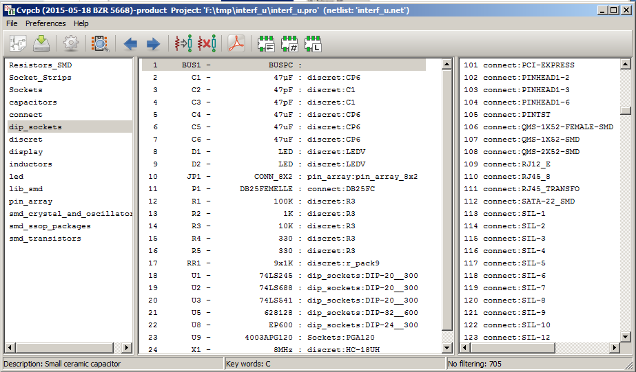

The left pane contains the list of available footprint library file
names associated with the project. The center pane contains the list of
components loaded from the net list file. The right pane contains the
list of available footprints loaded from the project footprint libraries.
The component pane will be empty if no netlist file has been loaded
and the footprint pane can be also empty if no footprint libraries are
found.

Main Window Toolbar
~~~~~~~~~~~~~~~~~~~

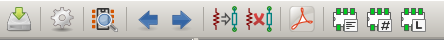

The top toolbar allows for easy access to the following commands:

[width="80%",cols="10%,90%",]
|=======================================================================
|image:images/icons/open_document.png[]
|Select the net list file to be processed.

|image:images/icons/save.png[]
|Save the footprint association file (.cmp) and the updated net list
(.net) file.

|image:images/icons/config.png[]
|Invoke the CvPcb configuration menu.

|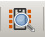
|Display the footprint of the component selected in the footprint
window.

|image:images/icons/left.png[]
|Automatically select the previous component in the list without a
footprint association.

|image:images/icons/right.png[]
|Automatically select the next component in the list without a footprint
association.

|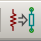
|Automatically associate footprints with components starting using an
equivalence file.

|image:images/icons/delete_association.png[]
|Delete all footprint assignments.

|
|Open the selected footprint documentation pdf file using the default
pdf viewer.

|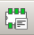
|Enable or disable the filtering to limit the list of footprints to the
footprint filters of the selected component.

|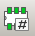
|Enable or disable the filtering to limit the list of footprints using
the pin count of the selected component.

|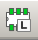
|Enable or disable filtering to limit the list of footprints using the
selected library.
|=======================================================================

Main Window Keyboard Commands
~~~~~~~~~~~~~~~~~~~~~~~~~~~~~

The following table lists the keyboard commands for the main window:

[width="80%",cols="15%,85%",]
|=======================================================================
|Right Arrow / Tab|Activate the next pane to the right of the currently activated pane.
Wrap around to the first pane if the last pane is currently activated.

|Left Arrow |Activate the next pane to the left of the currently activated
pane. Wrap around to the last pane if the first pane is currently activated.

|Up Arrow |Select the previous item of the currently selected list.

|Down Arrow |Select the next item of the currently selected list.

|Page Up |Select the item up one full page of the currently selected
list.

|Page Down |Select the item down one full page of the currently selected
list.

|Home |Select the first item of the currently selected list.

|End |Select the last item of the currently selected list.
|=======================================================================

CvPcb Configuration
~~~~~~~~~~~~~~~~~~~

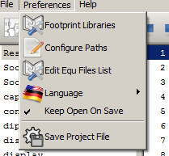

CvPcb can be automatically closed after saving the footprint association
file, or not.

Invoking the ``Libraries'' entry in the ``Preferences'' menu displays
the library configuration dialog.

Depending of the CvPcb version, there are 2 different libraries
management:

- The legacy management, using *.mod files, and a library list of files.

- The new ``Pretty'' format, using one file by footprint. It uses a
  folder list. Each folder (*.pretty folder name) is a library. When
  using the new management, You also can use native libraries coming
  from GEDA/GPCB or Eagle xml format files.

Footprint Libraries Management
------------------------------

Important remark:
~~~~~~~~~~~~~~~~~

* Until December 2013, CvPcb uses a library management called *_Legacy management_*
* Since December 2013, CvPcb no longer uses the Legacy management,
but a new management using *_Footprint Libraries tables_*.
It is a bit more complex, but is more powerful
and allows *direct use of footprint libraries* from
* KiCad Legacy footprint libraries
* KiCad New _.pretty_ footprint libraries (on your local disk)
* KiCad New _.pretty_ footprint libraries (on our Github server, or other Github server))
* GEDA libraries
* Eagle footprint libraries

[[_legacy_management_selecting_footprint_libraries]]
Legacy management: selecting Footprint Libraries
~~~~~~~~~~~~~~~~~~~~~~~~~~~~~~~~~~~~~~~~~~~~~~~~

*_This section is relevant only for KiCad versions before December 2013_*

This section of the footprint library configuration dialog is used to
add, remove, and change the search order of the footprint libraries for
the current project. The library order is critical when searching for
footprints with duplicate names. CvPcb will use the first occurrence of
the footprint name it finds. If you create a new footprint, it is always
a good idea to give it a unique name to prevent naming conflicts. This
is a known issue and will be fixed in a future version of KiCad. Please
note that changing these libraries will also effect Pcbnew.

image:images/en/footprint_select.png[]

- *Remove:* Removes the selected footprint library from the list.
- *Add:* Adds a new footprint library to the end of the list.
- *Insert:* Inserts a new footprint library to the list before the currently selected library.
- *Up:* Move the currently select library up the list.
- *Down:* Move the currently selected library down the list.

Changing the Footprint Documentation File.
^^^^^^^^^^^^^^^^^^^^^^^^^^^^^^^^^^^^^^^^^^

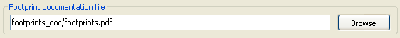

Select the ``Browse'' button to select a new footprint documentation
file with the display file select dialog.

Changing Footprint Library Search Paths.
^^^^^^^^^^^^^^^^^^^^^^^^^^^^^^^^^^^^^^^^

CvPcb uses two types of paths: the default paths automatically set by
KiCad when a new project is created and paths added by the user. These
paths are used to find the footprints library files (.mod), equivalence
files (.equ), and 3D model files (.wrl) used by CvPcb. The default paths
cannot be edited. Only new user defined paths can be added to the search
path list.

image:images/en/path_select.png[]

Changing User Define Paths.
^^^^^^^^^^^^^^^^^^^^^^^^^^^

Click the ``Add'' button to add a new path after the selected entry in
the search path list. Click the ``Insert'' button to insert a new path
before the selected entry in the search path list. Click the ``Remove''
button to remove the selected user defined search path. Clicking the
``Remove'' button will have no effect if a default search path is
selected.

image:images/en/user_path.png[]

Default Library Paths
^^^^^^^^^^^^^^^^^^^^^

By default CvPcb internally uses a set of predefined paths used to search
for footprint libraries. These paths are operating system dependent. It
is generally preferable to use relative paths rather than absolute paths
whenever possible to prevent platform dependency problems. In other
words: “c:\Program Files\kicad\share” has no meaning and will fail on
Linux and OSX.

The default Linux library paths will be as follows:

- *root/share/kicad/modules*
- *root/share/kicad/modules/packages3d* (for 3D shapes files
  format *VRML* created par Wings3D).
- *root/share/template*

Where the root path is relative to the binary path where KiCad is
installed. Typically on Linux Kicad is installed in the /usr/bin path.
Therefore the root path would be /usr.

New Management: Footprint Libraries tables
~~~~~~~~~~~~~~~~~~~~~~~~~~~~~~~~~~~~~~~~~~

include::CvPcb_footprint_libraries_tables.adoc[po4a]

Viewing the Current Footprint
-----------------------------

The view footprint command
~~~~~~~~~~~~~~~~~~~~~~~~~~

The view footprint command displays the footprint currently selected in
the _footprint_ window. A 3D model of the component can be shown if it
has been created and assigned to the footprint. Below is the footprint
viewer window.

image:images/en/footprint_view.png[]

Status Bar Information
^^^^^^^^^^^^^^^^^^^^^^

The status bar is located a the bottom of the CvPcb new main window and
provides useful information to the user. The following table defined the
contents of each pane in the status bar.

Keyboard Commands
^^^^^^^^^^^^^^^^^

[width="80%",cols="20%,80%",]
|==================================================================
|F1 |Zoom In
|F2 |Zoom Out
|F3 |Refresh Display
|F4 |Move cursor to center of display window
|Home |Fit footprint into display window
|Space Bar |Set relative coordinates to the current cursor position
|Right Arrow |Move cursor right one grid position
|Left Arrow |Move cursor left one grid position
|Up Arrow |Move cursor up one grid position
|Down Arrow |Move cursor down one grid position
|==================================================================

Mouse Commands
^^^^^^^^^^^^^^

[width="80%",cols="32%,68%",]
|============================================================
|Scroll Wheel |Zoom in and out at the current cursor position
|Ctrl + Scroll Wheel |Pan right and left
|Shift + Scroll Wheel |Pan up and down
|Right Button Click |Open context menu
|============================================================

Context Menu
^^^^^^^^^^^^

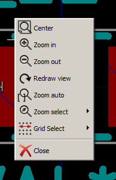

Displayed by right-clicking the mouse:

[width="80%",cols="44%,56%",]
|====================================================================
|Zoom Selection (Select Zoom) |Direct selection of the display zoom.
|Grid Selection (Grid Select) |Direct selection of the grid.
|====================================================================

Horizontal Toolbar
^^^^^^^^^^^^^^^^^^

[width="90%",cols="10%,90%",]
|=======================================================================
|
|Show display options dialog
|image:images/icons/zoom_in.png[]
|Zoom in

|image:images/icons/zoom_out.png[]
|Zoom out

|image:images/icons/redraw.png[]
|Redraw

|image:images/icons/zoom_fit_in_page.png[]
|Fit drawing in display area

|image:images/icons/open_3d_model_view.png[]
|Open 3D model viewer
|=======================================================================

Vertical Toolbar
^^^^^^^^^^^^^^^^

[width="90%",cols="10%,90%",]
|=======================================================================
|
|Show or hide the grid

|image:images/icons/coordination_system.png[]
|Show coordinates in polar or rectangular notation

|image:images/icons/unit_inch.png[]
|Display coordinates in inches

|image:images/icons/unit_mm.png[]
|Display coordinates in millimeters

|image:images/icons/pointer_style.png[]
|Toggle pointer style

|image:images/icons/toggle_pads_sketch.png[]
|Toggle between drawing pads in sketch or normal mode

|image:images/icons/toggle_text_sketch.png[]
|Toggle between drawing text in sketch or normal mode

|image:images/icons/toggle_edge_sketch.png[]
|Toggle between drawing edges in sketch or normal mode
|=======================================================================

Viewing the Current 3D Model
~~~~~~~~~~~~~~~~~~~~~~~~~~~~

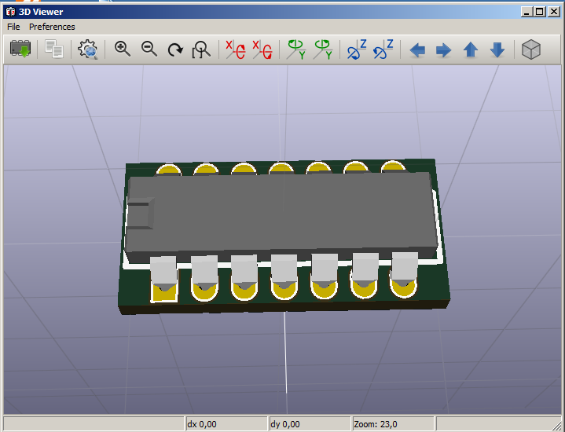

Mouse Commands
^^^^^^^^^^^^^^

[width="90%",cols="32%,68%",]
|============================================================
|Scroll Wheel |Zoom in and out at the current cursor position
|Ctrl + Scroll Wheel |Pan right and left
|Shift + Scroll Wheel |Pan up and down
|============================================================

Horizontal Toolbar
^^^^^^^^^^^^^^^^^^

[width="90%",cols="10%,90%",]
|=======================================================================
|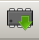
|Reload the 3D model

|image:images/icons/copy_to_clipboard.png[]
|Copy 3D image to clipboard

|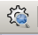
|Set 3D viewer options

|image:images/icons/zoom_in.png[]
|Zoom in

|image:images/icons/zoom_out.png[]
|Zoom out

|image:images/icons/redraw.png[]
|Redraw

|image:images/icons/zoom_fit_in_page.png[]
|Fit drawing in display area

|image:images/icons/rotate_back_x.png[]
|Rotate backward along the X axis

|
|Rotate forward along the X axis

|image:images/icons/rotate_back_y.png[]
|Rotate backward along the Y axis

|image:images/icons/rotate_forw_y.png[]
|Rotate forward along the Y axis

|
|Rotate backward along the Z axis

|
|Rotate forward along the Z axis

|image:images/icons/left.png[]
|Pan left

|image:images/icons/right.png[]
|Pan right

|image:images/icons/up.png[]
|Pan up

|image:images/icons/down.png[]
|Pan down

|image:images/icons/toggle_ortho.png[]
|Toggle orthographic projection mode on and off
|=======================================================================

Using CvPcb to Associate Components with Footprints
---------------------------------------------------

Manually Associating Footprints with Components
~~~~~~~~~~~~~~~~~~~~~~~~~~~~~~~~~~~~~~~~~~~~~~~

To manually associate a footprint with a component first select a
component in the component pane. Then select a footprint in the
footprint pane by double-clicking the left mouse button on the name of
the desired footprint. The unassigned next component in the list is
automatically selected. Changing the component footprint is performed in
the same manner.

Filtering the Footprint List
~~~~~~~~~~~~~~~~~~~~~~~~~~~~

If the selected component and/or library is highlighted when the one or
more of the filtering option is enabled, the displayed footprint list
in CvPcb is filtered accordingly.

Without filtering.

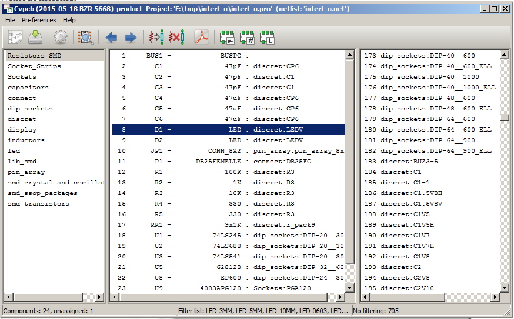

Filtered by list of footprint filters assigned to the selected
component. The component filters are listed on the center pane of the
status bar at the bottom of the main window.

image:images/en/filter_comp.png[]

In the component library editor in Eeschema, the footprint list was set
using the entries in the footprint filter tab of the component
properties dialog as shown below.

image:images/en/eeschema_filter.png[]

Filtered by the pin count of the selected component.

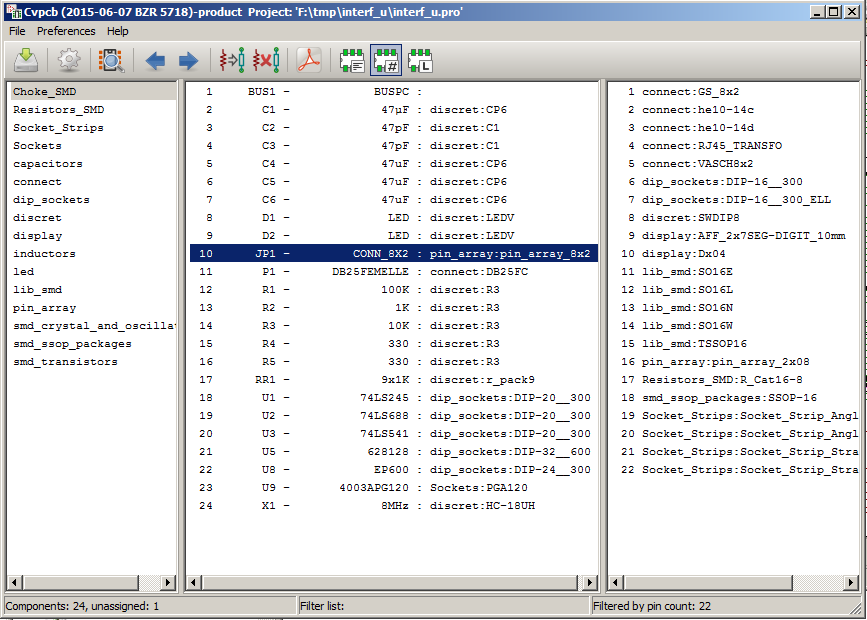

Filtered by the selected library.

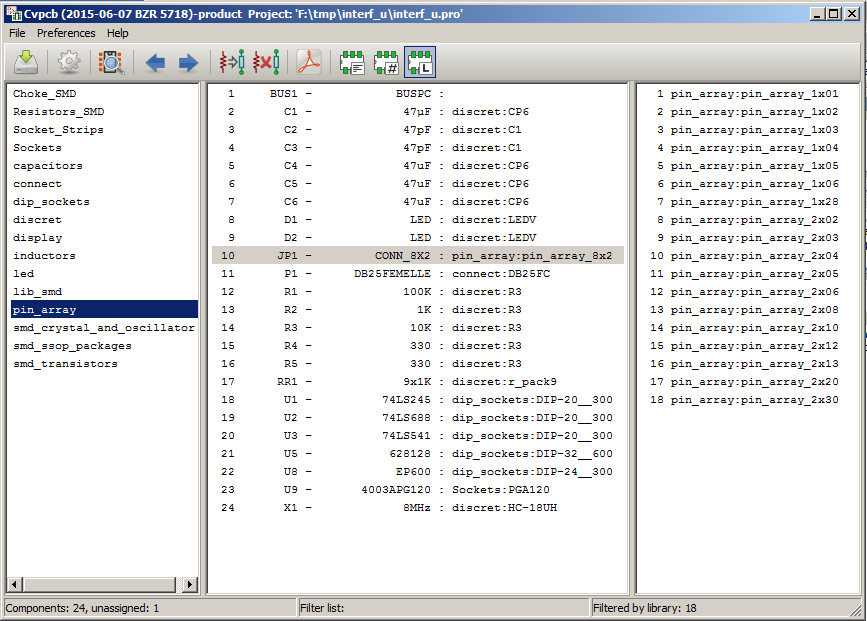

The icons image:images/icons_filter.png[] enable and disable the
filtering feature. When the filtering is not enabled, the full footprint
list is shown. The filtering can be combined to form more complex
filtering to help reduce the number of footprints in the footprint pane.

Filtered by the selected component pin count and the selected library.

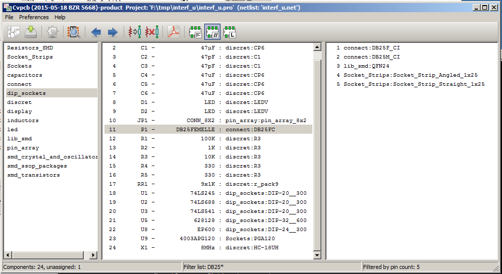

Automatic Associations
----------------------

Equivalence files
~~~~~~~~~~~~~~~~~

Equivalence files allow for automatic assignment of footprints to
components. They list the name of the corresponding footprint according
to the name (_value field_) of the component. These files typically
have the .equ file extension. They are plain text files and may be edited
by any plain text editor.

////
TODO
Refer to the section ``Selecting the equivalence files'' for more information.
////

Equivalence File Format
~~~~~~~~~~~~~~~~~~~~~~~

Equivalence files consist of one line for each component. Each line has
the following structure:

*`component value' `footprint name'*

Each name must be single quoted by the ’ character and the component and
footprint names must be separated by one or more spaces.

_Example:_

If the U3 component is circuit 14011 and its footprint is 14DIP300, the
line is:

+`14011' `14DIP300'+

Any line starting with *#* is a comment.

Here is an example equivalence file:

-----------------------------------------------
#integrated circuits (smd):
'74LV14' 'SO14E'
'74HCT541M' 'SO20L'
'EL7242C' 'SO8E'
'DS1302N' 'SO8E'
'XRC3064' 'VQFP44'
'LM324N' 'S014E'
'LT3430' 'SSOP17'
'LM358' 'SO8E'
'LTC1878' 'MSOP8'
'24LC512I/SM' 'SO8E'
'LM2903M' 'SO8E'
'LT1129_SO8' 'SO8E'
'LT1129CS8-3.3' 'SO8E'
'LT1129CS8' 'SO8E'
'LM358M' 'SO8E'
'TL7702BID' 'SO8E'
'TL7702BCD' 'SO8E'
'U2270B' 'SO16E'
#Xilinx
'XC3S400PQ208' 'PQFP208'
'XCR3128-VQ100' 'VQFP100'
'XCF08P' 'BGA48'

#upro
'MCF5213-LQFP100' 'VQFP100'

#regulators
'LP2985LV' 'SOT23-5'
-----------------------------------------------

Automatically Associating Footprints to Components
~~~~~~~~~~~~~~~~~~~~~~~~~~~~~~~~~~~~~~~~~~~~~~~~~~

Click on the automatic footprint association button on the top toolbar
to process an equivalence file. All components found by their value in
the selected equivalence (*.equ) file will have their footprint
automatically assigned.

////

[index]
Index
=====

////

////

[[indices-and-tables]]
Indices and tables
==================

- genindex
- modindex
- search

////

