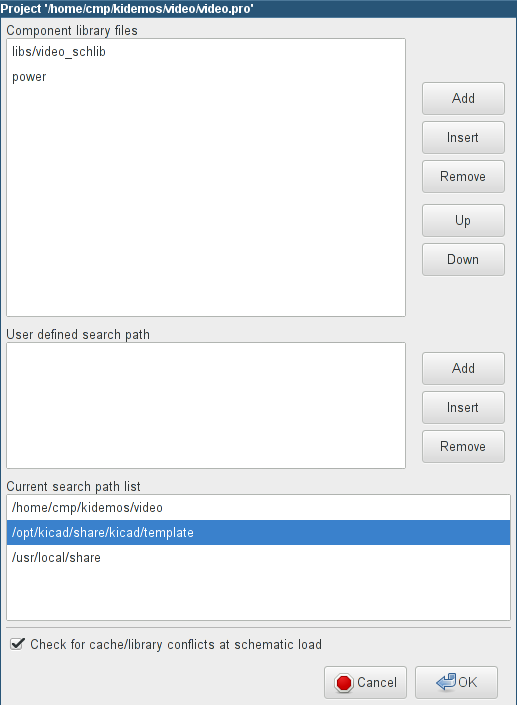
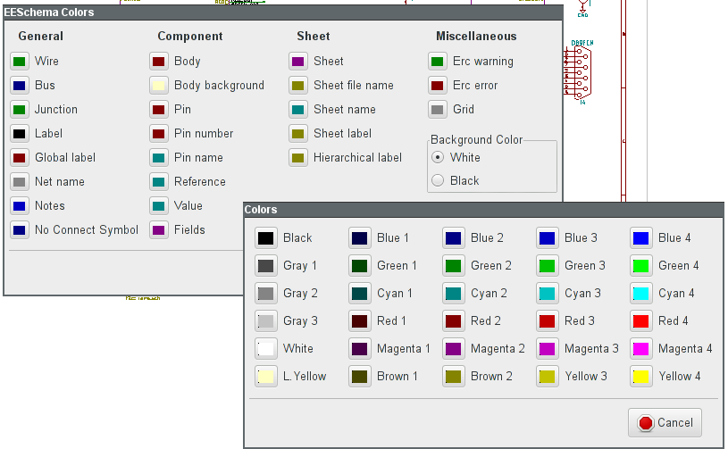
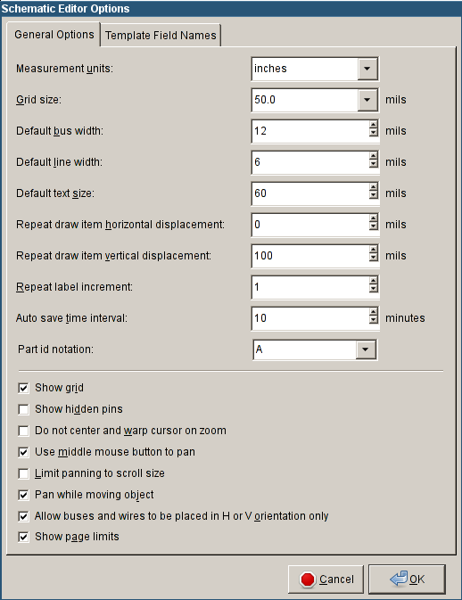

[[main-top-menu]]
== Main top menu

[[file-menu]]
=== File menu

image:images/en/file_menu.png[File menu]

[width="100%",cols="31%,69%",]
|=======================================================================
|New Schematic Project |Clear current schematic and initialize a new one

|Open Schematic Project |Load a schematic hierarchy

|Open Recent |Open a list of recently opened files

|Append Schematic Sheet |Insert the contents of another sheet into the current one

|Save Schematic Project |Save current sheet and all its hierarchy.

|Save Current Sheet Only |Save current sheet, but not others in a
hierarchy.

|Save Current Sheet As... |Save current sheet with a new name.

|Page Settings |Configure page dimensions and title block.

|Print |Print schematic hierarchy (See also chapter <<plot-and-print,Plot and Print>>).

|Plot |Export to PDF, PostScript, HPGL or SVG format (See chapter <<plot-and-print,Plot and Print>>).

|Close |Quit without saving.
|=======================================================================

[[preferences-menu]]
=== Preferences menu

[[preferences]]
==== Preferences

image::images/en/menu_path_hotkey_editor.png[Preferences menu]

[width="90%",cols="30%,70%",]
|================================================
|Component Libraries |Select libraries and library search path.
|Set Colors Scheme |Select colors for display, print and plot.
|Schematic Editor Options |General options (units, grid size, field names, etc.).
|Language |Select interface language.
|Hotkeys |List, edit, export, and import hotkey settings.
|Save Preferences |Save the project settings to the .pro file.
|Load Preferences |Load the project settings from a .pro file.
|================================================

[[preferences-menu-libs-and-dir]]
==== Preferences menu / Component Libraries

This dialog is used to configure component libraries and search paths.
The configuration parameters are saved in the .pro file. Different
configuration files in different directories are also possible.

Eeschema searches, in order:

1.  The configuration file (projectname.pro) in the current directory.
2.  The kicad.pro configuration file in the KiCad directory. This file
can thus be the default configuration.
3.  Default values if no file is found. It will at least then be
necessary to fill out the list of libraries to load, and then save the
configuration.

The 'Check for cache/library conflicts at schematic load' box is used to configure
the library conflict rescue behavior. See <<rescuing-cached-components,Rescuing Cached Components>> for more information about that.

[[preferences-menu-and-colors]]
==== Preferences menu / Set Color Scheme

Color scheme for various graphic elements, and background color selection (either black or
white).

[[preferences-and-options]]
==== Preferences menu / Schematic Editor Options

[width="100%",cols="40%,60%",]
|=======================================================================
|Measurement units: |Select the display and the cursor coordinate units
(inches or millimeters).

|Grid Size: a|
Grid size selection.

**It is recommended to work with normal grid (0.050 inches or 1,27 mm)**. __Smaller
grids are used for component building__.

|Default bus width: |Pen size used to draw buses.

|Default line width: |Pen size used to draw objects that do not have a
specified pen size.

|Default text size: |Text size used when creating new text items or labels

|Repeat draw item horizontal displacement a|
increment on X axis during element duplication (usual value 0)

(after placing an item like a component, label or wire,::
  a duplication is made by the _Insert_ key)

|Repeat draw item vertical displacement |increment on Y axis during
element duplication (usual value is 0.100 inches or 2,54 mm)

|Repeat label increment: |Increment of label value during duplication of texts ending
in a number, such as bus members (usual value 1 or -1).

|Auto save time interval: |Time in minutes between saving backups.

|Part id notation: |Style of suffix that is used to denote component parts (U1A, U1.A, U1-1, etc.)

|Show Grid: |If checked: display grid.

|Show hidden pins: |Display invisible (or __hidden__) pins, typically power pins. If checked,
allows the display of power pins.

|Do not center and warp cursor on zoom: |When zooming, keep the position and cursor where they are.

|Use middle mouse button to pan |When enabled, the sheet can be dragged around using the middle mouse button.

|Limit panning to scroll size |When enabled, the middle mouse
button cannot move the sheet area outside the displayed area.

|Pan while moving object |If checked, automatically shifts the window
if the cursor leaves the window during drawing or moving.

|Allow buses and wires to be placed in H or V orientation only a|
If checked, buses and wires can only be vertical or horizontal.

Otherwise, buses and wires can be placed at any orientation.

|Show page limits |If checked, shows the page boundaries on screen.
|=======================================================================

[[preferences-and-language]]
==== Preferences and Language

Use default mode. Other languages are available mainly for development
purposes.

[[help-menu]]
=== Help menu

Access to on-line help (this document) for an extensive tutorial about
KiCad. Use ``Copy Version Information'' when submitting bug reports to
identify your build and system.
