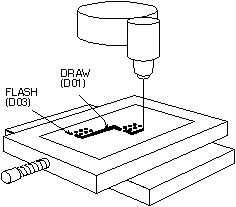

Gerber Format Info
------------------

image:images/dcodes_5EB0000016B59714152.png[dcodes_5EB0000016B59714152_png,scaledwidth="50%"]
image:images/dcodes_09D000000A3540174CA.png[dcodes_09D000000A3540174CA_png,scaledwidth="50%"]

mailto:steve@artwork.com[Steve DiBartolomeo]

Applications Manager

Artwork Conversion Software, Inc.

© 1991 Artwork Conversion Software, Inc.

<<<

Introduction
~~~~~~~~~~~~

No matter how powerful your design software may be, you must eventually
create a photoplot file in Gerber format to create film. Aggravation can
be reduced by better understanding what is contained in a photoplot
file. Misunderstandings between the PCB designer and photoplot operator
account for a large percent of the bad film produced in this industry.

A Brief Description of the Photoplotter
~~~~~~~~~~~~~~~~~~~~~~~~~~~~~~~~~~~~~~~

Before diving into the details of the photoplot file a short discussion
of photoplotters will make the following material easier to digest.
Early photoplotters consisted of a precision servo controlled X-Y table
to which a piece of high contrast film is attached. A bright light
source is directed through a shutter, through an aperture wheel and
focused onto the film. A controller converts Gerber commands into the
appropriate table movements, wheel rotation and shutter opening.

image::images/dcodes_0DF000001099C83334C.png[Photoplotter Schematic]
*Figure 1* Photoplotter Schematic

When the shutter is open light shines through the aperture exposing the
aperture's image onto the film. When the table simultaneously moves
while the shutter is open, a line or stripe is imaged onto the film.
Given the proper commands for table motion, aperture selection and
shutter operations, one can construct just about any image on film.

*Figure 2* Plotter Operation

Simplicity: A double-edged sword
~~~~~~~~~~~~~~~~~~~~~~~~~~~~~~~~

The beauty of the Gerber database is its simplicity. There are only four
essential commands plus coordinate data. The database had to be simple
and compact because the first machines were driven by a fragile punched
paper tape. The need to compress as much information as possible into as
few bytes as possible explains many of the "problems" we encounter today
when storage space is measured in hundreds of megabytes instead of
hundreds of bytes.

But simplicity exacts its own price. The Gerber file lacks essential
information necessary to run the plotter. This missing data is handed
from the designer to the plotter operator separately, and is often the
source of errors. Further, the temptation to create non-standard
extensions is impossible to resist. Every photoplotter manufacturer
supports the basic Gerber commands plus whatever features they feel
necessary to differentiate their machine. The result is that one man's
feature is the next man's unsupported problem.

Gerber File Contents
~~~~~~~~~~~~~~~~~~~~

Below is a simple Gerber file illustrating the structure and content of
the format:

--------
G90*         1
G70*         2
G54D10*      3
G01X0Y0D02*  4
X450Y330D01* 5
X455Y300D03* 6
G54D11*      7
Y250D03*     8
Y200D03*     9
Y150D03*     10
X0Y0D02*     11
M02*         12
--------

The line numbers at far right are not part of the file. Examining this
file without any prior knowledge of Gerber one would correctly deduce
that each line represents a particular machine command and that the
asterisk (*) is the end of command character. There seems to be
different kinds of commands: instructions beginning with G, D, M and x,y
coordinate data.

G-Codes: Setting the Initial Conditions
~~~~~~~~~~~~~~~~~~~~~~~~~~~~~~~~~~~~~~~

Gerber calls the Gxx commands preparatory codes. In most cases these
codes are used to prepare the machine's state prior to drawing. Several
G codes are important to recognize:

G90/G91 Incremental vs. Absolute Coordinates.
^^^^^^^^^^^^^^^^^^^^^^^^^^^^^^^^^^^^^^^^^^^^^

The G90 command in line 1 tells the machine that data coordinates are
absolute. Each set of coordinates is referenced to the table's origin
(0,0). The converse to absolute is incremental-each coordinate is
measured relative the previous coordinate value and is set by issuing
the G91 command.

You may never encounter the G90 command in any Gerber file since most
programs assume that absolute coordinates are the default and do not
bother to write the G90 command. What's worse is that many incremental
databases don't bother to use the G91 command either. If you see a
"starburst" display similar to figure 3 on your CAM station you are
probably trying to read a file written with incremental coordinates.

G70/G71 Inches vs. Millimeters
^^^^^^^^^^^^^^^^^^^^^^^^^^^^^^

The G70* (line 2) indicates that data following is in units of inches.
This is another G-code that rarely appears in Gerber files. In the U.S.
one assumes that Gerber files are output in inches, but files generated
in the rest of the world may be in inches or millimeters. G71 indicates
units of millimeters.

image:images/dcodes_0F5000000796F138525.png[dcodes_0F5000000796F138525_png]

*Figure 3* Left: correctly displayed. Right: Viewer set to incremental
when data is absolute.

Tool Select G54
^^^^^^^^^^^^^^^

G54, tool select, (line 3) is the most commonly encountered G code and
instructs the plotter to rotate the aperture wheel to the position
described by Dxx immediately following the G54 command. If you find no
G54's in a particular file don't panic. G54 is an optional command on
many photoplotters; some programs don't use it and the photoplotter
recognizes that by specificity Dxx (where xx is not 01,02,03) that the
correct tool should be selected.

Draw and Flash Commands D01, D02, D03
~~~~~~~~~~~~~~~~~~~~~~~~~~~~~~~~~~~~~

D-codes are instructions to the photoplotter that naturally include the
letter "D." The first three D-codes control the movement of the x-y
table.

D01 (D1): move to the x-y location specified with the shutter *open* .

D02 (D2): move to the x-y location specified with the shutter *closed* .

D03 (D3): move to the x-y location specified with the shutter *closed* ;

*then open and close the shutter* -known as flashing the exposure.

D01 is the command that "draws" lines. D02 is the command to move the
table without exposing any film. D01 and D02 correspond to moving the
paper on a pen plotter with the pen down and pen up.

D03 is the "flash" command. The table is moved with the shutter closed.
When the desired x-y coordinates are reached the shutter opens and
closes leaving the image of the aperture on the film. The flash
instruction is an efficient way to image the thousands of pads present
on most circuit boards.

D01, D02 and D03 commands follow their coordinate data. For example the
following sequence of commands:

 X0Y0D02*
 X450Y330D01*
 X455Y300D03*

would move the table position to 0,0 with the shutter closed and then
would draw a line from 0,0 to 450,330. A flash would be located at
455,300.

Wheel Positions D10-D999
~~~~~~~~~~~~~~~~~~~~~~~~

Unlike D01, D02 and D03 the D-codes with values from 10-999 are data,
not commands. They represent apertures or positions on the
photoplotter's wheel. Early photoplotters used a wheel with 24
positions.

Each slot is filled with a piece of film. The wheel rotates, positioning
the desired aperture in the light path. Table 1 shows the correspondence
between D-code and aperture position.

.*Table 1.* D-codes vs. Apertures
----
D-code Aperture D-code Aperture
       Position        Position
 10      1       20      13
 11      2       21      14
 12      3       22      15
 13      4       23      16
 14      5       24      17
 15      6       25      18
 16      7       26      19
 17      8       27      20
 18      9       28      21
 19      10      29      22
 70      11      72      23
 71      12      73      24
----

One can see that it proceeds logically from D10 through D19. Then,
instead of D20 mapping into position 11, D70 and D71 intrude. The
mapping continues, now skewed by two places until reaching the point
where one would expect to see D30. Instead D72 and D73 jump in. Most
photoplotters and CAM software ask you to enter the aperture
descriptions by D-code; a few reference by aperture position. There are
D-codes between 3 and 9 but they are specialized commands for rare or
obsolete machines.

Miscellaneous M Codes
~~~~~~~~~~~~~~~~~~~~~

At the end of the file we see the command M02*. Gerber calls the M
codes, miscellaneous codes. The only common M-code used is at the end of
the file- M00, M01 and M02 which are all different types of program
"stop" commands. Occasionally one sees an M02 at the beginning of a
Gerber file. Apparently some applications issue this to insure that any
previous file running is stopped - however many CAM softwares see the
M02 at the beginning of the file and ignore anything following it.

X,Y Coordinate Data
~~~~~~~~~~~~~~~~~~~

Coordinate data makes up the bulk of the Gerber file. It is difficult to
manually follow table motion from a printout because Gerber uses several
techniques to minimize the number of bytes required to represent the
data. These are:

* Suppress the decimal point in the x,y data
* Suppress either the leading or the trailing zeros
* Only output changes in coordinate data

Decimal Point Suppression
~~~~~~~~~~~~~~~~~~~~~~~~~

The decimal point is redundant if you know in advance where it will be.
The decimal point needs to be reinserted by the photoplotter control
software in the correct location. One of the most common errors that
novice designers make is to assume that the person receiving their data
knows you data format. Consider the following Gerber commands:

 X00560Y00320D02*
 X00670Y00305D01*
 X00700Y00305D01*

The table moves along X from 00560 to 00670 during the first two
commands. But what does 00560 represent? It could be 5.6 inches, 0.56
inches, 0.056 inches or even (but not likely) 0.0056 inches. No way to
tell. If the designer tells you that there are two integers before the
decimal point and 4 integers after the decimal point then you know that
00560 represents 0.56 inch.

*Rule 1.* __* When you send a Gerber file, always provide the data
format. When you receive a Gerber file, always ask for the data
format.__*

What if your customer violates Rule 1 and sends you a Gerber file with
no data format information? You're working graveyard shift, it's 11pm
and you need to plot the film by 8am the next morning. Make an educated
guess. There are five digits in the coordinates so that the sum of
integers before and after the decimal point must equal 5. The most
likely candidate is 2.3.

Why? Not many boards are longer than 99 inches and not many boards are
built to a precision less than 0.001 inch these days. Display the board
on your CAM station. If the overall size looks good (say 8 inches) go
ahead. If the board shows up as 80 inches or 0.8 inches long you are
probably off by a factor of 10 in one direction or the other.

Leading and Trailing Zero Suppression
~~~~~~~~~~~~~~~~~~~~~~~~~~~~~~~~~~~~~

The designers of the Gerber database didn't rest after eliminating the
decimal point. They must have looked at a printout and thought,

"What good are all those extra zeros in front? suppose we cut them off.
You can still figure out the coordinate value if you count decimal
points from the right side of the number."

[width="50%",grid="none",frame="none",options="header"]
|============================================
|No Zero Suppression|Leading Zero Suppression
|X00560Y00320D02*   |X560Y230D2*
|X00670Y00305D01*   |X670Y305D1*
|X00700Y00305D01*   |X700Y305D1*
|============================================

Without zero suppression 48 bytes are used. With leading zero
suppression 33 bytes are required to represent the same information. In
the days of paper tape this was a very significant reduction.

Depending on the data you might be better off leaving the leading zeros
on and suppressing the trailing zeros.

[width="50%",grid="none",frame="none",options="header"]
|============================================
|No Zero Suppression|Trailing Zero Suppression
|X00560Y00320D02*   |X0056Y0032D2*
|X00670Y00305D01*   |X0067Y00305D1*
|X00700Y00305D01*   |X007Y00305D1*
|============================================

To correctly interpret the data you must count from the left side of the
number to locate the decimal point. Confusing? Yes. Leading to Rule 2:

Rule 2. __* When you send a Gerber file, always indicate leading or
trailing zero suppression. When you receive a Gerber file, always ask
about leading or trailing zero suppression.__*

It turns out that leading zero suppression is more commonly encountered.

Modal Data Coordinates
~~~~~~~~~~~~~~~~~~~~~~

After eliminating the decimal point and suppressing the redundant zeros
you might think that the database designers would rest on their success.
Not at all. One sharp eyed programmer noticed that the same coordinate
would appear over and over again when the table moved only along X or Y.

"Why not remember the last value of X and Y; output a coordinate only if
it changes!"

[width="50%",grid="none",frame="none",options="header",]
|=================================
|All Coordinates|Modal Coordinates
|X560Y230D2*    |X560Y230D2*
|X670Y305D1*    |X670Y305D1*
|X700Y305D1*    |X700D1*
|=================================

The concept that the plotter remembers the last value of coordinates is
called modality. PC boards often have hundreds of pads in a row along X
or Y and a properly sorted Gerber file will be much smaller when the
redundant coordinate is eliminated. This is such a fundamental concept
that coordinate data is always modal. You don't need to inform your
target site that data is modal or nonmodal - every photoplotter and CAM
software supports modal data. In this example an additional 4 bytes were
save by using modal coordinates.

Modal Commands
~~~~~~~~~~~~~~

Modality is a good concept for data and works equally well for commands.
For example, if you have a string of draw commands why repeat the D01
command again and again. Let it stay in effect until another command
(D02 or D03) occurs to change it.

[width="80%",grid="none",frame="none",options="header"]
|========================
|D1 not modal|D1 modal
|X560Y230D2* |X560Y230D2*
|X670Y305D1* |X670Y305D1*
|X700D1*     |X700D1*
|X730D1*     |X730D1*
|X760D1*     |X760D1*
|Y335D1*     |Y335D1*
|========================

It would appear that all commands in Gerber ought to be modal. Once
issued the command is in effect until otherwise superseded or turned
off. However there are a couple of erratic exceptions that occasionally
cause trouble. The most curious is the D03 flash command.

Certain brands of photoplotters don't treat D03 as modal. That is, they
expect to see D03 at the end of each flash command. We've encountered
this on MDA's FIRE 9000 family of photoplotters.

Flashes that were displayed on our CAM software didn't appear on the
film. The problem is easily solved by re-outing the Gerber data with
explicit D03's - Lavenir has a utility that does this and many CAM
software's can be configured to treat D03 as either modal or non-modal.

The other erratic exception to the standard modal behavior of commands
is the G02/G03 command - circular interpolation. Many photoplotters
revert to G01 (linear) after a G02/G03 (circular).

Circular Commands: G02/G03 and G75
~~~~~~~~~~~~~~~~~~~~~~~~~~~~~~~~~~

Gerber photoplotters can draw arcs when instructed to do so. In the
past, circular commands were rarely used for PCB manufacturing. Flex
circuit boards use curved traces to reduce stress, and high speed logic
uses uses smooth radii to reduce signal reflection. There is renewed
interest in reading and writing Gerber data with arcs and few rude
surprises are surfacing.

The basic format for circular interpolation is:

 GNN XNNNN YNNNN INNNN JNNNN DNN *

_Example:_ +G02X40Y30150J0D01*+

Where G02 indicates clockwise rotation, G03 indicates counterclockwise
rotation and G75 turns on full 360 degree circular. I, J are additional
coordinates required to locate the center of the arc. G02 and G03
commands are rarely treated as modal.

It would take more room available in this paper to properly treat the
various permutations that can occur. Circular commands may be limited to
just quadrant data on older machines or can describe full 360 degree
arcs on newer machines. The meaning of I, J changes depend on whether
data coordinates are absolute or incremental.
