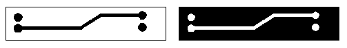
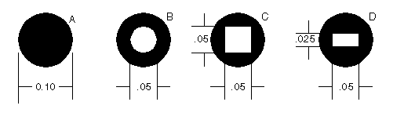
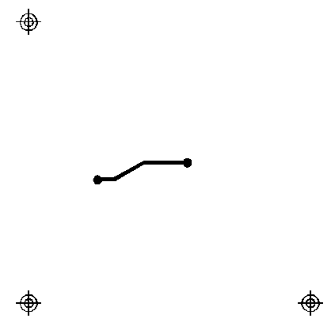
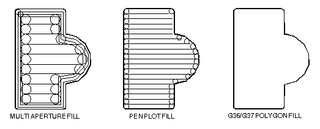

RS274X-Format-Info
------------------

mailto:steve@artwork.com[Steve DiBartolomeo]

Applications Manager

Artwork Conversion Software, Inc. 

© 1995 Artwork Conversion Software, Inc.

<<<

Introduction
~~~~~~~~~~~~

If you're a PCB designer you're probably hearing more and more about
extended Gerber **RS274X** . The latest versions of many PCB layout
programs either offer RS274X as an option or only output RS274X -- such
as Cadence's Allegro.

Benefits of RS274X
^^^^^^^^^^^^^^^^^^

RS274X includes many high level commands and controls that let the
creator of the Gerber data specify the photoplot very precisely - much
more so than RS274D which entailed passing a lot of critical information
separately from the data file.

What is RS274X anyway?
^^^^^^^^^^^^^^^^^^^^^^

It is an extension to standard RS274D (commonly known as Gerber) that
includes:

* embedded format, unit and data information
* embedded apertures
* custom aperture definitions
* film control statements
* multiple layers embedded in a single file
* special polygon definitions

This document assumes that you are familiar with the basic Gerber
commands - if not you may wish to first review the article *Apertures,
D-Codes and Plot Files* which summarizes basic Gerber.

Some of the embedded information we mention here is actually available,
although rarely used, in the RS274D specification.

Where to Get the Official RS274X Spec?
^^^^^^^^^^^^^^^^^^^^^^^^^^^^^^^^^^^^^^

The RS274X specification was developed by Gerber Systems.

Gerber was purchased by Barco, a Belgian company. The 427X spec is now
available at:

http://www.barco.com/ets/data/rs274xc.pdf

Embedding Format Info in the 274X Header
~~~~~~~~~~~~~~~~~~~~~~~~~~~~~~~~~~~~~~~~

RS274X includes a statement that embeds key information about the
format, zero suppression and data mode into a single line:

* format (x,y)
* zero suppression (leading, trailing or none)
* coordinates (absolute or incremental)

image:images/rs274x_1E80000005C6AC0D0B8.png[rs274x_1E80000005C6AC0D0B8_png]

where:

L = leading zeros omitted

T = trailing zeros omitted

D = explicit decimal point (i.e. no zeros omitted)

A = absolute coordinate mode

I = incremental coordinate mode

Nn = sequence number, where n is number of digits (rarely used)

Gn = prepartory function code (rarely used)

Xa = format of input data (5.5 is max)

Yb = format of input data

Zb = format of input data (Z is rarely if ever seen)

Dn = draft code

Mn = misc code

Examples
^^^^^^^^

%FSLAX24Y24*%

Format Statement Leading Zeros Suppression, Absolute Coordinates
format=2.4

%FSTIX44Y44*%

Format Statement Trailing Zero Supression, Incremental Coordinates,
format=4.4

Embedded Units
^^^^^^^^^^^^^^

RS274X files can use coordinate and aperture units of either inches or
millimeters. The statements:

%MOIN*% indicates inches

%MOMM*% indicates millimeters

Image Polarity
^^^^^^^^^^^^^^

With the old RS274D one had to instruct the photoplot operator manually
on the desired polarity of the film. If the operator didn't pay
attention or got confused then your film came out wrong. With RS274X a
command near the beginning of the file can invert the film's polarity.

%IPPOS*% - positive (left)

%IPNEG*% - negative (right)

Do not confuse image polarity with individual layer polarity. It is
possible to build up a very complex plot by combining individual dark
and clear plots and then setting the overall polarity of the film.

Embedded Aperture Definitions
^^^^^^^^^^^^^^^^^^^^^^^^^^^^^

One of the major shortcomings of the old RS274D spec was that the
definition of each aperture was not part of data file; instead it was
transferred manually on paper or as a text file similar to what is seen
below:

Aperture Definitions
++++++++++++++++++++

D-code Shape SizeX Size Y

d10 round 0.010

d11 square 0.030

d12 rect 0.060 0.020

d13 thermal 0.050

d14 oblong 0.060 0.025

Some apertures are obvious - the round, square and rectangle. But both
the oblong and the thermal are subject to the photoplot operator's
interpretation as shown below.

image:images/rs274x_1540000006E37B1F5CF.png[rs274x_1540000006E37B1F5CF_png]

Basic Thermal --- Rotated Thermal --- Square Thermal

With 274D, building the exact thermal shape was a job for the photoplot
operator; there was significant amount of effort and expense involved in
creating these custom apertures and libraries had to be maintained.

With 274X even complex apertures are described using macros that the
photoplotter (and hopefully your CAM software) synthesizes on-the-fly.

The Basic Aperture Definitions
++++++++++++++++++++++++++++++

RS274x includes several "standard" apertures since these represent more
than 90 percent of the flash types used:

* circle
* rectangle
* obround
* polygon

These are all assumed to be centered and can be defined with a round or
rectangular hole if desired.

Standard Circle
+++++++++++++++

%ADD\{code}C,\{$1}X\{$2}X\{$3}*%

where

AD -aperture description parameter

D\{code} d-code to which this aperture is assigned (10-999)

C tells 274X this is a circle macro

$1 value (inches or mm) of the outside diameter

$2 optional, if present defines the diameter of the hole

$3 optional, if present the $2 and $3 represent the size of

a rectangular hole.

Circle Examples
+++++++++++++++

%ADD21C,.100*% _(a) 0.10 diameter circle on d21_

%ADD22C,.100X.050*% _(b) 0.10 dia circle with 0.05 hole_

_on d22._

%ADD23C,.100X.050X.050*% _(c) 0.10 dia circle with 0.05 square_

_hole on d23_

%ADD24C,.100X.050X.025*% _(d) 0.10 dia circle with 0.05 x 0.025_

_rectangular hole on d24_

Standard Rectangles
+++++++++++++++++++

%ADD\{code}R,\{$1}X\{$2}X\{$3}X\{$4}*%

where

AD -aperture description parameter

D\{code} d-code to which this aperture is assigned (10-999)

R tells 274X this is a rectangle macro

$1 value (inches or mm) of rect's length in X

$2 value if rect's height in Y

$3 optional, if present defines the diameter of the hole

$4 optional, if present the $2 and $3 represent the size of

a rectangular hole.

For details on the obround and polygon (which are rarely used) see
_Gerber Format Guide, Doc 0000-000-RM-00._

Aperture Macros
+++++++++++++++

The more general aperture macro can be thought of as a type of
programming language where one builds up a complex aperture definition
from a series of simpler primitives. While this is a very powerful
feature of RS274X, using it has its drawbacks.

Remember that 274X is essentially Gerber Scientific's standard -
photoplotter's from other manufacturer's may not read 274X at all - even
if they do implement a subset of 274X it is usually the simpler commands
that are supported and complex commands such as aperture macros may not
translate correctly or at all. Therefore most PCB layout programs do not
make use of complex aperture macros.

However macros are almost required defining thermal reliefs - and since
thermal reliefs are very important in power and ground planes we'll do a
detailed example of macros using the thermal primitive.

Macro Primitives
++++++++++++++++

Remember we said a macro is like a programming language - the complex
aperture is built from one or more shapes called primitives. Available
primitives include:

*Primitive Name* *Primitive Number* *Description and Parameter Number*

Circle (1) round

Line Vector (2 or 20) rectangle defined by endpoints

width and rotation. Square ends.

Line Center (21) rect - defined by center and length, width

and rotation. Square ends.

Line-Lower Left (22) rect - defined by lower left coordinate,

length, width and rotation.

Outline (4) outlines an area defined by coordinate pairs.

max vertice=50.

Polygon (5) a regular polygon with 3-10 sides. defined

by center, outer diameter and rotation.

Moire (6) target defined by center, number of circles

circle thickness, cross hair length, thickness

and rotation.

Thermal (7) thermal relief defined by outer diameter, inner

diameter, crosshair thickness and rotation.

Aperture Macro Example - Thermal Relief
+++++++++++++++++++++++++++++++++++++++

The thermal relief is so important that it has its own primitive - even
though it could be built from other primitives.

image:images/rs274x_1E8000000787CC18D07.png[rs274x_1E8000000787CC18D07_png]

%AMTHERM100*7,0,0,0.100,0.050,0.025,0.0*%

%ADD32THERM100*% _assigns THERM100 to d-code 32_

where

AM - aperture macro

THERM100 - name of the macro

* - terminates name

7 - primitive 7, which is a thermal relief

0,0 - first two parms: x,y center

0.100 - third parm: outer diameter (solid black see (a) above)

0.050 - fourth parm: inner diameter (clear see (b) above)

0.025 - fifth parm: crosshair width (clear see (c) above)

0.0 - sixth parm: crosshair rotation (not used here)

Multiple Layers
^^^^^^^^^^^^^^^

It's been pretty standard practice in the PCB industry to build up a
phototool from multiple Gerber files. However the instructions to the
photoplotter operator have always been manual - leaving room for errors
and omissions. Here's how it used to be done:

Plotting Instructions for XYZ

Film1: top

targets.gbr pos

comp.gbr pos

padmaster.gbr pos

Film2: bottom

targets.gbr pos

sold.gbr pos

padmaster.gbr pos

Film3: vcc

vcc1.gbr neg

clearance.gbr neg

traces.gbr pos

RS274X includes two special commands, *%LPD*%* and *%LPC*%* that
organizes data inside the file by layer. With a few judicious LPD/LPC
commands combined with the IP (image polarity) command one can build up
complex ground planes quickly and easily. In the example below we will
show how the LPD/LPC can be used to put a circuit trace easily on a
power plane.

The main difficulty with putting a circuit trace on a power plane is
clearing away the metal around the circuit trace and it's associated
pads. With standard Gerber the layout software often had to fill in with
small strokes the entire powerplane metal area except where the
clearance would be. This results in a very large and unwieldy Gerber
file.

When creating such a Gerber file in 274X we can use the LPC (clear
layer) to draw the trace.

G04 Image Parameters _*_

%MOIN*%

%FSLAX24Y24*%

%IPNEG*% this will reverse polarity of the entire film,

eliminating the need to stroke the metal area

of the powerplane.

%ADD10C,,,*% here we define some round apertures and a thermal

%ADD11C...*%

%ADD12C...*%

%AMTHERMAL*...*%

%ADD13THERMAL*%

G04*

%LNINTERNAL_VCC*% this is our basic vcc powerplane layer consisting

of clearance pads, thermal reliefs, the outer trace

that defines the board edge, and the clearance

for the inner trace.

%LPD*% indicates digitized data is dark. However when the

entire film is reversed the digitzied data will be

clear.

G54D10*

data

data

data

G04 NEW LAYER _*_

%LNTRACE_VCC*% this defines the circuit trace and two pads A,B

%LPC*% note that the data here is clear or reversed out.

however when the entire film is negated the digitized

data will be black on the film.

G54D12*

data

data

data

M02* end of the job

[width="100%",cols="100%",]
|=======================================================================
|The series of images below show how a ground plane can be easily drawn,
a trace within the ground plane is placed and substracted, and the
entire image is then reversed.

a|
image:images/rs274x_1A5000001A1F9ACE4FA.png[rs274x_1A5000001A1F9ACE4FA_png]
| *Internal_VCC data. Note the large pads at A,B and the fat clearance
trace.*::
  [[section]]
  |

|=======================================================================

[width="100%",cols="26%,74%",]
|=======================================================================
|
|*The inner TRACE data. Since the layer is defined as LPC it will be
subtracted from the INTERNAL_VCC plane data.*
|=======================================================================

[width="100%",cols="32%,68%",]
|=======================================================================
|image:images/rs274x_193000000A0EEBFF4ED.png[rs274x_193000000A0EEBFF4ED_png]
|*The dark VCC layer merged with the clear TRACE layer but before
polarity reversal.*
|=======================================================================

[width="100%",cols="34%,66%",]
|=======================================================================
|image:images/rs274x_1C5000000B9443DD856.png[rs274x_1C5000000B9443DD856_png]
|*The dark VCC layer merged with the clear TRACE layer after polarity
reversal* .
|=======================================================================

G36/G37 Polygons
^^^^^^^^^^^^^^^^

The G36/G37 polygon command precedes the RS274X spec but only the newer
Gerber photoplotters supported it. However it is a very powerful command
and will see more use in the future for describing complex data often
encountered in IC packages, RF and microwave circuits and analog
devices.

When the photoplotter sees a G36* command it immediately changes mode -
it now ignores any aperture setting and treats each draw command as the
edge of a polygon to be filled in. The application creating the Gerber
file should create simple clean polygons.

Sample Usage of G36/G37
+++++++++++++++++++++++

G04 G36/G37 Polygon Example _*_

%MOIN*%

%FSLAX24Y24*%

%IPPOS*%

%ADD10C,,,*% here we define some apertures

%ADD11C...*%

%ADD12C...*%

G04*

%LPD*%

G54D10* select D10

G01*

G36* switch into polygon mode. The diameter and

shape of D10 no longer matters.

X123Y123D02* move to initial position with pen up

X234D01* draw a line (edge)

Y456D01* draw a line (edge)

X234D01* draw a line (edge)

Y123D01* draw a line (edge) back to original start

G37* end polygon mode.

[cols="^"]
|=======================================================================
|http://www.artwork.com/[ARTWORK CONVERSION SOFTWARE, INC.]
|417 Ingalls St., Santa Cruz, CA 95060, Tel (831) 426-6163, Fax 426-2824, 
email: mailto:webmaster@artwork.com[info@artwork.com]
|=======================================================================

