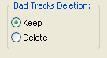
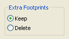
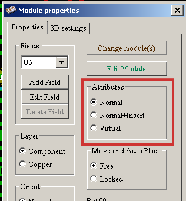

Create and modify a board
-------------------------

Creating a board
~~~~~~~~~~~~~~~~

Drawing the board outline
^^^^^^^^^^^^^^^^^^^^^^^^^

It is usually a good idea to define the outline of the board first.
The outline is drawn as a sequence of line segments. Select 'Edges
pcb' as the active layer and use the 'Add graphic line or polygon'
tool to trace the edge, clicking at the position of each vertex and
double-clicking to finish the outline. Boards usually have very
precise dimensions, so it may be necessary to use the displayed
cursor coordinates while tracing the outline. Remember that the
relative coordinates can be zeroed at any time using the space bar,
and that the display units can also be toggled using 'Alt-U'.
Relative coordinates enable very precise dimensions to be drawn. It
is possible to draw a circular (or arc) outline:

. Select the 'Add graphic circle' or 'Add graphic arc' tool
. Click to fix the circle centre
. Adjust the radius by moving the mouse
. Finish by clicking again.

Note that the width of the outline can be adjusted, in the
Parameters menu (recommended width = 150 in 1/10 mils) or via the
Options, but this will not be visible unless the graphics are
displayed in other than outline mode.

The resulting outline might look something like this:

image:images/Pcbnew_simple_board_outline.png[]

Importing a DXF drawing for a board outline
^^^^^^^^^^^^^^^^^^^^^^^^^^^^^^^^^^^^^^^^^^^

As an alternative to drawing the board outline in Pcbnew directly, an
outline can also be imported from a DXF drawing. Using this feature allows
for much more complex board shapes than is possible with the Pcbnew drawing
capabilities.

For example the required board shape may be exported as a DXF drawing from a
mechanical CAD package and then imported into Pcbnew to define the exact
board shape required to fit an enclosure.

For best results use the *DXF R12* format for import into Pcbnew as there is
limited support for _advanced_ features like Ellipsis as available in more
recent versions of the DXF formats.

To import a board shape from a *DXF R12* file:

. File > Import > DXF File.
. Select the DXF file to be imported.
. Select which origin is used by the DXF shape.
. Select the board layer for the import. Edge.Cuts is needed
  for the board outline, but DXF drawings can be imported onto other layers
  as well.
. Click OK

Notes on importing DXF files with advanced features like Ellipsis
^^^^^^^^^^^^^^^^^^^^^^^^^^^^^^^^^^^^^^^^^^^^^^^^^^^^^^^^^^^^^^^^^

If you require the use of more _advanced_ DXF drawing features for your board
outline, it is possible to do so by exporting your DXF drawing in the older
*DXF R12* format.

The DXF R12 format does not have support for _advanced_ drawing features.
As such, most CAD software converts these drawing features into a series of
short line segments that approximate the required shape when exporting to
DXF R12. Some CAD packages also allow you to select either the number of line
segments or the length of the segments used for such an approximation.
You may have to experiment with your CAD export feature for best results.

LibreCAD is one of those CAD packages that is able to convert DXF files to
the older DXF R12 format.

In LibreCAD:

. Open the DXF file
. Use 'Save As...'
. In the 'Save Drawing As' dialog, select 'Drawing Exchange DXF R12 (*.dxf)'
  in the 'Save as type:' selection.
. Enter a different file name, if you like to preserve your original DXF file.

Here is an example of such an DXF import with a board that had several
elliptical segments approximated by a number of short line segments:

image:images/Pcbnew_board_outline_imported_from_a_DXF.png[]

Reading the netlist generated from the schematic
^^^^^^^^^^^^^^^^^^^^^^^^^^^^^^^^^^^^^^^^^^^^^^^^

Activate the  icon to display the
netlist dialog window:

image:images/Pcbnew_netlist_dialog.png[]

If the name (path) of the netlist in the window title is incorrect,
use the 'Select' button to browse to the desired  netlist. Then
'Read' the netlist. Any modules not already loaded will appear,
superimposed one upon another (we shall see below how to move them
automatically).

image:images/Pcbnew_board_outline_with_dogpile.png[]

If none of the modules have been placed, all of the modules will
appear on the board in the same place, making them difficult to
recognize. It is possible to arrange them automatically (using the
command 'Global Place/Move module' accessed via the right mouse
button). Here is the result of such automatic arrangement:

image:images/Pcbnew_board_outline_with_globally_placed_modules.png[]

NOTE: If a board is modified by replacing an existing module with a
new one (for example changing a 1/8W resistance to 1/2W) in CvPcb,
it will be necessary to delete the existing component before Pcbnew
will load the replacement module.  However, if a module is to be
replaced by an existing module, this is easier to do using the
module dialog accessed by clicking the right mouse button over the
module in question.

Correcting a board
~~~~~~~~~~~~~~~~~~

It is very often necessary to correct a board following a
corresponding change in the schematic.

Steps to follow
^^^^^^^^^^^^^^^

. Create a new netlist from the modified schematic.
. If new components have been added, link these to their corresponding
modules in CvPcb.
. Read the new netlist in Pcbnew.

Deleting incorrect tracks
^^^^^^^^^^^^^^^^^^^^^^^^^

Pcbnew is able to automatically delete tracks that have become
incorrect as a result of modifications. To do this, check the
'Delete' option in the 'Bad tracks deletion' box of the netlist
dialog:

However, it is often quicker to modify such tracks by hand (the DRC
function allows their identification).

Deleted components
^^^^^^^^^^^^^^^^^^

Pcbnew can delete modules corresponding to components that have been
removed from the schematic. This is optional.

This is necessary because there are often modules (holes for
fixation screws, for instance) that are added to the PCB that never
appear in the schematic.

If the "Remove Extra Footprints" option is checked, a footprint
corresponding to a component not found in the netlist will be deleted,
unless they have the option "Locked" active. It is a good idea to
activate this option for "mechanical" footprints:

Modified modules
^^^^^^^^^^^^^^^^

If a module is modified in the netlist (using CvPcb), but the module
has already been placed, it will not be modified by Pcbnew, unless
the corresponding option of the 'Exchange module' box of the netlist
dialog is checked:

image:images/Pcbnew_exchange_module_option.png[]

Changing a module (replacing a resistor with one of a different
size, for instance) can be effected directly by editing the module.

Advanced options - selection using time stamps
^^^^^^^^^^^^^^^^^^^^^^^^^^^^^^^^^^^^^^^^^^^^^^

Sometimes the notation of the schematic is changed, without any
material changes in the circuit (this would concern the references -
like R5, U4...).The PCB is therefore unchanged (except possibly for
the silkscreen markings). Nevertheless, internally, components and
modules are represented by their reference. In this situation, the
'Timestamp' option of the netlist dialog may be selected before
re-reading the netlist:

image:images/Pcbnew_module_selection_option.png[]

With this option, Pcbnew no longer identifies modules by their
reference, but by their time stamp instead. The time stamp is
automatically generated by Eeschema (it is the time and date when
the component was placed in the schematic).

WARNING: Great care should be exercised when using this option (save
the file first!). This is because the technique is complicated in
the case of components containing multiple parts (e.g. a 7400 has 4
parts and one case). In this situation, the time stamp is not
uniquely defined (for the 7400 there would be up to four – one for
each part). Nevertheless, the time stamp option usually resolves
re-annotation problems.

Direct exchange for footprints already placed on board
~~~~~~~~~~~~~~~~~~~~~~~~~~~~~~~~~~~~~~~~~~~~~~~~~~~~~~
Changing a footprint ( or some identical footprints) to another
footprint is very useful, and is very easy:

. Click on a footprint to open the Edit dialog box.
. Activate Change Modules.

image:images/Pcbnew_change_modules_button.png[]

Options for footprint exchange:

image:images/Pcbnew_footprint_exchange_options.png[]

One must choose a new footprint name and use:

* *Change Module* for the current footprint
* *Change same modules* for all footprints like the current footprint.
* *Change same module+value* for all footprints like the current
  footprint, restricted to components which have the same value.

NOTE: *Change all* reloads all footprints on board.
