:author: The KiCad Team
:doctype: article
:toc:
:ascii-ids:

[[pl_editor]]
Pl_Editor
=========

*Pl_Editor*

_Reference manual_

[[copyright]]
*Copyright*

This document is Copyright © 2013 by it's contributors as listed below.
You may distribute it and/or modify it under the terms of either the GNU
General Public License
(http://www.gnu.org/licenses/gpl.html[http://www.gnu.org/licenses/gpl.html]),
version 3 or later, or the Creative Commons Attribution License
(http://creativecommons.org/licenses/by/3.0/[http://creativecommons.org/licenses/by/3.0/]),
version 3.0 or later.

[[contributors]]
*Contributors*

Jean-Pierre Charras.

[[feedback]]
*Feedback*

Please direct any comments or suggestions about this document to the
KiCad mailing list:

_https://launchpad.net/~kicad-developers_

[[acknowledgments]]
*Acknowledgments*

[[publication_date_and_software_version]]
*Publication date and software version*

October 19, 2013.

[[introduction-to-pl_editor]]
Introduction to Pl_Editor
-------------------------

Pl_Editor is a page layout editor tool to create custom title blocks,
and frame references.

The title block, associated to frame references, and other graphic items
(logos) is called here a page layout

Basic page layout items are:

* Lines
* Rectangles
* Texts (with format symbols, that will be replaced by the actual text,
  like the date, page number...) in Eeschema or Pcbnew.
* Poly-polygons (mainly to place logos and special graphic shapes)
* Bitmaps.

WARNING: Bitmaps can be plotted only by few plotters (PDF and
PS only) Therefore, for other plotters, only a bounding box will be
plotted.

* Items can be repeated, and texts and poly_polygons can be rotated.

[[pl_editor-files]]
Pl_Editor files
---------------

[[input-file-and-default-title-block]]
Input file and default title block
~~~~~~~~~~~~~~~~~~~~~~~~~~~~~~~~~~

Pl_Editor reads or writes page layout description files *.kicad_wks
(KiCad worksheet).

An internal default page layout description to display the default KiCad
title block is used until a file is read

[[output-file]]
Output file
~~~~~~~~~~~

The current page layout description can be written in a *.kicad_wks
file, using the S expression format, which is widely used in KiCad.

This file can be used to show the custom page layout in Eeschema and/or
Pcbnew.

[[theory-of-operations]]
Theory of operations
--------------------

[[basic-page-layout-items-properties]]
Basic page layout items properties:
~~~~~~~~~~~~~~~~~~~~~~~~~~~~~~~~~~~

Basic page layout items are:

* *Lines*
* *Rectangles*
* *Texts* (with format symbols, with will be replaced by the actual
text, like the date, page number...) in Eeschema or Pcbnew.
* *Poly-polygons* (mainly to place logos and special graphic shapes)
These poly polygons are created by **Bitmap2component**, and cannot be
built inside pl_editor, because it is not possible to create such shapes
by hand.
* *Bitmaps* to place logos (Warning: Bitmaps can be plotted only by few
plotters: PDF and PS only).

Therefore

* *Texts, poly-polygons* and *bitmaps* are defined by a position, and
can be rotated.
* *Lines* (in fact segments) and *rectangles* are defined by two points:
a start point and a end point. They cannot be rotated (this is useless
for segments)

These basic items can be repeated.

Texts which are repeated accept also an increment value for labels (has
meaning only if the text is one letter or one digit)

[[coordinates-definition]]
Coordinates definition
~~~~~~~~~~~~~~~~~~~~~~

Each position, start point and end point of items is always relative to
a page corner.

**This feature ensure you can define a page layout which is not
dependent on the paper size**.

[[reference-corners-and-coordinates]]
Reference corners and coordinates:
~~~~~~~~~~~~~~~~~~~~~~~~~~~~~~~~~~

image:images/Object_1.png[Object_1_png]

* When the page size is changed, the position of the item, relative to
its reference corner does not change.
* Usually, title blocks are attached to the right bottom corner, and
therefore this corner is the default corner, when creating an item.

For rectangles and segments, which have two defined points, each point
has its reference corner.

[[rotation]]
Rotation
~~~~~~~~

Items which are a position defined by one point (texts and
poly-polygons) can be rotated:

[width="97%",cols="42%,58%",]
|=======================================================================
|image:images/289F00001AAB8B9CAB6A.png[289F00001AAB8B9CAB6A_png]
|Normal: Rotation = 0

|image:images/26DD000020DF53BA89AF.png[26DD000020DF53BA89AF_png]
|Rotated: Rotation = 20 and 10 degrees.
|=======================================================================

[[repeat-option]]
Repeat option
~~~~~~~~~~~~~

Items can be repeated:

This is useful to create grid and grid labels.

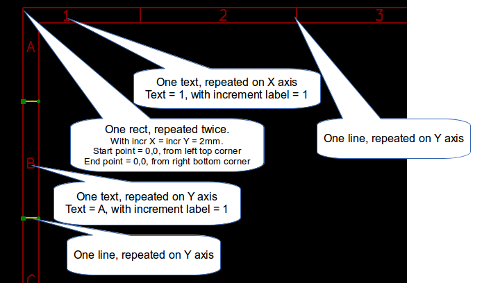

[[texts-and-formats]]
Texts and formats
-----------------

[[format-symbols]]
Format symbols:
~~~~~~~~~~~~~~~

Texts can be simple strings or can include format symbols.

Format symbols are replaced by the actual values in Eeschema or Pcbnew.

They are like format symbols in printf function.

A format symbol is *%* followed by 1 letter.

The *%C* format has one digit (comment identifier)

Formats symbols are:

*%% = replaced by %*

*%K = KiCad version*

*%Z = paper format name (A4, USLetter ...)*

*%Y = company name*

*%D = date*

*%R = revision*

*%S = sheet number*

*%N = number of sheets*

*%Cx = comment (x = 0 to 9 to identify the comment)*

*%F = filename*

*%P = sheet path (sheet full name, for Eeschema)*

*%T = title*

Example:

"Size: %Z" displays "Size A4" or Size USLetter"

[width="100%",cols="34%,66%",]
|=======================================================================
|image:images/204000000B615B3B830.png[204000000B615B3B830_png] a|
User display mode:

image:images/026000000247DACC8C8.png[026000000247DACC8C8_png] activated.

Title block displayed like in Eeschema and Pcbnew

|image:images/20D000000BF8AE6E45B.png[20D000000BF8AE6E45B_png] a|
“Native” display mode:

image:images/023000000247D2AF312.png[023000000247D2AF312_png] activated.

The native texts entered in Pl_Editor, with their format symbols.

|=======================================================================

[[multi-line-texts]]
Multi-line texts:
~~~~~~~~~~~~~~~~~

Texts can be multi-line.

There are 2 ways to insert a new line in texts:

1.  Insert the “n” 2 chars sequence (mainly in Page setup dialog in
KiCad)
2.  Insert a new line in Pl_Editor Design window.

Here is an example

[width="77%",cols="50%,50%",]
|================================================================
|image:images/2170000015C98B9D826.png[2170000015C98B9D826_png] a|
image:images/0F300000102C5881F3E.png[0F300000102C5881F3E_png]

Setup

|================================================================

[[multi-line-texts-in-page-setup-dialog]]
Multi-line texts in Page Setup dialog:
~~~~~~~~~~~~~~~~~~~~~~~~~~~~~~~~~~~~~~

In the page setup dialog, text controls do not accept a multi-line text.

The “n” 2 chars sequence should be inserted to force a new line inside a
text

Here is a two lines text, in _comment 2_ field:

image:images/1BC0000003F9A68F44F.png[1BC0000003F9A68F44F_png]

Here is the actual text:

image:images/108000000796A6637BF.png[108000000796A6637BF_png]

However, if you really want the *“n”* inside the text, enter *“*
******n”**.

image:images/1A50000004681684C4B.png[1A50000004681684C4B_png]

And the displayed text:

image:images/2480000008572F151BE.png[2480000008572F151BE_png]

[[constraints]]
Constraints
-----------

[[page-1-constraint]]
Page 1 constraint
~~~~~~~~~~~~~~~~~

When using Eeschema, the full schematic often uses more than one page.

Usually layout items are displayed on all pages.

But if a user want some items to be displayed only on page 1, or not on
page 1, the “page 1 option” this is possible by setting this option:

[width="100%",cols="29%,71%",]
|=================================================================
|image:images/0FE0000008C8F0A84EF.png[0FE0000008C8F0A84EF_png] a|
Page 1 option:

* None: no constraint.
* Page 1 only: the items is visible only on page 1.
* Not on page 1: the items is visible on all pages but the page 1.

|=================================================================

[[text-full-size-constraint]]
Text full size constraint
~~~~~~~~~~~~~~~~~~~~~~~~~

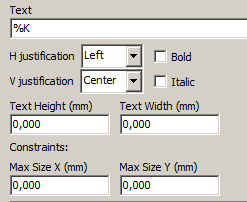

Only for texts, one can set 2 parameters :

* the max size X
* the max size Y

which define a bounding box

When these parameters are not 0, when displaying the text, the actual
text height and the actual text width are dynamically modified if the
full text size is bigger than the max size X and/or the max size Y, to
fit the full text size with this bounding box.

When the actual full text size is smaller than the max size X and/or the
max size Y, the text height and/or the text width is not modified.

[width="84%",cols="46%,54%",]
|================================================================
|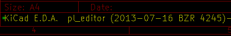 a|
The text with no bounding box.

Max size X = 0

Max size Y = 0

|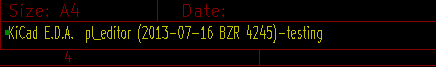 a|
The *same* text with::
  constraint.

Max size X = 40

Max size Y = 0

|================================================================

A multi line text, constrained:

[width="77%",cols="50%,50%",]
|================================================================
|image:images/114000000A59A49C107.png[114000000A59A49C107_png] a|
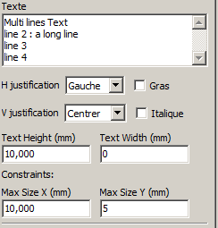

Setup

|================================================================

[[invoking-pl_editor]]
Invoking Pl_Editor
------------------

Pl_Editor is typically invoked from a command line, or from the KiCad
manager.

From a command line, the syntax is pl_editor <*.kicad_wks file to open>.

[[pl_editor-commands]]
Pl_Editor Commands
------------------

[[main-screen]]
Main Screen
~~~~~~~~~~~

The image below shows the main window of Pl_Editor.

image:images/280000002003BB28D10.png[280000002003BB28D10_png]

The left pane contains the list of basic items.

The right pane is the item settings editor.

[[main-window-toolbar]]
Main Window Toolbar
~~~~~~~~~~~~~~~~~~~

image:images/3180000002933A1DAFF.png[3180000002933A1DAFF_png]

The top toolbar allows for easy access to the following commands:

[width="100%",cols="28%,72%",]
|=======================================================================
|image:images/025000000236092322C.png[025000000236092322C_png] |Select
the net list file to be processed.

|image:images/02100000023DA2FC874.png[02100000023DA2FC874_png] |Load a
page layout description file.

| |Save the
current page layout description in a .kicad_wks file.

|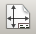 |Display
the page size selector and the title block user data editor.

|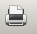 |Prints
the current page.

|image:images/029000000225511CDE8.png[029000000225511CDE8_png] |Delete
the currently selected item.

|image:images/048000000223C9FAADD.png[048000000223C9FAADD_png]
|Undo/redo tools.

|image:images/08D000000226C3BBC45.png[08D000000226C3BBC45_png] |Delete
all footprint assignments.

|image:images/026000000247DACC8C8.png[026000000247DACC8C8_png] |Show the
page layout in user mode: texts are shown like in Eeschema or Pcbnew:
text format symbols are replaced by the user texts.

|image:images/023000000247D2AF312.png[023000000247D2AF312_png] |Show the
page layout in native mode: texts are displayed “as is”, with the
contained formats, without any replacement.

|image:images/09D0000002290AC88FC.png[09D0000002290AC88FC_png]
|Reference corner selection, for coordinates displayed to the status
bar.

|image:images/060000000223178ABCE.png[060000000223178ABCE_png] a|
Selection of the page number (page & or other pages).

This selection has meaning only if some items have a page option, are
are not shown on all pages (in a schematic for instance, which contains
more than one page)

|=======================================================================

[[commands-in-drawing-area-draw-panel]]
Commands in drawing area (draw panel)
~~~~~~~~~~~~~~~~~~~~~~~~~~~~~~~~~~~~~

[[keyboard-commands]]
Keyboard Commands
^^^^^^^^^^^^^^^^^

[width="100%",cols="20%,80%",]
|==================================================================
|F1 |Zoom In
|F2 |Zoom Out
|F3 |Refresh Display
|F4 |Move cursor to center of display window
|Home |Fit footprint into display window
|Space Bar |Set relative coordinates to the current cursor position
|Right Arrow |Move cursor right one grid position
|Left Arrow |Move cursor left one grid position
|Up Arrow |Move cursor up one grid position
|Down Arrow |Move cursor down one grid position
|==================================================================

[[mouse-commands]]
Mouse Commands
^^^^^^^^^^^^^^

[width="100%",cols="32%,68%",]
|============================================================
|Scroll Wheel |Zoom in and out at the current cursor position
|Ctrl + Scroll Wheel |Pan right and left
|Shift + Scroll Wheel |Pan up and down
|Right Button Click |Open context menu
|============================================================

[[context-menu]]
Context Menu
^^^^^^^^^^^^

Displayed by right-clicking the mouse:

* Add Line
* Add Rectangle
* Add Text
* Append Page Layout Descr File

Are commands to add a basic layout item to the current page layout
description.

* Zoom selection: direct selection of the display zoom.
* Grid selection: direct selection of the grid.

*Note:*

_Append Page Layout Descr File_ is intended to add poly polygons to make
logos.

Because usually a logo it needs hundred of vertices, you cannot create a
polygon by hand. But you can append a description file, created by
Bitmap2Component.

[[status-bar-information]]
Status Bar Information
~~~~~~~~~~~~~~~~~~~~~~

The status bar is located a the bottom of the Pl_Editor and provides
useful information to the user.

image:images/31A0000002140AB1BF6.png[31A0000002140AB1BF6_png]

Coordinates are *always relative to the corner* selected as
**reference**.

[[left-window]]
Left window
-----------

The left windows shows the list of layout items.

One can select a given item (left clicking on the line), of when right
clicking on the line, display a pop up menu

This menu allows basic operations: add a new item, or delete the
selected item.

**-> A selected item is also drawn in a different color on draw panel**.

[width="94%",cols="42%,58%",]
|=======================================================================
|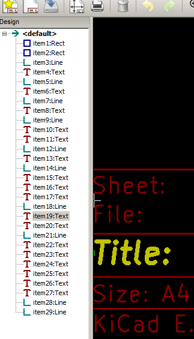 |Design
tree: the item 19 is selected, and shown in Yellow on the draw panel.
|=======================================================================

[[right-window]]
Right window
------------

[width="100%",cols="25%,23%,52%",]
|=======================================================================
|image:images/0FF000002FE9E9A0182.png[0FF000002FE9E9A0182_png]
|image:images/10000000151380C57AA.png[10000000151380C57AA_png] a|
The right window is the edit window.

On can set

properties of the page and properties of the current item.

|=======================================================================

Displayed settings depend on the selected item:

[width="100%",cols="34%,33%,33%",]
|=======================================================================
|image:images/0FD000001DD98658CC7.png[0FD000001DD98658CC7_png]
|image:images/0FD00000261FA2A9A82.png[0FD00000261FA2A9A82_png]
|image:images/0FA00000198A5084F51.png[0FA00000198A5084F51_png]

|Settings for lines and rectangles |Settings for texts |Settings for
poly-polygons

|image:images/108000001B1E318405A.png[108000001B1E318405A_png] | |

|Setting for bitmaps | |
|=======================================================================

[[interactive-edition]]
Interactive edition
-------------------

[[item-selection]]
Item selection
~~~~~~~~~~~~~~

An item can be selected:

* From the Design tree.
* By Left clicking on it.
* By Right clicking on it (and a pop up menu will be displayed).

When selected, this item is drawn in yellow.

[width="77%",cols="50%,50%",]
|=======================================================================
|image:images/0D70000009E6F0E0711.png[0D70000009E6F0E0711_png] |The
starting point (
image:images/022000000264392FC54.png[022000000264392FC54_png] ) and the
ending point (
image:images/01C00000020671586A1.png[01C00000020671586A1_png] ) are
highlighted.
|=======================================================================

When right clicking on the item, a pop-up menu is displayed.

The pop menu options slightly depend on the selection:

[width="100%",cols="34%,33%,33%",]
|=======================================================================
|image:images/0E20000009E089146DE.png[0E20000009E089146DE_png]
|image:images/0CE000000C7FC23C3DC.png[0CE000000C7FC23C3DC_png]
|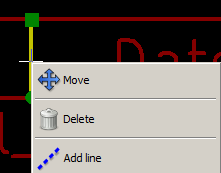
|=======================================================================

If more than one item is found, a menu clarification will be shown, to
select the item:

image:images/16F000000DA893C678D.png[16F000000DA893C678D_png]

[width="100%",cols="35%,65%",]
|=======================================================================
|image:images/0D5000000C7E7BD47D2.png[0D5000000C7E7BD47D2_png] |Once
selected, the item, or one of its end points, can be moved by moving the
mouse and placed (right clicking on the mouse).
|=======================================================================

[[item-creation]]
Item creation
~~~~~~~~~~~~~

To add a new item, right click the mouse button, when the cursor is on
the left window, or the draw area.

A popup menu is displayed:

[width="77%",cols="50%,50%",]
|=======================================================================
|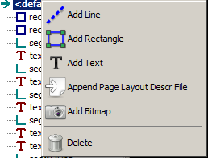
|image:images/0F2000001A2CB4F77A7.png[0F2000001A2CB4F77A7_png]

|Pop up menu in left window |Pop up menu in draw area.
|=======================================================================

Lines, rectangles and texts are added just by clicking on the
corresponding menu item.

Logos must first be created by Bitmap2component, which creates a page
layout description file.

The Append Page Layout Descr File option append this file, to insert the
logo (a poly polygon)

[[adding-lines-rectangles-and-texts]]
Adding lines, rectangles and texts
~~~~~~~~~~~~~~~~~~~~~~~~~~~~~~~~~~

When clicking on the option, a dialog is opened:

[width="77%",cols="50%,50%",]
|=======================================================================
|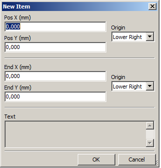
|image:images/13F0000014FEDD597EE.png[13F0000014FEDD597EE_png]

|Adding line or rectangle |Adding text
|=======================================================================

Position of end points, and corner reference can be defined here.

However they can be defined later, from the right window, or by moving
the item, or one of its end points.

Most of time the corner reference is the same for both points.

If this is not the case, define the corner reference at creation is
better, because if a corner reference is changed later, the geometry of
the item will be a bit strange.

When an item is created, if is put in move mode, and you can refine its
position (this is very useful for texts and small lines or rectangles)

[[adding-logos]]
Adding logos
~~~~~~~~~~~~

To add a logo, a poly polygon (the vectored image of the logo) must be
first created using Bitmap2component.

Bitmap2component creates a page layout description file which is append
to the current design, using the *Append Page Layout Descr File* option.

Bitmap2component creates a page layout description file which contains
only one item: a poly polygon.

__However, this command can be used to append any page layout
description file, which is merged with the current design__.

Once a poly polygon is inserted, it can be moved and its parameters
edited.

[[adding-image-bitmaps]]
Adding image bitmaps
~~~~~~~~~~~~~~~~~~~~

You can add an image bitmap using most of bitmap formats (PGN, JPEG, BMP
...)

* When a bitmap is imported, its PPI (pixel per inch) definition is set
to 300PPI
* This value can be modified in panel Properties (right panel).
* The actual size depend on this parameter.
* Be aware using hight definition can create large files, and have a
noticeable draw or plot time.

A bitmap can be repeated, but not rotated.
