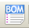

[[general-top-toolbar]]
General Top Toolbar
-------------------

[[sheet-management]]
Sheet Management
~~~~~~~~~~~~~~~~

With the icon
image:images/1000000000000022000000221C8530A2.png[1000000000000022000000221C8530A2_png]
you have access to the sheet settings. Here, you can define the sheet
size and various text sections in the title block on the bottom
right-hand corner.

image:images/10000000000002C50000023117E554F8.png[10000000000002C50000023117E554F8_png]

The date is automatically updated. Total number of sheets and sheet
number are automatically updated.

[[options-of-the-schematic-editor]]
Options of the schematic editor
~~~~~~~~~~~~~~~~~~~~~~~~~~~~~~~

[[general-options]]
General options
^^^^^^^^^^^^^^^

These options are relative to the drawings

image:images/1000000000000194000001B85AC8A901.png[1000000000000194000001B85AC8A901_png]

[[template-fields-names]]
Template fields names
^^^^^^^^^^^^^^^^^^^^^

You can define custom fields that will always existing in each component
(even if the fields are left empty in a given component).

image:images/1000000000000198000001B30C4E98A4.png[1000000000000198000001B30C4E98A4_png]

[[search-tool]]
Search tool
~~~~~~~~~~~

the following icon
image:images/1000000000000024000000255522ABD1.png[1000000000000024000000255522ABD1_png]
can be used to access the search tool.

image:images/100000000000017D000000EDC469394A.png[100000000000017D000000EDC469394A_png]

You can search a component, a value, or a text string in the current
sheet or in the whole hierarchy. Once found, the cursor will be
positioned on the found element, in the relative sub-sheet.

[[netlist-tool]]
Netlist tool
~~~~~~~~~~~~

The icon
image:images/10000000000000220000002353233D17.png[10000000000000220000002353233D17_png]
gives access to the netlist tool used to generate a netlist file.

This netlist file can apply to the whole hierarchy (usual option), or
only to the current sheet (the netlist is then partial, but this option
can be useful for some software).

In a multisheet hierarchy, any local label is known only inside the
sheet to which it belongs.

Thus the label TOTO of sheet 3 is different from the label TOTO of sheet
5 (if no connection has been intentionally introduced to connect them).
This is due to the fact that the sheet number (updated by the annotate
command) is associated with the local label. In the previous example,
the first label TOTO is actually TOTO_3, and the second label TOTO is
actually TOTO_5.

This association can be inhibited if it is wished, but be aware of
possible undesired connections.

Note 1:

Label lengths have no limitations in Eeschema, but the software
exploiting the generated netlist can be limited on this point.

Note 2:

Avoid spaces in the labels, because they will appear as separated words.
It is not a limitation of Eeschema, but of many netlist formats, which
often suppose that a label has no spaces.

image:images/10000000000001AD0000010F147D1D8A.png[10000000000001AD0000010F147D1D8A_png]

Option:

Default Format:

Check to select Pcbnew as the default format.

Other formats can also be generated:

* Orcad PCB2
* CadStar
* Spice, for the Spice simulator.

External plugins can be launch to extend the netlist formats list (a
PadsPcb Plugin was added here)

[[annotation-tool]]
Annotation tool
~~~~~~~~~~~~~~~

The icon
image:images/100000000000002400000023EA45FB2C.png[100000000000002400000023EA45FB2C_png]
gives access to the annotation tool. This tool performs an automatic
naming for all used components.

For multi-part components (such as 7400 TTL which contains 4 gates), a
multi-part suffix is also allocated (thus a 7400 TTL designated U3 will
be divided into U3A, U3B, U3C and U3D).

You can unconditionally annotate all the components, or only the new
components, i.e. those which were not previously annotated.

image:images/10000000000001550000018519570F95.png[10000000000001550000018519570F95_png]

*Scope*

\1) Use the entire schematic. All the sheets are re-annotated (usual
Option).

\2) Use the current page only. Only the current sheet is re-annotated
(this option is to be used only in special cases, for example to
evaluate the amount of resistors in the current sheet.).

\3) Keep existing annotation. Conditional annotation, only the new
components will be re-annotated (usual option).

\4) Reset existing annotation. Unconditional annotation, all the
components will be re-annotated (this option is to be used when there
are duplicated references).

*Order*

Sorting option to set the annotation numbers to components

[[electrical-rules-check-tool]]
Electrical Rules Check tool
~~~~~~~~~~~~~~~~~~~~~~~~~~~

The icon
image:images/100000000000002700000023737FA05C.png[100000000000002700000023737FA05C_png]
gives access to the electrical rules check (ERC) tool.

This tool performs a design verification and is particularly useful to
detect forgotten connections, and inconsistencies.

Once you have run ERC, Eeschema places markers on the pins or labels
able to highlight a problem. The diagnosis can then be given by left
clicking on the marker. An errors file can also be generated.

[[main-erc-dialog]]
Main ERC dialog
^^^^^^^^^^^^^^^

image:images/1000000000000280000002432F17A751.png[1000000000000280000002432F17A751_png]

Errors are displayed in the Erc Diags dialog box:

* Errors and warnings count.
* Errors count.
* Warnings count.

Option:

* Create the ERC report: check this option to generate an ERC report
file.

Commands:

* Test Erc: to perform an Electrical Rules Check.
* Del Markers: to remove all ERC markers.
* Close: to exit this dialog box.

Note:

* When clicking on an error message, jump to the corresponding marker in
schematic.

[[erc-options-dialog]]
ERC options dialog
^^^^^^^^^^^^^^^^^^

image:images/100000000000018D00000161B6099430.png[100000000000018D00000161B6099430_png]

This Setup ERC dialog box allows you to establish connectivity rules
between pins; you can choose between 3 options for each case:

* No error
* Warning
* Error

Each square of the matrix can be modified by clicking on it.

[[bill-of-material-tool]]
Bill of Material tool
~~~~~~~~~~~~~~~~~~~~~

The icon

gives access to the bill of material (BOM). This menu allows the
generation of a file listing of the components and/or hierarchical
connections (global labels).

image:images/1000020100000202000001D3432F631D.png[1000020100000202000001D3432F631D_png]

Components can be sorted by:

* Reference.
* Value.

And multi-part components can be detailed. Global labels can be sorted
by :

* Alphabetical classification
* Sub-sheet

Different kinds of sorting can be used simultaneously. Options are:

[width="100%",cols="25%,75%",]
|=======================================================================
|Components by Reference |Bill of Material sorted by Reference.

|Component by Value |Bill of Material sorted by Value.

|Sub components |The BOM shows every device of multi-part components (ex
U2A, U2B...).

|Hierarchy Pins by name |Hierarchical connections sorted alphabetically.

|Hierarchy Pins by Sheet |Hierarchical connections sorted by sheet
number.

|List |Creates a plain text file ready to print

|Text for spreadsheet import |Creates an ASCII file which can be easily
imported in a *spreadsheet*

|Single Part per line |Creates a csv file combining components with the
same Value into a single line, listing reference designators comma
separated.

|Launch list browser |Run the text editor to load and display the BOM
list file after creating.
|=======================================================================

A useful set of component properties to use for a BOM are:

* Value – unique name for each part used.
* Footprint – either manually entered or back-annotated (see below).
* Field1 – Manufacturer's name.
* Field2 – Manufacturer's Part Number.
* Field3 – Distributor's Part Number.

For example:

image:images/10000000000002EE00000219860D66E0.png[10000000000002EE00000219860D66E0_png]

Using the BOM Format Single Part per line only requires the component
properties to be edited for one component on the schematic and not all
components with that same Value.

However, if there are different parts, both with a Value of 33K, may be
one is 1/10 W and another is ¼ W, or may have a different footprint,
specify one as 33K and the other as 33KBig and these will be listed as
different parts.

The output is in a format than can be imported into a spreadsheet where
cost numbers (or optionally even Field4) may be added to derive a board
cost and assist with parts procurement.

[[import-tool-for-footprint-assignment]]
Import tool for footprint assignment:
~~~~~~~~~~~~~~~~~~~~~~~~~~~~~~~~~~~~~

[[access]]
Access:
^^^^^^^

The icon
image:images/100000000000002400000025B5886D2F.png[100000000000002400000025B5886D2F_png]
gives access to the back-annotate tool.

This tool allows a schematic to be captured, make footprint assignments
using Cvpcb's table and browser tools, then export that assignment back
to the schematic.

This function reads the .cmp file previously created by Cvpcb and
initialize the footprint field (Field 3) of components.

This is not mandatory for Pcbnew, but useful to add the footprint field
when creating the Bill of Material and the netlist.

This feature keeps the component footprint/reference information in a
single source file, the schematic, which is the source for the netlist
and makes the .cmp file redundant.

The footprint assignments will appear in any future netlist export from
Eeschema. This is useful when using some netlist formats.

[[note-for-pcbnew]]
Note for Pcbnew
^^^^^^^^^^^^^^^

Using the .cmp file or the netlist only to assign a footprint to a
component is a choice in side Pcbnew.

When Pcbnew does not find a .cmp file corresponding to the .net file, it
uses the component footprint/reference found in the .net file.

However, using the .cmp file is better, because if the designer changes
a footprint assignment from Pcbnew, the corresponding .cmp file is also
updated.
