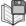
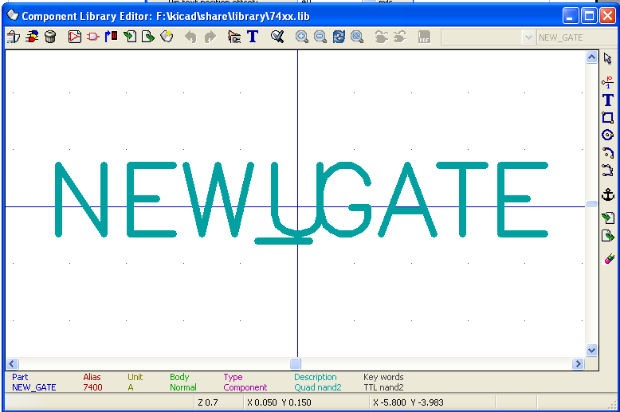
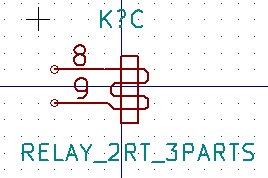
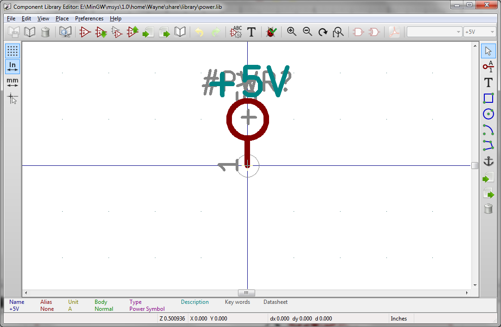

[[component-library-editor]]
Component Library Editor
------------------------

[[general-information-about-component-libraries]]
General Information About Component Libraries
~~~~~~~~~~~~~~~~~~~~~~~~~~~~~~~~~~~~~~~~~~~~~

A component is a schematic element which contains a graphical
representation, electrical connections, and fields defining the
component. Components used in a schematic are stored in component
libraries. Eeschema provides a component library editing tool that
allows you to create libraries, add, delete or transfer components
between libraries, export components to files, and import components
from files. The library editing tool provides a simple way to manage
component library files.

[[component-library-overview]]
Component Library Overview
~~~~~~~~~~~~~~~~~~~~~~~~~~

A component library is composed of one or more components. Generally the
components are logically grouped by function, type, and/or manufacturer.

A component is composed of:

* Graphical items (lines, circles, arcs, text, etc ) that provide the
symbolic definition.
* Pins which have both graphic properties (line, clock, inverted, low
level active, etc ) and electrical properties (input, output,
bidirectional, etc.) used by the E lectrical R ules C heck (ERC) tool.
* Fields such as references, values, corresponding footprint names for
PCB design, etc.
* Aliases used to associate a common component such as a 7400 with all
of it's derivatives such as 74LS00, 74HC00, and 7437. All of these
aliases share the same library component.

Proper component designing requires:

* Defining if the component is made up of one or more units.
* Defining if the component has an alternate body style also known as a
De Morgan representation.
* Designing it 's symbolic representation using lines, rectangles,
circles, polygons and text.
* Adding pins by c arefully defining each pin's graphical elements,
name, number, and electrical properties (input, output, tri-state, power
port, etc.).
* Adding an alias if other components have the same symbol and pin out
or removing one if the component has been created from an other
component.
* Adding optional fields such the name of the footprint used by the PCB
design software and/or defining their visibility.
* Documenting the component by adding a description string and links to
data sheets, etc.
* Saving it in the desired library.

[[component-library-editor-overview]]
Component Library Editor Overview
~~~~~~~~~~~~~~~~~~~~~~~~~~~~~~~~~

The component library editor main window is shown below. It consists
three tool bars for quick access to common features and a component
viewing/editing area. Not all commands are available on the tool bars
but can be accessed using the menus.

image:images/100000000000049F000002C20FF41347.png[100000000000049F000002C20FF41347_png]

[[main-toolbar]]
Main Toolbar
^^^^^^^^^^^^

The main tool bar typically located at the top of main window shown
below consists of the library management tools, undo/redo commands, zoom
commands, and component properties dialogs.

image:images/100000000000040000000027C376CA0E.png[100000000000040000000027C376CA0E_png]

[width="100%",cols="50%,50%",]
|=======================================================================
|
|Save the currently select library. The button will be disabled if no
library is currently selected or no changes to the currently selected
library have been made.

|image:images/100002010000001A0000001ACED60702.png[100002010000001A0000001ACED60702_png]
|Select the library to edit.

|image:images/100002010000001A0000001AB1BB0D48.png[100002010000001A0000001AB1BB0D48_png]
|Delete a component from the currently selected library or any library
defined by the project if no library is currently selected.

|
|Open the component library browser to select the library and component
to edit.

|image:images/100002010000001A0000001AAE4A6891.png[100002010000001A0000001AAE4A6891_png]
|Create a new component.

|image:images/100002010000001A0000001AE03E3808.png[100002010000001A0000001AE03E3808_png]
|Load component from currently selected library for editing.

|image:images/100002010000001A0000001A2D043F72.png[100002010000001A0000001A2D043F72_png]
|Create a new component from the currently loaded component.

|image:images/100002010000001A0000001A7C9F9F5F.png[100002010000001A0000001A7C9F9F5F_png]
|Save the current component changes in memory. The library file is not
changed.

|
|Import one component from a file.

|image:images/100002010000001A0000001A4F9201B5.png[100002010000001A0000001A4F9201B5_png]
|Export the current component to a file.

|image:images/100002010000001A0000001AA50256B5.png[100002010000001A0000001AA50256B5_png]
|Create a new library file containing the current component. Note: new
libraries are not automatically added to the project.

|image:images/100002010000001A0000001AB26950B9.png[100002010000001A0000001AB26950B9_png]
|Undo last edit.

|image:images/100002010000001A0000001AD04E6418.png[100002010000001A0000001AD04E6418_png]
|Redo last undo.

|image:images/100002010000001A0000001A80C75DC5.png[100002010000001A0000001A80C75DC5_png]
|Edit the current component properties.

|image:images/100002010000001A0000001A65CFC162.png[100002010000001A0000001A65CFC162_png]
|Edit the fields of current component.

|image:images/100002010000001A0000001A98E4437C.png[100002010000001A0000001A98E4437C_png]
|Test the current component for design errors.

|image:images/100002010000001A0000001AF14D4F98.png[100002010000001A0000001AF14D4F98_png]
|Zoom in.

|image:images/100002010000001A0000001AB0362631.png[100002010000001A0000001AB0362631_png]
|Zoom out.

|image:images/100002010000001A0000001A798AA253.png[100002010000001A0000001A798AA253_png]
|Refresh display.

|image:images/100002010000001A0000001A3C243FE3.png[100002010000001A0000001A3C243FE3_png]
|Zoom to fit component in display.

|image:images/100002010000001A0000001A93F5F714.png[100002010000001A0000001A93F5F714_png]
|Select the normal body style. The button is disabled if the current
component does not have an alternate body style.

|image:images/100002010000001A0000001A67B02101.png[100002010000001A0000001A67B02101_png]
|Select the alternate body style. The button is disabled if the current
component does not have an alternate body style.

|
|Show the associated documentation. The button will be disabled if no
documentation is defined for the current component.

|image:images/100000000000007A0000002651F79CA5.png[100000000000007A0000002651F79CA5_png]
|Select the unit to display. The drop down control will be disable if
the current component is not derived from multiple units.

|image:images/100000000000007A00000026D48F1971.png[100000000000007A00000026D48F1971_png]
|Selection the alias. The drop down control will be disabled if the
current component does not have any aliases.

|image:images/100002010000001A0000001A2096B8A2.png[100002010000001A0000001A2096B8A2_png]
|Pin editing: independent editing for pin shape and position for
components with multiple units and alternate symbols.
|=======================================================================

[[element-toolbar]]
Element Toolbar
^^^^^^^^^^^^^^^

The vertical toolbar typically located on the right hand side of the
main window allows you to place all of the elements required to design a
component. The table below defines each tool bar button.

[width="100%",cols="50%,50%",]
|=======================================================================
|image:images/100002010000001A0000001A34B52176.png[100002010000001A0000001A34B52176_png]
|Select tool. Right clicking with the select tool opens the context menu
for the object under the cursor. Left clicking with the select tool
displays the attributes of the object under the cursor in the message
panel at the bottom of the main window. Left double-click with the
select tool will open the properties dialog for the object under the
cursor.

|image:images/100002010000001A0000001AF33889E5.png[100002010000001A0000001AF33889E5_png]
|Pin tool. Left click to add a new pin.

|image:images/100002010000001A0000001A65CFC162.png[100002010000001A0000001A65CFC162_png]
|Graphical text tool. Left click to add a new graphical text item.

|image:images/100002010000001A0000001A0A4070B9.png[100002010000001A0000001A0A4070B9_png]
|Rectangle tool. Left click to begin drawing the first corner of a
graphical rectangle. Left click again to place the opposite corner of
the rectangle.

|image:images/100002010000001A0000001A4D79A704.png[100002010000001A0000001A4D79A704_png]
|Circle tool. Left click to begin drawing a new graphical circle from
the center. Left click again to define the radius of the cicle.

|image:images/100002010000001A0000001A5735E244.png[100002010000001A0000001A5735E244_png]
|Arc tool. Left click to begin drawing a new graphical arc item from the
center. Left click again to define the first arc end point. Left click
again to defint the second arc end point.

|image:images/100002010000001A0000001A9D16E38B.png[100002010000001A0000001A9D16E38B_png]
|Polygon tool. Left click to begin drawing a new graphical polygon item
in the current component. Left click for each addition polygon line.
Left double click to complete the polygon.

|image:images/100002010000001A0000001A9D745AFD.png[100002010000001A0000001A9D745AFD_png]
|Anchor tool. Left click to set the anchor position of the component.

|
|Import a component from a file.

|image:images/100002010000001A0000001A4F9201B5.png[100002010000001A0000001A4F9201B5_png]
|Export the current component to a file.

|image:images/100002010000001A0000001AB1BB0D48.png[100002010000001A0000001AB1BB0D48_png]
|Delete tool. Left click to delete an object from the current component.
|=======================================================================

[[options-toolbar]]
Options Toolbar
^^^^^^^^^^^^^^^

The vertical tool bar typically located on the left hand side of the
main window allows you to set some of the editor drawing options. The
table below defines each tool bar button.

[width="100%",cols="50%,50%",]
|=======================================================================
|image:images/100002010000001A0000001A1103DCA9.png[100002010000001A0000001A1103DCA9_png]
|Toggle grid visibility on and off.

|image:images/100002010000001A0000001AED35FAEC.png[100002010000001A0000001AED35FAEC_png]
|Set units to inches.

|image:images/100002010000001A0000001AD542C4CF.png[100002010000001A0000001AD542C4CF_png]
|Set units to millimeters.

|image:images/100002010000001A0000001A4A78FB18.png[100002010000001A0000001A4A78FB18_png]
|Toggle full screen cursor on and off.
|=======================================================================

[[library-selection-and-maintenance]]
Library Selection and Maintenance
~~~~~~~~~~~~~~~~~~~~~~~~~~~~~~~~~

The selection of the current library is possible via the
link:#select_library[select current library icon] which shows you all
available libraries and allows you to select one. When a component is
loaded or saved, it will be put in this library. The library name of
component is the contents of it's value field.

*Note:*

* You must load a library in Eeschema, in order to access it's contents.
* The content of the current library can be saved after modification, by
clicking on the link:#save_library[save current library button] on the
main tool bar.
* A component can be removed from any library by clicking on the
link:#delete_component[delete component from library button].

[[select-and-save-a-component]]
Select and Save a Component
^^^^^^^^^^^^^^^^^^^^^^^^^^^

When you edit a component you are not really working on the component in
its library but on a copy of it in the computer's memory. Any edit
action can undone easily. A component may be loaded from a local library
or from an existing component.

[[component-selection]]
Component Selection
+++++++++++++++++++

Clicking the link:#load_from_library[load component from library button]
on the main tool bar displays the list of the available components that
you can select and load from the currently selected library.

*Note:*

If a component selected by it's alias, the name of the loaded component
is displayed on the window title bar instead of selected alias. The list
of component aliases is always loaded with each component and can be
edited. You can create a new component by selecting an alias of the
current component from the link:#select_alias_drop_down[select alias
drop down control]. The first item in the alias list is the root name of
the component.

*Note:*

Alternatively, clicking the link:#import_component[import component
button] allows you to load a component which has been previously saved
by the link:#export_component[export component button].

[[save-a-component]]
Save a Component
++++++++++++++++

After modification, a component can be saved in the current library or
in a new library or exported to a backup file.

To save the modified component in the current library, click the
link:#save_to_memory[update changes to library in memory button]. Please
note that the update command only saves the component changes in the
local memory. T his way, you can make up your mind before you save the
library.

To permanently save the component changes to the library file, click the
link:#save_library[save the current library button] which will overwrite
the existing library file with the component changes.

If you want to create a new library containing th e current component,
click the link:#new_library[save in new library button]. You will be
asked to enter a new library name.

*Note:*

New libraries are not automatically added to the current project.

You must add any new library you wish to use in a schematic to the list
of project libraries in Eeschema using the
link:../../../src/kicad-doc/doc/help/en/docs_src/eeschema/Eeschema_Chapter3_EN.odt#1.2.3.Preferences%20menu%20/%20Libs%20and%20Dir%7Coutline[component
library configuration dialog].

Click the link:#export_component[export component button] to create a
file containing only th e current component. This file will be a
standard library file which will contains only one component. This file
can be used to import the component into another library. In fact the
create new library command and the export command are basically
identical.

[[transfer-components-to-another-library]]
Transfer Components to Another Library
++++++++++++++++++++++++++++++++++++++

You can very easily copy a component from a source library into a
destination library using the following commands:

* Select the source library by clicking the link:#select_library[select
library button].
* Load the component to be transferred by clicking the
link:#load_from_library[load component from library button]. The
component will be displayed in the editing area.
* Select the destination library by clicking the
link:#select_library[select library button].
* Save the current component to the new library in the local memory by
clicking the link:#save_to_memory[update changes to library in memory
button].
* Save the component in the current local library file by clicking the
link:#save_library[save the current library button].

[[discarding-component-changes]]
Discarding Component Changes
++++++++++++++++++++++++++++

When you are working on a component, the edited component is only a
working copy of the actual component in its library. This means that as
long as you have not saved it, you can just reload it to discard all
changes made. If you have already updat ed it in the local memory and
you have not saved it to the library file, you can always quit and start
again. Eeschema will undo all the changes.

[[creating-library-components]]
Creating Library Components
~~~~~~~~~~~~~~~~~~~~~~~~~~~

[[create-a-new-component]]
Create a New Component
^^^^^^^^^^^^^^^^^^^^^^

A new component can be created clicking the link:#new_component[new
component button]. You will be asked for a component name (this name is
used as default value for the value field in the schematic editor), the
reference designator (U, IC, R...), the number of units per package (for
example a 7400 is made of 4 units per package) and if an alternate body
style (sometimes referred to as DeMorgan) is desired. If the reference
designator field is left empty, it will default to “U”. These properties
changed later, but it is preferable to set them correctly at the
creation of the component.

image:images/1000000000000153000001795877268E.png[1000000000000153000001795877268E_png]

A new component will be created using the properties above and will
appear in the editor as shown below.

[[create-a-component-from-another-component]]
Create a Component from Another Component
^^^^^^^^^^^^^^^^^^^^^^^^^^^^^^^^^^^^^^^^^

Often, the component that you want to make is similar to one already in
a component library. In this case it is easy to load and modify an
already existing component.

* Load the component which will be used as a starting point.
* Click on the link:#duplicate_component[duplicate component button] or
modify its name by right click on the value field and editing the text.
If you chose to duplicate the current component, you will be prompted
for a new component name.
* If the model component has aliases, you will be prompted to remove
aliases from the new component which conflict with the current library.
If the answer is no the new component creation will be aborted.
Component libraries cannot have any duplicate names or aliases.
* Edit the new component as required.
* Update the new component in the current library by clicking the
link:#save_to_memory[update changes to library in memory button] or save
to a new library by clicking the link:#new_library[save in new library
button] or if you want to save this new component in an other existing
library select the other library by clicking on the
link:#select_library[select library button] and save the new component.
* Save the current library file to disk by clicking the
link:#save_library[save the current library button].

[[component-properties]]
Component Properties
^^^^^^^^^^^^^^^^^^^^

Component properties should be carefully set during the component
creation or alternatively they are inherited from copied component. To
change the component properties, click on the
link:#component_properties[open the component properties] to show the
dialog below.

image:images/10000000000001B2000001509F311F99.png[10000000000001B2000001509F311F99_png]

It is very important to correct set the n umber of units per package and
if the component has an alternate symbolic representation pa rameters
correctly because when pins are edited or created the corresponding pins
for each unit will created. If you change the number of units per
package after pin creation and editing, there will be additional work
introduced add the new unit pins and symbols. Nevertheless, it is
possible to modify these properies at any time.

The graphic options “Show pin number” and “Show pin name” define the
visibility of the pin number and pin name text. This text will be
visible if the corresponding options are checked. The option “Place pin
names inside” defines the pin name position relative to the pin body.
This text will be displayed inside the component outline if the option
is checked. In this case the “Pin Name Position Offset” property defines
the shift of the text away from the body end of the pin. A value from 30
to 40 (in 1/1000 inch) is reasonable.

The example below shows a component with the “Place pin name inside”
option unchecked. Notice the position of the names and pin numbers.

image:images/2000000800003D8000002550D6E11DAF.png[2000000800003D8000002550D6E11DAF_png]

[[components-with-alternate-symbols]]
Components with Alternate Symbols
^^^^^^^^^^^^^^^^^^^^^^^^^^^^^^^^^

If the component has more than one symbolic repersentation, you will
have to select the different symbols of th e component in order to edit
them. To edit the normal symbol, click the
link:#normal_body_style[normal body style button].

To edit the alternate symbol click on the
link:#alternate_body_style[alternate body style button]. Use the
link:#unit_select_control[unit selection drop down control] show below
to select the unit you wish to edit.

image:images/1000000000000456000002680D968591.png[1000000000000456000002680D968591_png]

[[graphical-elements]]
Graphical Elements
~~~~~~~~~~~~~~~~~~

Graphical elements create the symbolic repersentation of a component and
contain no electrical connection information. Their design is possible
using the following tools:

* Lines and polygons defined by start and end points.
* Rectangles defined by two diagonal corners.
* Circles defined by the center and radius.
* Arcs defined by the starting and ending point of the arc and its
center. An arc goes from 0° to 180°.

The vertical toolbar on the right hand side of the main window allows
you to place all of the graphical elements required to design a
component's symbolic representation.

[[graphical-element-membership]]
Graphical Element Membership
^^^^^^^^^^^^^^^^^^^^^^^^^^^^

Each graphic element (line, arc, circle, etc.) can be defined as common
to all units and/or body styles or specific to a given unit and/or body
style. Element options can be quickly accessed by the right clicking on
the element to display the context menu for the selected element. Below
is the context menu for a line element.

image:images/20000009000056D200003432E4789F12.png[20000009000056D200003432E4789F12_png]

You can a lso double left click on an element to modify it's properties.
Below is the properties dialog for a polygon element.

image:images/100000000000012100000146E8D1DDCE.png[100000000000012100000146E8D1DDCE_png]

The properties of a graphic element are:

* Line width which defines the width of the element's line in the
current drawing units.
* The “Common to all units in component” setting defines if the
graphical element is drawn for each unit in component with more than one
unit per package or if the graphical element is only drawn for the
current unit.
* The “Common by all body styles (DeMorgan)” setting defines if the
graphical element is drawn for each symbolic representation in
components with an alternate body style or if the graphical element is
only drawn for the current body style.
* The fill style setting determines if the symbol defined by the
graphical element is to be drawn unfilled, background filled, or
foreground filled.

[[graphical-text-elements]]
Graphical Text Elements
^^^^^^^^^^^^^^^^^^^^^^^

The link:#text_tool[graphical text tool] allows for the creation of
graphical text. Graphical text is always readable, even when the
component is mirrored. Please note that graphical text items are not
fields.

[[multiple-units-per-component-and-alternate-body-styles]]
Multiple Units per Component and Alternate Body Styles
~~~~~~~~~~~~~~~~~~~~~~~~~~~~~~~~~~~~~~~~~~~~~~~~~~~~~~

Components can have two symbolic representations (a standard symbol and
an alternate symbol often referred to as “DeMorgan”) and/or have more
than one unit per package (logic gates for example). Some components can
have more than one unit per package each with different symbols and pin
configurations.

Consider for instance a relay with two switches which can be designed as
a component with three diff e rent units: a coil, switch 1, and switch
2. Designing component with multiple units per package and/or alternate
body styles is very flexible. A pin or a body symbol item can be common
to all units or specific to a given unit or they can be common to both
symbolic representation so r specific to a given symbol repr e
sentation.

By default, pins are specific to each symbolic repr e sentation of each
unit, because the pin number is specific to a unit, and the shape
depends on the symbolic repr e sentation. When a pin is comm on to each
unit or each symbolic representation, you need to create it only once
for all units and all symbolic representations (this is usually the case
for power pins). This is also the case for the body style graphic shapes
and text, which may be common to each unit (but typically are specific
to each symbolic representation).

[[example-of-a-component-having-multiple-units-with-different-symbols]]
Example of a Component Having Multiple Units with Different Symbols:
^^^^^^^^^^^^^^^^^^^^^^^^^^^^^^^^^^^^^^^^^^^^^^^^^^^^^^^^^^^^^^^^^^^^

This is an example of a relay defined with three units per package,
switch 1, switch 2, and the coil:

[width="100%",cols="54%,46%",]
|=======================================================================
|image:images/2000000900003094000008CA41334F3B.png[2000000900003094000008CA41334F3B_png]
|Option: pins are not linked. One can add or edit pins for each unit
without any coupling with pins of other units.

|image:images/10000000000001B20000014F8449F983.png[10000000000001B20000014F8449F983_png]
|All units are not interchangeable must be selected.

|image:images/10000000000000FF000000A989993852.png[10000000000000FF000000A989993852_png]
|Unit 1

|image:images/1000000000000114000000B804ED21E4.png[1000000000000114000000B804ED21E4_png]
|Unit 2

|
a|
Unit 3

It does not have the same symbol and pin layout and therefore is not
interchangeable with units 1 and 2.

|=======================================================================

[[graphical-symbolic-elements]]
Graphical Symbolic Elements
+++++++++++++++++++++++++++

Shown below are properties for a graphic body element. From the relay
example above, the three units have different symbolic representations.
Therefore, each unit was created separately and the graphical body
elements must have the “Common to all units in component” disabled.

image:images/2000000900003855000027B1F162801F.png[2000000900003855000027B1F162801F_png]

[[pin-creation-and-editing]]
Pin Creation and Editing
~~~~~~~~~~~~~~~~~~~~~~~~

You can click on the link:#pin_tool[pin tool button] to create and
insert a pin. The editing of all pin properties is done by
double-clicking on the pin or right-click ing on the pin to open the pin
context menu. Pins must be created carefully, because any error will
have consequences on the PCB design. Any pin already placed can be
edited, deleted, and / or moved.

[[pin-overview]]
Pin Overview
^^^^^^^^^^^^

A pin is defined by it's graphical representation, it's name and it's
“number”. The pin's “number” is defined by a set of 4 letters and / or
numbers. For the electronic rules check (ERC) tool to be useful, the
pin's “electrical” type (input, output, tri-state...) must also be
defined correctly. If this type is not defined properly, the schematic
ERC check results may be invalid.

Important notes:

* Do not use spaces in pin names and numbers.
* To define a pin name with an inverted signal (overline) use the tilde
“~” character. The next “~” character will turn off the overline. For
example ~FO~O would display FO O.
* If the pin name is reduced to a single symbol, the pin is regarded as
unnamed.
* Pin names starting with “#”, are reserved for power port symbols.
* A pin “number” consists of 1 to 4 letters and/ or numbers. 1,2,..9999
are valid numbers. A1, B3, Anod, Gnd, Wi r e, etc. are also valid.
* Duplicate pin “numbers” cannot exist in a component.

[[pin-properties]]
Pin Properties
^^^^^^^^^^^^^^

image:images/100000000000031000000198EA7FCC88.png[100000000000031000000198EA7FCC88_png]

The pin properties dialog allows you to edit all of the characteristics
of a pin. This dialog pops up automatically when you create a pin or
when double-clicking on an existing pin. This dialog allows you modify:

* Name and name's text size.
* Number and number's text size.
* Length.
* Electrical and graphical types.
* Unit and alternate representation membership.
* Visibility.

[[pins-graphical-styles]]
Pins Graphical Styles
^^^^^^^^^^^^^^^^^^^^^

You can see on the figure below the different pin graphical styles. The
choice of graphic styles does not have any influence on the pin's
electrical type.

image:images/10000000000003100000019800B8A351.png[10000000000003100000019800B8A351_png]

[[pin-electrical-types]]
Pin Electrical Types
^^^^^^^^^^^^^^^^^^^^

Choosing the correct electrical type is important for the schematic ERC
tool. The electrical types defined are:

* Bidirectional which indicates bidirectional pins commutable between
input and output (microprocessor data bus for example).
* Tri-state is the usual 3 states output.
* Passive is used for passive component pins, resistors, connectors,
etc.
* Unspecified can be used when the ERC check doesn't matter.
* Power input is used for the component ' s power pins. Power pins are
automatically connected to the other power input pins with the same
name.
* Power out put is used for regulator outputs.
* Open emitter and open collector types can be used for logic outputs
defined as such.
* Not connected is used when a component has a pin that has no internal
connection.

[[pin-global-properties]]
Pin Global Properties
^^^^^^^^^^^^^^^^^^^^^

You can modify the length or text size of the name and/or number of all
the pins using the Global command entry of the pin context menu. Click
on the parameter you want to modify and type the new value which will
then be applied to all of the current component's pins.

image:images/100000000000018D000001023AE0F5CF.png[100000000000018D000001023AE0F5CF_png]

[[defining-pins-for-multiple-units-and-alternate-symbolic-representations]]
Defining Pins for Multiple Units and Alternate Symbolic Representations
^^^^^^^^^^^^^^^^^^^^^^^^^^^^^^^^^^^^^^^^^^^^^^^^^^^^^^^^^^^^^^^^^^^^^^^

Components with multiple units and/or graphical representations are
particularly problematic when creating and editing pins. The majority of
pins are specific to each unit (because their pin number is specific to
each unit) and to each symbolic representation (because their form and
position is specific to each symbolic representation). The creation and
the editing of pins can be problematic for components with multiple
units per package and alternate symbolic representations. The component
library editor allows the simultaneous creation of pins. By default,
changes made to a pin are made for all units of a multiple unit
component and both representations for components with an alternate
representation.

The only exception to this is the pin's graphical type and name. This
dependency was established to allow for easier pin creation and editing
in most of the cases. This dependency can be disabled by toggling the
link:#indepenent_pin_edit[independent pin edit button] on the main tool
bar. This will allow you to create pins for each unit and representation
completely independently.

A component can have two symbolic representations (representation known
as “DeMorgan”) and can be made up of more than one unit as in the case
of components with logic gates. For certain components, you may want
several different graphic elements and pins. Like the relay sample shown
in section 11.7.1, a relay can be represented three distinct units: a
coil, switch contact 1, and switch contact 2.

The management of the components with multiple units and components with
alternate symbolic representations is flexible. A pin can be common or
specific to different units. A pin can also be common to both symbolic
representations or specific to each symbolic representation.

By default, pins are specific to each representation of each unit,
because their number differs for each unit, and their design is
different for each symbolic representation. When a pin is common to all
units, it only has to draw n once such as in the case of power pins.

An example is the output pin 7400 quad dual input NAND gate. Since there
are four units and two symbolic representations, there are eight
separate output pins defined in the component definition. When creating
a new 7400 component, unit A of the normal symbolic representation will
be shown in the library editor. To edit the pin style in alternate
symbolic representation, it must first be enabled by clicking the
link:#alternate_body_style[show alternate body sytle] button on the tool
bar. To edit the pin number for each unit, select the appropriate unit
using the link:#unit_select_control[unit selection] drop down control.

[[component-fields]]
Component Fields
~~~~~~~~~~~~~~~~

All library components are defined with four default fields. The
reference designator, value, footprint assignment, and documentation
file link fields are created whenever a component is created or copied.
Only the reference designator and value fields are required. For
existing fields, you can use the context menu commands by right click
ing on the pin. Components defined in libraries typically are defined
with these four default fields. Additional fields such as vendor, part
number, unit cost, etc. can be added to library components but generally
this is done in the schematic editor so the additional fields can be
applied to all of the components in the schematic.

[[editing-component-fields]]
Editing Component Fields
^^^^^^^^^^^^^^^^^^^^^^^^

To edit an existing component field, right click on the field text to
show the field context menu shown below.

image:images/200000090000154B000027E6496104E3.png[200000090000154B000027E6496104E3_png]

To edit undefined fields, add new fields, or delete optional fields
link:#edit_fields[click the open field properties dialog button] on the
main tool bar to open the field properties dialog shown below.

image:images/1000000000000208000002211F585317.png[1000000000000208000002211F585317_png]

Fields are text sections associated with the component. Do not confused
them with the text belonging to the graphic representation of this
component.

Important notes:

* Modifying value field effectively creates a new component us ing using
the current component as the starting point for the new component. This
new component has the name contained in the value field when you save it
to the currently selected library.
* The field edit dialog above must be used to edit a field that is empty
or has the i nvisible attribute enable.
* The footprint is defined as an absolute footprint using the
LIBNAME:FPNAME format where LIBNAME is the name of the footprint library
defined in the footprint library table (see the “Footprint Library
Table” section in the Pcbnew “Reference Manual”) and FPNAME is the name
of the footprint in the library LIBNAME.

[[power-symbols]]
Power Symbols
~~~~~~~~~~~~~

Power symbols are created the same way as normal components. It may be
useful to place them in a dedicated library such as power.lib. Power
symbols consist of a graphical symbol a nd a pin of the type “Power
Invisible”. Power port symbols are handled like any other component by
the schematic capture software. Some precautions are essential. Below is
an example of a power +5V symbol.

To create a power symbol, use the following steps:

* Add a pin of type “Power input” named +5V (important because this name
will establish connection to the net +5V), with a pin number of 1
(number of no importance), a length of 0, and a “Line” “Graphic Style”.
* Place a small circle and a segment from the pin to the circle as
shown.
* The anchor of the symbol is on the pin.
* The component value is +5V.
* The component reference is #+5V. The reference text i s no importance
except the first character which must be “#” to indicate that the
component is a power symbol. By convention, every component in which the
reference field starts with a '#' will not appear in the component list
or in the netlist and the reference is declared as invisible.

An easier method to creat e of a new power port symbol is to use another
symbol as model.

You just need to:

* Load an existing power symbol.
* Edit the pin name w ith name of the new power symbol.
* Edit the value field to the sa me name as the pin, if you want to
display the power port value.
* Save the new component.
