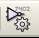

[[libedit-complements]]
LibEdit – Complements
---------------------

[[overview-1]]
Overview
~~~~~~~~

A component consist of the following elements

* A graphical representation (geometrical shapes, texts).
* Pins.
* Fields or associated text used by the post processors: netlist,
components list.

Two fields are to be initialized: reference and value. The name of the
design associated with the component, and the name of the associated
footprint, the other fields are the free fields, they can generally
remain empty, and could be filled during schematic capture.

However, managing the documentation associated with any component
facilitates the research, use and maintenance of libraries. The
associated documentation consists of

* A line of comment.
* A line of key words such as TTL CMOS NAND2, separated by spaces.
* An attached file name (for example an application note or a pdf file).
+
The default directory for attached files:
+
kicad/share/library/doc
+
If not found:
+
kicad/library/doc
+
Under linux:
+
/usr/local/kicad/share/library/doc
+
/usr/share/kicad/library/doc
+
/usr/local/share/kicad/library/doc

Key words allow you to selectively search for a component according to
various selection criteria. Comments and key words are displayed in
various menus, and particularly when you select a component from the
libr ary.

The component also has an anchoring point. A rotation or a mirror is
made relatively to this anchor point and during a placement this point
is used as a reference position. It is thus useful to position this
anchor accurately.

A component can have aliases, i.e. equivalent names. This allows you to
considerably reduce the number of components that need to be created
(for example, a 74LS00 can have aliases such as 74000, 74HC00,
74HCT00…).

Finally, the components are distributed in libraries (classified by
topics, or manufacturer) in order to facilitate their management.

[[position-a-component-anchor]]
Position a component anchor
~~~~~~~~~~~~~~~~~~~~~~~~~~~

The anchor is at the coordinates (0,0) and it is shown by the blue axes
displayed on your screen.

image:images/10000000000003830000027F3B1EDABD.png[10000000000003830000027F3B1EDABD_png]

The anchor can be repositioned by selecting the icon
image:images/100000000000002300000023B57C73D3.png[100000000000002300000023B57C73D3_png]
and clicking on the new desired anchor position. The drawing will be
automatically re-centered on the new anchor point.

[[component-aliases]]
Component aliases
~~~~~~~~~~~~~~~~~

An alias is another name corresponding to the same component in the
library. Components with similar pin-out and representation can then be
represented by only one component, having several aliases (e.g. 7400
with alias 74LS00, 74HC00, 74LS37 ).

The use of aliases allows you to build complete libraries quickly. In
addition these libraries, being much more compact, are easily loaded by
KiCad.

To modify the list of aliases, you have to select the main editing
window via the icon

and select the alias folder.

image:images/10000000000001B50000013E8AB145A7.png[10000000000001B50000013E8AB145A7_png]

You can thus add or remove the desired alias. The current alias cannot
obviously be removed since it is edited.

To remove all aliases, you have firstly to select the root component.
The first component in the alias list in the window of selection of the
main toolbar.

[[component-fields-1]]
Component fields
~~~~~~~~~~~~~~~~

The field editor is called via the icon
image:images/10000000000000240000002612FF054A.png[10000000000000240000002612FF054A_png].

There are four special fields (texts attached to the component), and
configurable user fields

image:images/10000000000002870000021DEC5337FC.png[10000000000002870000021DEC5337FC_png]

Special fields

* Reference.
* Value. It is the component name in the library and the default value
field in schematic.
* Footprint. It is the footprint name used for the board. Not very
useful when using CvPcb to setup the footprint list, but mandatory if
CvPcb is not used.
* Sheet. It is a reserved field, not used at the time of writing.

[[component-documentation]]
Component documentation
~~~~~~~~~~~~~~~~~~~~~~~

To edit documentation information, it is necessary to call the main
editing window of the component via the icon

and to select the document folder.

image:images/10000000000001B70000014140B7CFE4.png[10000000000001B70000014140B7CFE4_png]

Be sure to select the right alias, or the root component, because this
documentation is the only characteristic which differs between aliases.
The "Copy Doc" button allows you to copy the documentation information
from the root component towards the currently edited alias.

[[component-keywords]]
Component keywords
^^^^^^^^^^^^^^^^^^

Keywords allow you to search in a selective way for a component
according to specific selection criteria (function, technological
family, etc.)

The EESchema research tool is not case sensitive. The most current key
words used in the libraries are

* CMOS TTL for the logic families
* AND2 NOR3 XOR2 INV… for the gates (AND2 = 2 inputs AND gate, NOR3 = 3
inputs NOR gate).
* JKFF DFF... for JK or D flip-flop.
* ADC, DAC, MUX…
* OpenCol for the gates with open collector output. Thus if in the
schematic capture software, you search the component: by keys words
NAND2 OpenCol EES chema will display the list of components having these
2 key words.

[[component-documentation-doc]]
Component documentation (Doc)
^^^^^^^^^^^^^^^^^^^^^^^^^^^^^

The line of comment (and keywords) is displayed in various menus,
particularly when you select a component in the displayed components
list of a library and in the ViewLib menu.

If this Doc. file exists, it is also accessible in the schematic capture
software, in the pop-up menu displayed by right-clicking on the
component.

[[associated-documentation-file-docfilename]]
Associated documentation file (DocFileName)
^^^^^^^^^^^^^^^^^^^^^^^^^^^^^^^^^^^^^^^^^^^

Indicates an attached file (documentation, application schematic)
available ( pdf file, schematic diagram, etc.).

[[footprint-filtering-for-cvpcb]]
Footprint filtering for CvPcb
^^^^^^^^^^^^^^^^^^^^^^^^^^^^^

You can enter a list of allowed footprints for the component. This list
acts as a filter used by CvPcb to display only the allowed footprints. A
void list does not filter anything.

image:images/10000000000001B8000001406BAFF1AF.png[10000000000001B8000001406BAFF1AF_png]

Wild-card characters are allowed.

S014* allows CvPcb to show all the footprints with a name starting by
SO14.

For a resistor, R? shows all the footprints with a 2 letters name
starting by R.

Here are samples: with and without filtering

[width="84%",cols="68%,32%",]
|=======================================================================
|image:images/1000000000000205000001F7190A1FAC.png[1000000000000205000001F7190A1FAC_png]
|With filtering

|image:images/1000000000000202000001F61A671096.png[1000000000000202000001F61A671096_png]
|Without filtering
|=======================================================================

[[symbol-library]]
Symbol library
~~~~~~~~~~~~~~

You can easily compile a graphic symbols library file containing
frequently used symbols .This can be used for the creation of components
(triangles, the shape of AND, OR, Exclusive OR gates, etc.) for saving
and subsequent re-use.

These files are stored by default in the library directory and have a
.sym extension. The symbols are not gathered in libraries like the
components because they are generally not so many.

[[export-or-create-a-symbol]]
Export or create a symbol
^^^^^^^^^^^^^^^^^^^^^^^^^

A component can be exported as a symbol with the button
image:images/10000000000000220000002619461B92.png[10000000000000220000002619461B92_png].
You can generally create only one graphic, also it will be a good idea
to delete all pins, if they exist.

[[import-a-symbol]]
Import a symbol
^^^^^^^^^^^^^^^

Importing allows you to add graphics to a component you are editing. A
symbol is imported with the button
image:images/100000000000001F000000260197FE05.png[100000000000001F000000260197FE05_png].
Imported graphics are added as they were created in existing graphics.

