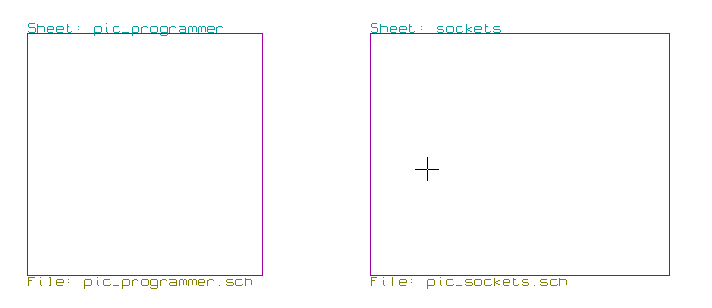
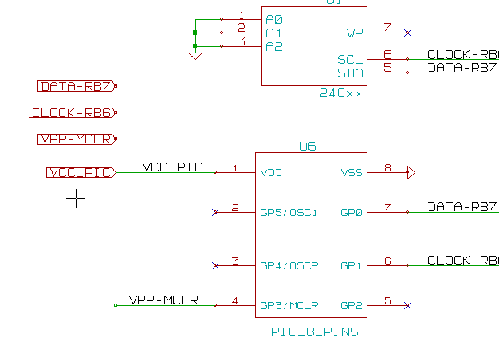

[[hierarchical-schematics]]
Hierarchical schematics
-----------------------

[[introduction-2]]
Introduction
~~~~~~~~~~~~

A hierarchical representation is generally a good solution for projects
bigger than a few sheets. If you want to manage this kind of project, it
will be necessary to:

* Use large sheets, which results in printing and handling problems.
* Use several sheets, which leads you to a hierarchy structure.

The complete schematic then consists in a main schematic sheet, called
root sheet, and sub-sheets constituting the hierarchy. Moreover, a
skillful subdividing of the design into separate sheets often improves
on its readability.

From the root sheet, you must be able to find all sub-sheets.
Hierarchical schematics management is very easy with Eeschema, thanks to
an integrated “hierarchy navigator” accessible via the icon
image:images/100000000000002200000025C0F59654.png[100000000000002200000025C0F59654_png]
of the upper and right toolbar.

There are two types of hierarchy that can exist simultaneously: the
first one has just been evoked and is of general use. The second
consists in creating components in the library that appear like
traditional components in the schematic, but which actually correspond
to a schematic which describes their internal structure.

This second type is used to develop integrated circuits, because in this
case you have to use function libraries in the schematic you are
drawing.

Eeschema currently doesn't treat this second case.

A hierarchy can be:

* simple: a given sheet is used only once
* complex: a given sheet is used more than once (multiples instances)
* Flat: which is a simple hierarchy, but connections between sheets are
not drawn.

Eeschema can deal with all these hierarchies.

The creation of a hierarchical schematic is easy, the whole hierarchy is
handled starting from the root schematic, as if you had only one
schematic.

The two important steps to understand are:

* How to create a sub-sheet.
* How to build electric connections between sub-sheets.

[[navigation-in-the-hierarchy]]
Navigation in the Hierarchy
~~~~~~~~~~~~~~~~~~~~~~~~~~~

Navigation among sub-sheets It is very easy thanks to the navigator tool
accessible via the button
image:images/100000000000002200000025C0F59654.png[100000000000002200000025C0F59654_png]
on the horizontal toolbar.

image:images/100000000000010C00000104307CA6BA.png[100000000000010C00000104307CA6BA_png]

Each sheet is reachable by clicking on its name. For quick access, right
click on a sheet name, and choose to enter into sheet.

You can quickly reach the root sheet, or a sub-sheet thanks to the tool
image:images/100000000000002200000025C0F59654.png[100000000000002200000025C0F59654_png]
of the right vertical toolbar. After the navigation tool has been
selected:

* Click on a sheet name to selection this sheet.
* Click elsewhere to select the main sheet.

[[local-hierarchical-and-global-labels]]
Local, hierarchical and global labels
~~~~~~~~~~~~~~~~~~~~~~~~~~~~~~~~~~~~~

[[properties]]
Properties
^^^^^^^^^^

Local labels, tool
image:images/10000000000000210000001F09B8170C.png[10000000000000210000001F09B8170C_png],
are connecting signals only within a sheet. Hierarchical labels (tool
image:images/1000000000000021000000209B84B124.png[1000000000000021000000209B84B124_png])
are connecting signals only within a sheet and to a hierarchical pin
placed in the parent sheet.

Global labels (tool
image:images/10000000000000210000001D13F7B559.png[10000000000000210000001D13F7B559_png])
are connecting signals across all the hierarchy. Power pins (type _power
in_ and __power out__) invisible are like global labels because they are
seen as connected between them across all the hierarchy.

[[notes]]
Notes
^^^^^

Within a hierarchy (simple or complex) one can use both hierarchical
labels and/or global labels.

[[hierarchy-creation-of-headlines]]
Hierarchy creation of headlines
~~~~~~~~~~~~~~~~~~~~~~~~~~~~~~~

You have to:

* Place in the root sheet a hierarchy symbol called “sheet symbol”.
* Enter into the new schematic (sub-sheet) with the navigator and draw
it, like any other schematic.
* Draw the electric connections between the two schematics by placing
Global Labels (HLabels) in the new schematic (sub-sheet), and labels
having the same name in the root sheet, known as SheetLabels. These
SheetLabels will be connected to the sheet symbol of the root sheet to
the other elements of the schematic like standard component pins.

[[sheet-symbol]]
Sheet symbol
~~~~~~~~~~~~

Draw a rectangle defined by two diagonal points symbolizing the
sub-sheet.

The size of this rectangle must allow you to place later particular
labels, hierarchy pins, corresponding to the global labels (HLabels) in
the sub-sheet.

These labels are similar to usual component pins. Select the tool
image:images/100000000000002100000020F9992133.png[100000000000002100000020F9992133_png].

Click to place the upper left corner of the rectangle. Click again to
place the lower right corner, having a large enough rectangle.

Example:

image:images/20000008000024130000119315BBAF66.png[20000008000024130000119315BBAF66_png]

You will then be prompted to type a file name and a sheet name for this
sub-sheet (in order to reach the corresponding schematic, using the
hierarchy navigator).

image:images/20000008000024130000119315BBAF66.png[20000008000024130000119315BBAF66_png]

You must give at least a file name. If there is no sheet name, the file
name will be used as sheet name (usual way to do that).

[[connections-hierarchical-pins]]
Connections – hierarchical pins
~~~~~~~~~~~~~~~~~~~~~~~~~~~~~~~

You will create here points of connection (hierarchy pins) for the
symbol which has been just created.

These points of connection are similar to normal component pins, with
however the possibility to connect a complete bus with only one point of
connection.

There are two ways to do this:

* Place the different pins before drawing the sub-sheet (manual
placement).
* Place the different pins after drawing the sub-sheet, and the global
labels (semi-automatic placement).

The second solution is quite preferable.

*Manual placement:*

* To select the tool
image:images/1000000000000021000000239C3EC480.png[1000000000000021000000239C3EC480_png].
* Click on the hierarchy symbol where you want to place this pin.

See below an example of the creation of the hierarchical pin called
“CONNEXION”.

image:images/1000000000000160000000CD797712D0.png[1000000000000160000000CD797712D0_png]

You can define its graphical attributes, and size or later, by editing
this pin sheet (Right click and select Edit in the PopUp menu).

Various pin symbols are available:

* Input
* Output
* BiDir
* Tri State
* Not Specified

These pin symbols are only graphic enhancements, and have no other role.

*Automatic placement:*

* Select the tool
image:images/100000000000002100000021C98460F6.png[100000000000002100000021C98460F6_png].
* Click on the hierarchy symbol from where you want to import the pins
corresponding to global labels placed in the corresponding schematic. A
hierarchical pin appears, if a new global label exists, i.e. not
corresponding to an already placed pin.
* Click where you want to place this pin.

All necessary pins can thus be placed quickly and without error. Their
aspect is in accordance with corresponding global labels.

[[connections---hierarchical-labels]]
Connections - hierarchical labels
~~~~~~~~~~~~~~~~~~~~~~~~~~~~~~~~~

Each pin of the sheet symbol just created, must correspond to a label
called hierarchical Label in the sub-sheet. Hierarchical labels are
similar to labels, but they provide connections between sub-sheet and
root sheet. The graphical representation of the two complementary labels
(pin and HLabel) is similar. Hierarchical labels creation is made with
the tool
image:images/1000000000000021000000209B84B124.png[1000000000000021000000209B84B124_png].

See below a root sheet example:

image:images/20000008000041D700001D9077DCC816.png[20000008000041D700001D9077DCC816_png]

Notice pins TRANSF1 and TRANSF2, connected to connector JP3.

Here are the corresponding connections in the sub-sheet :

image:images/20000008000041D700001D9077DCC816.png[20000008000041D700001D9077DCC816_png]

You find again, the two corresponding hierarchical labels, providing
connection between the two hierarchical sheets.

*Note*

You can use hierarchical labels and hierarchy pins to connect two buses,
according to the syntax (Bus [N. .m]) previously described.

[[labels-hierarchical-labels-global-labels-and-invisible-power-pins]]
Labels, hierarchical labels, global labels and invisible power pins
^^^^^^^^^^^^^^^^^^^^^^^^^^^^^^^^^^^^^^^^^^^^^^^^^^^^^^^^^^^^^^^^^^^

Here are some comments on various ways to provide connections, others
than wire connections.

[[simple-labels]]
Simple labels
+++++++++++++

Simple labels have a local capacity of connection, i.e. limited to the
schematic sheet where they are placed. This is due to the fact that :

* Each sheet has a sheet number.
* This sheet number is associated to a label.

Thus, if you place the label “TOTO” in sheet n° 3, in fact the true
label is “TOTO_3”. If you also place a label “TOTO” in sheet n° 1 (root
sheet) you place in fact a label called “TOTO_1”, different from
“TOTO_3”. This is always true, even if there is only one sheet.

[[hierarchical-labels]]
Hierarchical labels
+++++++++++++++++++

What is said for the simple labels is also true for hierarchical labels.

Thus in the same sheet, a HLabel “TOTO” is considered to be connected to
a local label “TOTO”, but not connected to a HLabel or label called
“TOTO” in another sheet.

However a HLabel is considered to be connected to the corresponding
SheetLabel symbol in the hierarchical symbol placed in the root sheet.

[[invisible-power-pins]]
Invisible power pins
++++++++++++++++++++

It was seen that invisible power pins were connected together if they
have the same name. Thus all the power pins declared “Invisible Power
Pins“ and named VCC are connected and form the equipotential VCC,
whatever the sheet they are placed on.

This means that if you place a VCC label in a sub-sheet, it will not be
connected to VCC pins, because this label is actually VCC_n, where n is
the sheet number.

If you want this label VCC to be really connected to the equipotential
VCC, it will have to be explicitly connected to an invisible power pin,
thanks to a VCC power port.

[[global-labels]]
Global labels
^^^^^^^^^^^^^

Global labels that have an identical name are connected across the whole
hierarchy.

(power labels like vcc ... are global labels)

[[complex-hierarchy]]
Complex Hierarchy
~~~~~~~~~~~~~~~~~

Here is an example. The same schematic is used twice (two instances).
The two sheets share the same schematic because the file name is the
same for the two sheets ("other_sheet.sch"). But the sheet names must be
different.

image:images/10000000000001C6000001CAAC972C0B.png[10000000000001C6000001CAAC972C0B_png]

[[flat-hierarchy]]
Flat hierarchy
~~~~~~~~~~~~~~

You can create a project using many sheets, without creating connections
between these sheets (flat hierarchy) if the next rules are repsected:

* You must create a root sheet containing the other sheets, which acts
as a link between others sheets.
* No explicit connections are needed.
* All connections between sheets will use global labels instead of
hierarchical labels.

Here is an example of a root sheet.

Here is the two pages, connected by global labels.

image:images/100000000000020B000001B70A60DECC.png[100000000000020B000001B70A60DECC_png]

+-----------------------+----------------------------------------+
| Look at global labels | image:images/100000000000009B00000079AC689E05.png[100000000000009B00000079AC689E05_png]
+-----------------------+----------------------------------------+
