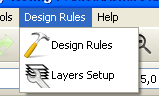
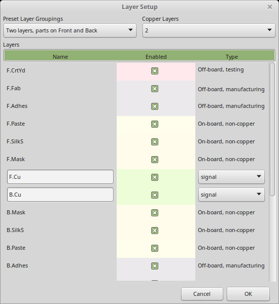
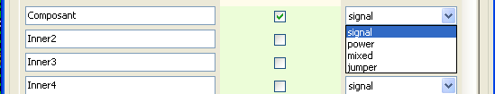
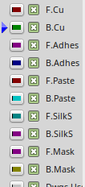
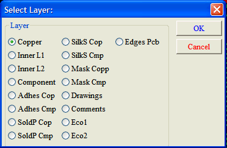
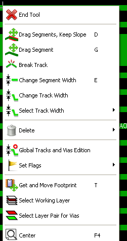
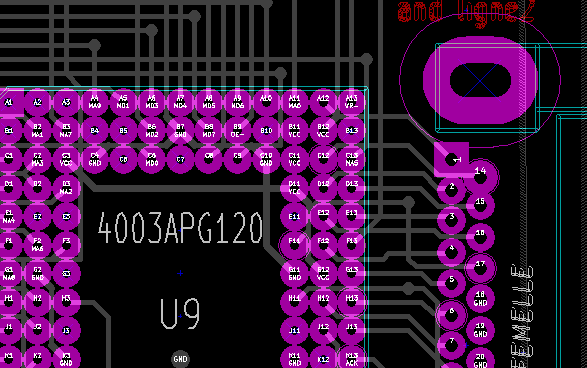

Setting up working layers
-------------------------

Pcbnew can work on 29 different layers:

* 16 layers of copper (or of routing of tracks)
* 12 auxiliary technical layers.
* 1 board outlines layer

The number of copper layer, and, if needed, their names and
attributes should be set. Unused technical layers can be disabled.

Select copper layers
~~~~~~~~~~~~~~~~~~~~

Introduction
^^^^^^^^^^^^

Copper layers are the usual working layers used by the automatic
router to place and re-arrange tracks. Layer 1 is the copper
(solder) layer. Layer 16 is the component layer. Other layers are
the inner layers, from L2 to L15.

Select number of layers
^^^^^^^^^^^^^^^^^^^^^^^

To enable navigation between layers, it is necessary to select the
number of working layers. To do this you can use the menu bar and
select Preferences -> Layers Setup.

Then select the number of layers wanted, from 2 to 16.

Copper layers
^^^^^^^^^^^^^

The name of any copper layer is editable. Copper layers have
attributes useful when using the external router _FreeRouter_.

Auxiliary technical layers
~~~~~~~~~~~~~~~~~~~~~~~~~~

Some are associated in pairs, others not. When they appear as a pair
this affects the behaviour of modules. The elements making up a
module (pads, drawing and text) appearing on a layer (solder or
component), appear on the other complementary layer when the module
is inverted (mirrored).

The technical layers are:

Paired layers
^^^^^^^^^^^^^

* The *Adhesives* layers (Copper and Component):
** These are used in the application of adhesive to stick SMD components
to the circuit board, generally before wave soldering.
* The *Solder Paste*  layers paste SMD (Copper and Component):
** Used to produce a masks to allow solder paste to be placed on the
pads of surface mount components, generally before reflow soldering.
In theory only surface mount pads occupy these layers.
* The *Silk Screen* layers (Copper and Component):
** They are the layers where the drawings of the components appear.
* The *Solder Mask* layers (Copper and Component):
** These define the solder masks. Normally all the pads appear on one or
the other of these layers (or both for through pads) to prevent the
varnish covering the pads.

Layers for general use
^^^^^^^^^^^^^^^^^^^^^^

* Comments
* E.C.O. 1
* E.C.O. 2
* Drawings

These layers are for any use. They can be used for text such as
instructions for assembly or wiring, or construction drawings, to be
used to create a file for assembly or machining.

Special layer
^^^^^^^^^^^^^

* *Edge Cuts* layer:
** this layer is reserved for the drawing of circuit board outline. Any
element (graphic, texts...) placed on this layer appears on all the
other layers. Use this layer only to draw board outlines.

Selection of the active layer
~~~~~~~~~~~~~~~~~~~~~~~~~~~~~

The selection of the active working layer can be done in several ways:

* Using the right toolbar (Layer manager).
* Using the upper toolbar.
* With the pop-up window (activated with the right mouse button).
* Using the + and – keys (works on copper layers only).
* By hot keys.

Selection using the layer manager
^^^^^^^^^^^^^^^^^^^^^^^^^^^^^^^^^

Selection using the upper toolbar
^^^^^^^^^^^^^^^^^^^^^^^^^^^^^^^^^

image:images/Pcbnew_layer_selection_dropdown.png[]

This directly selects the working layer.

Hot keys to select  the working layer are displayed.

Selection using the pop-up window
^^^^^^^^^^^^^^^^^^^^^^^^^^^^^^^^^

image:images/Pcbnew_layer_selection_popup.png[]

The Pop-up window opens a menu window which provides a choice for
the working layer

Selection of the Layers for Vias
~~~~~~~~~~~~~~~~~~~~~~~~~~~~~~~~

If the *Add Tracks and Vias* icon is selected on the right hand
toolbar, the Pop-Up window provides the option to change the layer
pair used for vias:

This selection opens a menu window which provides choice of the
layers used for vias.

image:images/Pcbnew_via_layer_pair_dialog.png[]

When a via is placed the working (active) layer is automatically
switched to the alternate layer of the layer pair used for the vias.

One can also switch to an other active layer by hot keys, and if a
track is in progress, a via will be inserted.

Using the high-contrast mode
~~~~~~~~~~~~~~~~~~~~~~~~~~~~

This mode is entered when the tool (in the left toolbar) is activated:
image:../common/icons/contrast_mode.png[]

When using this mode, the active layer is displayed like in the
normal mode, but all others layers are displayed in gray color.

There are two useful cases:

Copper layers in high-contrast mode
^^^^^^^^^^^^^^^^^^^^^^^^^^^^^^^^^^^

When a board uses more than four layers, this option allows the
active copper layer to seen more easily:

*Normal mode* (back side copper layer active):

image:images/Pcbnew_copper_layers_contrast_normal.png[]

*High-contrast mode* (back side copper layer active):

image:images/Pcbnew_copper_layers_contrast_high.png[]

Technical layers
^^^^^^^^^^^^^^^^

The other case is when it is necessary to examine solder paste
layers and solder mask layers, that are usually not displayed.

Masks on pads are displayed if this mode is active.

*Normal mode* (front side solder mask layer active):

image:images/Pcbnew_technical_layers_contrast_normal.png[]

*High-contrast mode* (front side solder mask layer active):

