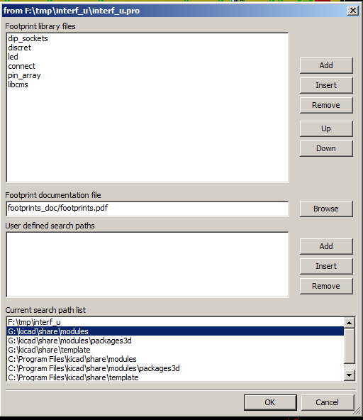
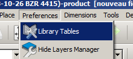
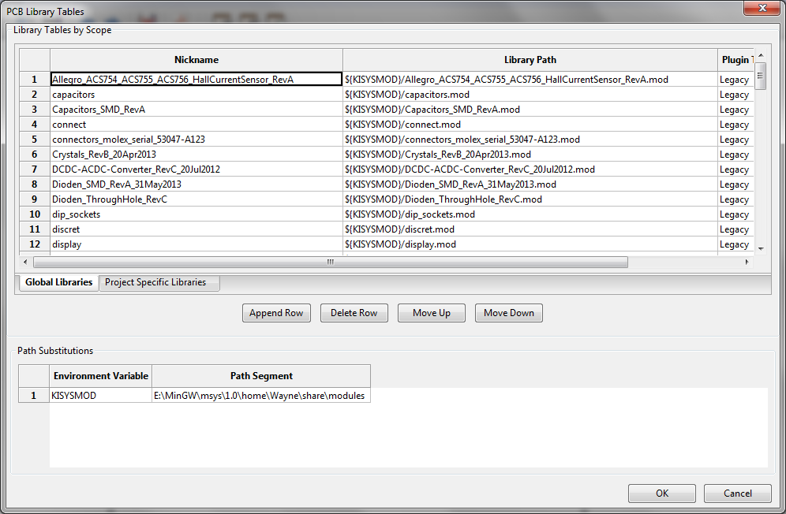

Installation
------------

Installation of the software
~~~~~~~~~~~~~~~~~~~~~~~~~~~~

The installation procedure is described in the KiCad documentation.

Modifying the default configuration
~~~~~~~~~~~~~~~~~~~~~~~~~~~~~~~~~~~

A default configuration file `kicad.pro` is provided in
`kicad/share/template`. This file is used as the initial
configuration for all new projects.

This configuration file can be modified to change libraries to be
loaded

To do this:

* Launch Pcbnew using kicad or directly. On Windows is in
`C:\kicad\bin\pcbnew.exe` and on Linux you can run
`/usr/local/kicad/bin/kicad` or `/usr/local/kicad/bin/pcbnew` if the
binaries are located in `/usr/local/kicad/bin`.
* Select Preferences - Libs and Dir.
* Edit as required.
* Save the modified configuration (Save Cfg) to
`kicad/share/template/kicad.pro`.

Managing Footprint Libraries: legacy versions
~~~~~~~~~~~~~~~~~~~~~~~~~~~~~~~~~~~~~~~~~~~~~

You can access to the library list initialization from the
Preferences menu:

image:images/Library_list_menu_item.png[]

The image below shows the dialog which allows you to set the
footprint library list:

You must to add all libraries that contain the footprints required
for your project. You should also remove unused libraries from new
projects to prevent footprint name clashes. Please note, there is a
issue with the footprint library list when duplicate footprint names
exist in more than one library.  When this occurs, the footprint
will be loaded from the first library found in the list. This is an
issue (you cannot load the footprint you want), either change the
library list order using the “Up” and “Down” buttons in the dialog
above or give the footprint a unique name in using the footprint
editor.

Managing Footprint Libraries: .pretty repositories
~~~~~~~~~~~~~~~~~~~~~~~~~~~~~~~~~~~~~~~~~~~~~~~~~~

As of release rXXXX, Pcbnew uses the new footprint library table
implementation to manage footprint libraries and the information in
the previous section is no longer valid. The library table manager is
accessible by:

The image below shows the footprint library table editing dialog
which can be opened by invoking the “Library Tables” entry from the
“Preferences” menu.

The footprint library table is used to map a footprint library of
any supported library type to a library nickname.  This nickname is
used to look up footprints instead of the previous method which
depended on library search path ordering.  This allows Pcbnew to
access footprints with the same name in different libraries by
ensuring that the correct footprint is loaded from the appropriate
library.  It also allows Pcbnew to support loading libraries from
different PCB editors such as Eagle and GEDA.

Global Footprint Library Table
^^^^^^^^^^^^^^^^^^^^^^^^^^^^^^

The global footprint library table contains the list of libraries
that are always available irregardless of the currently loaded
project file.  The table is saved in the file `fp-lib-table` in the
user's home folder.  The location of this folder is dependent on the
operating system.

Project Specific Footprint Library Table
^^^^^^^^^^^^^^^^^^^^^^^^^^^^^^^^^^^^^^^^

The project specific footprint library table contains the list of
libraries that are available specifically for the currently loaded
project file.  The project specific footprint library table can only
be edited when it is loaded along with the project board file.  If
no project file is loaded or there is no footprint library table
file in the project path, an empty table is created which can be
edited and later saved along with the board file.

Initial Configuration
^^^^^^^^^^^^^^^^^^^^^

The first time CvPcb or Pcbnew is run and the global footprint table
file `fp-lib-table` is not found in the user's home folder, Pcbnew
will attempt to copy the default footprint table file
fp_global_table stored in the system's KiCad template folder to the
file `fp-lib-table` in the user's home folder.  If fp_global_table
cannot be found, an empty footprint library table will be created in
the user's home folder.  If this happens, the user can either copy
fp_global_table manually or configure the table by hand.  The
default footprint library table includes all of the standard
footprint libraries that are installed as part of KiCad.

Adding Table Entries
^^^^^^^^^^^^^^^^^^^^

In order to use a footprint library, it must first be added to
either the global table or the project specific table.  The project
specific table is only applicable when a board file is open.  Each
library entry must have a unique nickname.  This does not have to be
related in any way to the actual library file name or path.  The
colon `:` character cannot be used anywhere in the nickname.  Each
library entry must have a valid path and/or file name depending on
the type of library.  Paths can be defined as absolute, relative, or
by environment variable substitution (see section 4.5.3 below).  The
appropriate plug in type must be selected in order for the library
to be properly read.  Pcbnew currently supports reading KiCad
legacy, KiCad Pretty, Eagle,  and GEDA footprint libraries.  There
is also a description field to add a description of the library
entry.  The option field is not used at this time so adding options
will have no effect when loading libraries.  Please note that you
cannot have duplicate library nicknames in the same table.  However,
you can have duplicate library nicknames in both the global and
project specific footprint library table.  The project specific
table entry will take precedence over the global table entry when
duplicated names occur.  When entries are defined in the project
specific table, an fp-lib-table file containing the entries will be
written into the folder of the currently open net list.

Environment Variable Substitution
^^^^^^^^^^^^^^^^^^^^^^^^^^^^^^^^^

One of the most powerful features of the footprint library table is
environment variable substitution.  This allows you to define custom
paths to where your libraries are stored in environment variables.
Environment variable substitution is supported by using the syntax
`${ENV_VAR_NAME}` in the footprint library path.  By default, at run
time Pcbnew defines the `$KISYSMOD` environment variable.  This points
to where the default footprint libraries that were installed with
KiCad are located.  You can override `$KISYSMOD` by defining it
yourself which allows you to substitute your own  libraries in place
of the default KiCad footprint libraries.  When a board file is
loaded, Pcbnew also defines the `$KPRJMOD` using the board file path.
This allows you to create libraries in the project path without
having to define the absolute path to the library in the project
specific footprint library table.

Using the GitHub Plugin
^^^^^^^^^^^^^^^^^^^^^^^

The GitHub plugin is a special plugin that provides an interface for
read only access to a remote GitHub repository consisting of pretty
(Pretty is name of the KiCad footprint file format) footprints and
optionally provides "Copy On Write" (COW) support for editing
footprints read from the GitHub repo and saving them locally.
Therefore the "GitHub" plugin is for *read only for accessing remote
pretty footprint libraries* at https://github.com.  To add a GitHub
entry to the footprint library table the "Library Path" in the
footprint library table row for a must be set to a valid GitHub URL.

For example:

     https://github.com/liftoff-sr/pretty_footprints

Tpically GitHub URLs take the form:

     https://github.com/user_name/repo_name

The "Plugin Type" must be set to "Github".  To enable the “Copy On
Write" feature the option `allow_pretty_writing_to_this_dir` must be
added to the “Options” setting of the footprint library table entry.
This option is the "Library Path" for local storage of modified
copies of footprints read from the GitHub repo.  The footprints
saved to this path are combined with the read only part of the
GitHub repository to create the footprint library.  If this option
is missing, then the GitHub library is read only.  If the option is
present for a GitHub library, then any writes to this hybrid library
will go to the local `*.pretty` directory.  Note that the github.com
resident portion of this hybrid COW library is always read only,
meaning you cannot delete anything or modify any footprint in the
specified GitHub repository directly. The aggregate library type
remains "Github" in all further discussions, but it consists of both
the local read/write portion and the remote read only portion.

The table below shows a footprint library table entry without the option `allow_pretty_writing_to_this_dir`:

[options="header"]
|==============================================================
| Nickname | Library Path | Plugin Type | Options | Description
| github
    | https://github.com/liftoff-sr/pretty_footprints
    | Github
    |
    | Liftoff's GH footprints
|==============================================================

The table below shows a footprint library table entry with the COW
option given.  Note the use of the environment variable `${HOME}` as
an example only.  The github.pretty directory is located in
`${HOME}/pretty/path`.  Anytime you use the option
`allow_pretty_writing_to_this_dir`, you will need to create that
directory manually in advance and it must end with the extension
`.pretty`.

[options="header"]
|==============================================================
| Nickname | Library Path | Plugin Type | Options | Description
| github
    | https://github.com/liftoff-sr/pretty_footprints
    | Github
    | allow_pretty_writing_to_this_dir=${HOME}/pretty/github.pretty
    | Liftoff's GH footprints
|==============================================================

Footprint loads will always give precedence to the local footprints
found in the path given by the option
`allow_pretty_writing_to_this_dir`.  Once you have saved a footprint
to the COW library's local directory by doing a footprint save in
the footprint editor, no GitHub updates will be seen when loading a
footprint with the same name as one for which you've saved locally.

Always keep a separate local `*.pretty` directory for each GitHub
library, never combine them by referring to the same directory more
than once.  Also, do not use the same COW (`*.pretty`) directory in
a footprint library table entry.  This would likely create a mess.
The value of the option `allow_pretty_writing_to_this_dir` will
expand any environment variable using the `${}` notation to create
the path in the same way as the “Library Path” setting.

What's the point of COW?  It is to turbo-charge the sharing of
footprints.  If you periodically email your COW pretty footprint
modifications to the GitHub repository maintainer, you can help
update the GitHub copy.  Simply email the individual `*.kicad_mod`
files you find in your COW directories to the maintainer of the
GitHub repository.  After you've received confirmation that your
changes have been committed, you can safely delete your COW file(s)
and the updated footprint from the read only part of GitHub library
will flow down.  Your goal should be to keep the COW file set as
small as possible by contributing frequently to the shared master
copies at https://github.com.

Usage Patterns
^^^^^^^^^^^^^^

Footprint libraries can be defined either globally or specifically
to the currently loaded project.  Footprint libraries defined in the
user's global table are always available and are stored in the
`fp-lib-table` file in the user's home folder.  Global footprint
libraries can always be accessed even when there is no project net
list file opened.  The project specific footprint table is active
only for the currently open net list file.  The project specific
footprint library table is saved in the file fp-lib-table in the
path of the currently open board file.  You are free to define
libraries in either table.

There are advantages and disadvantages to each method:

* You can define all of your libraries in the global table which means
they will always be available when you need them.
** The disadvantage of this is that you may have to search through a lot
of libraries to find the footprint you are looking for.
* You can define all your libraries on a project specific basis.
** The advantage of this is that you only need to define the libraries
you actually need for the project which cuts down on searching.
** The disadvantage is that you always have to remember to add each
footprint library that you need for every project.
* You can also define footprint libraries both globally and project
specifically.

One usage pattern would be to define your most commonly used
libraries globally and the library only require for the project in
the project specific library table.  There is no restriction on how
you define your libraries.
