General operations
------------------

Toolbars and commands
~~~~~~~~~~~~~~~~~~~~~

In Pcbnew it is possible to executes command via various means:

* text-based menu at the top of the main window.
* top toolbar menu.
* right toolbar menu.
* left toolbar menu.
* mouse buttons (menu options). Specifically:
** The right-hand mouse button reveals a Pop up menu the content of
which depends on the element under the mouse arrow.
* keyboard (Function keys F1, F2, F3, F4, Shift, Delete, +, - Page Up,
Page Down and “space” bar). The “Escape” key generally cancels an
operation in progress.

The screen-shot below illustrates some of the possible accesses to the
operations:

image:images/Right-click_legacy_menu.png[]

Mouse commands
~~~~~~~~~~~~~~

Basic commands
^^^^^^^^^^^^^^

* Left button
** Single click displays the characteristics of the module or text under
the cursor to the lower status bar.
** Double click displays the editor (if the element is editable) of the
element under the cursor.
* Centre button/wheel
** Rapid zoom and some commands in layer manager. A 2 button mouse is
undesirable.
** Hold down the centre button and draw a rectangle to zoom to the
described area. The rotation of the mouse wheel will allow you to zoom
in and zoom out.
* Right button
* Displays a pop-up menu

Operations on blocks
^^^^^^^^^^^^^^^^^^^^

Operations to move, invert (mirror), copy, rotate and delete a block
are all available via the pop-up menu. In addition the view can zoom
to the area described by the block.

The framework of the block is traced by moving the mouse whilst
holding down the left mouse button. The operation is executed when
the button is released.

By holding down one of the hotkeys “Shift” or “Ctrl”, or both keys
“Shift and Ctrl” together, whilst the block is drawn the operation
invert, rotate or delete is automatically selected as shown in the
table below:

[options="header"]
|====
| Action | Effect
| Left mouse button held down
| Trace framework to move block
| Shift + Left mouse button held down
| Trace framework for invert block
| Ctrl + Left mouse button held down
| Trace framework for rotating block 90°
| Shift+Ctrl + Left mouse button held down
| Trace framework to delete the block
| Centre mouse button held down
| Trace framework to zoom to block
|====

When moving a block:

* Move block to new position and operate left mouse button to place
the elements.
* To cancel the operation use the right mouse button
and select Cancel Block from the menu (or press the Esc key).

Alternatively if no key is pressed when drawing the block use the
right mouse button to display the pop-up menu and select the
required operation.

For each block operation a selection window enables the action to be
limited to only some elements.

Selection of grid size
~~~~~~~~~~~~~~~~~~~~~~

During elements layout the cursor moves on a grid. The grid can be turned on or off using the icon on the left toolbar.

Any of the pre-defined grid sizes, or a User Defined grid, can be
chosen using the pop-up window, or the drop-down selector on the
toolbar at the top of the screen. The size of the User Defined grid
is set using the menu bar option Dimensions -> User Grid Size.

Adjustment of the zoom level
~~~~~~~~~~~~~~~~~~~~~~~~~~~~

To change the zoom level:

* Open the pop-up window (using the right mouse button) and to select the desired zoom.
* Or use the function keys:
** `F1`: Enlarge (zoom in)
** `F2`: Reduce (zoom out)
** `F3`: Redraw the display
** `F4`: Centre view at the current cursor position
* Or rotate the mouse wheel.
* Or hold down the middle mouse button and draw a rectangle to zoom to the described area.

Displaying cursor coordinates
~~~~~~~~~~~~~~~~~~~~~~~~~~~~~

The cursor coordinates are displayed in inches or millimetres as selected using the 'In' or 'mm' icons on the left hand side toolbar.

Whichever unit is selected Pcbnew always works to a precision of 1/10,000 of inch.

The status bar at the bottom of the screen gives:

* The current zoom setting.
* The absolute position of the cursor.
* The relative position of the cursor. Note the relative coordinates (x,y) can be set to (0,0) at any position by pressing the space bar. The cursor position is then displayed relative to this new datum.

In addition the relative position of the cursor can be displayed using its polar co-ordinates (ray + angle). This can be turned on and off using the icon on the left hand side toolbar.

Keyboard commands - hotkeys
~~~~~~~~~~~~~~~~~~~~~~~~~~~~

Many commands are accessible directly with the keyboard. Selection can be either upper or lower case. Most hot keys are shown in menus. Some hot keys that do not appear are:

* `Delete`: deletes a module or a track. (_Available only if the Module tool or the track tool is active_)
* `V`: if the track tool is active switches working layer or place via, if a track is in progress.
* `+` and `-`: select next or previous layer.
* `?`: display the list off all hot keys.
* `Space`: reset relative coordinates.

Operation on blocks
~~~~~~~~~~~~~~~~~~~

Operations to move, invert (mirror), copy, rotate and delete a block
are all available from the pop-up menu. In addition the view can
zoom to that described by the block.

The framework of the block is traced by moving the mouse whilst
holding down the left mouse button. The operation is carried out on
releasing the button.

By holding down one of the keys “Shift” or “Ctrl” or both “Shift and
Ctrl” together or “Alt”, whilst the block is drawn the operation
invert, rotate, delete or copy is automatically selected as shown in
the table below:

[options="header"]
|====
| Action | Effect
| Left mouse button held down
| Move block
| Shift + Left mouse button held down
| Invert (mirror) block
| Ctrl + Left mouse button held down
| Rotate block 90°
| Shift+Ctrl + Left mouse button held down
| Delete the block
| Alt + Left mouse button held down
| Copy the block
|====

When a block command is made, a dialog window is displayed, and
items involved in this command can be chosen.

Any of the commands above can be cancelled via the same pop-up menu
or by pressing the Escape key (`Esc`).

image:images/Pcbnew_legacy_block_selection_dialog.png[]

Units used in dialogs
~~~~~~~~~~~~~~~~~~~~~

Units used to display dimensions values are inch and mm. The desired
unit can be selected by pressing the icon located in left toolbar:
image:images/Inch mm combo icon.png[]
However one can enter the unit used to define a value, when entering
a new value.

Accepted units are:

|====
| 1 *in*  | 1 inch
| 1 *"*   | 1 inch
| 25 *th* | 25 thou
| 25 *mi* | 25 mils, same as thou
| 6 *mm*  | 6 mm
|====

The rules are:

* Spaces between the number and the unit are accepted.
* Only the first two letters are significant.
* In countries using an alternative decimal separator than the period, the period (`.`) can be used as well. Therefore `1,5` and `1.5` are the same in French.

Top menu bar
~~~~~~~~~~~~

The top menu bar provides access to the files (loading and saving), configuration options, printing, plotting and the help files.

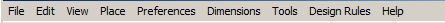

The File menu
^^^^^^^^^^^^^

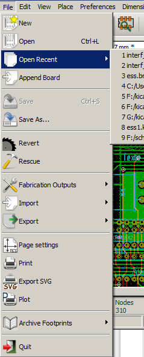

The File menu allows the loading and saving of printed circuits files, as well as printing and plotting the circuit board. It enables the export (with the format GenCAD 1.4) of the circuit for use with automatic testers.

Edit menu
^^^^^^^^^

Allows some global edit actions:

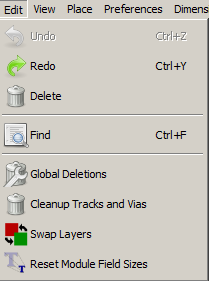

View menu
^^^^^^^^^

image:images/Pcbnew_view_menu.png[]

Zoom functions and 3D board display.

Sub menu View/3D display
^^^^^^^^^^^^^^^^^^^^^^^^

Opens the 3D board viewer. Here is a sample:

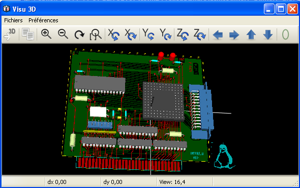

Place menu
^^^^^^^^^^

Same function as the right-hand toolbar.

image:images/Pcbnew place menu.png[]

The Preferences menu
^^^^^^^^^^^^^^^^^^^^

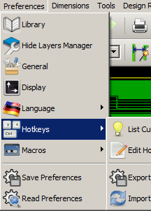

Allows:

* Selection of the module libraries.
* Hide/Show the Layers manager( colors selection for displaying layers and other elements. Also enables the display of elements to be turned on and off.)
* Management of general options (units,  etc.).
* The management of other display options.
* Creation, edition (and re-read) of the hot keys file.

Dimensions menu
^^^^^^^^^^^^^^^

An important menu.
image:images/Pcbnew_dimensions_menu.png[]

Allows adjustment of:

* User grid size.
* Size of texts and the line width for drawings.
* Dimensions and characteristic of pads.
* Setting the global values for solder mask and solder paste layers

Tools menu
^^^^^^^^^^

image:images/Pcbnew_place_menu.png[]

The Design Rules menu
^^^^^^^^^^^^^^^^^^^^^

image:images/Pcbnew_design_rules_menu.png[]

* Provides access to 2 dialogs:
Setting the Design rules (tracks and vias sizes, clerances).
* Setting layers (Number, enabled and layers names)

The Display 3D Model menu
^^^^^^^^^^^^^^^^^^^^^^^^^

Brings up the 3D viewer used to display the circuit board in 3
dimensions.

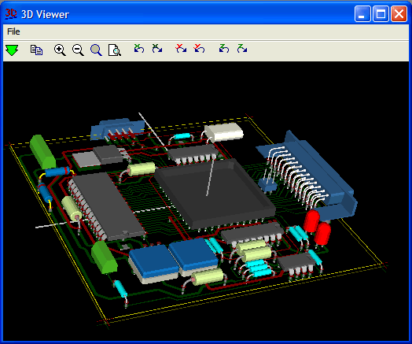

The Help menu
^^^^^^^^^^^^^

Provides access to the user manuals and to the version information
menu (Pcbnew About).

Using icons on the top toolbar
~~~~~~~~~~~~~~~~~~~~~~~~~~~~~~

This toolbar gives access to the principal functions of Pcbnew.

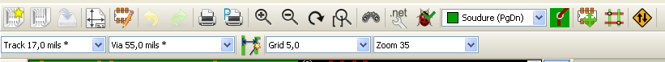

[cols="2,10"]
|====
| image:../common/icons/new.png[]
    | Creation of a new printed circuit.
| image:../common/icons/open_brd_file.png[]
    | Opening of an old printed circuit.
| image:../common/icons/save.png[]
    | Save printed circuit.
| image:../common/icons/sheetset.png[]
    | Selection of the page size and modification of the file properties.
| image:../common/icons/module_editor.png[]
    | Opens module editor (Modedit) to display/edit library or pcb modules.
|  image:../common/icons/redo.png[]
    | Undo/Redo last commands (10 levels)
| image:../common/icons/print_button.png[]
    | Display print menu.
| image:../common/icons/plot.png[]
    | Display plot menu.
| image:../common/icons/zoom_in.png[] image:../common/icons/zoom_out.png[]
    | Zoom in and Zoom out (relative to the centre of screen).
| 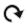
    | Redraw the screen
| 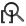
    | Fit to page
| 
    | Find module or text.
| image:../common/icons/netlist.png[]
    | Netlist operations (selection, reading, testing and compiling).
| image:../common/icons/drc.png[]
    | DRC (Design Rule Check): Automatic check of the tracks.
| image:images/Pcbnew_toolbar_layer_select_dropdown.png[]
    | Selection of the working layer.
| image:images/Pcbnew_layer_pair_indicator.png[]
    | Selection of layer pair (for vias)
| image:../common/icons/mode_module.png[]
    | Footprint mode: when active this enables module options in the
    pop-up window.
| 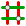
    | Routing mode: when active this enables routing options in the
    pop-up window
| 
    | Direct access to the web router FreeRoute
|====

Auxiliary toolbar
^^^^^^^^^^^^^^^^^

[cols="2,10"]
|====
| image:images/Pcbnew_track_thickness_dropdown.png[]
    | Selection of thickness of track already in use.
| 
    | Selection of a dimension of via already in use.
| 
    | Automatic track width: if enabled when creating a new track,
    when starting on an existing track, the width of the new track
    is set to the width of the existing track.
| image:images/Pcbnew_grid_size_dropdown.png[]
    | Selection of the grid size.
| image:images/Pcbnew_zoom_factor_dropdown.png[]
    | Selection of the zoom.
|====

Right-hand side toolbar
~~~~~~~~~~~~~~~~~~~~~~~

image:images/Pcbnew_right_toolbar.png[float="right"]

This toolbar gives access to the editing tool to change the PCB
shown in Pcbnew:

    * Placement of modules, tracks, zones of copper, texts, etc.
    * Net Highlighting.
    * Creating notes, graphic elements, etc.
    * Deleting elements.

[cols="2,10",width="90%"]
|====
| 
    | Select the standard mouse mode.
| 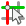
    | Highlight net selected by clicking on a track or pad.
| 
    | Display local ratsnest (Pad or Module).
| 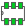
    | Add a module from a library.
| 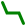
    | Placement of tracks and vias.
| image:../common/icons/add_zone.png[]
    | Placement of zones (copper planes).
| image:../common/icons/add_keepout_area.png[]
    | Placement of keepout areas ( on copper layers ).
| 
    | Keepout are areas with no tracks, or/and vias or/and copper areas
| 
    | Draw Lines on technical layers (i.e. not a copper layer).
| 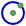
    | Draw Circles on technical layers (i.e. not a copper layer).
| image:../common/icons/add_arc.png[]
    | Draw Arcs on technical layers (i.e. not a copper layer).
| image:../common/icons/add_text.png[]
    | Placement of text.
| image:../common/icons/add_dimension.png[]
    | Draw Dimensions on technical layers (i.e. not the copper layer).
| image:../common/icons/add_mires.png[]
    | Draw Alignment Marks (appearing on all layers).
| image:../common/icons/delete.png[]
    | Delete element pointed to by the cursor

    *Note:*
    When Deleting if several superimposed elements are
    pointed to priority is given to the smallest (in the decreasing
    set of priorities tracks, text, module). The function “Undelete”
    of the upper toolbar allows the cancellation of the last item
    deleted.
| 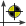
    | Offset adjust for drilling and place files.
| image:../common/icons/grid_select_axis.png[]
    | Grid origin. (grid offset). Useful mainly for edition and
    placement of footprints. Can also be set in Dimensions/Grid menu.
|====

Left-hand side toolbar
~~~~~~~~~~~~~~~~~~~~~~

image:images/Pcbnew_left_toolbar.png[float="right"]

The left hand-side toolbar provides display and control options that
affect Pcbnew's interface.

[cols="2,10",width="90%"]
|====
| 
    | Turns DRC (Design Rule Checking) on/off. *Caution:* when DRC
    is off incorrect connections can be made.
| image:../common/icons/grid.png[]
    | Turn grid display on/off *Note:* a small grid may not be displayed
    unless zoomed in far enough
| image:../common/icons/polar_coord.png[]
    | Polar display of the relative co-ordinates on the status bar on/off.
| image:../common/icons/unit_inch.png[] image:../common/icons/unit_mm.png[]
    | Display/entry of coordinates or dimensions in inches or millimeters.
| image:../common/icons/cursor_shape.png[]
    | Change cursor display shape.
| image:../common/icons/general_ratsnest.png[]
    | Display general rats nest (incomplete connections between modules).
| 
    | Display module rats nest dynamically as it is moved.
| image:../common/icons/auto_delete_track.png[]
    | Enable/Disable automatic deletion of a track when it is redrawn.
| image:../common/icons/show_zone.png[]
    | Show filled areas in zones
| 
    | Do not show filled areas in zones
| image:../common/icons/show_zone_outline_only.png[]
    | Show only outlines of filled areas in zones
| 
    | Display of pads in sketch mode on/off.
| 
    | Display mode for vias (Filled/Sketch)
| image:../common/icons/showtrack.png[]
    | Display of tracks in sketch mode on/off.
| image:../common/icons/contrast_mode.png[]
    | High contrast display mode on/off. In this mode the active
    layer is displayed normally, all the other layers are displayed
    in gray. Useful for working on multi-layer circuits.
| image:../common/icons/layers_manager.png[]
    | Hide/Show the Layers manager
| 
    | Access to microwaves tools. Under development
|====

Pop-up windows and fast editing
~~~~~~~~~~~~~~~~~~~~~~~~~~~~~~~

A right click of the mouse open a pop-up window. Its contents
depends on the element pointed at by the cursor.

This gives immediate access to:

* Changing the display (centre display on cursor, zoom in or out or
selecting the zoom).
* Setting the grid size.
* Additionally a right click on an element enables editing of the most
usually modified element parameters.

The screenshot below shows what the pop-up window looks like.

Available modes
~~~~~~~~~~~~~~~

There are 3 modes when using pop up menus. In the pop-up menus,
these modes add or remove some specific commands.

[cols="2,5"]
|====
| image:../common/icons/mode_module.png[] and
   disabled
    | Normal mode
|  enabled
    | Footprint mode
|  enabled
    | Tracks mode
|====

Normal mode
^^^^^^^^^^^

* Pop-up menu with no selection:

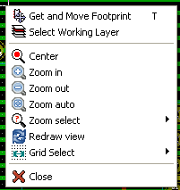

* Pop-up menu with track selected:

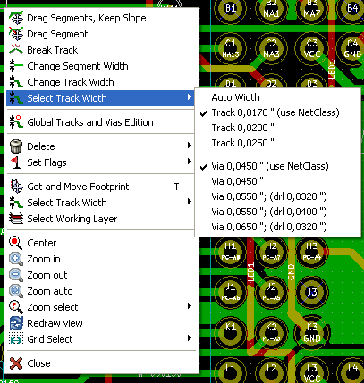

* Pop-up menu with footprint selected:

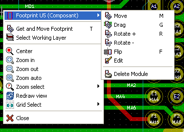

Footprint mode
^^^^^^^^^^^^^^

Same cases in Footprint Mode (image:../common/icons/mode_module.png[] enabled)

* Pop-up menu with no selection:

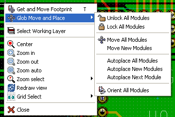

* Pop-up menu with track selected:

image:images/Pcbnew_popup_footprint_mode_track.png[]

* Pop-up menu with footprint selected:

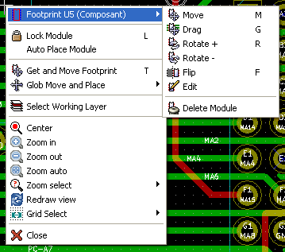

Tracks mode
^^^^^^^^^^^

Same cases in Track Mode ( enabled)

* Pop-up menu with no selection:

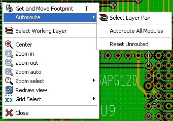

* Pop-up menu with track selected:

image:images/Pcbnew_popup_track_mode_track.png[]

* Pop-up menu with footprint selected:

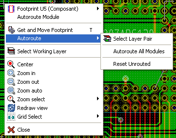
