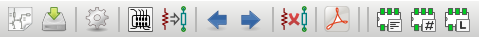
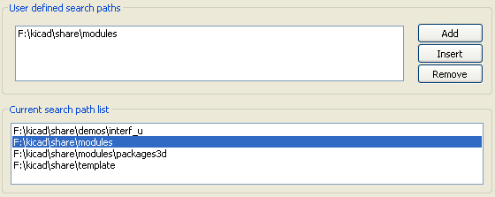
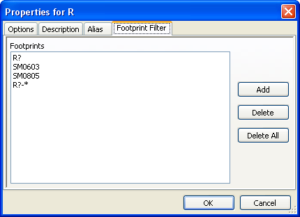

CvPcb
=====
:author: The KiCad Team
:version: 0.1
:doctype: article
:toc:
:toc-placement: preamble

image::images/kicad_logo.png[Kicad logo]

*CvPcb*

_Reference manual_

<<<

[[copyright]]
*Copyright*

This document is Copyright © 2010–2014 by it’s contributors as listed
below. You may distribute it and/or modify it under the terms of either
the GNU General Public License (http://www.gnu.org/licenses/gpl.html),
version 3 or later, or the Creative Commons Attribution License
(http://creativecommons.org/licenses/by/3.0/), version 3.0 or later.

All trademarks within this guide belong to their legitimate owners.

[[contributors]]
*Contributors*

Jean-Pierre Charras, Fabrizio Tappero, Wayne Stambaugh.

[[feedback]]
*Feedback*

Please direct any comments or suggestions about this document to the
KiCad mailing list: _https://launchpad.net/~kicad-developers_

[[acknowledgments]]
*Acknowledgments*

None

[[publication_date_and_software_version]]
*Publication date and software version*

Published on February 4, 2013.

[[note-for-mac-users]]
*Note for Mac users*

The KiCad support for the Apple OS X operating system is experimental.

<<<

toc::[]

Introduction to CvPcb
---------------------

CvPcb is a tool that allows you to associate components in your
schematic to component footprints used when laying out the printed
circuit board. This association is added to the net list file created by
the schematic capture program Eeschema.

Typically the net list file generated by Eeschema does not specify which
printed circuit board footprint is associated with each component in the
schematic. Although this is not always the case as component footprints
can be associated during schematic capture by setting the component’s
footprint field. CvPcb provides a convenient method of associating
footprints to components. It provides footprint list filtering,
footprint viewing, and 3D component model viewing to help ensure the
correct footprint is associated with each component.

Components can be assigned to their corresponding footprints manually or
automatically by creating equivalence files. Equivalence files are look
up tables associating each component with it’s footprint.

This interactive approach is simpler and less error prone than directly
associating the footprints in the schematic editor.

CvPcb allows you to see the list of available footprints and display them
on the screen to ensure you are associating the correct footprint.

CvPcb Features
--------------

Manual or Automatic Association
~~~~~~~~~~~~~~~~~~~~~~~~~~~~~~~

CvPcb allows for interactive assignment (manual) as well as automatic
assignment via equivalence files. It is also possible to generate
back-annotation files which are useful for automatically associating the
footprints selected by CvPcb schematic captured by Eeschema.

Input Files
~~~~~~~~~~~

* The net list file (*.net) created by Eeschema with or without footprint
  associations.
* The auxiliary component assignment file (*.cmp) previously created by
  CvPcb if one exists.

Output Files
~~~~~~~~~~~~

Two files are generated for Pcbnew:

* The net list file with footprint associations.
* An auxiliary component association file (*.cmp).

Invoking CvPcb
--------------

CvPcb is typically invoked from the schematic capture program Eeschema.
Eeschema automatically passes the correct net list file name to CvPcb.
Before running CvPcb for the first time for each project, you must first
save the initial net list by selecting the ``Generate Netlist'' entry in
to ``Tools'' menu or click on the generate net list button on the top
tool bar in Eeschema. By default the net list file has the same name as
the project with a ``net'' file extension. If the net list file for the
project already exists, all footprint associations will be preserved.
After the initial net list file is created by Eeschema, CvPcb can be
invoked directly from the KiCad project manager. CvPcb can also be
invoked as a stand alone program rather than being launch from the KiCad
project manager or the schematic editor. If CvPcb is run as a stand
alone program, the net list file must be opened manually by selecting
the ``Open'' entry in the ``File'' menu or clicking the ``Open'' file
button on the tool bar.

CvPcb Commands
--------------

Main Screen
~~~~~~~~~~~

The image below shows the main window of CvPcb.

image:images/1000000000000324000001ED7EE8E1AB.png[]

The left pane contains the list of available footprint library file
names associated with the project. The center pane contains the list of
components loaded from the net list file. The right pane contains the
list of available footprints loaded from the project footprint libraries.
The component pane will be empty if no netlist file has been loaded
and the footprint pane can be also empty if no footprint libraries are
found.

Main Window Toolbar
~~~~~~~~~~~~~~~~~~~

The top toolbar allows for easy access to the following commands:

[width="80%",cols="10%,90%",]
|=======================================================================
|image:images/icon_open_document.png[]
|Select the net list file to be processed.

|
|Save the footprint association file (.cmp) and the updated net list
(.net) file.

|image:images/icon_config.png[]
|Invoke the CvPcb configuration menu.

|image:images/icon_show_footprint.png[]
|Display the footprint of the component selected in the footprint
window.

|image:images/100002010000001A0000001AFDF35759.png[]
|Automatically associate footprints with components starting using an
equivalence file.

|image:images/100002010000001A0000001A3EEC8BF8.png[]
|Automatically select the previous component in the list without a
footprint association.

|image:images/100002010000001A0000001A35181776.png[]
|Automatically select the next component in the list without a footprint
association.

|
|Delete all footprint assignments.

|image:images/icon_datasheet.png[]
|Open the selected footprint documentation pdf file using the default
pdf viewer.

|image:images/100002010000001A0000001A2030B04B.png[]
|Enable or disable the filtering to limit the list of footprints to the
footprint filters of the selected component.

|image:images/100002010000001A0000001A98870FF1.png[]
|Enable or disable the filtering to limit the list of footprints using
the pin count of the selected component.

|image:images/100002010000001A0000001A7D355C45.png[]
|Enable or disable filtering to limit the list of footprints using the
selected library.
|=======================================================================

Main Window Keyboard Commands
~~~~~~~~~~~~~~~~~~~~~~~~~~~~~

The following table lists the keyboard commands for the main window:

[width="80%",cols="15%,85%",]
|=======================================================================
v|Right Arrow
Tab|Activate the next pane to the right of the
currently activated pane. Wrap around to the first pane if the last pane
is currently activated.

|Left Arrow |Activate the next pane to the left of the currently
activated pane. Wrap around to the last pane if the first pane is
currently activated.

|Up Arrow |Select the previous item of the currently selected list.

|Down Arrow |Select the next item of the currently selected list.

|Page Up |Select the item up one full page of the currently selected
list.

|Page Down |Select the item down one full page of the currently selected
list.

|Home |Select the first item of the currently selected list.

|End |Select the last item of the currently selected list.
|=======================================================================

CvPcb Configuration
~~~~~~~~~~~~~~~~~~~

image:images/10000000000000D3000000C24C09C33B.png[]

CvPcb can be automatically closed after saving the footprint association
file, or not.

Invoking the ``Libraries'' entry in the ``Preferences'' menu displays
the library configuration dialog.

Depending of the CvPcb version, there are 2 different libraries
management:

- The legacy management, using *.mod files, and a library list of files
- The new ``Pretty'' format, using one file by footprint. It uses a
folder list. Each folder (*.pretty folder name) is a library. When
using the new management, You also can use native libraries coming from
GEDA/GPCB or Eagle xml format files .

Footprint Libraries Management
------------------------------

Legacy management: selecting Footprint Libraries
~~~~~~~~~~~~~~~~~~~~~~~~~~~~~~~~~~~~~~~~~~~~~~~~

This section of the footprint library configuration dialog is used to
add, remove, and change the search order of the footprint libraries for
the current project. The library order is critical when searching for
footprints with duplicate names. CvPcb will use the first occurrence of
the footprint name it finds. If you create a new footprint, it is always
a good idea to give it a unique name to prevent naming conflicts. This
is a known issue and will be fixed in a future version of KiCad. Please
note that changing these libraries will also effect Pcbnew.

image:images/2000000900003A6600000EC90C50E7EF.png[]

- *Remove:* Removes the selected footprint library from the list.
- *Add:* Adds a new footprint library to the end of the list.
- *Insert:* Inserts a new footprint library to the list before the currently selected library.
- *Up:* Move the currently select library up the list.
- *Down:* Move the currently selected library down the list.

Changing the Footprint Documentation File.
^^^^^^^^^^^^^^^^^^^^^^^^^^^^^^^^^^^^^^^^^^

image:images/2000000900003A1700000596F88F93A0.png[]

Select the ``Browse'' button to select a new footprint documentation
file with the display file select dialog.

Changing Footprint Library Search Paths.
^^^^^^^^^^^^^^^^^^^^^^^^^^^^^^^^^^^^^^^^

CvPcb uses two types of paths: the default paths automatically set by
KiCad when a new project is created and paths added by the user. These
paths are used to find the footprints library files (.mod), equivalence
files (.equ), and 3D model files (.wrl) used by CvPcb. The default paths
cannot be edited. Only new user defined paths can be added to the search
path list.

Changing User Define Paths.
^^^^^^^^^^^^^^^^^^^^^^^^^^^

Click the ``Add'' button to add a new path after the selected entry in
the search path list. Click the ``Insert'' button to insert a new path
before the selected entry in the search path list. Click the ``Remove''
button to remove the selected user defined search path. Clicking the
``Remove'' button will have no effect if a default search path is
selected.

image:images/100000000000022F0000007155E2D729.png[]

Default Library Paths
^^^^^^^^^^^^^^^^^^^^^

By default CvPcb internally uses a set of predefined paths used to search
for footprint libraries. These paths are operating system dependent. It
is generally preferable to use relative paths rather than absolute paths
whenever possible to prevent platform dependency problems. In other
words: “c:\Program Files\kicad\share” has no meaning and will fail on
Linux and OSX.

The default Linux library paths will be as follows:

- *root/share/kicad/modules*
- *root/share/kicad/modules/packages3d* (for 3D shapes files 
  format *VRML* created par Wings3D).
- *root/share/template*

Where the root path is relative to the binary path where KiCad is
installed. Typically on Linux Kicad is installed in the /usr/bin path.
Therefore the root path would be /usr.

New Management: Footprint Libraries tables
~~~~~~~~~~~~~~~~~~~~~~~~~~~~~~~~~~~~~~~~~~

Since December 2013, CvPcb no longer uses the library management tool
described in <<_legacy_management_selecting_footprint_libraries,Legacy
management: selecting Footprint Libraries>>.

The new footprint library table implementation is how footprint
libraries are now managed.

The image below shows the footprint library table editing dialog which
can be opened by invoking the ``Library Tables'' entry from the
``Preferences'' menu.

image:images/10000000000003E40000028C68557401.png[]

The footprint library table is used to map a footprint library of any
supported library type to a library nickname. *This nickname is used to
look up footprints* instead of the previous method which depended on
library search path ordering. This allows CvPcb to access footprints
with the same name in different libraries by ensuring that the correct
footprint is loaded from the appropriate library. It also allows CvPcb
to support loading libraries from different PCB editors such as Eagle
and GEDA.

Global Footprint Library Table
^^^^^^^^^^^^^^^^^^^^^^^^^^^^^^

The global footprint library table contains the list of libraries that
are always available irregardless of the currently loaded project file.
The table is saved in the file fp-lib-table in the user’s home folder.
The location of this folder is dependent on the operating system.

Project Specific Footprint Library Table
^^^^^^^^^^^^^^^^^^^^^^^^^^^^^^^^^^^^^^^^

The project specific footprint library table contains the list of
libraries that are available specifically for the currently loaded
project file. The project specific footprint library table can only be
edited when it is loaded along with the project netlist file. If no
project file is loaded or there is no footprint library table file in
the project path, an empty table is created which can be edited and
later saved along with the footprint assignment file.

Initial Configuration
^^^^^^^^^^^^^^^^^^^^^

The first time CvPcb or Pcbnew is run and the global footprint table
file *fp-lib-table* is not found in the user’s home folder, CvPcb will
attempt to copy the default footprint table file fp-lib-table stored in
the system’s KiCad template folder to the file fp-lib-table in the
user’s home folder.

If fp-lib-table cannot be found, an empty footprint library table will
be created in the user’s home folder. If this happens, the user can
either copy fp-lib-table manually or configure the table by hand.

The default footprint library table includes all of the standard
footprint libraries that are installed as part of KiCad.

Adding Table Entries
^^^^^^^^^^^^^^^^^^^^

In order to use a footprint library, it must first be added to either
the global table or the project specific table. The project specific
table is only applicable when you have a net list file open.

*Each library entry must have a unique nickname.*

This does not have to be related in any way to the actual library file
name or path. The colon : character cannot be used anywhere in the
nickname. Each library entry must have a valid path and/or file name
depending on the type of library. Paths can be defined as absolute,
relative, or by environment variable substitution (see section below).

The appropriate plug in type must be selected in order for the library
to be properly read. CvPcb currently supports reading KiCad legacy,
KiCad Pretty, Eagle, and GEDA footprint libraries.

There is also a description field to add a description of the library
entry. The option field is not used at this time so adding options will
have no effect when loading libraries.

- Please note that you cannot have duplicate library nicknames in the
same table. However, you can have duplicate library nicknames in both
the global and project specific footprint library table.
- The project specific table entry will take precedence over the global
table entry when duplicated names occur. When entries are defined in the
project specific table, an fp-lib-table file containing the entries will
be written into the folder of the currently open net list.

Environment Variable Substitution
^^^^^^^^^^^^^^^^^^^^^^^^^^^^^^^^^

One of the most powerful features of the footprint library table is
environment variable substitution. This allows you to define custom
paths to where your libraries are stored in environment variables.
Environment variable substitution is supported by using the syntax
+$\{ENV_VAR_NAME\}+ in the footprint library path.

By default, at run time CvPcb defines the +KISYSMOD+ environment
variable. This points to where the default footprint libraries that were
installed with KiCad are located.

You can override +KISYSMOD+ by defining it yourself which allows you to
substitute your own libraries in place of the default KiCad footprint
libraries.

When a project netlist file is loaded, CvPcb also defines the +KIPRJMOD+
using the file path. This allows you to create libraries in the project
path without having to define the absolute path to the library in the
project specific footprint library table.

Using the GitHub Plugin
^^^^^^^^^^^^^^^^^^^^^^^

The GitHub is a special plugin that provides an interface for read only
access to a remote Git Hub repository consisting of pretty (Pretty is
name of the KiCad footprint file format) footprints and optionally
provides ``Copy On Write'' (COW) support for editing footprints read from
the GitHub repo and saving them locally. Therefore the ``Git Hub'' plugin
is for *read only for accessing remote pretty footprint libraries at* 
https://github.com/[https://github.com]. To add a GitHub entry to the
footprint library table the ``Library Path'' in the footprint library
table row for a must be set to a valid GitHub URL.

For example:

https://github.com/liftoff-sr/pretty_footprints[https://github.com/liftoff-sr/pretty_footprints]

or

https://github.com/KiCad[https://github.com/KiCad]

Typicality GitHub URLs take the form:

https://github.com/user_name/repo_name[https://github.com/user_name/repo_name]

The ``Plugin Type'' must be set to ``Github''. To enable the ``Copy On
Write'' feature the option *allow_pretty_writing_to_this_dir* must be
added to the ``Options'' setting of the footprint library table entry.
This option is the ``Library Path'' for local storage of modified copies
of footprints read from the GitHub repo. The footprints saved to this
path are combined with the read only part of the Git Hub repository to
create the footprint library. If this option is missing, then the Git
Hub library is read only. If the option is present for a Git Hub library,
then any writes to this hybrid library will go to the local
*.pretty directory. Note that the github.com resident portion of this
hybrid COW library is always read only, meaning you cannot delete
anything or modify any footprint in the specified Git Hub repository
directly. The aggregate library type remains ``Github'' in all further
discussions, but it consists of both the local read/write portion and the
remote read only portion.

The table below shows a footprint library table entry without the option
*allow_pretty_writing_to_this_dir*:

[width="100%",cols="9%,42%,7%,31%,11%",options="header",]
|=======================================================================
|Nickname |Library Path |Plugin Type |Options |Description

|github
|https://github.com/liftoff-sr/pretty_footprints[https://github.com/liftoff-sr/pretty_footprints]
|Github | |Liftoff’s GH footprints
|=======================================================================

The table below shows a footprint library table entry with the COW option
given. Note the use of the environment variable $\{HOME\} as an example
only. The github.pretty directory is located in $\{HOME\}/pretty/ path.
Anytime you use the option *allow_pretty_writing_to_this_dir*, you will
need to create that directory manually in advance and it must end with
the extension *.pretty*.

[width="100%",cols="9%,42%,7%,31%,11%",options="header",]
|=======================================================================
|Nickname |Library Path |Plugin Type |Options |Description

|github
|https://github.com/liftoff-sr/pretty_footprints[https://github.com/liftoff-sr/pretty_footprints]
|Github |allow_pretty_writing_to_this_dir= $\{HOME\}/pretty/github.pretty
|Liftoff’s GH footprints
|=======================================================================

Footprint loads will always give precedence to the local footprints found
in the path given by the option *allow_pretty_writing_to_this_dir*. Once
you have saved a footprint to the COW library’s local directory by doing
a footprint save in the footprint editor, no Git Hub updates will be
seen when loading a footprint with the same name as one for which you’ve
saved locally.

Always keep a separate local *.pretty directory for each Git Hub library,
never combine them by referring to the same directory more than once.

Also, do not use the same COW (*.pretty) directory in a footprint library
table entry. This would likely create a mess.

The value of the option *allow_pretty_writing_to_this_dir* will expand
any environment variable using the $\{\} notation to create the path in
the same way as the ``Library Path'' setting.

What’s the point of COW? It is to turbo-charge the sharing of footprints.

If you periodically email your COW pretty footprint modifications to the
GitHub repository maintainer, you can help update the Git Hub copy.
Simply email the individual *.kicad_mod files you find in your COW
directories to the maintainer of the GitHub repository. After you’ve
received confirmation that your changes have been committed, you can
safely delete your COW file(s) and the updated footprint from the read
only part of Git Hub library will flow down. Your goal should be to
keep the COW file set as small as possible by contributing frequently to
the shared master copies at https://github.com/[https://github.com].

Usage Patterns
^^^^^^^^^^^^^^

Footprint libraries can be defined either globally or specifically to
the currently loaded project. Footprint libraries defined in the user’s
global table are always available and are stored in the fp-lib-table
file in the user’s home folder.

Global footprint libraries can always be accessed even when there is no
project net list file opened.

The project specific footprint table is active only for the currently open net list file.

The project specific footprint library table is saved in the file
fp-lib-table in the path of the currently open net list . You are free
to define libraries in either table.

There are advantages and disadvantages to each method. You can define
all of your libraries in the global table which means they will always
be available when you need them. The disadvantage of this is that you
may have to search through a lot of libraries to find the footprint you
are looking for. You can define all your libraries on a project specific
basis.

The advantage of this is that you only need to define the libraries you
actually need for the project which cuts down on searching.

The disadvantage is that you always have to remember to add each
footprint library that you need for every project. You can also define
footprint libraries both globally and project specifically.

One usage pattern would be to define your most commonly used libraries
globally and the library only require for the project in the project
specific library table. There is no restriction on how you define your
libraries.

Viewing the Current Footprint
-----------------------------

The view footprint command
~~~~~~~~~~~~~~~~~~~~~~~~~~

The view footprint command displays the footprint currently selected in
the _footprint_ window. A 3D model of the component can be shown if it
has been created and assigned to the footprint. Below is the footprint
viewer window.

image:images/100000000000034500000244D8B45F5A.png[]

Status Bar Information
^^^^^^^^^^^^^^^^^^^^^^

The status bar is located a the bottom of the CvPcb new main window and
provides useful information to the user. The following table defined the
contents of each pane in the status bar.

Keyboard Commands
^^^^^^^^^^^^^^^^^

[width="80%",cols="20%,80%",]
|==================================================================
|F1 |Zoom In
|F2 |Zoom Out
|F3 |Refresh Display
|F4 |Move cursor to center of display window
|Home |Fit footprint into display window
|Space Bar |Set relative coordinates to the current cursor position
|Right Arrow |Move cursor right one grid position
|Left Arrow |Move cursor left one grid position
|Up Arrow |Move cursor up one grid position
|Down Arrow |Move cursor down one grid position
|==================================================================

Mouse Commands
^^^^^^^^^^^^^^

[width="80%",cols="32%,68%",]
|============================================================
|Scroll Wheel |Zoom in and out at the current cursor position
|Ctrl + Scroll Wheel |Pan right and left
|Shift + Scroll Wheel |Pan up and down
|Right Button Click |Open context menu
|============================================================

Context Menu
^^^^^^^^^^^^

image:images/2000000900000C4E00001A91ED722582.png[]

Displayed by right-clicking the mouse:

[width="80%",cols="44%,56%",]
|====================================================================
|Zoom Selection (Select Zoom) |Direct selection of the display zoom.
|Grid Selection (Grid Select) |Direct selection of the grid.
|====================================================================

Horizontal Toolbar
^^^^^^^^^^^^^^^^^^

[width="90%",cols="10%,90%",]
|=======================================================================
|image:images/100002010000001A0000001AFFE7B356.png[]
|Show display options dialog
|image:images/100002010000001A0000001A987F0D04.png[]
|Zoom in

|
|Zoom out

|image:images/100002010000001A0000001A798AA253.png[]
|Redraw

|image:images/100002010000001A0000001A0D57E008.png[]
|Fit drawing in display area

|image:images/100002010000001A0000001A2C2F6349.png[]
|Open 3D model viewer
|=======================================================================

Vertical Toolbar
^^^^^^^^^^^^^^^^

[width="90%",cols="10%,90%",]
|=======================================================================
|image:images/100002010000001A0000001A1103DCA9.png[]
|Show or hide the grid

|
|Show coordinates in polar or rectangular notation

|
|Display coordinates in inches

|image:images/100002010000001A0000001AD542C4CF.png[]
|Display coordinates in millimeters

|image:images/100002010000001A0000001A4A78FB18.png[]
|Toggle cursor style

|image:images/100002010000001A0000001A68CAF66E.png[]
|Toggle between drawing pads in sketch or normal mode

|image:images/100002010000001A0000001A406F2807.png[]
|Toggle between drawing text in sketch or normal mode

|
|Toggle between drawing edges in sketch or normal mode
|=======================================================================

Viewing the Current 3D Model
~~~~~~~~~~~~~~~~~~~~~~~~~~~~

image:images/10000000000002C7000002264738B528.png[]

Mouse Commands
^^^^^^^^^^^^^^

[width="90%",cols="32%,68%",]
|============================================================
|Scroll Wheel |Zoom in and out at the current cursor position
|Ctrl + Scroll Wheel |Pan right and left
|Shift + Scroll Wheel |Pan up and down
|============================================================

Horizontal Toolbar
^^^^^^^^^^^^^^^^^^

[width="90%",cols="10%,90%",]
|=======================================================================
|image:images/100002010000001A0000001A106F8A4B.png[]
|Reload the 3D model
|image:images/100002010000001A0000001A9A14D17F.png[]
|Copy 3D image to clipboard

|image:images/100002010000001A0000001A987F0D04.png[]
|Zoom in

|
|Zoom out

|image:images/100002010000001A0000001A798AA253.png[]
|Redraw

|image:images/100002010000001A0000001A0D57E008.png[]
|Fit drawing in display area

|image:images/100002010000001A0000001A1DC691C6.png[]
|Rotate backward along the X axis

|image:images/100002010000001A0000001A36E79F92.png[]
|Rotate forward along the X axis

|image:images/100002010000001A0000001A1C53FE12.png[]
|Rotate backward along the Y axis

|image:images/100002010000001A0000001A94DDCA95.png[]
|Rotate forward along the Y axis

|image:images/100002010000001A0000001A9C45D193.png[]
|Rotate backward along the Z axis

|image:images/100002010000001A0000001AF4723C21.png[]
|Rotate forward along the Z axis

|image:images/100002010000001A0000001A3EEC8BF8.png[]
|Pan left

|image:images/100002010000001A0000001A35181776.png[]
|Pan right

|image:images/100002010000001A0000001AB8AAD9D8.png[]
|Pan up

|image:images/100002010000001A0000001A38DC77BD.png[]
|Pan down

|
|Toggle orthographic projection mode on and off
|=======================================================================

Using CvPcb to Associate Components with Footprints
---------------------------------------------------

Manually Associating Footprints with Components
~~~~~~~~~~~~~~~~~~~~~~~~~~~~~~~~~~~~~~~~~~~~~~~

To manually associate a footprint with a component first select a
component in the component pane. Then select a footprint in the
footprint pane by double-clicking the left mouse button on the name of
the desired footprint. The unassigned next component in the list is
automatically selected. Changing the component footprint is performed in
the same manner.

Filtering the Footprint List
~~~~~~~~~~~~~~~~~~~~~~~~~~~~

If the selected component and/or library is highlighted when the one or
more of the filtering option is enabled, the displayed footprint list
in CvPcb is filtered accordingly.

Without filtering.

image:images/10000000000003240000021792B3B03C.png[]

Filtered by list of footprint filters assigned to the selected
component. The component filters are listed on the center pane of the
status bar at the bottom of the main window.

image:images/1000000000000324000002177D2E4BF4.png[]

In the component library editor in Eeschema, the footprint list was set
using the entries in the footprint filter tab of the component
properties dialog as shown below.

Filtered by the pin count of the selected component.

image:images/10000000000003240000021766744A5C.png[]

Filtered by the selected library.

image:images/100000000000032400000217206EB343.png[]

The icons
image:images/10000000000000400000001FB5B88EB2.png[]
enable and disable the filtering feature. When the filtering is not
enabled, the full footprint list is shown. The filtering can be combined
to form more complex filtering to help reduce the number of footprints
in the footprint pane.

Filtered by the selected component pin count and the selected library.

image:images/100000000000032400000217E1D94A37.png[]

Automatic Associations
----------------------

Equivalence files
~~~~~~~~~~~~~~~~~

Equivalence files allow for automatic assignment of footprints to
components. They list the name of the corresponding footprint according
to the name (_value field_) of the component. These files typically
have the .equ file extension. They are plain text files and may be edited
by any plain text editor.

////
TODO
Refer to the section ``Selecting the equivalence files'' for more information.
////

Equivalence File Format
~~~~~~~~~~~~~~~~~~~~~~~

Equivalence files consist of one line for each component. Each line has
the following structure:

*`component value' `footprint name'*

Each name must be single quoted by the ’ character and the component and
footprint names must be separated by one or more spaces.

_Example:_

If the U3 component is circuit 14011 and its footprint is 14DIP300, the
line is:

+`14011' `14DIP300'+

Any line starting with *#* is a comment.

Here is an example equivalence file:

-----------------------------------------------
#integrated circuits (smd):
'74LV14' 'SO14E'
'74HCT541M' 'SO20L'
'EL7242C' 'SO8E'
'DS1302N' 'SO8E'
'XRC3064' 'VQFP44'
'LM324N' 'S014E'
'LT3430' 'SSOP17'
'LM358' 'SO8E'
'LTC1878' 'MSOP8'
'24LC512I/SM' 'SO8E'
'LM2903M' 'SO8E'
'LT1129_SO8' 'SO8E'
'LT1129CS8-3.3' 'SO8E'
'LT1129CS8' 'SO8E'
'LM358M' 'SO8E'
'TL7702BID' 'SO8E'
'TL7702BCD' 'SO8E'
'U2270B' 'SO16E'
#Xilinx
'XC3S400PQ208' 'PQFP208'
'XCR3128-VQ100' 'VQFP100'
'XCF08P' 'BGA48'

#upro
'MCF5213-LQFP100' 'VQFP100'

#regulators
'LP2985LV' 'SOT23-5'
-----------------------------------------------

Automatically Associating Footprints to Components
~~~~~~~~~~~~~~~~~~~~~~~~~~~~~~~~~~~~~~~~~~~~~~~~~~

Click on the automatic footprint association button on the top toolbar
to process an equivalence file. All components found by their value in
the selected equivalence (*.equ) file will have their footprint
automatically assigned.

////

[index]
Index
=====

////

////

[[indices-and-tables]]
Indices and tables
==================

- genindex
- modindex
- search

////

