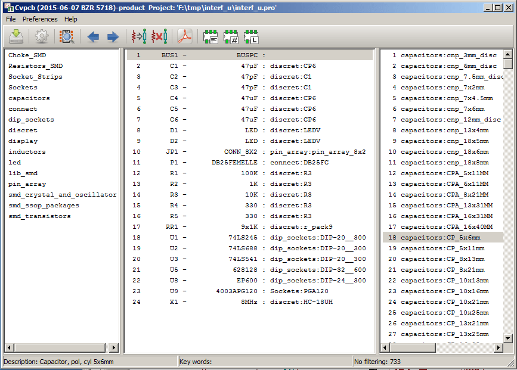
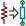
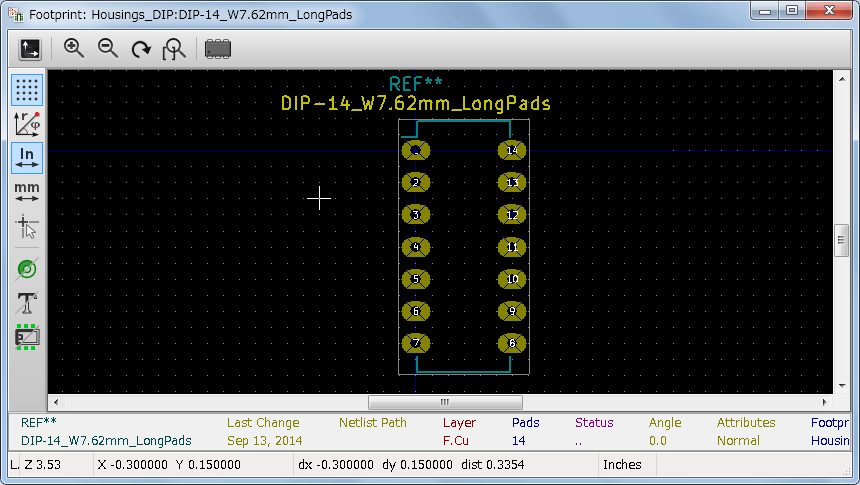
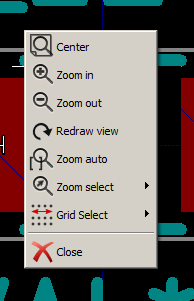
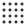
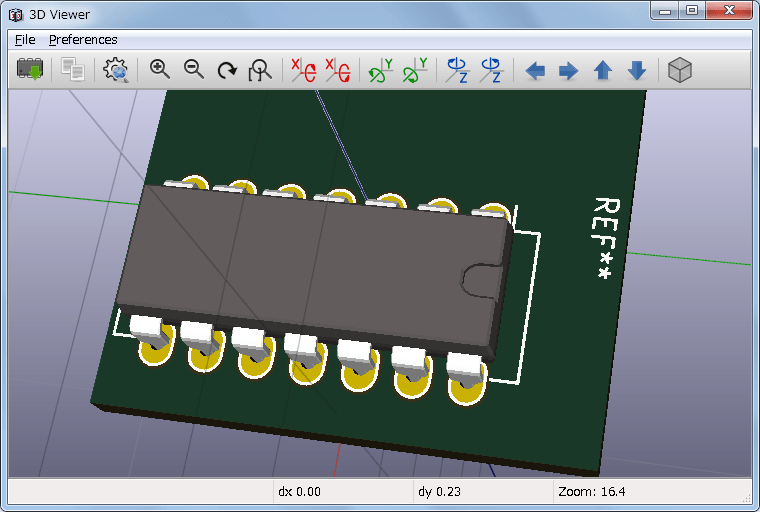
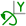
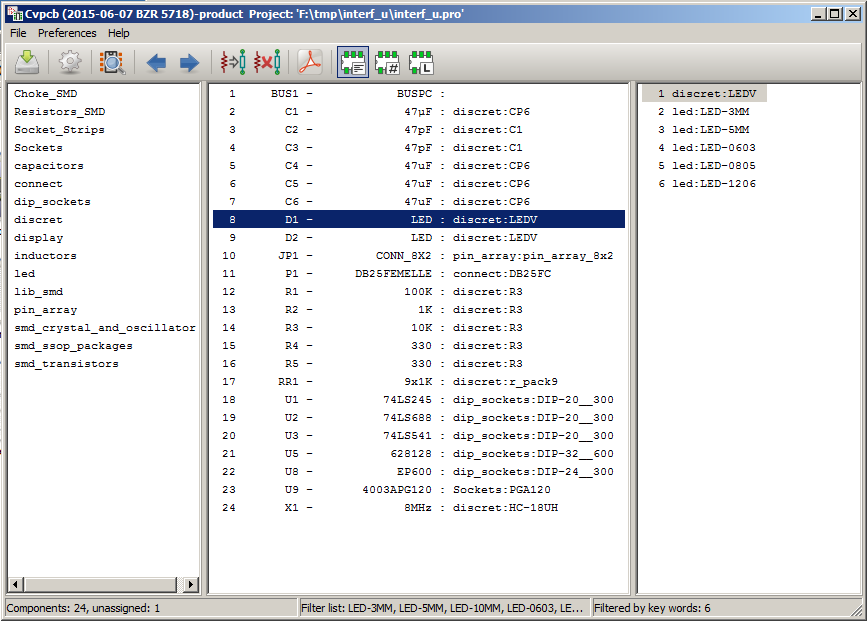
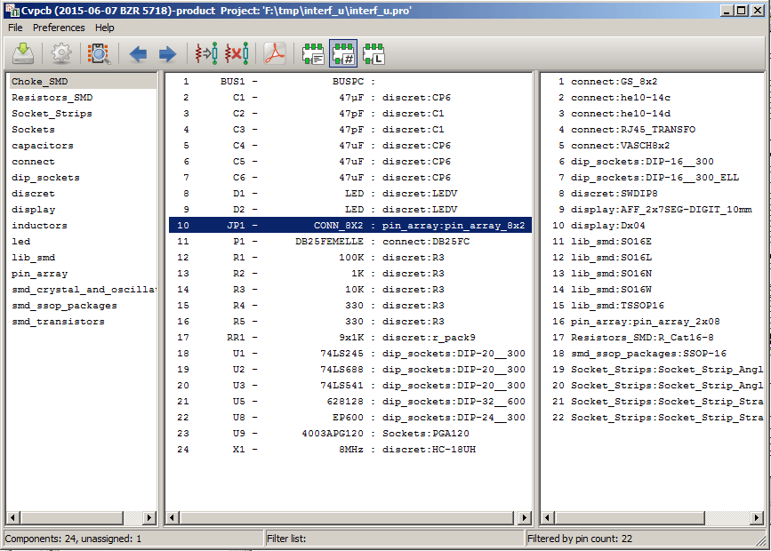
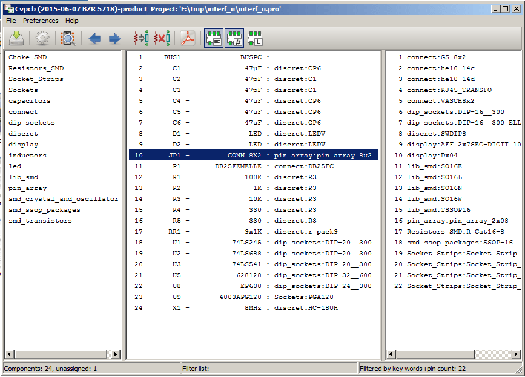

:author: The KiCad Team
:doctype: article
:toc:
:ascii-ids:

= CvPcb

_Reference manual_

[[copyright]]
*Copyright*

This document is Copyright (C) 2010-2018 by it's contributors as listed
below. You may distribute it and/or modify it under the terms of either
the GNU General Public License (https://www.gnu.org/licenses/gpl.html),
version 3 or later, or the Creative Commons Attribution License
(https://creativecommons.org/licenses/by/3.0/), version 3.0 or later.

All trademarks within this guide belong to their legitimate owners.

[[contributors]]
*Contributors*

Jean-Pierre Charras, Fabrizio Tappero, Wayne Stambaugh.

[[feedback]]
*Feedback*

Please direct any bug reports, suggestions or new versions to here:

- About KiCad document: https://github.com/KiCad/kicad-doc/issues

- About KiCad software: https://bugs.launchpad.net/kicad

- About KiCad software i18n: https://github.com/KiCad/kicad-i18n/issues

[[version_info]]
*Version info*

include::../../version_info.txt[]

//Since docbook "article" is more compact, I have to separate this page
<<<<

== Introduction to CvPcb

CvPcb is a tool that allows you to associate components in your
schematic to component footprints used when laying out the printed
circuit board. This association is added to the net list file created by
the schematic capture program Eeschema.

The net list file generated by Eeschema specifies which printed circuit board footprint
is associated with each component in the schematic only when the footprint field
of the component is initialized.

This is the case when component footprints are associated during schematic capture
by setting the component's footprint field, or it is set in the schematic library
when loading the symbol.

CvPcb provides a convenient method of associating footprints to components
during schematic capture.
It provides footprint list filtering, footprint viewing, and 3D component model
viewing to help ensure the correct footprint is associated with each component.

Components can be assigned to their corresponding footprints manually or
automatically by creating equivalence files (.equ files).
Equivalence files are lookup tables associating each component with it's footprint.

This interactive approach is simpler and less error prone than directly
associating the footprints in the schematic editor.

CvPcb allows you to see the list of available footprints and to display them
on the screen to ensure you are associating the correct footprint.

**It can be run only from Eeschema**, from the top toolbar, either when
Eeschema is started from the KiCad project manager or when Eeschema is
started as a stand alone application.

Running CvPcb from Eeschema launched from the KiCad Manager is generally
better because:

* Cvpcb needs the project config file to know the footprint libraries to
  load.

* Cvpcb initializes the components footprint fields of the current
  schematic project. This is possible only if the project file is in the
  same path as the open schematic.

Launching CvPcb from an Eeschema launched from the KiCad manager assures
automatically all this.

WARNING: You actually *can* launch CvPcb from a stand alone Eeschema
session though, but please note that any schematic opened that does not
have a project file in the same path may be missing components due to
missing libraries which will not show up in CvPcb. If there is no
fp-lib-table file in the same path as the open schematic, no project
specific footprint libraries will be available either.

== CvPcb Features

=== Manual or Automatic Association

CvPcb allows for interactive assignment (manual) as well as automatic
assignment via equivalence files.

== Invoking CvPcb

*CvPcb is only invoked from the schematic capture program Eeschema*, by the tool:

image:images/icons/cvpcb.png[Calling CvPcb]

Eeschema automatically passes the correct data (component list and footprints) to CvPcb.
There is no update to do (unless some new components are not yet annotated), just run Cvpcb.

== CvPcb Commands

=== Main Screen

The image below shows the main window of CvPcb.

The left pane contains the list of available footprint library file
names associated with the project. The center pane contains the list of
components loaded from the net list file. The right pane contains the
list of available footprints loaded from the project footprint libraries.
The component pane will be empty if no netlist file has been loaded
and the footprint pane can be also empty if no footprint libraries are
found.

=== Main Window Toolbar

image::images/cvpcb_main_toolbar.png[scaledwidth="70%", alt="Main Toolbar of CvPcb"]

The top toolbar allows for easy access to the following commands:

[width="80%",cols="10%,90%",]
|=======================================================================
|
|Transfer the current footprint association to Eeschema (this is the content of footprint fields).

|image:images/icons/config.png[]
|Invoke the CvPcb configuration menu.

|
|Display the footprint of the component selected in the footprint
window.

|image:images/icons/left.png[]
|Automatically select the previous component in the list without a
footprint association.

|image:images/icons/right.png[]
|Automatically select the next component in the list without a footprint
association.

|
|Automatically associate footprints with components starting using an
equivalence file.

|image:images/icons/delete_association.png[]
|Delete all footprint assignments.

|image:images/icons/datasheet.png[]
|Open the selected footprint documentation pdf file using the default
pdf viewer.

|image:images/icons/module_filtered_list.png[]
|Enable or disable the filtering to limit the list of footprints to the
footprint filters of the selected component.

|image:images/icons/module_pin_filtered_list.png[]
|Enable or disable the filtering to limit the list of footprints using
the pin count of the selected component.

|
|Enable or disable filtering to limit the list of footprints using the
selected library.
|=======================================================================

=== Main Window Keyboard Commands

The following table lists the keyboard commands for the main window:

[width="80%",cols="15%,85%",]
|=======================================================================
|Right Arrow / Tab|Activate the next pane to the right of the currently activated pane.
Wrap around to the first pane if the last pane is currently activated.

|Left Arrow |Activate the next pane to the left of the currently activated
pane. Wrap around to the last pane if the first pane is currently activated.

|Up Arrow |Select the previous item of the currently selected list.

|Down Arrow |Select the next item of the currently selected list.

|Page Up |Select the item up one full page of the currently selected
list.

|Page Down |Select the item down one full page of the currently selected
list.

|Home |Select the first item of the currently selected list.

|End |Select the last item of the currently selected list.
|=======================================================================

=== CvPcb Configuration

image::images/en/cvpcb_preference_menu.png[scaledwidth="35%", alt="Preferences menu"]

CvPcb can be automatically closed after saving the footprint association
file, or not.

Invoking the ``Libraries'' entry in the ``Preferences'' menu displays
the library configuration dialog.

Depending on the CvPcb version, there are 2 different methods of library
management:

- The legacy management, using *.mod files, and a library list of files.

- The new ``Pretty'' format, using one file by footprint. It uses a
  folder list. Each folder (*.pretty folder name) is a library. When
  using this new method of library management, You can also use native libraries originating
  from GEDA/GPCB or even Eagle xml format files.

<<<<<

== Footprint Libraries Management

=== Important remark:

*_This section is relevant only for KiCad versions since December 2013_*

=== Footprint Library tables

include::cvpcb_footprint_libraries_tables.adoc[po4a]

<<<<<

== Viewing the Current Footprint

=== The view footprint command

The view footprint command displays the footprint currently selected in
the _footprint_ window. A 3D model of the component can be shown if it
has been created and assigned to the footprint. Below is the footprint
viewer window.

==== Status Bar Information

The status bar is located at the bottom of the CvPcb new main window and
provides useful information to the user. The following table defines the
contents of each pane in the status bar.

[width="80%",cols="20%,80%",]
|==================================================================
|Left |Component count: total, unassigned
|Middle |Filter list of the selected component
|Right |Filtering mode and count of available footprints
|==================================================================

==== Keyboard Commands

[width="80%",cols="20%,80%",]
|==================================================================
|F1 |Zoom In
|F2 |Zoom Out
|F3 |Refresh Display
|F4 |Move cursor to center of display window
|Home |Fit footprint into display window
|Space Bar |Set relative coordinates to the current cursor position
|Right Arrow |Move cursor right one grid position
|Left Arrow |Move cursor left one grid position
|Up Arrow |Move cursor up one grid position
|Down Arrow |Move cursor down one grid position
|==================================================================

==== Mouse Commands

[width="80%",cols="32%,68%",]
|============================================================
|Scroll Wheel |Zoom in and out at the current cursor position
|Ctrl + Scroll Wheel |Pan right and left
|Shift + Scroll Wheel |Pan up and down
|Right Button Click |Open context menu
|============================================================

==== Context Menu

Displayed by right-clicking the mouse:

[width="80%",cols="44%,56%",]
|====================================================================
|Zoom Selection (Select Zoom) |Direct selection of the display zoom.
|Grid Selection (Grid Select) |Direct selection of the grid.
|====================================================================

==== Horizontal Toolbar

[width="90%",cols="10%,90%",]
|=======================================================================
|
|Show display options dialog
|image:images/icons/zoom_in.png[]
|Zoom in

|image:images/icons/zoom_out.png[]
|Zoom out

|image:images/icons/zoom_redraw.png[]
|Redraw

|
|Fit drawing in display area

|image:images/icons/shape_3d.png[]
|Open 3D model viewer
|=======================================================================

==== Vertical Toolbar

[width="90%",cols="10%,90%",]
|=======================================================================
|
|Show or hide the grid

|image:images/icons/polar_coord.png[]
|Show coordinates in polar or rectangular notation

|image:images/icons/unit_inch.png[]
|Display coordinates in inches

|
|Display coordinates in millimeters

|image:images/icons/cursor_shape.png[]
|Toggle pointer style

|image:images/icons/pad_sketch.png[]
|Toggle between drawing pads in sketch or normal mode

|image:images/icons/text_sketch.png[]
|Toggle between drawing text in sketch or normal mode

|
|Toggle between drawing edges in sketch or normal mode
|=======================================================================

=== Viewing the Current 3D Model

==== Mouse Commands

[width="90%",cols="32%,68%",]
|============================================================
|Scroll Wheel |Zoom in and out at the current cursor position
|Ctrl + Scroll Wheel |Pan right and left
|Shift + Scroll Wheel |Pan up and down
|============================================================

==== Horizontal Toolbar

[width="90%",cols="10%,90%",]
|=======================================================================
|
|Reload the 3D model

|image:images/icons/copy.png[]
|Copy 3D image to clipboard

|
|Set 3D viewer options

|image:images/icons/zoom_in.png[]
|Zoom in

|image:images/icons/zoom_out.png[]
|Zoom out

|image:images/icons/zoom_redraw.png[]
|Redraw

|
|Fit drawing in display area

|image:images/icons/rotate_neg_x.png[]
|Rotate backward along the X axis

|image:images/icons/rotate_pos_x.png[]
|Rotate forward along the X axis

|
|Rotate backward along the Y axis

|image:images/icons/rotate_pos_y.png[]
|Rotate forward along the Y axis

|
|Rotate backward along the Z axis

|image:images/icons/rotate_pos_z.png[]
|Rotate forward along the Z axis

|image:images/icons/left.png[]
|Pan left

|image:images/icons/right.png[]
|Pan right

|image:images/icons/up.png[]
|Pan up

|
|Pan down

|
|Toggle orthographic projection mode on and off
|=======================================================================

<<<<<

== Using CvPcb to Associate Components with Footprints

=== Manually Associating Footprints with Components

To manually associate a footprint with a component first select a
component in the component pane. Then select a footprint in the
footprint pane by double-clicking the left mouse button on the name of
the desired footprint. The unassigned next component in the list is
automatically selected. Changing the component footprint is performed in
the same manner.

=== Filtering the Footprint List

If the selected component and/or library is highlighted when the one or
more of the filtering option is enabled, the displayed footprint list
in CvPcb is filtered accordingly.

The icons image:images/icons/module_filtered_list.png[]
image:images/icons/module_pin_filtered_list.png[]
 enable and disable the
filtering feature. When the filtering is not enabled, the full footprint
list is shown.

Without filtering:

image::images/en/filter_none.png[scaledwidth="80%", alt="List without any filter"]

Filtered by list of footprint filters assigned to the selected
component. The component filters are listed on the center pane of the
status bar at the bottom of the main window.

Filtered by the footprint filter of the selected component:

In the component library editor in Eeschema, the footprint list was set
using the entries in the footprint filter tab of the component
properties dialog as shown below.

image::images/en/eeschema_filter.png[scaledwidth="50%", alt="Footprint filter in Eeschema"]

Filtered by the pin count of the selected component:

Filtered by the selected library.

image::images/en/filter_library.png[scaledwidth="80%", alt="List filtered by library"]

The filtering can be combined to form more complex
filtering to help reduce the number of footprints in the footprint pane.

Filtered by the selected component pin count and the component filter:

<<<<<

== Automatic Associations

=== Equivalence files

Equivalence files allow for automatic assignment of footprints to
components.

They list the name of the corresponding footprint according
to the name (__value field__) of the component. These files typically
have the *.equ* file extension.

They are plain text files and may be edited by using any plain text editor,
and must be created by the user.

=== Equivalence File Format

Equivalence files consist of one line for each component. Each line has
the following structure:

*`component value' `footprint name'*

Each name must be single quoted by the ' character and the component and
footprint names must be separated by one or more spaces.

_Example:_

If the U3 component is circuit 14011 and its footprint is 14DIP300, the
line is:

+`14011' `14DIP300'+

Any line starting with *#* is a comment.

Here is an example equivalence file:

-----------------------------------------------
#integrated circuits (smd):
'74LV14' 'SO14E'
'74HCT541M' 'SO20L'
'EL7242C' 'SO8E'
'DS1302N' 'SO8E'
'XRC3064' 'VQFP44'
'LM324N' 'S014E'
'LT3430' 'SSOP17'
'LM358' 'SO8E'
'LTC1878' 'MSOP8'
'24LC512I/SM' 'SO8E'
'LM2903M' 'SO8E'
'LT1129_SO8' 'SO8E'
'LT1129CS8-3.3' 'SO8E'
'LT1129CS8' 'SO8E'
'LM358M' 'SO8E'
'TL7702BID' 'SO8E'
'TL7702BCD' 'SO8E'
'U2270B' 'SO16E'
#Xilinx
'XC3S400PQ208' 'PQFP208'
'XCR3128-VQ100' 'VQFP100'
'XCF08P' 'BGA48'

#upro
'MCF5213-LQFP100' 'VQFP100'

#regulators
'LP2985LV' 'SOT23-5'
-----------------------------------------------

=== Automatically Associating Footprints to Components

Click on the automatic footprint association button on the top toolbar
to process an equivalence file.

_All components found by their value in the selected equivalence (*.equ) file
will have their footprint automatically assigned._

////

[index]
= Index

////

////

[[indices-and-tables]]
= Indices and tables

- genindex
- modindex
- search

////

