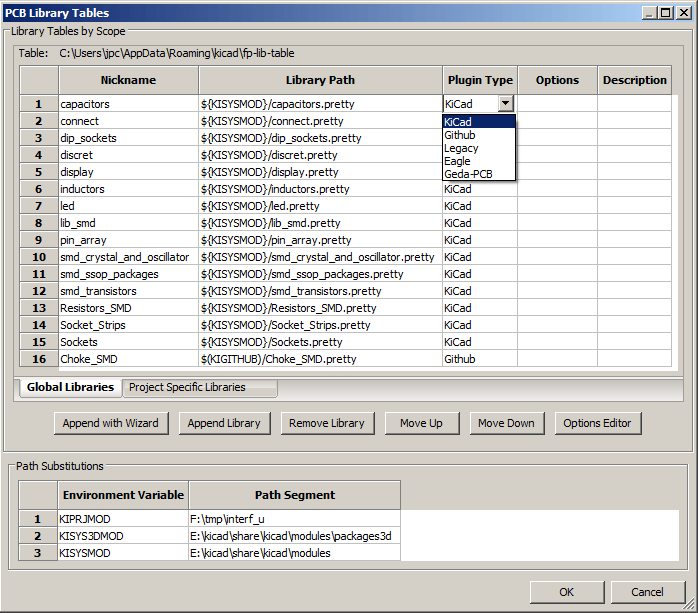
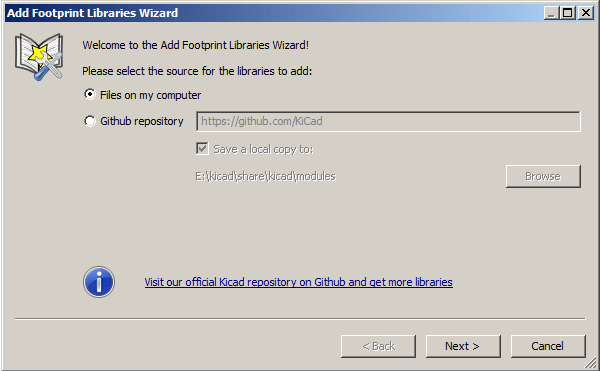
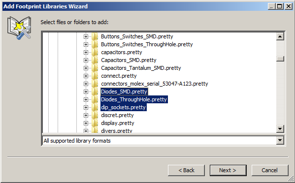
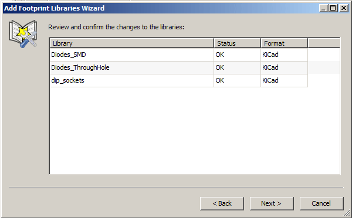
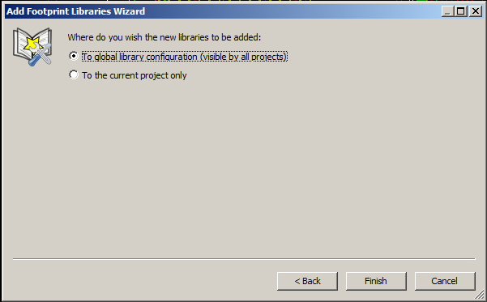

Since December 2013, Pcbnew and CvPcb uses a new library management tool
based on  *_footprint library tables_* which allows *direct use of
footprint libraries* from

* KiCad Legacy footprint libraries (.mod files)
* KiCad New _.pretty_ footprint libraries (on your local disk)
  (folders with .pretty extension, containing .kicad_mod files)
* KiCad New _.pretty_ footprint libraries (on our Github server, or other Github server)
* GEDA libraries  (folders containing .fp files)
* Eagle footprint libraries

[NOTE]
====
* you can write only KiCad  _.pretty_ footprint library folders on your local disk
  (and the .kicad_mod files inside these folders).
* All other formats are read only.
====

<<<<<

The image below shows the footprint library table editing dialog which
can be opened by invoking the ``Footprint Libraries'' entry from the
``Preferences'' menu.

The footprint library table is used to map a footprint library of any
supported library type to a library nickname. *This nickname is used to
look up footprints* instead of the previous method which depended on
library search path ordering.

This allows CvPcb to access footprints
with the same name in different libraries by ensuring that the correct
footprint is loaded from the appropriate library. It also allows CvPcb
to support loading libraries from different PCB editors such as Eagle
and GEDA.

==== Global Footprint Library Table

The global footprint library table contains the list of libraries that
are always available regardless of the currently loaded project file.
The table is saved in the file fp-lib-table in the user's home folder.
The location of this folder is dependent upon the operating system being used.

==== Project Specific Footprint Library Table

The project specific footprint library table contains the list of
libraries that are available specifically for the currently loaded
project file. The project specific footprint library table can only be
edited when it is loaded along with the project netlist file. If no
project file is loaded or there is no footprint library table file in
the project path, an empty table is created which can be edited and
later saved along with the footprint assignment file.

==== Initial Configuration

The first time Pcbnew or CvPcb is run and the global footprint table
file *fp-lib-table* is not found in the user's home folder, Pcbnew or CvPcb
will attempt to copy the default footprint table file fp-lib-table stored in
the system's KiCad template folder to the file fp-lib-table in the
user's home folder.

If fp-lib-table cannot be found, an empty footprint library table will
be created in the user's home folder. If this happens, the user can
either copy fp-lib-table manually or configure the table by hand.

The default footprint library table includes many of the standard
footprint libraries that are installed as part of KiCad.

Obviously, the *first thing* to do is to modify this table (add/remove entries)
according to your work and the libraries you need for all your projects.

(Too many libraries to load is time consuming)

==== Adding Table Entries

In order to use a footprint library, it must first be added to either
the global table or the project specific table. The project specific
table is only applicable when you have a net list file open.

*Each library entry must have a unique nickname.*

This does not have to be related in any way to the actual library file
name or path. The colon : character cannot be used anywhere in the
nickname. Each library entry must have a valid path and/or file name
depending on the type of library. Paths can be defined as absolute,
relative, or by environment variable substitution (see section below).

The appropriate plug in type must be selected in order for the library
to be properly read. KiCad currently supports reading KiCad legacy,
KiCad Pretty, Eagle, and GEDA footprint libraries.

There is also a description field to add a description of the library
entry. The option field is not used at this time so adding options will
have no effect when loading libraries.

- Please note that you cannot have duplicate library nicknames in the
same table. However, you can have duplicate library nicknames in both
the global and project specific footprint library table.
- The project specific table entry will take precedence over the global
table entry when duplicated names occur. When entries are defined in the
project specific table, an fp-lib-table file containing the entries will
be written into the folder of the currently open net list.

==== Environment Variable Substitution

One of the most powerful features of the footprint library table is
environment variable substitution. This allows you to define custom
paths to where your libraries are stored in environment variables.
Environment variable substitution is supported by using the syntax
+$\{ENV_VAR_NAME\}+ in the footprint library path.

By default, at run time KiCad defines **two environment variables**:

* the *+KIPRJMOD+* environment variable. This points always the current project directory
  and cannot be modified.

* the *+KISYSMOD+* environment variable. This points to where the
  default footprint libraries that were installed with KiCad are located.

You can override +KISYSMOD+ by defining it yourself in preferences/Configure Path
which allows you to substitute your own libraries in place of the default KiCad footprint
libraries.

When a project netlist file is loaded, CvPcb defines the +KIPRJMOD+
using the file path (the project path).

Pcbnew also defines this environment variable when loading a board file.

This allows you to store libraries in the project path without having
to define the absolute path (which is not always known) to the library
in the project specific footprint library table.

==== Using the GitHub Plugin

The GitHub is a special plugin that provides an interface for read only
access to a remote Git Hub repository consisting of pretty (Pretty is
name of the KiCad footprint file format) footprints and optionally
provides ``Copy On Write'' (COW) support for editing footprints read from
the GitHub repo and saving them locally. Therefore the ``Git Hub'' plugin
is for *read only accessing remote pretty footprint libraries at*
https://github.com/[https://github.com]. To add a GitHub entry to the
footprint library table the ``Library Path'' in the footprint library
table row a must be set to a valid GitHub URL.

For example:

https://github.com/liftoff-sr/pretty_footprints[https://github.com/liftoff-sr/pretty_footprints]

or

https://github.com/KiCad[https://github.com/KiCad]

Typically GitHub URLs take the form:

https://github.com/user_name/repo_name[https://github.com/user_name/repo_name]

The ``Plugin Type'' must be set to ``Github''. To enable the ``Copy On
Write'' feature the option *allow_pretty_writing_to_this_dir* must be
added to the ``Options'' setting of the footprint library table entry.
This option is the ``Library Path'' for local storage of modified copies
of footprints read from the GitHub repo. The footprints saved to this
path are combined with the read only part of the Git Hub repository to
create the footprint library. If this option is missing, then the Git
Hub library is read only. If the option is present for a Git Hub library,
then any writes to this hybrid library will go to the local
*.pretty directory. Note that the github.com resident portion of this
hybrid COW library is always read only, meaning you cannot delete
anything or modify any footprint in the specified Git Hub repository
directly. The aggregate library type remains ``Github'' in all further
discussions, but it consists of both the local read/write portion and the
remote read only portion.

The table below shows a footprint library table entry without the option
*allow_pretty_writing_to_this_dir*:

[width="100%",cols="9%,37%,8%,37%,9%",options="header",]
|=======================================================================
|Nickname |Library Path |Plugin Type |Options |Descript.

|github
|https://github.com/liftoff-sr/pretty_footprints[https://github.com/liftoff-sr/pretty_footprints]
|Github | |Liftoff's GH footprints
|=======================================================================

The table below shows a footprint library table entry with the COW option
given. Note the use of the environment variable $\{HOME\} as an example
only. The github.pretty directory is located in $\{HOME\}/pretty/ path.
Anytime you use the option *allow_pretty_writing_to_this_dir*, you will
need to create that directory manually in advance and it must end with
the extension *.pretty*.

[width="100%",cols="9%,37%,8%,37%,9%",options="header",]
|=======================================================================
|Nickname |Library Path |Plugin Type |Options |Descript.

|github
|https://github.com/liftoff-sr/pretty_footprints[https://github.com/liftoff-sr/pretty_footprints]
|Github |allow_pretty_writing_to_this_dir= $\{HOME\}/pretty/github.pretty
|Liftoff's GH footprints
|=======================================================================

Footprint loads will always give precedence to the local footprints found
in the path given by the option *allow_pretty_writing_to_this_dir*. Once
you have saved a footprint to the COW library's local directory by doing
a footprint save in the footprint editor, no Git Hub updates will be
seen when loading a footprint with the same name as one for which you've
saved locally.

Always keep a separate local *.pretty directory for each Git Hub library,
never combine them by referring to the same directory more than once.

Also, do not use the same COW (*.pretty) directory in a footprint library
table entry. This would likely create a mess.

The value of the option *allow_pretty_writing_to_this_dir* will expand
any environment variable using the $\{\} notation to create the path in
the same way as the ``Library Path'' setting.

What is the point of COW? It is to turbo-charge the sharing of footprints.

If you periodically email your COW pretty footprint modifications to the
GitHub repository maintainer, you can help update the Git Hub copy.
Simply email the individual *.kicad_mod files you find in your COW
directories to the maintainer of the GitHub repository. After you have
received confirmation that your changes have been committed, you can
safely delete your COW file(s) and the updated footprint from the read
only part of Git Hub library will flow down. Your goal should be to
keep the COW file set as small as possible by contributing frequently to
the shared master copies at https://github.com/[https://github.com].

==== Usage Patterns

Footprint libraries can be defined either globally or specifically to
the currently loaded project. Footprint libraries defined in the user's
global table are always available and are stored in the fp-lib-table
file in the user's home folder.

Global footprint libraries can always be accessed even when there is no
project net list file opened.

The project specific footprint table is active only for the currently open net list file.

The project specific footprint library table is saved in the file
fp-lib-table in the path of the currently open net list . You are free
to define libraries in either table.

There are advantages and disadvantages to each method. You can define
all of your libraries in the global table which means they will always
be available when you need them. The disadvantage of this is that you
may have to search through a lot of libraries to find the footprint you
are looking for. You can define all your libraries on a project specific
basis.

The advantage of this is that you only need to define the libraries you
actually need for the project which cuts down on searching.

The disadvantage is that you always have to remember to add each
footprint library that you need for every project. You can also define
footprint libraries both globally and project specifically.

One usage pattern would be to define your most commonly used libraries
globally and the library only require for the project in the project
specific library table. There is no restriction on how you define your
libraries.

<<<<<

=== Using the Footprint Library Table Wizard

A wizard to add footprint libraries to the footprint library tables
is available from the _footprint library table editing dialog_.

Note also libraries can be any type of footprint library supported by KiCad.

It can add ``local'' libraries or libraries from a Github repository.

When libraries are on a Github repository, they can be added as remote libraries,
or **downloaded and added as _local libraries_**.

Here, the local libraries option is selected.

Here, the remote libraries option is selected.

image::images/en/fplib_wizard_startpage_github.png[scaledwidth="65%",alt="fplib wizard startpage_github"]

Depending on the selected option, one of these pages will be displayed,
to select a list of libraries:

Here, the local libraries option was selected.

Here, the remote libraries option was selected.

image::images/en/fplib_wizard_githubselection.png[scaledwidth="65%",alt="fplib wizard github selection"]

After a set of libraries is selected, the next page validates the choice:

If some selected libraries are incorrect (not supported, not a footprint library ...)
they will be flagged as ``INVALID''.

The last choice is the footprint library table to populate:

* the global table
* the local table (the project specific table)

