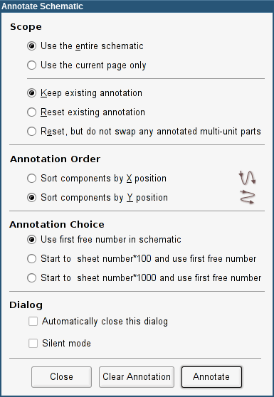
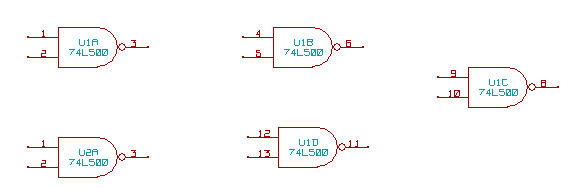
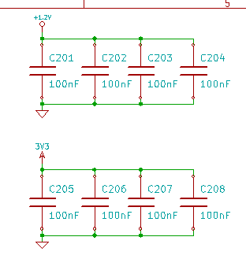

[[automatic-classification-annotation]]
== Automatic classification Annotation

=== Introduction

The automatic classification annotation tool allows you to automatically
assign a designator to components in your schematic. For multi-parts
components, assign a multi-part suffix to minimize the number of these
packages. The automatic classification annotation tool is accessible via
the icon
image:images/icons/annotate.png[icons_annotate_png].
Here you find its main window.

Various possibilities are available:

* Annotate all the components (reset existing annotation option)
* Annotate all the components, but do not swap any previously annotated
  multi-unit parts.
* Annotate new components only (i.e. those whose reference finishes by?
  like IC? ) (keep existing annotation option).
* Annotate the whole hierarchy (use the entire schematic option).
* Annotate the current sheet only (use current page only option).

The ``Reset, but do not swap any annotated multi-unit parts'' option keeps
all existing associations between multi-unit parts. That is, if you have
U2A and U2B, they may be reannotated to U1A and U1B respectively, but they will
never be reannotated to U1A and U2A, nor to U2B and U2A. This is useful if
you want to ensure that pin groupings are maintained, if you have already
decided by yourself which subunits are best placed where.

The annotation order choice gives the method used to set the reference
number inside each sheet of the hierarchy.

Except for particular cases, an automatic annotation applies to the
whole project (all sheets) and to the new components, if you don't want
to modify previous annotations.

The Annotation Choice gives the method used to calculate reference Id:

* Use first free number in schematic: components are annotated from 1
  (for each reference prefix). If a previous annotation exists, not yet in
  use numbers will be used.
* Start to sheet number*100 and use first free number: annotation start
  from 101 for the sheet 1, from 201 for the sheet 2, etc. If there are
  more than 99 items having the same reference prefix (U, R) inside the
  sheet 1, the annotation tool uses the number 200 and more, and
  annotation for sheet 2 will start from the next free number.
* Start to sheet number*1000 and use first free number. Annotation start
  from 1001 for the sheet 1, from 2001 for the sheet 2.

[[some-examples]]
=== Some examples

[[annotation-order]]
==== Annotation order

This example shows 5 elements placed, but not annotated.

image::images/eeschema_annotation_order_none.png[alt="eeschema_annotation_order_none_png",scaledwidth="85%"]

After the annotation tool Is executed, the following result is obtained.

Sort by X position.

image::images/eeschema_annotation_order_x.png[alt="eeschema_annotation_order_x_png",scaledwidth="85%"]

Sort by Y position.

You can see that four 74LS00 gates were distributed in U1 package, and
that the fifth 74LS00 has been assigned to the next, U2.

[[annotation-choice]]
==== Annotation Choice

Here is an annotation in sheet 2 where the option use first free number
in schematic was set.

image::images/eeschema_annotation_choice_free.png[alt="eeschema_annotation_choice_free_png",scaledwidth="60%"]

Option start to sheet number*100 and use first free number give the
following result.

The option start to sheet number*1000 and use first free number gives
the following result.

image::images/eeschema_annotation_choice_x1000.png[alt="eeschema_annotation_choice_x1000_png",scaledwidth="60%"]

