[[component-library-editor]]
== Component Library Editor

[[general-information-about-component-libraries]]
=== General Information About Component Libraries

A component is a schematic element which contains a graphical
representation, electrical connections, and fields defining the
component. Components used in a schematic are stored in component
libraries. Eeschema provides a component library editing tool that
allows you to create libraries, add, delete or transfer components
between libraries, export components to files, and import components
from files. The library editing tool provides a simple way to manage
component library files.

[[component-library-overview]]
=== Component Library Overview

A component library is composed of one or more components. Generally the
components are logically grouped by function, type, and/or manufacturer.

A component is composed of:

* Graphical items (lines, circles, arcs, text, etc ) that provide the
  symbolic definition.
* Pins which have both graphic properties (line, clock, inverted, low
  level active, etc ) and electrical properties (input, output,
  bidirectional, etc.) used by the Electrical Rules Check (ERC) tool.
* Fields such as references, values, corresponding footprint names for
  PCB design, etc.
* Aliases used to associate a common component such as a 7400 with all
  of its derivatives such as 74LS00, 74HC00, and 7437. All of these
  aliases share the same library component.

Proper component designing requires:

* Defining if the component is made up of one or more units.
* Defining if the component has an alternate body style also known as a
  De Morgan representation.
* Designing its symbolic representation using lines, rectangles,
  circles, polygons and text.
* Adding pins by carefully defining each pin's graphical elements,
  name, number, and electrical property (input, output, tri-state, power
  port, etc.).
* Adding an alias if other components have the same symbol and pin out
  or removing one if the component has been created from another
  component.
* Adding optional fields such as the name of the footprint used by the PCB
  design software and/or defining their visibility.
* Documenting the component by adding a description string and links to
  data sheets, etc.
* Saving it in the desired library.

[[component-library-editor-overview]]
=== Component Library Editor Overview

The component library editor main window is shown below. It consists
of three tool bars for quick access to common features and a component
viewing/editing area. Not all commands are available on the tool bars
but can be accessed using the menus.

image::images/libedit_main_window.png[alt="libedit_main_window_png",scaledwidth="95%"]

[[main-toolbar]]
==== Main Toolbar

The main tool bar typically located at the top of the main window shown
below consists of the library management tools, undo/redo commands, zoom
commands, and component properties dialogs.

[width="100%",cols="20%,80%",]
|=======================================================================
|
|Save the currently selected library. The button will be disabled if no
library is currently selected or no changes to the currently selected
library have been made.

|
|Select the library to edit.

|
|Delete a component from the currently selected library or any library
defined by the project if no library is currently selected.

|
|Open the component library browser to select the library and component
to edit.

|
|Create a new component.

|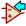
|Load component from currently selected library for editing.

|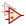
|Create a new component from the currently loaded component.

|
|Save the current component changes in memory. The library file is not
changed.

|
|Import one component from a file.

|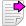
|Export the current component to a file.

|
|Create a new library file containing the current component. Note: new
libraries are not automatically added to the project.

|
|Undo last edit.

|
|Redo last undo.

|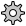
|Edit the current component properties.

|image:images/icons/add_text.png[icons/add_text_png]
|Edit the fields of current component.

|image:images/icons/erc.png[icons/erc_png]
|Test the current component for design errors.

||Zoom in.

||Zoom out.

||Refresh display.

||Zoom to fit component in display.

|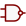
|Select the normal body style. The button is disabled if the current
component does not have an alternate body style.

|
|Select the alternate body style. The button is disabled if the current
component does not have an alternate body style.

|
|Show the associated documentation. The button will be disabled if no
documentation is defined for the current component.

|
|Select the unit to display. The drop down control will be disabled if
the current component is not derived from multiple units.

|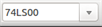
|Select the alias. The drop down control will be disabled if the
current component does not have any aliases.

|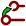
|Pin editing: independent editing for pin shape and position for
components with multiple units and alternate symbols.

|
|Show pin table.
|=======================================================================

[[element-toolbar]]
==== Element Toolbar

The vertical toolbar typically located on the right hand side of the
main window allows you to place all of the elements required to design a
component. The table below defines each toolbar button.

[width="100%",cols="10%,90%",]
|=======================================================================
|
|Select tool. Right-clicking with the select tool opens the context menu
for the object under the cursor. Left-clicking with the select tool
displays the attributes of the object under the cursor in the message
panel at the bottom of the main window. Double-left-clicking with the
select tool will open the properties dialog for the object under the
cursor.

|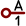
|Pin tool. Left-click to add a new pin.

|image:images/icons/add_text.png[icons/add_text_png]
|Graphical text tool. Left-click to add a new graphical text item.

|image:images/icons/add_rectangle.png[icons/add_rectangle_png]
|Rectangle tool. Left-click to begin drawing the first corner of a
graphical rectangle. Left-click again to place the opposite corner of
the rectangle.

|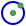
|Circle tool. Left-click to begin drawing a new graphical circle from
the center. Left-click again to define the radius of the cicle.

|image:images/icons/add_arc.png[icons/add_arc_png]
|Arc tool. Left-click to begin drawing a new graphical arc item from the
center. Left-click again to define the first arc end point. Left-click
again to define the second arc end point.

|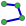
|Polygon tool. Left-click to begin drawing a new graphical polygon item
in the current component. Left-click for each addition polygon line.
Double-left-click to complete the polygon.

|
|Anchor tool. Left-click to set the anchor position of the component.

|
|Import a component from a file.

|
|Export the current component to a file.

|
|Delete tool. Left-click to delete an object from the current component.
|=======================================================================

[[options-toolbar]]
==== Options Toolbar

The vertical tool bar typically located on the left hand side of the
main window allows you to set some of the editor drawing options. The
table below defines each tool bar button.

[width="100%",cols="10%,90%",]
|=======================================================================
|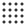
|Toggle grid visibility on and off.

|
|Set units to inches.

|
|Set units to millimeters.

|image:images/icons/cursor_shape.png[icons/cursor_shape_png]
|Toggle full screen cursor on and off.
|=======================================================================

[[library-selection-and-maintenance]]
=== Library Selection and Maintenance

The selection of the current library is possible via the

which shows you all available libraries and allows you to select one.
When a component is loaded or saved, it will be put in this library. The
library name of component is the contents of its value field.

[NOTE]
====
* You must load a library into Eeschema, in order to access its contents.
* The content of the current library can be saved after modification, by
  clicking on the
  
  on the main tool bar.
* A component can be removed from any library by clicking on the
  .
====

[[select-and-save-a-component]]
==== Select and Save a Component

When you edit a component you are not really working on the component in
its library but on a copy of it in the computer's memory. Any edit
action can be undone easily. A component may be loaded from a local library
or from an existing component.

[[component-selection]]
===== Component Selection

Clicking the 

on the main tool bar displays the list of the available components that
you can select and load from the currently selected library.

[NOTE]
If a component is selected by its alias, the name of the loaded component
is displayed on the window title bar instead of the selected alias. The list
of component aliases is always loaded with each component and can be
edited. You can create a new component by selecting an alias of the
current component from the 
.
The first item in the alias list is the root name of the component.

[NOTE]
Alternatively, clicking the 

allows you to load a component which has been previously saved
by the 
.

[[save-a-component]]
===== Save a Component

After modification, a component can be saved in the current library,
in a new library, or exported to a backup file.

To save the modified component in the current library, click the
.
Please note that the update command only saves the component changes in 
the local memory. This way, you can make up your mind before you save the
library.

To permanently save the component changes to the library file, click the

which will overwrite the existing library file with the component
changes.

If you want to create a new library containing the current component,
click the 
.
You will be asked to enter a new library name.

[NOTE]
====
New libraries are not automatically added to the current project.

You must add any new library you wish to use in a schematic to the list
of project libraries in Eeschema using the component configuration dialog.

image:images/en/libsettings.png[alt="Library settings",width="50%"]
====

Click the 

to create a file containing only the current component. This file 
will be a standard library file which will contain only one component.
This file can be used to import the component into another library. In
fact, the create new library command and the export command are basically
identical.

[[transfer-components-to-another-library]]
===== Transfer Components to Another Library

You can very easily copy a component from a source library into a
destination library using the following commands:

* Select the source library by clicking the 
  .
* Load the component to be transferred by clicking the
  .
  The component will be displayed in the editing area.
* Select the destination library by clicking the
  .
* Save the current component to the new library in the local memory by
  clicking the 
  .
* Save the component in the current local library file by clicking the
  .

[[discarding-component-changes]]
===== Discarding Component Changes

When you are working on a component, the edited component is only a
working copy of the actual component in its library. This means that as
long as you have not saved it, you can just reload it to discard all
changes made. If you have already updated it in the local memory and
you have not saved it to the library file, you can always quit and start
again. Eeschema will undo all the changes.

[[creating-library-components]]
=== Creating Library Components

[[create-a-new-component]]
==== Create a New Component

A new component can be created by clicking the 
. 
You will be asked for a component name (this name is used as default
value for the value field in the schematic editor), the reference designator
(U, IC, R...), the number of units per package (for example a 7400 is made of
4 units per package) and if an alternate body style (sometimes referred to
as DeMorgan) is desired. If the reference designator field is left empty, it
will default to "U". These properties can be changed later, but it is preferable to
set them correctly at the creation of the component.

image::images/eeschema_component_properties.png[alt="eeschema_component_properties_png",scaledwidth="50%"]

A new component will be created using the properties above and will
appear in the editor as shown below.

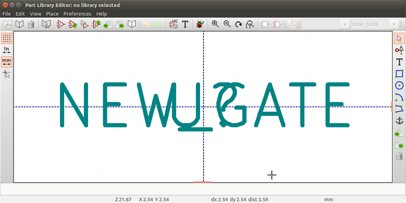

[[create-a-component-from-another-component]]
==== Create a Component from Another Component

Often, the component that you want to make is similar to one already in
a component library. In this case it is easy to load and modify an
existing component.

* Load the component which will be used as a starting point.
* Click on the 
  
  or modify its name by right-clicking on the value field and editing the text.
  If you chose to duplicate the current component, you will be prompted
  for a new component name.
* If the model component has aliases, you will be prompted to remove
  aliases from the new component which conflict with the current library.
  If the answer is no the new component creation will be aborted.
  Component libraries cannot have any duplicate names or aliases.
* Edit the new component as required.
* Update the new component in the current library by clicking the
  
  or save to a new library by clicking the 
  
  or if you want to save this new component in an other existing
  library select the other library by clicking on the
  
  and save the new component.
* Save the current library file to disk by clicking the
  .

[[component-properties]]
==== Component Properties

Component properties should be carefully set during the component
creation or alternatively they are inherited from the copied component. To
change the component properties, click on the

to show the dialog below.

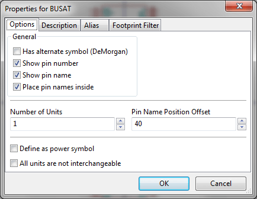

It is very important to correctly set the number of units per package and
if the component has an alternate symbolic representation parameters
correctly because when pins are edited or created the corresponding pins
for each unit will created. If you change the number of units per
package after pin creation and editing, there will be additional work
introduced to add the new unit pins and symbols. Nevertheless, it is
possible to modify these properies at any time.

The graphic options "Show pin number" and "Show pin name" define the
visibility of the pin number and pin name text. This text will be
visible if the corresponding options are checked. The option "Place pin
names inside" defines the pin name position relative to the pin body.
This text will be displayed inside the component outline if the option
is checked. In this case the "Pin Name Position Offset" property defines
the shift of the text away from the body end of the pin. A value from 30
to 40 (in 1/1000 inch) is reasonable.

The example below shows a component with the "Place pin name inside"
option unchecked. Notice the position of the names and pin numbers.

image::images/eeschema_uncheck_pin_name_inside.png[alt="eeschema_uncheck_pin_name_inside_png",scaledwidth="95%"]

[[components-with-alternate-symbols]]
==== Components with Alternate Symbols

If the component has more than one symbolic repersentation, you will
have to select the different symbols of the component in order to edit
them. To edit the normal symbol, click the
.

To edit the alternate symbol click on the
. 
Use the

shown below to select the unit you wish to edit.

image::images/eeschema_libedit_select_unit.png[alt="eeschema_libedit_select_unit_png",scaledwidth="80%"]

[[graphical-elements]]
=== Graphical Elements

Graphical elements create the symbolic representation of a component and
contain no electrical connection information. Their design is possible
using the following tools:

* Lines and polygons defined by start and end points.
* Rectangles defined by two diagonal corners.
* Circles defined by the center and radius.
* Arcs defined by the starting and ending point of the arc and its
  center. An arc goes from 0° to 180°.

The vertical toolbar on the right hand side of the main window allows
you to place all of the graphical elements required to design a
component's symbolic representation.

[[graphical-element-membership]]
==== Graphical Element Membership

Each graphic element (line, arc, circle, etc.) can be defined as common
to all units and/or body styles or specific to a given unit and/or body
style. Element options can be quickly accessed by right-clicking on
the element to display the context menu for the selected element. Below
is the context menu for a line element.

image::images/eeschema_libedit_context_menu.png[alt="eeschema_libedit_context_menu_png",scaledwidth="80%"]

You can also double-left-click on an element to modify its properties.
Below is the properties dialog for a polygon element.

image::images/eeschema_libedit_polyline_properties.png[alt="eeschema_libedit_polyline_properties_png",scaledwidth="50%"]

The properties of a graphic element are:

* Line width which defines the width of the element's line in the
  current drawing units.
* The "Common to all units in component" setting defines if the
  graphical element is drawn for each unit in component with more than one
  unit per package or if the graphical element is only drawn for the
  current unit.
* The "Common by all body styles (DeMorgan)" setting defines if the
  graphical element is drawn for each symbolic representation in
  components with an alternate body style or if the graphical element is
  only drawn for the current body style.
* The fill style setting determines if the symbol defined by the
  graphical element is to be drawn unfilled, background filled, or
  foreground filled.

[[graphical-text-elements]]
==== Graphical Text Elements

The 
image:images/icons/add_text.png[icons/add_text_png]
allows for the creation of graphical text. Graphical text is always
readable, even when the component is mirrored. Please note that
graphical text items are not fields.

[[multiple-units-per-component-and-alternate-body-styles]]
=== Multiple Units per Component and Alternate Body Styles

Components can have two symbolic representations (a standard symbol and
an alternate symbol often referred to as "DeMorgan") and/or have more
than one unit per package (logic gates for example). Some components can
have more than one unit per package each with different symbols and pin
configurations.

Consider for instance a relay with two switches which can be designed as
a component with three different units: a coil, switch 1, and switch 2.
Designing a component with multiple units per package and/or alternate
body styles is very flexible. A pin or a body symbol item can be common
to all units or specific to a given unit or they can be common to both
symbolic representation so are specific to a given symbol representation.

By default, pins are specific to each symbolic representation of each
unit, because the pin number is specific to a unit, and the shape
depends on the symbolic representation. When a pin is common to each
unit or each symbolic representation, you need to create it only once
for all units and all symbolic representations (this is usually the case
for power pins). This is also the case for the body style graphic shapes
and text, which may be common to each unit (but typically are specific
to each symbolic representation).

[[example-of-a-component-having-multiple-units-with-different-symbols]]
==== Example of a Component Having Multiple Units with Different Symbols:

This is an example of a relay defined with three units per package,
switch 1, switch 2, and the coil:

Option: pins are not linked. One can add or edit pins for each unit
without any coupling with pins of other units.

image::images/eeschema_libedit_pins_per_part.png[alt="eeschema_libedit_pins_per_part_png",scaledwidth="70%"]

All units are not interchangeable must be selected.

image::images/eeschema_libedit_not_interchangeable.png[alt="eeschema_libedit_not_interchangeable_png",scaledwidth="60%"]

Unit 1

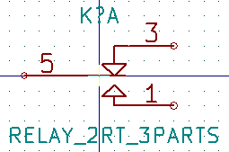

Unit 2

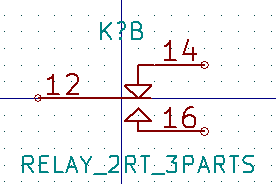

Unit 3

image::images/eeschema_libedit_unit3.png[alt="eeschema_libedit_unit3_png",scaledwidth="45%"]

It does not have the same symbol and pin layout and therefore is not
interchangeable with units 1 and 2.

[[graphical-symbolic-elements]]
===== Graphical Symbolic Elements

Shown below are properties for a graphic body element. From the relay
example above, the three units have different symbolic representations.
Therefore, each unit was created separately and the graphical body
elements must have the "Common to all units in component" disabled.

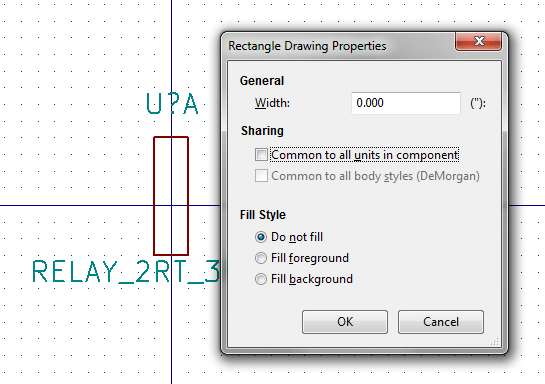

[[pin-creation-and-editing]]
=== Pin Creation and Editing

You can click on the 

to create and insert a pin. The editing of all pin properties is done by
double-clicking on the pin or right-clicking on the pin to open the pin
context menu. Pins must be created carefully, because any error will
have consequences on the PCB design. Any pin already placed can be
edited, deleted, and/or moved.

[[pin-overview]]
==== Pin Overview

A pin is defined by its graphical representation, its name and its
"number". The pin's "number" is defined by a set of 4 letters and / or
numbers. For the Electrical Rules Check (ERC) tool to be useful, the
pin's "electrical" type (input, output, tri-state...) must also be
defined correctly. If this type is not defined properly, the schematic
ERC check results may be invalid.

Important notes:

* Do not use spaces in pin names and numbers.
* To define a pin name with an inverted signal (overline) use the
  `~` (tilde) character. The next `~` character will turn off the overline.
  For example `\~FO~O` would display [overline]#FO# O.
* If the pin name is reduced to a single symbol, the pin is regarded as
  unnamed.
* Pin names starting with `#`, are reserved for power port symbols.
* A pin "number" consists of 1 to 4 letters and/ or numbers. 1,2,..9999
  are valid numbers. A1, B3, Anod, Gnd, Wire, etc. are also valid.
* Duplicate pin "numbers" cannot exist in a component.

[[pin-properties]]
==== Pin Properties

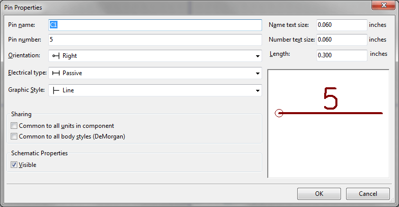

The pin properties dialog allows you to edit all of the characteristics
of a pin. This dialog pops up automatically when you create a pin or
when double-clicking on an existing pin. This dialog allows you to modify:

* Name and name's text size.
* Number and number's text size.
* Length.
* Electrical and graphical types.
* Unit and alternate representation membership.
* Visibility.

[[pins-graphical-styles]]
==== Pins Graphical Styles

Shown in the figure below are the different pin graphical styles. The
choice of graphic styles does not have any influence on the pin's
electrical type.

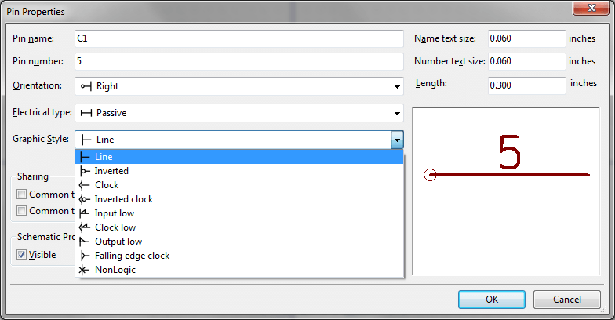

[[pin-electrical-types]]
==== Pin Electrical Types

Choosing the correct electrical type is important for the schematic ERC
tool. The electrical types defined are:

* Bidirectional which indicates bidirectional pins commutable between
  input and output (microprocessor data bus for example).
* Tri-state is the usual 3 states output.
* Passive is used for passive component pins, resistors, connectors,
  etc.
* Unspecified can be used when the ERC check doesn't matter.
* Power input is used for the component's power pins. Power pins are
  automatically connected to the other power input pins with the same
  name.
* Power output is used for regulator outputs.
* Open emitter and open collector types can be used for logic outputs
  defined as such.
* Not connected is used when a component has a pin that has no internal
  connection.

[[pin-global-properties]]
==== Pin Global Properties

You can modify the length or text size of the name and/or number of all
the pins using the Global command entry of the pin context menu. Click
on the parameter you want to modify and type the new value which will
then be applied to all of the current component's pins.

image::images/eeschema_libedit_pin_context_menu.png[alt="eeschema_libedit_pin_context_menu_png",scaledwidth="60%"]

[[defining-pins-for-multiple-units-and-alternate-symbolic-representations]]
==== Defining Pins for Multiple Units and Alternate Symbolic Representations

Components with multiple units and/or graphical representations are
particularly problematic when creating and editing pins. The majority of
pins are specific to each unit (because their pin number is specific to
each unit) and to each symbolic representation (because their form and
position is specific to each symbolic representation). The creation and
the editing of pins can be problematic for components with multiple
units per package and alternate symbolic representations. The component
library editor allows the simultaneous creation of pins. By default,
changes made to a pin are made for all units of a multiple unit
component and both representations for components with an alternate
representation.

The only exception to this is the pin's graphical type and name. This
dependency was established to allow for easier pin creation and editing
in most of the cases. This dependency can be disabled by toggling the

on the main tool bar. This will allow you to create pins for each unit
and representation completely independently.

A component can have two symbolic representations (representation known
as "DeMorgan") and can be made up of more than one unit as in the case
of components with logic gates. For certain components, you may want
several different graphic elements and pins. Like the relay sample shown
in section 11.7.1, a relay can be represented by three distinct units: a
coil, switch contact 1, and switch contact 2.

The management of the components with multiple units and components with
alternate symbolic representations is flexible. A pin can be common or
specific to different units. A pin can also be common to both symbolic
representations or specific to each symbolic representation.

By default, pins are specific to each representation of each unit,
because their number differs for each unit, and their design is
different for each symbolic representation. When a pin is common to all
units, it only has to drawn once such as in the case of power pins.

An example is the output pin 7400 quad dual input NAND gate. Since there
are four units and two symbolic representations, there are eight
separate output pins defined in the component definition. When creating
a new 7400 component, unit A of the normal symbolic representation will
be shown in the library editor. To edit the pin style in alternate
symbolic representation, it must first be enabled by clicking the

button on the tool bar. To edit the pin number for each unit,
select the appropriate unit using the 

drop down control.

[[component-fields]]
=== Component Fields

All library components are defined with four default fields. The
reference designator, value, footprint assignment, and documentation
file link fields are created whenever a component is created or copied.
Only the reference designator and value fields are required. For
existing fields, you can use the context menu commands by right-clicking
on the pin. Components defined in libraries are typically defined
with these four default fields. Additional fields such as vendor, part
number, unit cost, etc. can be added to library components but generally
this is done in the schematic editor so the additional fields can be
applied to all of the components in the schematic.

[[editing-component-fields]]
==== Editing Component Fields

To edit an existing component field, right-click on the field text to
show the field context menu shown below.

image::images/eeschema_libedit_field_context_menu.png[alt="eeschema_libedit_field_context_menu_png",scaledwidth="35%"]

To edit undefined fields, add new fields, or delete optional fields
image:images/icons/add_text.png[icons/add_text_png]
on the main tool bar to open the field properties dialog shown below.

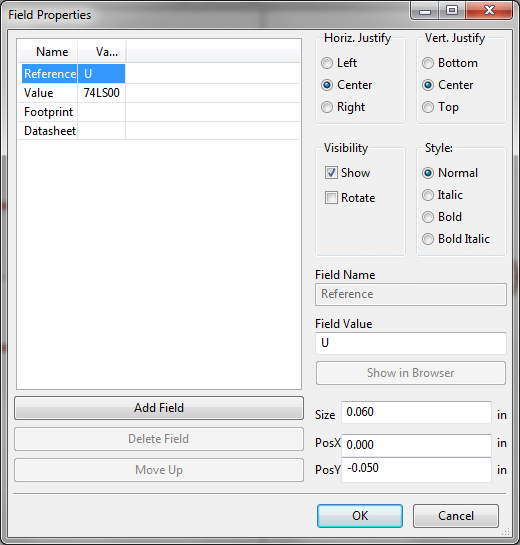

Fields are text sections associated with the component. Do not confuse
them with the text belonging to the graphic representation of this
component.

Important notes:

* Modifying value fields effectively creates a new component using
  the current component as the starting point for the new component. This
  new component has the name contained in the value field when you save it
  to the currently selected library.
* The field edit dialog above must be used to edit a field that is empty
  or has the invisible attribute enable.
* The footprint is defined as an absolute footprint using the
  LIBNAME:FPNAME format where LIBNAME is the name of the footprint library
  defined in the footprint library table (see the "Footprint Library
  Table" section in the Pcbnew "Reference Manual") and FPNAME is the name
  of the footprint in the library LIBNAME.

[[power-symbols]]
=== Power Symbols

Power symbols are created the same way as normal components. It may be
useful to place them in a dedicated library such as power.lib. Power
symbols consist of a graphical symbol and a pin of the type "Power
Invisible". Power port symbols are handled like any other component by
the schematic capture software. Some precautions are essential. Below is
an example of a power +5V symbol.

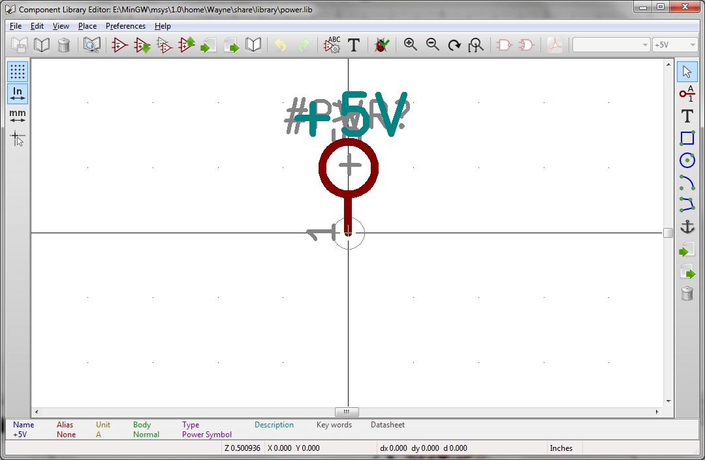

To create a power symbol, use the following steps:

* Add a pin of type "Power input" named +5V (important because this name
  will establish connection to the net +5V), with a pin number of 1
  (number of no importance), a length of 0, and a "Line" "Graphic Style".
* Place a small circle and a segment from the pin to the circle as
  shown.
* The anchor of the symbol is on the pin.
* The component value is `+5V`.
* The component reference is `\#+5V`. The reference text is not important
  except the first character which must be `#` to indicate that the
  component is a power symbol. By convention, every component in which the
  reference field starts with a `#` will not appear in the component list
  or in the netlist and the reference is declared as invisible.

An easier method to create a new power port symbol is to use another
symbol as a model:

* Load an existing power symbol.
* Edit the pin name with name of the new power symbol.
* Edit the value field to the same name as the pin, if you want to
  display the power port value.
* Save the new component.
