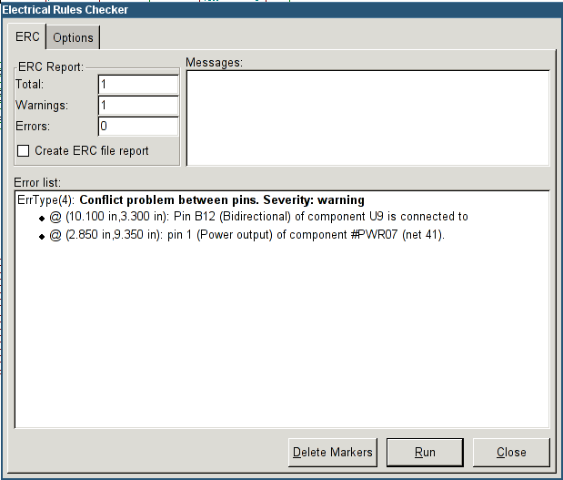
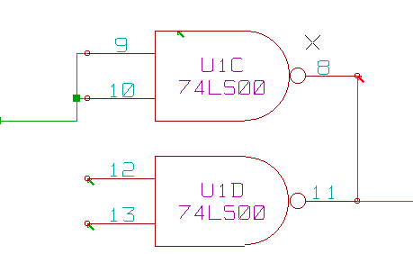
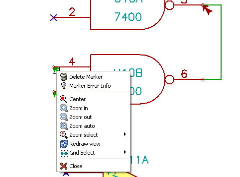
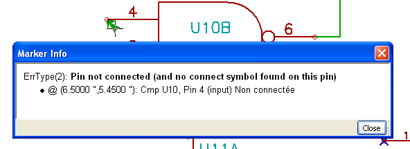

[[erc]]
== Design verification with Electrical Rules Check

=== Introduction

The Electrical Rules Check (ERC) tool performs an automatic check of
your schematic. The ERC checks for any errors in your sheet, such as
unconnected pins, unconnected hierarchical symbols, shorted outputs,
etc. Naturally, an automatic check is not infallible, and the software
that makes it possible to detect all design errors is not yet 100%
complete. Such a check is very useful, because it allows you to detect
many oversights and small errors.

In fact all detected errors must be checked and then corrected before
proceeding as normal. The quality of the ERC is directly related to the
care taken in declaring electrical pin properties during library
creation. ERC output is reported as "errors" or "warnings".

[[how-to-use-erc]]
=== How to use ERC

ERC can be started by clicking on the icon
image:images/icons/erc.png[ERC icon].

Warnings are placed on the schematic elements raising an ERC error (pins
or labels).

[NOTE]
====
* In this dialog window, when clicking on an error message you can jump
  to the corresponding marker in the schematic.
* In the schematic right-click on a marker to access the corresponding
  diagnostic message.
====

You can also delete error markers from the dialog.

[[example-of-erc]]
=== Example of ERC

Here you can see four errors:

* Two outputs have been erroneously connected together (red arrow).
* Two inputs have been left unconnected (green arrow).
* There is an error on an invisible power port, power flag is missing
  (green arrow on the top).

[[displaying-diagnostics]]
=== Displaying diagnostics

By right-clicking on a marker the pop-up menu allows you to access the ERC
marker diagnostic window.

and when clicking on Marker Error Info you can get a description of the
error.

[[power-pins-and-power-flags]]
=== Power pins and Power flags

It is common to have an error or a warning on power pins, even though
all seems normal. See example above. This happens because, in most
designs, the power is provided by connectors that are not power sources
(like regulator output, which is declared as Power out).

The ERC thus won't detect any Power out pin to control this wire and
will declare them not driven by a power source.

To avoid this warning you have to place a "PWR_FLAG" on such a power
port. Take a look at the following example:

image::images/eeschema_power_pins_and_flags.png[alt="eeschema_power_pins_and_flags_png",scaledwidth="70%"]

The error marker will then disappear.

Most of the time, a PWR_FLAG must be connected to GND, because usually
regulators have outputs declared as power out, but ground pins are never
power out (the normal attribute is power in), so grounds never appear
connected to a power source without a pwr_flag.

[[configuration]]
=== Configuration

_The Options_ panel allows you to configure connectivity rules to define
electrical conditions for errors and warnings check.

image::images/eeschema_erc_options.png[alt="eeschema_erc_options_png",scaledwidth="70%"]

Rules can be changed by clicking on the desired square of the matrix,
causing it to cycle through the choices: normal, warning, error.

[[erc-report-file]]
=== ERC report file

An ERC report file can be generated and saved by checking the option
Write ERC report. The file extension for ERC report files is .erc. Here
is an example of ERC report file.

----------------------------------------------------------------------
ERC control (4/1/1997-14:16:4)

***** Sheet 1 (INTERFACE UNIVERSAL)
ERC: Warning Pin input Unconnected @ 8.450, 2.350
ERC: Warning passive Pin Unconnected @ 8.450, 1.950
ERC: Warning: BiDir Pin connected to power Pin (Net 6) @ 10.100, 3.300
ERC: Warning: Power Pin connected to BiDir Pin (Net 6) @ 4.950, 1.400

>> Errors ERC: 4
----------------------------------------------------------------------
