[[general-top-toolbar]]
== General Top Toolbar

[[sheet-management]]
=== Sheet management

The Sheet Settings icon
(image:images/icons/sheetset.png[Sheet Settings icon])
allows you to define the sheet size and the contents of the
title block.

image::images/en/page_settings.png[alt="Page Settings",scaledwidth="75%"]

Sheet numbering is automatically updated. You can set the date
to today by pressing the left arrow button by "Issue Date", but it
will not be automatically changed.

[[search-tool]]
=== Search tool

The Find icon
(image:images/icons/find.png[Find icon])
can be used to access the search tool.

image::images/en/find_dialog.png[alt="Find dialog",scaledwidth="50%"]

You can search for a reference, a value or a text string in the current
sheet or in the whole hierarchy. Once found, the cursor will be
positioned on the found element in the relevant sub-sheet.

[[netlist-tool]]
=== Netlist tool

The Netlist icon
(image:images/icons/netlist.png[Netlist icon])
opens the netlist generation tool.

The tool creates a file which describe all connections in the entire hierarchy.

In a multisheet hierarchy, any local label is visible only inside the
sheet to which it belongs.
For example: the label LABEL1 of sheet 3 is different from the label LABEL1 of sheet
5 (if no connection has been intentionally introduced to connect them).
This is due to the fact that the sheet name path is internally associated with
the local label.

[NOTE]
Even though there is no text length limit for labels in Eeschema, please take
into account that other programs reading the generated netlist may have such
constraints.

[NOTE]
Avoid spaces in labels, because they will appear as separated words in the
generated file. It is not a limitation of Eeschema, but of many netlist
formats, which often assume that a label has no spaces.

image::images/en/netlist_dialog.png[alt="Netlist dialog",scaledwidth="70%"]

Option:

[width="100%",cols="40%,60%",]
|====================
|Default Format |Check to select Pcbnew as the default format.
|====================

Other formats can also be generated:

* Orcad PCB2
* CadStar
* Spice (simulators)

////
TODO describe how to create new plugins
////
External plugins can be added to extend the netlist formats list
(PadsPcb Plugin was added in the picture above).

There is more information about creating netlists in
<<create-a-netlist, Create a Netlist>> chapter.

[[annotation-tool]]
=== Annotation tool

The icon
image:images/icons/annotate.png[icons_annotate_png]
launches the annotation tool. This tool assigns references to components.

For multi-part components (such as 7400 TTL which contains 4 gates), a
multi-part suffix is also allocated (thus a 7400 TTL designated U3 will
be divided into U3A, U3B, U3C and U3D).

You can unconditionally annotate all the components or only the new
components, i.e. those which were not previously annotated.

image::images/en/annotate-dialog.png[alt="annotate-dialog_img",scaledwidth="50%"]

*Scope*
[width="100%",cols="40%,60%",]
|====================
|Use the entire schematic| All sheets are re-annotated (default).

|Use the current page only| Only the current sheet is re-annotated
(this option is to be used only in special cases, for example to
evaluate the amount of resistors in the current sheet.).

|Keep existing annotation| Conditional annotation, only the new
components will be re-annotated (default).

|Reset existing annotation| Unconditional annotation, all the
components will be re-annotated (this option is to be used when there
are duplicated references).

|Reset, but do not swap any annotated multi-unit parts| Keeps
all groups of multiple units (e.g. U2A, U2B) together when reannotating.
|====================

*Annotation Order*

Selects the order in which components will be numbered (either horizontally
or vertically).

*Annotation Choice*

Selects the assigned reference format.

[[electrical-rules-check-tool]]
=== Electrical Rules Check tool

The icon
image:images/icons/erc.png[ERC icon]
launches the electrical rules check (ERC) tool.

This tool performs a design verification and is able to
detect forgotten connections, and inconsistencies.

Once you have run the ERC, Eeschema places markers to highlight problems.
The error description is displayed after left clicking on the marker. An error
report file can also be generated.

[[main-erc-dialog]]
==== Main ERC dialog

image::images/en/dialog_erc.png[alt="ERC dialog",scaledwidth="70%"]

Errors are displayed in the Electrical Rules Checker dialog:

* Total count of errors and warnings.
* Errors count.
* Warnings count.

Option:

[width="100%",cols="40%,60%",]
|====================
|Create ERC file report |Check this option to generate an ERC report file.
|====================

Commands:

[width="100%",cols="40%,60%",]
|====================
|Delete Markers| Remove all ERC error/warnings markers.
|Run| Start an Electrical Rules Check.
|Close| Close the dialog.
|====================

[NOTE]
* Clicking on an error message jumps to the corresponding marker in the
  schematic.

[[erc-options-dialog]]
==== ERC options dialog

image::images/en/dialog_erc_opts.png[alt="ERC Options dialog",scaledwidth="60%"]

This tab allows you to define the connectivity rules
between pins; you can choose between 3 options for each case:

* No error
* Warning
* Error

Each square of the matrix can be modified by clicking on it.

Option:

[width="100%",cols="40%,60%",]
|====================
|Test similar labels |Report labels that differ only by letter case (e.g. label/Label/LaBeL).
Net names are case-sensitive therefore such labels are treated as separate nets.
|Test unique global labels |Report global lables that occur only once for a
particular net. Normally it is required to have at least two make a connection.
|====================

Commands:

[width="100%",cols="40%,60%",]
|====================
|Initialize to Default| Restores the original settings.
|====================

// TODO cvpcb toolbar button

[[bill-of-material-tool]]
=== Bill of Material tool

The icon
image:images/icons/bom.png[BOM icon]
launches the bill of materials (BOM) generator. This tool generates a file
listing the components and/or hierarchical connections (global labels).

image::images/en/dialog_bom.png[alt="BOM dialog",scaledwidth="60%"]

Eeschema's BOM generator makes use of external plugins, either as XSLT
or Python scripts. There are a few examples installed inside the KiCad
program files directory.

A useful set of component properties to use for a BOM are:

* Value - unique name for each part used.
* Footprint - either manually entered or back-annotated (see below).
* Field1 - Manufacturer's name.
* Field2 - Manufacturer's Part Number.
* Field3 - Distributor's Part Number.

For example:

image::images/en/dialog_component_properties.png[alt="Component Properties dialog",scaledwidth="80%"]

On **MS Windows**, BOM generator dialog has a special option
(pointed by red arrow) that controls visibility of external plugin window. +
By default, BOM generator command is executed console window hidden and output is
redirected to __Plugin info__ field. Set this option to show the window of the
running command. It may be necessary if plugin has provides a graphical user interface.

image::images/bom_extra_option_windows.png[alt="BOM dialog extra option on MS Windows",scaledwidth="80%"]

[[edit-fields-tool]]
=== Edit Fields tool

The icon image:images/icons/spreadsheet.png[Edit Fields icon] opens a spreadsheet
to view and modify field values for all symbols.

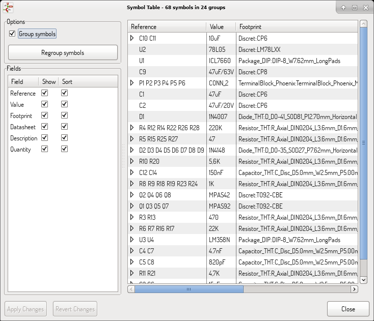

Once you modify field values, you need to either accept changes by clicking on
'Apply' button or undo them by clicking on 'Revert' button.

[[tricks-to-simplify-fields-filling]]
==== Tricks to simplify fields filling

There are several special copy/paste methods in spreadsheet.
They may be useful when entering field values that are repeated
in a few components.

This methods are illustrated below.

[options="autowidth", cols="3*^"]
|===
|Copy (Ctrl+C) |Selection |Paste (Ctrl+V)

a|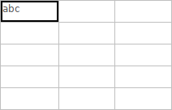
a|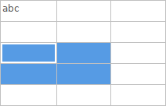
a|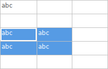

a|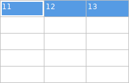
a|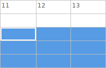
a|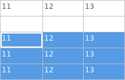

a|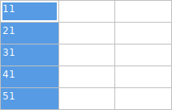
a|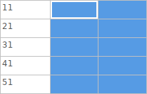
a|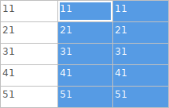

a|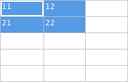
a|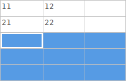
a|image:images/copypaste43.png["4paste"]

a|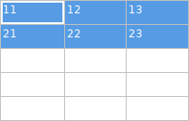
a|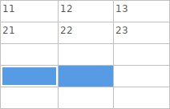
a|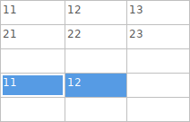
|===

NOTE: These techniques are also available in other dialogs with a grid control
element.

[[import-tool-for-footprint-assignment]]
=== Import tool for footprint assignment

[[access]]
==== Access:

The icon
image:images/icons/import_footprint_names.png[Import Footprint Names icon]
launches the back-annotate tool.

This tool allows footprint changes made in PcbNew to be imported back
into the footprint fields in Eeschema.
