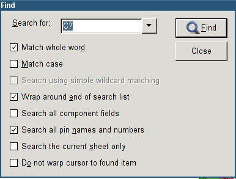
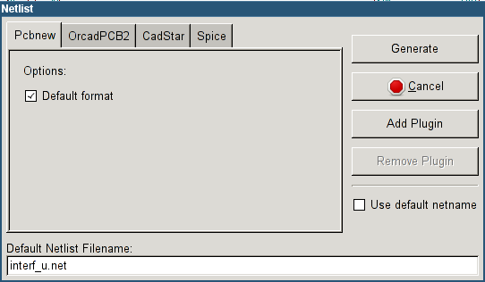
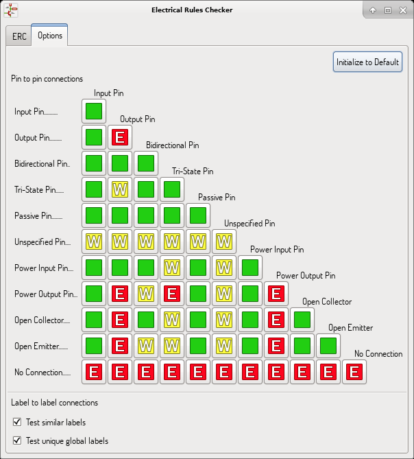
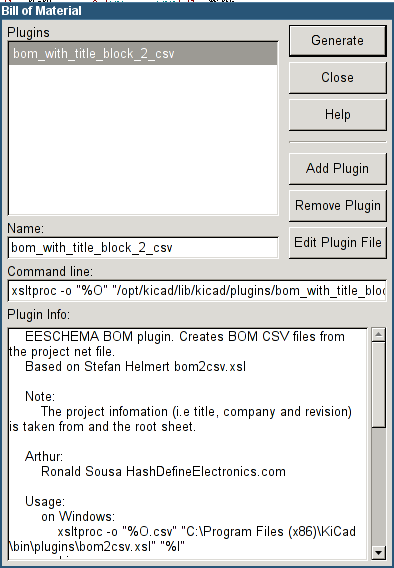
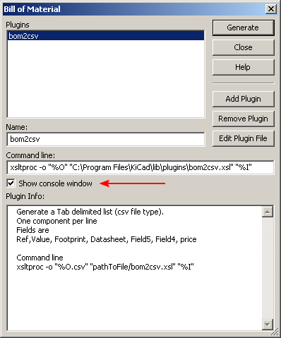

[[general-top-toolbar]]
== General Top Toolbar

[[sheet-management]]
=== Sheet management

The Sheet Settings icon,
image:images/icons/sheetset.png[Sheet Settings icon],
allows you to define the sheet size and the contents of the
title block.

image::images/en/page_settings.png[alt="Page Settings",scaledwidth="75%"]

Sheet numbering is automatically updated. You can set the date
to today by pressing the left arrow button by "Issue Date", but it
will not be automatically changed.

[[options-of-the-schematic-editor]]
=== Options of the schematic editor

[[search-tool]]
=== Search tool

The Find icon,
image:images/icons/find.png[Find icon],
can be used to access the search tool.

You can search for a reference, a value, or a text string in the current
sheet or in the whole hierarchy. Once found, the cursor will be
positioned on the found element in the relevant sub-sheet.

[[netlist-tool]]
=== Netlist tool

The Netlist icon,
image:images/icons/netlist.png[Netlist icon],
opens the netlist generation tool.

The netlist file it creates describes all connections in the entire hierarchy.

In a multisheet hierarchy, any local label is visible only inside the
sheet to which it belongs.
Thus, the label TOTO of sheet 3 is different from the label TOTO of sheet
5 (if no connection has been intentionally introduced to connect them).
This is due to the fact that the sheet name path is internally associated with
the local label.

Note 1:

Label lengths have no limitations in Eeschema, but the software
exploiting the generated netlist can be limited on this point.

Note 2:

Avoid spaces in the labels, because they will appear as separated words.
It is not a limitation of Eeschema, but of many netlist formats, which
often assume that a label has no spaces.

Option:

Default Format:

Check to select Pcbnew as the default format.

Other formats can also be generated:

* Orcad PCB2
* CadStar
* Spice, for simulators

External plugins can be launched to extend the netlist formats list (a
PadsPcb Plugin was added here).

[[annotation-tool]]
=== Annotation tool

The icon
image:images/icons/annotate.png[icons_annotate_png]
gives access to the annotation tool. This tool performs an automatic
naming of all components in the schematic.

For multi-part components (such as 7400 TTL which contains 4 gates), a
multi-part suffix is also allocated (thus a 7400 TTL designated U3 will
be divided into U3A, U3B, U3C and U3D).

You can unconditionally annotate all the components, or only the new
components, i.e. those which were not previously annotated.

image::images/en/annotate-dialog.png[alt="annotate-dialog_img",scaledwidth="50%"]

*Scope*

1. Use the entire schematic. All the sheets are re-annotated (usual
Option).

2. Use the current page only. Only the current sheet is re-annotated
(this option is to be used only in special cases, for example to
evaluate the amount of resistors in the current sheet.).

3. Keep existing annotation. Conditional annotation, only the new
components will be re-annotated (usual option).

4. Reset existing annotation. Unconditional annotation, all the
components will be re-annotated (this option is to be used when there
are duplicated references).

5. Reset, but do not swap any annotated multi-unit parts. This keeps
all groups of multiple units (e.g. U2A, U2B) together when reannotating.

*Annotation Order*

Selects the order in which components will be numbered.

*Annotation Choice*

Selects the method by which numbers will be selected.

[[electrical-rules-check-tool]]
=== Electrical Rules Check tool

The icon
image:images/icons/erc.png[ERC icon]
gives access to the electrical rules check (ERC) tool.

This tool performs a design verification and is particularly useful to
detect forgotten connections, and inconsistencies.

Once you have run the ERC, Eeschema places markers to highlight problems.
The diagnosis can then be given by left clicking on the marker. An error file can also be generated.

[[main-erc-dialog]]
==== Main ERC dialog

image::images/en/dialog_erc.png[alt="ERC dialog",scaledwidth="70%"]

Errors are displayed in the Electrical Rules Checker dialog box:

* Total count of errors and warnings.
* Errors count.
* Warnings count.

Option:

* Create ERC file report: check this option to generate an ERC report file.

Commands:

* Delete Markers: to remove all ERC error/warnings markers.
* Run: to perform an Electrical Rules Check.
* Close: to exit this dialog box.

Note:

* Clicking on an error message jumps to the corresponding marker in the
  schematic.

[[erc-options-dialog]]
==== ERC options dialog

This tab allows you to establish connectivity rules
between pins; you can choose between 3 options for each case:

* No error
* Warning
* Error

Each square of the matrix can be modified by clicking on it.

[[bill-of-material-tool]]
=== Bill of Material tool

The icon
image:images/icons/bom.png[BOM icon]
gives access to the bill of materials (BOM) generator. This menu allows the
generation of a file listing of the components and/or hierarchical
connections (global labels).

Eeschema's BOM generator makes use of external plugins, generally in XSLT
or Python form. Some are provided, and will be installed inside the KiCad
program files directory.

A useful set of component properties to use for a BOM are:

* Value - unique name for each part used.
* Footprint - either manually entered or back-annotated (see below).
* Field1 - Manufacturer's name.
* Field2 - Manufacturer's Part Number.
* Field3 - Distributor's Part Number.

For example:

image::images/en/dialog_component_properties.png[alt="Component Properties dialog",scaledwidth="80%"]

On **MS Windows** operating systems, BOM generator dialog has special option
(pointed by red arrow) that controls visibility of external plugin window. +
By default, command line runs with hidden console window and output is
redirected to __Plugin info__ field. Set this option to show the window of the
running command. It may be necessary if plugin has GUI.

[[import-tool-for-footprint-assignment]]
=== Import tool for footprint assignment:

[[access]]
==== Access:

The icon
image:images/icons/import_footprint_names.png[Import Footprint Names icon]
gives access to the back-annotate tool.

This tool allows footprint changes made in PcbNew to be imported back
into the footprint fields in Eeschema.
