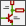
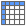
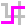

== Generic Eeschema commands

Commands can be executed by:

* Clicking on the menu bar (top of screen).
* Clicking on the icons on top of the screen (general commands).
* Clicking on the icons on the right side of the screen (particular
  commands or "tools").
* Clicking on the icons on the left side of the screen (display
  options).
* Pressing the mouse buttons (important complementary commands). In
  particular a right click opens a contextual menu for the
  element under the cursor (Zoom, grid and editing of the elements).
* Function keys (F1, F2, F3, F4, Insert and Space keys).
  Specifically: Escape key cancels the command in progress.
  Insert key allows the duplication of the last element created.
* Pressing hot keys which typically perform a select tool command and begin
  tool action at the current cursor location.  For a list of hot keys, see
  the "Help->List Hotkeys" menu entry or press '?' key.

image::images/en/commands_overview.png[alt="Commands overview",scaledwidth="60%"]

=== Mouse commands

==== Basic commands

*Left button*

* Single click: displays the characteristics of the component or text
  under the cursor in the status bar.
* Double click: edit (if the element is editable) the component or text.

*Right button*

* Opens a pop-up menu.

==== Block operations

You can move, drag, copy and delete selected areas in all Eeschema
menus.

Areas are selected by drawing a box around items using the left mouse button.

Holding "Shift", "Ctrl", or "Shift + Ctrl" during selection respectively
performs copying, dragging and deletion:

[width="80%",cols="66%,34%",]
|======================================================
|left mouse button |Move selection.
|Shift + left mouse button |Copy selection.
|Ctrl + left mouse button |Drag selection.
|Ctrl + Shift + left mouse button |Delete selection.
|======================================================

When dragging or copying, you can:

* Click again to place the elements.
* Click the right button or press Escape key to cancel.

If a block move command has started, another command can be
selected using the right-click pop-up menu.

image::images/en/main_window_popup.png[alt="main window popup",scaledwidth="45%"]

=== Hotkeys

* The "?" key displays the current hotkey list.
* Hotkeys might be redefined in Controls tab of Schematic Editor Options dialog (menu Preferences -> General Options).

Here is the default hotkey list:

////
image::images/en/default_hot_key_list.png[alt="Default hotkey list",scaledwidth="40%"]
////

|==============================
|Help (this window) |  ?
|Zoom In |  F1
|Zoom Out |  F2
|Zoom Redraw |  F3
|Zoom Center |  F4
|Fit on Screen |  Home
|Zoom to Selection |  @
|Reset Local Coordinates |  Space
|Edit Item |  E
|Delete Item |  Del
|Rotate Item |  R
|Drag Item |  G
|Undo |  Ctrl+Z
|Redo |  Ctrl+Y
|Mouse Left Click |  Return
|Mouse Left Double Click |  End
|Save Schematic |  Ctrl+S
|Load Schematic |  Ctrl+L
|Find Item |  Ctrl+F
|Find Next Item |  F5
|Find Next DRC Marker |  Shift+F5
|Find and Replace |  Ctrl+Alt+F
|Repeat Last Item |  Ins
|Move Block -> Drag Block |  Tab
|Copy Block |  Ctrl+C
|Paste Block |  Ctrl+V
|Cut Block |  Ctrl+X
|Move Schematic Item |  M
|Duplicate Symbol or Label |  C
|Add Symbol |  A
|Add Power |  P
|Mirror X |  X
|Mirror Y |  Y
|Orient Normal Component |  N
|Edit Symbol Value |  V
|Edit Symbol Reference |  U
|Edit Symbol Footprint |  F
|Edit with Symbol Editor |  Ctrl+E
|Begin Wire |  W
|Begin Bus |  B
|End Line Wire Bus |  K
|Add Label |  L
|Add Hierarchical Label |  H
|Add Global Label |  Ctrl+L
|Add Junction |  J
|Add No Connect Flag |  Q
|Add Sheet |  S
|Add Wire Entry |  Z
|Add Bus Entry |  /
|Add Graphic PolyLine |  I
|Add Graphic Text |  T
|Update PCB from Schematic |  F8
|Autoplace Fields |  O
|Leave Sheet |  Alt+BkSp
|Delete Node |  BkSp
|Highlight Connection |  Ctrl+X
|==============================

All hotkeys can be redefined using the hotkey editor (menu Preferences->General
Options-><<preferences-controls,Controls>>).

It is possible to import/export hotkey settings using menu Preferences->Import
and Export->Import/Export Hotkeys.

=== Grid

In Eeschema the cursor always moves over a grid. The grid can be customized:

- Size might be changed using the pop-up menu or using the Preferences/Options menu.
- Color might be changed in Colors tab of the Schematic Editor Options dialog (menu Preferences -> General Options).
- Visibility might be switched using the left-hand toolbar button.

The default grid size is 50 mil (0.050") or 1,27 millimeters.

This is the preferred grid to place components and wires in a schematic,
and to place pins when designing a symbol in the Symbol Editor.

One can also work with a smaller grid from 25 mil to 10 mil.
This is only intended for designing the symbol body
or placing text and comments and not recommended for placing pins and wires.

=== Zoom selection

To change the zoom level:

* Right click to open the Pop-up menu and select the desired zoom.

* Or use the function keys:

  ** F1: Zoom in

  ** F2: Zoom out

  ** F4 or simply click on the middle mouse button (without moving the mouse): Center the view around the cursor pointer position

* Window Zoom:

  ** Mouse wheel: Zoom in/out

  ** Shift+Mouse wheel: Pan up/down

  ** Ctrl+Mouse wheel: Pan left/right

=== Displaying cursor coordinates

The display units are in inches or millimeters. However, Eeschema always
uses 0.001 inch (mil/thou) as its internal unit.

The following information is displayed at the bottom right hand side of
the window:

* The zoom factor
* The absolute position of the cursor
* The relative position of the cursor

The relative coordinates can be reset to zero by pressing Space. This is
useful for measuring distance between two points or aligning objects.

image::images/en/status_bar.png[alt="status_bar",scaledwidth="95%"]

=== Top menu bar

The top menu bar allows the opening and saving of schematics,
program configuration and viewing the documentation.

image::images/en/menu_bar.png[alt="menubar",scaledwidth="70%"]

=== Upper toolbar

This toolbar gives access to the main functions of Eeschema.

If Eeschema is run in standalone mode, this is the available tool set:

image::images/toolbar_schedit_standalone.png[alt="images/toolbar_schedit_standalone.png",scaledwidth="100%"]

Note that when KiCad runs in project mode, the first two icons are not available
as they work with individual files.

[width="100%",cols="10%,90%",]
|=======================================================================
|
|Create a new schematic (only in standalone mode).

|image:images/icons/open_document.png[Open schematic icon]
|Open a schematic (only in standalone mode).

|image:images/icons/save.png[Save schematic icon]
|Save complete schematic project.

|image:images/icons/sheetset.png[Page Settings icon]
|Select the sheet size and edit the title block.

|image:images/icons/print_button.png[Print icon]
|Open print dialog.

|image:images/icons/paste.png[icons/paste_png]
|Paste a copied/cut item or block to the current sheet.

|image:images/icons/undo.png[icons/undo_png]
|Undo: Revert the last change.

|image:images/icons/redo.png[icons/redo_png]
|Redo: Revert the last undo operation.

|image:images/icons/find.png[search icon]
|Show the dialog to search components and texts in the schematic.

|image:images/icons/find_replace.png[search replace icon]
|Show the dialog to search and replace texts in the schematic.

|image:images/icons/zoom_redraw.png[icons/zoom_redraw] image:images/icons/zoom_fit_in_page.png[icons/zoom_fit_in_page_png]
|Refresh screen; zoom to fit.

|image:images/icons/zoom_in.png[icons/zoom_in] image:images/icons/zoom_out.png[icons/zoom_out]
|Zoom in and out.

|image:images/icons/hierarchy_nav.png[hierarchy navigator icon]
|View and navigate the hierarchy tree.

|image:images/icons/leave_sheet.png[icons/leave_sheet]
|Leave the current sheet and go up in the hierarchy.

|image:images/icons/libedit.png[icons/libedit_png]
|Call the symbol library editor to view and modify libraries and component symbols.

|image:images/icons/library_browse.png[icons/library_browse_png]
|Browse symbol libraries.

|image:images/icons/annotate.png[icons_annotate_png]
|Annotate symbols.

|image:images/icons/erc.png[ERC icon]
|Electrical Rules Checker (ERC), automatically validate electrical connections.

|image:images/icons/cvpcb.png[run cvpcb icon]
|Call CvPcb to assign footprints to symbols.

|image:images/icons/netlist.png[Netlist icon]
|Export a netlist (Pcbnew, SPICE and other formats).

|
|Edit symbol fields.

|image:images/icons/bom.png[BOM icon]
|Generate the Bill of Materials (BOM).

|image:images/icons/pcbnew.png[icons/pcbnew_png]
|Call Pcbnew to perform a PCB layout.

|image:images/icons/import_footprint_names.png[Import Footprint Names icon]
|Back-import footprint assignment (selected using CvPcb or Pcbnew) into the "footprint" fields.
|=======================================================================

<<<<<

=== Right toolbar icons

This toolbar contains tools to:

* Place symbols, wires, buses, junctions, labels, text, etc.
* Create hierarchical subsheets and connection symbols.

[width="100%",cols="10%,90%",]
|=======================================================================
|image:images/icons/cursor.png[Cancel tool icon]
|Cancel the active command or tool.

|
|Highlight a net by marking its wires and net labels with a different color.
If KiCad runs in project mode then copper corresponding to the selected net will
be highlighted in Pcbnew as well.

|image:images/icons/new_component.png[New Component icon]
|Display the symbol selector dialog to select a new symbol to be placed.

|image:images/icons/add_power.png[Add Power icon]
|Display the power symbol selector dialog to select a power symbol to be placed.

|image:images/icons/add_line.png[icons/add_line_png]
|Draw a wire.

|image:images/icons/add_bus.png[icons/add_bus_png]
|Draw a bus.

|image:images/icons/add_line2bus.png[icons/add_line2bus_png]
|Draw wire-to-bus entry points. These elements are only graphical and do not create
a connection, thus they should not be used to connect wires together.

|image:images/icons/add_bus2bus.png[icons/add_bus2bus_png]
|Draw bus-to-bus entry points.

|image:images/icons/noconn.png[icons/noconn_png]
|Place a "No Connect" flag. These flags should be placed on symbol pins which
are meant to be left unconnected. It is done to notify the Electrical Rules
Checker that lack of connection for a particular pin is intentional and should
not be reported.

|image:images/icons/add_junction.png[icons/add_junction_png]
|Place a junction. This connects two crossing wires or a wire and a pin,
when it can be ambiguous (i.e. if a wire end or a pin is not directly
connected to another wire end).

|image:images/icons/add_line_label.png[icons/add_line_label_png]
|Place a local label. Local label connects items located **in the same sheet**.
For connections between two different sheets, you have to use global or
hierarchical labels.

|image:images/icons/add_glabel.png[Global label icon]
|Place a global label. All global labels with the same name are connected, even when
located on different sheets.

|image:images/icons/add_hierarchical_label.png[icons/add_hierarchical_label_png]
|Place a hierarchical label. Hierarchical labels are used to create a
connection between a subsheet and the parent sheet that contains it.

|image:images/icons/add_hierarchical_subsheet.png[icons/add_hierarchical_subsheet_png]
|Place a hierarchical subsheet. You must specify the file name for this subsheet.

|image:images/icons/import_hierarchical_label.png[icons/import_hierarchical_label_png]
|Import a hierarchical pin from a subsheet. This command can be executed only on
hierarchical subsheets. It will create hierarchical pins corresponding to hierarchical
labels placed in the target subsheet.

|image:images/icons/add_hierar_pin.png[icons/add_hierar_pin_png]
|Place a hierarchical pin in a subsheet. This command can be executed only on
hierarchical subsheets. It will create arbitrary hierarchical pins, even if they 
do not exist in the target subsheet.

|image:images/icons/add_dashed_line.png[icons/add_dashed_line_png]
|Draw a line. These are only graphical and do not connect anything.

|
|Place a text comment.

|image:images/icons/image.png[icons/image_png]
|Place a bitmap image.

|image:images/icons/delete.png[icons/cancel_png]
|Delete selected element.

|=======================================================================

=== Left toolbar icons

This toolbar manages the display options:

[width="100%",cols="10%,90%",]
|=======================================================================

|image:images/icons/grid.png[icons/grid]
|Toggle grid visibility.

|image:images/icons/unit_inch.png[icons/unit_inch]
|Switch units to inches.

|image:images/icons/unit_mm.png[icons/unit_mm]
|Switch units to millimeters.

|image:images/icons/cursor_shape.png[icons/cursor_shape]
|Choose the cursor shape (full screen/small).

|image:images/icons/hidden_pin.png[icons/hidden_pin]
|Toggle visibility of "invisible" pins.

|image:images/icons/lines90.png[icons/lines90]
|Toggle free angle/90 degrees wires and buses placement.

|=======================================================================

[[pop-up-menus-and-quick-editing]]
=== Pop-up menus and quick editing

A right-click opens a contextual menu for the selected element. This contains:

* Zoom factor.
* Grid adjustment.
* Commonly edited parameters of the selected element.

Pop-up without selected element.

image::images/eeschema_popup_without_element.png[alt="eeschema_popup_without_element_png",scaledwidth="50%"]

Editing a label.

image::images/eeschema_popup_edit_label.png[alt="eeschema_popup_edit_label_png",scaledwidth="60%"]

Editing a symbol.

image::images/eeschema_popup_edit_component.png[alt="eeschema_popup_edit_component_png",scaledwidth="60%"]

