== Generic Eeschema commands

=== Access to Eeschema commands

You can reach the various commands by:

* Clicking on the menu bar (top of screen).
* Clicking on the icons on top of the screen (general commands).
* Clicking on the icons on the right side of the screen (particular
  commands or "tools").
* Clicking on the icons on the left side of the screen (display
  options).
* Pressing the mouse buttons (important complementary commands). In
  particular a right click opens a contextual menu for the
  element under the cursor (Zoom, grid and edition of the elements).
* Function keys (F1, F2, F3, F4, Insert and space keys).
  Specifically: The "Escape" key often allows the canceling of a command
  in progress. The "Insert" key allows the duplication of the last element
  created.

Here are the various possible command locations:

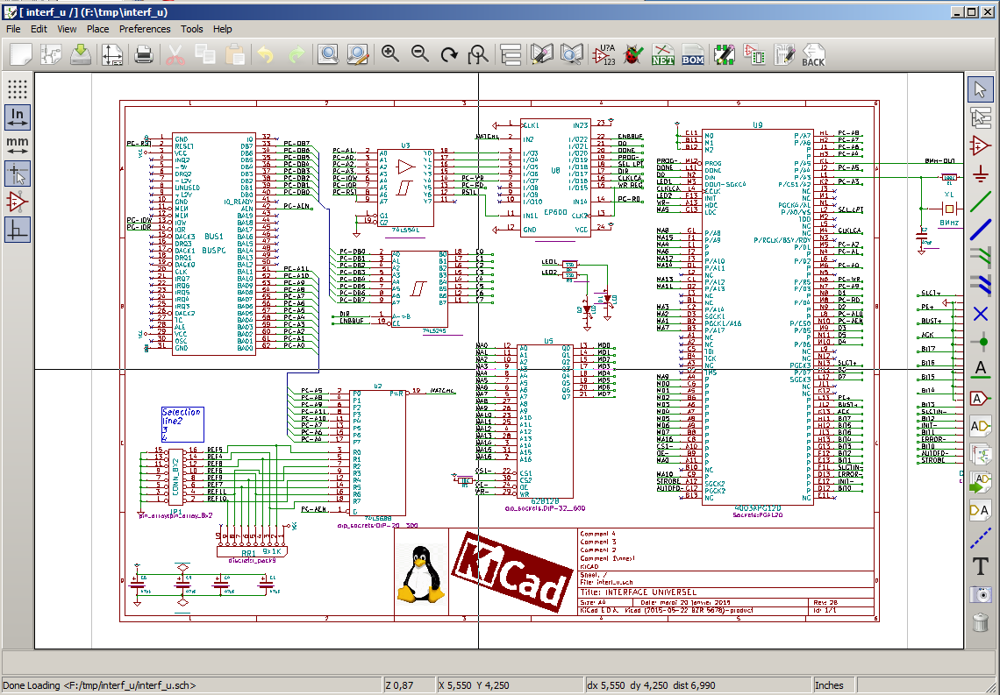

=== Mouse commands

==== Basic commands

*Left button*

* Single click: displays the characteristics of the component or text
  under the cursor in the status bar.
* Double click: edit (if the element is editable) the component or text.

*Right button*

* Opens a pop-up menu.

==== Operations on blocks

You can move, drag, copy and delete selected areas in all Eeschema
menus.

Areas are selected by dragging a box around them using the left mouse button.

Holding "Shift", "Ctrl", or "Shift + Ctrl" during selection respectively
performs copying, dragging, and deletion:

[width="80%",cols="66%,34%",]
|======================================================
|left mouse button |Move selection.
|Shift + left mouse button |Copy selection.
|Ctrl + left mouse button |Drag selection.
|Ctrl + Shift + left mouse button |Delete selection.
|======================================================

When dragging or copying, you can:

* Click again to place the elements.
* Click the right button to cancel.

If a block move command has started, another command can be
selected via the pop-up menu (mouse, right button):

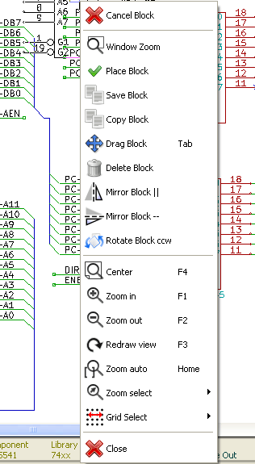

=== Hotkeys

* The "?" key displays the current hotkey list.
* Hotkeys can be managed by choosing "Edit Hotkeys" in the Preferences menu.

Here is the default hot key list:

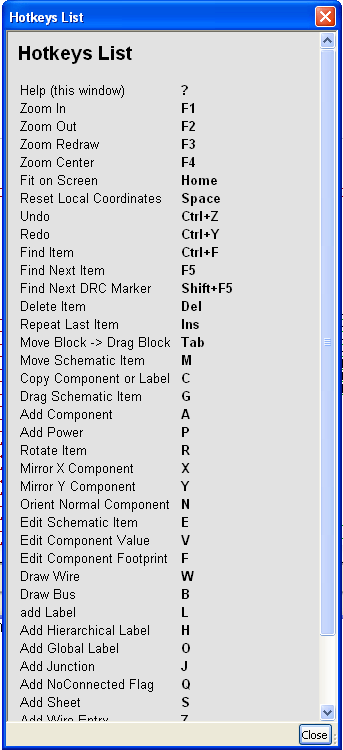

All hot keys can be redefined by the user via the hotkey editor:

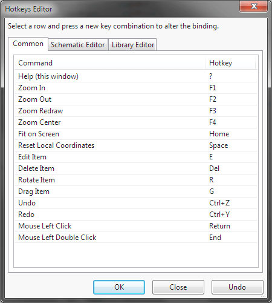

=== Selecting grid size

In Eeschema, the cursor moves over a grid, which can be displayed or
hidden. The grid is always displayed in the library manager.

You can change the grid size via the pop-up menu or via the Preferences/Options menu.

The default grid size is 50 mil (0.050") or 1,27 millimeters.

This is the prefered grid to place components and wires in a schematic,
and to place pins when designing a symbol in the Component Editor.

One can also work with a smaller grid from 25 mil to 10 mil.
This is only intended for designing the component body
or placing text and comments, not for placing pins and wires.

=== Zoom selection

To change the zoom level:

* Right click to open the Pop-up menu and select the desired zoom.

* Or use the function keys:

  ** F1: Zoom in

  ** F2: Zoom out

  ** F4 or simply click on the middle mouse button (without moving the mouse): Center the view around the cursor pointer position

* Window Zoom:

  ** Mouse wheel: Zoom in/out

  ** Shift+Mouse wheel: Pan up/down

  ** Ctrl+Mouse wheel: Pan left/right

=== Displaying cursor coordinates

The display units are in inches or millimeters. However, Eeschema always
works internally in 0.001-inch (mil/thou) units.

The following information is displayed at the bottom right hand side of
the window:

* The zoom factor
* The absolute position of the cursor
* The relative position of the cursor

The relative coordinates can be reset to zero with the space bar. This is
useful for making measurements between two points.

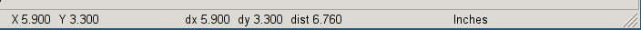

=== Top menu bar

The top menu bar allows the opening and saving of schematics,
program configuration, and viewing the documentation.

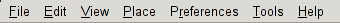

=== Upper toolbar

This toolbar gives access to the main functions of Eeschema.

If Eeschema is run in standalone mode, this is the available tool set:

If Eeschema is run from the project manager (KiCad), this is the available tool set:

Tools to initialize a project are not available, because these tools are in the _Project Manager_.

[width="100%",cols="10%,90%",]
|=======================================================================
|
|Create a new schematic (only in standalone mode).

|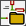
|Open a schematic (only in standalone mode).

|
|Save complete (hierarchical) schematic.

|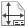
|Select the sheet size and edit the title block.

|
|Open print dialog.

|image:images/icons/cut_button.png[icons/cut_button_png]
|Remove the selected elements during a block move.

|
|Copy selected elements to the clipboard during a block move.

|
|Copy last selected element or block in the current sheet.

|image:images/icons/undo.png[icons/undo_png]
|Undo: Cancel the last change (up to 10 levels).

|image:images/icons/redo.png[icons/redo_png]
|Redo (up to 10 levels).

|
|Call the dialog to search components and texts in the schematic.

|
|Call the dialog to search and replace texts in the schematic.

|image:images/icons/zoom_in.png[icons/zoom_in] image:images/icons/zoom_out.png[icons/zoom_out]
|Zoom in and out.

|image:images/icons/zoom_redraw.png[icons/zoom_redraw] image:images/icons/zoom_fit_in_page.png[icons/zoom_fit_in_page_png]
|Refresh screen; zoom to fit.

|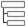
|View and navigate the hierarchy tree.

|
|Leave the current sheet and go up in the hierarchy.

|image:images/icons/libedit.png[icons/libedit_png]
|Call component editor _Libedit_ to view and modify libraries and component symbols.

|image:images/icons/library_browse.png[icons/library_browse_png]
|Display libraries (Viewlib).

|
|Annotate components.

|image:images/icons/erc.png[ERC icon]
|Electrical rules check (ERC), automatically validate electrical connections.

|
|Export a netlist (Pcbnew, SPICE, and other formats).

|
|Generate the BOM (Bill of Materials).

|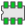
|Edit footprint.

|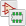
|Call CvPcb to assign footprints to components.

|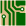
|Call Pcbnew to perform a PCB layout.

|
|Back-import component footprints (selected using CvPcb) into the "footprint" fields.
|=======================================================================

<<<<<

=== Right toolbar icons

This toolbar contains tools to:

* Place components, wires, buses, junctions, labels, text, etc.
* Create hierarchical sub-sheets and connection symbols

[width="100%",cols="10%,5%,85%",]
|=======================================================================
.20+^.^|
|image:images/icons/cursor.png[icons/cursor_png]
|Cancel the active command or tool.

|image:images/icons/hierarchy_cursor.png[icons/hierarchy_cursor_png]
|Hierarchy navigation: this tool makes it possible to open the
subsheet of the displayed schematic (click in the symbol of this
subsheet), or to go back up in the hierarchy (click in a free area of
the schematic).

|image:images/icons/new_component.png[New Component icon]
|Display the component selector.

|image:images/icons/add_power.png[Add Power icon]
|Display the power symbol selector.

|
|Draw a wire.

|
|Draw a bus.

|
|Draw wire-to-bus entry points. These elements are only graphical and do not create
a connection, thus they should not be used to connect wires together.

|
|Draw bus-to-bus entry points.

|
|Place a "No Connect" flag. These are placed on component pins which
are not to be connected. This is useful in the ERC function to check if
pins are intentionally left not connected or are missed.

|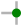
|Place a junction. This connects two crossing wires, or a wire and a pin,
when it can be ambiguous. (i.e. if an end of the wire or pin is not
connected to one of the ends of the other wire).

|image:images/icons/add_line_label.png[icons/add_line_label_png]
|Local label placement. Two wires may be connected with identical labels
**in the same sheet**. For connections between two different sheets, you
have to use global or hierarchical labels.

|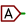
|Place a global label. All global labels with the same name are connected, even between
different sheets.

|image:images/icons/add_hierarchical_label.png[icons/add_hierarchical_label_png]
|Place a hierarchical label. This makes it possible to place a
connection between a sheet and the parent sheet that contains it.

|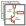
|Place a hierarchical subsheet. You must specify the file name for this subsheet.

|
|Import hierarchical labels from a subsheet. These hierarchical labels must already be
placed in the subsheet. These are equivalent to pins on a component, and must be connected
using wires.

|
|Place hierarchical label in a subsheet symbol. This is placed by name and does not require the
label to already exist in the subsheet itself.

|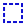
|Draw a line. These are only graphical and do not connect anything.

|image:images/icons/add_text.png[icons/add_text_png]
|Place textual comments. These are only graphical.

|
|Place a bitmap image.

|image:images/icons/delete.png[icons/cancel_png]
|Delete selected element.

If several superimposed elements are selected, the priority is given to
the smallest (in the decreasing priorities: junction, "No Connect", wire,
bus, text, component). This also applies to hierarchical sheets. Note:
the "Undelete" function of the general toolbar allows you to cancel last
deletions.

|=======================================================================

=== Left toolbar icons

This toolbar manages the display options:

[width="100%",cols="10%,90%",]
|=======================================================================

|image:images/icons/grid.png[icons/grid]
| Show/Hide the grid.

|image:images/icons/unit_inch.png[icons/unit_inch]
|Switch to inches.

|image:images/icons/unit_mm.png[icons/unit_mm]
|Switch to millimeters.

|image:images/icons/cursor_shape.png[icons/cursor_shape]
| Choose the cursor shape.

|image:images/icons/hidden_pin.png[icons/hidden_pin]
| Visibility of "invisible" pins.

|image:images/icons/lines90.png[icons/lines90]
| Allowed orientation of wires and buses.

|=======================================================================

[[pop-up-menus-and-quick-editing]]
=== Pop-up menus and quick editing

A right-click opens a contextual menu for the selected element. This contains:

* Zoom factor.
* Grid adjustment.
* Commonly edited parameters of the selected element.

Pop-up without selected element.

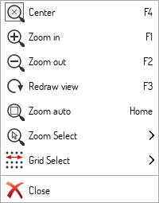

Editing of a label.

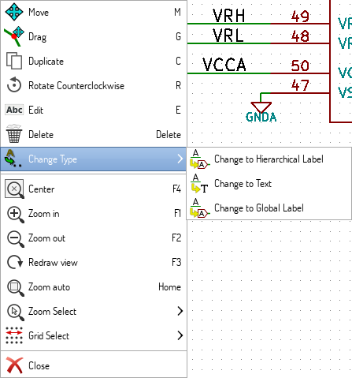

Editing a component.

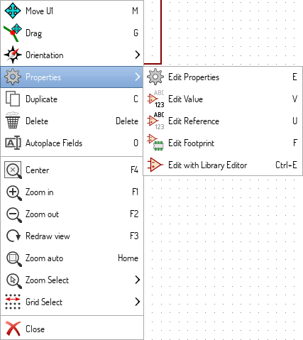

