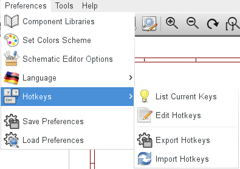
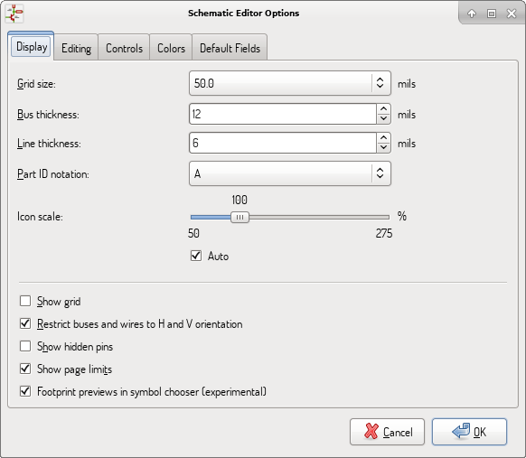
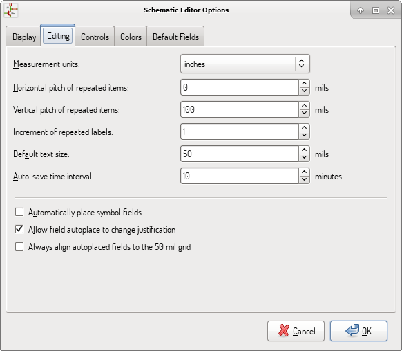
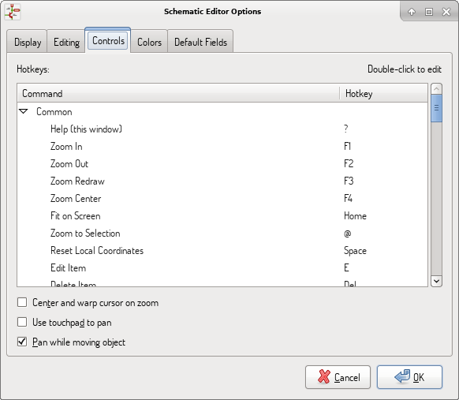
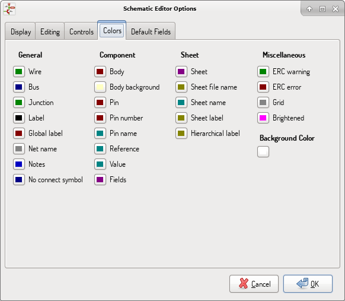
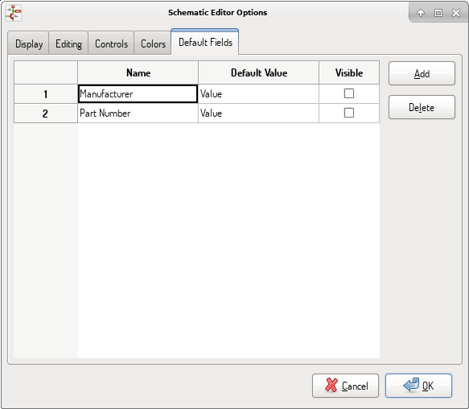

[[main-top-menu]]
== Main top menu

[[file-menu]]
=== File menu

image::images/en/menu_file.png[alt="File menu",scaledwidth="35%"]

[width="100%",cols="31%,69%",]
|=======================================================================
|New |Close current schematic and start a new one (only in standalone mode).

|Open |Load a schematic project (only in standalone mode).

|Open Recent |Open a schematic project from the list of recently opened files (only in standalone mode).

|Append Schematic Sheet |Insert the contents of another sheet into the current one.

|Import Non-Kicad Schematic File |Imports a schematic project saved in another file format.

|Save |Save current sheet and all its subsheets.

|Save Current Sheet |Save only the current sheet, but not others in the project.

|Save Current Sheet As... |Save the current sheet under a new name.

|Page Settings |Configure page dimensions and title block.

|Print |Print schematic project (See also chapter <<plot-and-print,Plot and Print>>).

|Plot |Export to PDF, PostScript, HPGL or SVG format (See chapter <<plot-and-print,Plot and Print>>).

|Close |Terminate the application.
|=======================================================================

[[preferences-menu]]
=== Preferences menu

[width="90%",cols="30%,70%",]
|================================================
|Manage Symbol Library Tables |Add/remove symbol libraries.
|Configure Paths |Set the default search paths.
|General Options | Preferences (units, grid size, field names, etc.).
|Set Language | Select interface language.
|Icons Options | Icons visibility settings.
|Import and Export | Transfer preferences to/from file.
|================================================

[[manage-sym-lib-table]]
==== Manage Symbol Library Tables

image::images/en/options_symbol_lib.png[alt="Symbol Library Tables",scaledwidth="50%"]

Eeschema uses two library tables to store the list of available symbol libraries,
which differ by the scope:

* Global Libraries

Libraries listed in the Global Libraries table are available to every project.
They are saved in *sym-lib-table* in your home directory (exact path is
dependent on the operating system; check the path above the table).

* Project Specific Libraries

Libraries listed in Project Specific Libraries table are available to the
currently opened project. They are saved in *sym-lib-table* file in the project
directory (check the path above the table).

You can view either list by clicking on "Global Libraries" or "Project Specific
Libraries" tab below the library table.

===== Add a new library

Add a library either by clicking *Browse Libraries...* button and selecting a
file or clicking "Append Library" and typing a path to a library file. The
selected library will be added to the currently opened library table
(Global/Project Specific).

===== Remove a library

Remove a library by selecting one or more libraries and clicking *Remove
Library* button.

===== Library properties

Each row in the table stores several fields describing a library:

[cols="30%,70%",]
|======================
| Active| Enables/disables the library. It is useful to temporarily reduce the loaded library set.
| Nickname| Nickname is a short, unique identifier used for assigning symbols to components. Symbols
are represented by '<Library Nickname>:<Symbol Name>' strings.
| Library Path| Path points to the library location.
| Plugin Type| Determines the library file format.
| Options| Stores library specific options, if used by plugin.
| Description| Briefly characterizes the library contents.
|======================

[[preferences-general-options]]
==== General Options

[[preferences-display]]
===== Display

[width="100%",cols="40%,60%",]
|=======================================================================
|Grid Size| Grid size selection.

It is *recommended* to work with normal grid (0.050 inches or 1,27 mm). Smaller
grids are used for component building.

|Bus thickness |Pen size used to draw buses.

|Line thickness |Pen size used to draw objects that do not have a
specified pen size.

|Part ID notation |Style of suffix that is used to denote symbol units (U1A,
U1.A, U1-1, etc.)

|Icon scale| Adjust toolbar icons size.

|Show Grid | Grid visibility setting.

|Restrict buses and wires to H and V orientation| If checked, buses and
wires are drawn only with vertical or horizontal lines.
Otherwise buses and wires can be placed at any orientation.

|Show hidden pins: |Display invisible (or __hidden__) pins, typically
power pins.

|Show page limits |If checked, shows the page boundaries on screen.

|Footprint previews in symbol chooser| Displays a footprint preview frame and
footprint selector when placing a new symbol.

*Note:* it may cause problems or delays, use at your own risk.
|=======================================================================

[[preferences-editing]]
===== Editing

[width="100%",cols="40%,60%",]
|=======================================================================
|Measurement units |Select the display and the cursor coordinate units
(inches or millimeters).

|Horizontal pitch of repeated items |
Increment on X axis during element duplication (default: 0)
(after placing an item like a symbol, label or wire,
a duplication is made by the _Insert_ key)

|Vertical pitch of repeated items| Increment on Y axis during
element duplication (default: 0.100 inches or 2,54 mm).

|Increment of repeated labels |Increment of label value during duplication of texts ending
in a number, such as bus members (usual value 1 or -1).

|Default text size |Text size used when creating new text items or labels.

|Auto-save time interval |Time in minutes between saving backups.

|Automatically place symbol fields | If checked, symbol fields (e.g. value and
reference) in newly placed symbols might be moved to avoid collisions with
other items.

|Allow field autoplace to change justification | Extension of 'Automatically
place symbol fields' option. Enable text justification adjustment for symbol fields when placing
a new part.

|Always align autoplaced fields to the 50 mil grid |Extension of 'Automatically
place symbol fields' option. If checked, fields are autoplaced using 50 mils
grid, otherwise they are placed freely.
|=======================================================================

[[preferences-controls]]
===== Controls

Redefine hotkeys and set up the user interface behavior.

Select a new hotkey by double clicking an
action or right click on an action to show a popup menu:

[width="100%",cols="40%,60%",]
|============
|Edit | Define a new hotkey for the action (same as double click).
|Undo Changes | Reverts the recent hotkey changes for the action.
|Restore Default | Sets the action hotkey to its default value.
|Undo All Changes | Reverts all recent hotkey changes for the action.
|Restore All to Default | Sets all action hotkeys to their default values.
|============

Options description:

[width="100%",cols="40%,60%",]
|============
|Center and warp cursor on zoom | If checked, the pointed location is warped
to the screen center when zooming in/out.

|Use touchpad to pan |When enabled, view is panned using scroll wheels (or
touchpad gestures) and to zoom one needs to hold Ctrl. Otherwise scroll wheels
zoom in/out and Ctrl/Shift are the panning modifiers.

|Pan while moving object |If checked, automatically pans the window
if the cursor leaves the window during drawing or moving.
|============

[[preferences-colors]]
===== Colors

Color scheme for various graphic elements. Click on any of the color swatches to
select a new color for a particular element.

[[preferences-default-fields]]
===== Default Fields

Define additional custom fields and corresponding values that will appear in
newly placed symbols.

[[help-menu]]
=== Help menu

Access to on-line help (this document) for an extensive tutorial about KiCad.

Use ``Copy Version Information'' when submitting bug reports to identify your
build and system.
