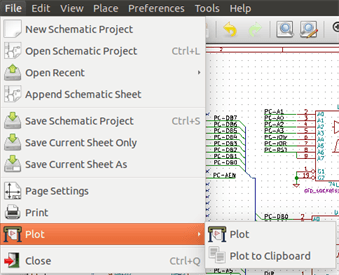
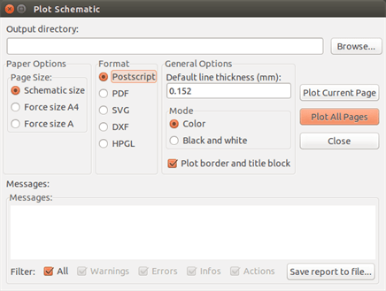
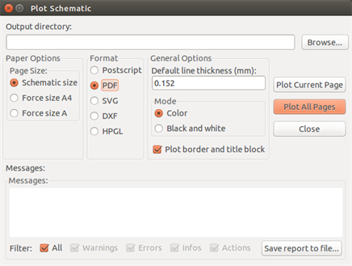
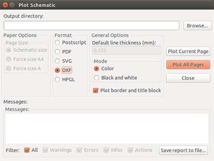

[[plot-and-print]]
== Plot and Print

=== Introduction

You can access both print and plot commands via the file menu.

The suported output formats are Postscript, PDF, SVG, DXF and HPGL. You can
also directly print to your printer.

[[common-printing-commands]]
=== Common printing commands

Plot Current Page:: prints one file for the current sheet only.

Plot All Pages:: allows you to plot the whole hierarchy (one print file is
generated for each sheet).

[[plot-in-postscript]]
=== Plot in Postscript

This command allows you to create PostScript files.

The file name is the sheet name with an extension .ps. You can disable
the option "Plot border and title block". This is useful if you want to create a
postscript file for encapsulation (format .eps) often used to insert a
diagram in a word processing software. The message window displays the
file names created.

[[plot-in-pdf]]
=== Plot in PDF

Allows you to create plot files using the format PDF.
The file name is the sheet name with an extension .pdf.

[[plot-in-svg]]
=== Plot in SVG

image::images/eeschema_plot_svg.png[alt="eeschema_plot_svg_png",scaledwidth="70%"]

Allows you to create plot files using the vectored format SVG.
The file name is the sheet name with an extension .svg.

[[plot-in-dxf]]
=== Plot in DXF

Allows you to create plot files using the format DXF.
The file name is the sheet name with an extension .dxf.

[[plot-in-hpgl]]
=== Plot in HPGL

This command allows you to create an HPGL file.
In this format you can define:

* Page size.
* Origin.
* Pen width (in mm).

The plotter setup dialog window looks like the following:

image::images/eeschema_plot_hpgl.png[alt="eeschema_plot_hpgl_png",scaledwidth="70%"]

The output file name will be the sheet name plus the extension .plt.

[[sheet-size-selection]]
==== Sheet size selection

Sheet size is normally checked. In this case, the sheet size defined in
the title block menu will be used and the chosen scale will be 1. If a
different sheet size is selected (A4 with A0, or A with E), the scale is
automatically adjusted to fill the page.

[[offset-adjustments]]
==== Offset adjustments

For all standard dimensions, you can adjust the offsets to center the
drawing as accurately as possible. Because plotters have an origin point
at the center or at the lower left corner of the sheet, it is necessary
to be able to introduce an offset in order to plot properly.

Generally speaking:

* For plotters having their origin point at the center of the sheet the
  offset must be negative and set at half of the sheet dimension.
* For plotters having their origin point at the lower left corner of the
  sheet the offset must be set to 0.

To set an offset:

* Select sheet size.
* Set offset X and offset Y.
* Click on accept offset.

[[print-on-paper]]
=== Print on paper

This command, available via the icon
image:images/icons/print_button.png[icons/print_button_png],
allows you to visualize and generate design files for the standard
printer.

image::images/print_dialog.png[alt="print_dialog_png",scaledwidth="50%"]

The "Print sheet reference and title block" option enables or disables
sheet references and title block.

The "Print in black and white" option sets printing in monochrome. This
option is generally necessary if you use a black and white laser
printer, because colors are printed into half-tones that are often not
so readable.
