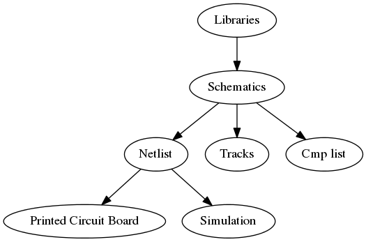
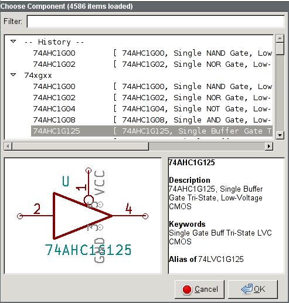
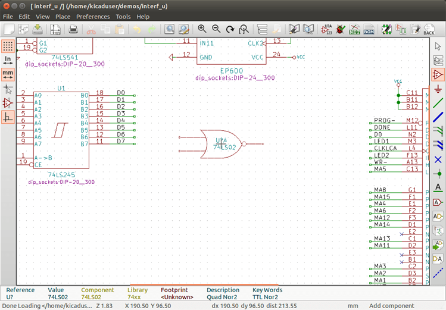
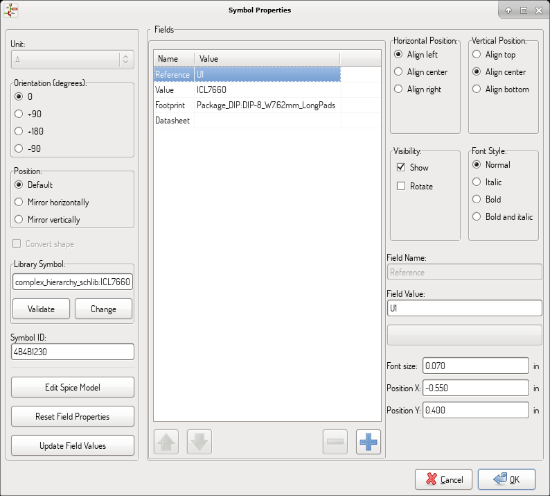
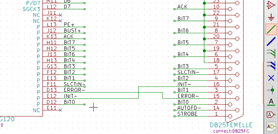
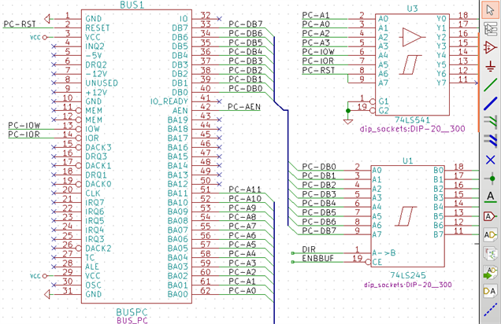
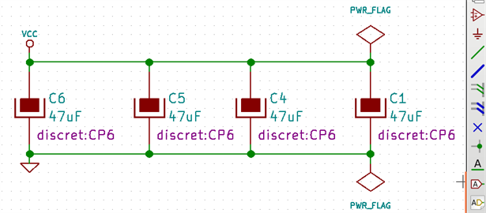
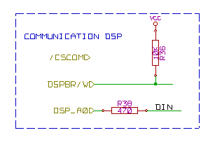
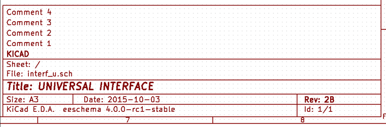
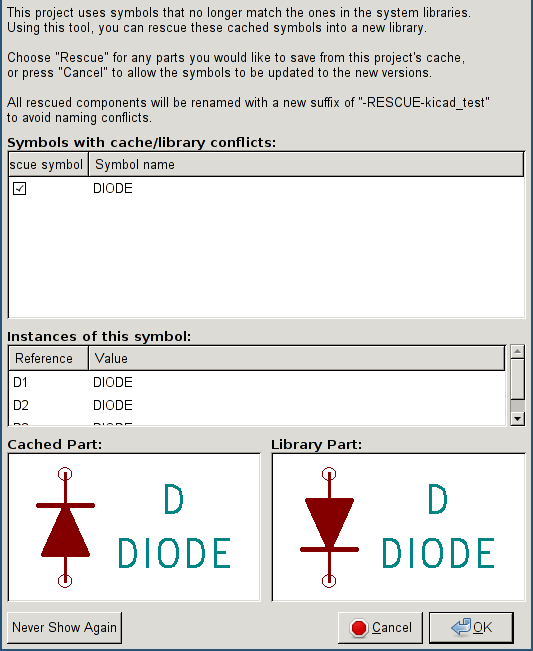

[[schematic-creation-and-editing]]
== Schematic Creation and Editing

=== Introduction

A schematic can be represented by a single sheet, but, if big enough, it
will require several sheets.

A schematic represented by several sheets is hierarchical,
and all its sheets (each one represented by its own file) constitute an
Eeschema project. The manipulation of hierarchical schematics will be
described in the <<hierarchical-schematics,Hierarchical Schematics>>
chapter.

[[general-considerations]]
=== General considerations

A schematic designed with Eeschema is more than a simple graphic
representation of an electronic device. It is normally the entry point
of a development chain that allows for:

* Validating against a set of rules (<<erc,Electrical Rules Check>>) to detect errors and omissions.
* Automatically generating a bill of materials (<<creating-customized-netlists-and-bom-files,BOM>>).
* <<creating-customized-netlists-and-bom-files,Generating a netlist>> for simulation software such as SPICE.
* <<creating-customized-netlists-and-bom-files,Generating a netlist>> for transferring to PCB layout.

A schematic mainly consists of components, wires, labels, junctions,
buses and power ports. For clarity in the schematic, you can place
purely graphical elements like bus entries, comments, and polylines.

[[the-development-chain]]
=== The development chain

Components are added to the schematic from component libraries. After
the schematic is made, a netlist is generated, which is later used to
import the set of connections and footprints into PcbNew.

[[component-placement-and-editing]]
=== Component placement and editing

[[find-and-place-a-component]]
==== Find and place a component

To load a component into your schematic you can use the icon
image:images/icons/new_component.png[New Component icon].
A dialog box allows you to type the name of the component to load.

The Choose Component dialog will filter components by name, keywords,
and description according to what you type into the search field.

Before placing the component in the schematic, you can rotate it, mirror
it, and edit its fields, by either using the hotkeys or the right-click
context menu. This can be done the same way after placement.

Here is a component during placement:

[[power-ports]]
==== Power ports

A power port symbol is a component (the symbols are grouped in the
“power” library), so they can be placed using the component chooser.
However, as power placements are frequent, the
image:images/icons/add_power.png[Add Power icon]
tool is available. This tool is similar, except
that the search is done directly in the ``power'' library.

[[component-editing-and-modification-already-placed-component]]
==== Component Editing and Modification (already placed component)

There are two ways to edit a component:

* Modification of the component itself: position, orientation, unit selection on a multi-unit component.
* Modification of one of the fields of the component: reference, value, footprint, etc.

When a component has just been placed, you may have to modify its value
(particularly for resistors, capacitors, etc.), but it is useless to
assign to it a reference number right away, or to select the unit
(except for components with locked units, which you have to assign
manually). This can be done automatically by the annotation function.

[[component-modification]]
===== Component modification

To modify some feature of a component, position the cursor on the
component, and then either:

* Double-click on the component to open the full editing dialog.
* Right-click to open the context menu and use one of the
  commands: Move, Orientation, Edit, Delete, etc.

[[text-fields-modification]]
===== Text fields modification

You can modify the reference, value, position, orientation, text size and
visibility of the fields:

* Double-click on the text field to modify it.
* Right-click to open the context menu and use one of the
  commands: Move, Rotate, Edit, Delete, etc.

For more options, or in order to create fields,
double-click on the component to open the Component Properties
dialog.

Each field can be visible or hidden, and displayed horizontally or
vertically. The displayed position is always indicated
for a normally displayed component (no rotation or mirroring) and is relative
to the anchor point of the component.

The option “Reset to Library Defaults” sets the component to the original
orientation, and resets the options, size and position of each field.  However,
texts fields are not modified because this could break the schematic.

[[wires-buses-labels-power-ports]]
=== Wires, Buses, Labels, Power ports

[[introduction-1]]
==== Introduction

All these drawing elements can also be placed with the tools on the
vertical right toolbar.

These elements are:

* *Wires:* most connections between components.
* *Buses:* to graphically join bus labels
* *Polylines:* for graphic presentation.
* *Junctions:* to create connections between crossing wires or buses.
* *Bus entries:* to show connections between wires and buses. Graphical only!
* *Labels:* for labeling or creating connections.
* *Global labels:* for connections between sheets.
* *Texts:* for comments and annotations.
* *"No Connect" flags:* to terminate a pin that does not need any connection.
* **Hierarchical sheets**, and their connection pins.

[[connections-wires-and-labels]]
==== Connections (Wires and Labels)

There are two ways to establish connection:

* Pin to pin wires.
* Labels.

The following figure shows the two methods:

*Note 1:*

The point of “contact” of a label is the lower left
corner of the first letter of the label. This point is displayed with
a small square when not connected.

This point must thus be in contact with the wire, or be superimposed at
the end of a pin so that the label is seen as connected.

*Note 2:*

To establish a connection, a segment of wire must be connected by its
ends to an another segment or to a pin.

If there is overlapping (if a wire passes over a pin, but without being
connected to the pin end) there is no connection.

*Note 3:*

Wires that cross are not implicitly connected. It is necessary to
join them with a junction dot if a connection is desired.

The previous figure (wires connected to DB25FEMALE pins 22, 21, 20, 19)
shows such a case of connection using a junction symbol.

*Note 4:*

If two different labels are placed on the same wire, they are connected
together and become equivalent: all the other elements connected to one
or the other labels are then connected to all of them.

[[connections-buses]]
==== Connections (Buses)

In the following schematic, many pins are connected to buses.

[[bus-members]]
===== Bus members

From the schematic point of view, a bus is a collection of signals,
starting with a common prefix, and ending with a number. For example,
PCA0, PCA1, and PCA2 are members of the PCA bus.

The complete bus is named PCA[N..m], where N and m are the first and
the last wire number of this bus. Thus if PCA has 20 members from 0 to
19, the complete bus is noted PCA[0..19]. A collection of signals
like PCA0, PCA1, PCA2, WRITE, READ cannot be contained in a bus.

[[connections-between-bus-members]]
===== Connections between bus members

Pins connected between the same members of a bus must be connected by
labels. It is not possible to connect a pin directly to a bus; this
type of connection will be ignored by Eeschema.

In the example above, connections are made by the labels placed on wires
connected to the pins. Bus entries (wire segments at 45
degrees) to buses are graphical only, and are not necessary to form
logical connections.

In fact, using the repetition command (__Insert__ key), connections can
be very quickly made in the following way, if component pins are aligned
in increasing order (a common case in practice on components such as
memories, microprocessors...):

* Place the first label (for example PCA0)
* Use the repetition command as much as needed to place members.
  Eeschema will automatically create the next labels (PCA1, PCA2...)
  vertically aligned, theoretically on the position of the other pins.
* Draw the wire under the first label. Then use the repetition command
  to place the other wires under the labels.
* If needed, place the bus entries by the same way (Place the first
  entry, then use the repetition command).

[NOTE]
====
In the Preferences/Options menu, you can set the repetition parameters:

* Vertical step.
* Horizontal step.
* Label increment (which can thus be incremented by 2, 3. or
  decremented).
====

[[global-connections-between-buses]]
===== Global connections between buses

You may need connections between buses, in order to link two buses
having different names, or in the case of a hierarchy, to create
connections between different sheets. You can make these connections in
the following way.

image::images/en/bus_junction.png[alt="Bus junction example",scaledwidth="80%"]

Buses PCA [0..15], ADR [0..7] and BUS [5..10] are connected together
(note the junction here because the vertical bus wire joins the middle
of the horizontal bus segment).

More precisely, the corresponding members are connected together : PCA0,
ADR0 are connected, (as same as PCA1 and ADR1 ... PCA7 and ADR7).

Furthermore, PCA5, BUS5 and ADR5 are connected (just as PCA6, BUS6 and
ADR6 like PCA7, BUS7 and ADR7).

PCA8 and BUS8 are also connected (just as PCA9 and BUS9, PCA10 and
BUS10)

[[power-ports-connection]]
==== Power ports connection

When the power pins of the components are visible, they must be
connected, as for any other signal.

Components such as gates and flip-flops may have invisible power pins.
Care must be taken with these because:

* You cannot connect wires, because of their invisibility.
* You do not know their names.

And moreover, it would be a bad idea to make them visible and to connect
them like the other pins, because the schematic would become unreadable
and not in accordance with usual conventions.

[NOTE]
If you want to enforce the display of these invisible power pins, you
must check the option ``Show invisible power pins'' in the
Preferences/Options dialog box of the main menu, or the icon
image:images/icons/hidden_pin.png[]
on the left (options) toolbar.

Eeschema automatically connects invisible power pins of the same name
to the power net of that name. It may be necessary to join power nets
of different names (for example, "GND" in TTL components and "VSS" in
MOS components); use power ports for this.

It is not recommended to use labels for power connection. These only have
a “local” connection scope, and would not connect the invisible power pins.

The figure below shows an example of power port connections.

In this example, ground (GND) is connected to power port VSS, and power
port VCC is connected to VDD.

Two PWR_FLAG symbols are visible. They indicate that the two power ports
VCC and GND are really connected to a power source.
Without these two flags, the ERC tool would diagnose: __Warning: power
port not powered__.

All these symbols are components of the schematic library ``power''.

[[no-connection-symbols]]
==== "No Connect" flag

These symbols are very useful to avoid undesired ERC warnings.
The electric rules check ensures that no connection has been
accidentally left unconnected.

If pins must really remain unconnected, it is necessary to place
a "No Connect" flag (tool image:images/icons/noconn.png[No connection icon])
on these pins. These symbols do not have any influence on the
generated netlists.

[[drawing-complements]]
=== Drawing Complements

[[text-comments]]
==== Text Comments

It can be useful (to aid in understanding the schematic) to place
annotations such as text fields and frames. Text fields (tool
image:images/icons/add_text.png[])
and Polyline (tool
image:images/icons/add_dashed_line.png[])
are intended for this use, contrary to labels and wires, which are
connection elements.

Here you can find an example of a frame with a textual comment.

[[sheet-title-block]]
==== Sheet title block

The title block is edited with the tool
image:images/icons/sheetset.png[Page Settings tool].

image::images/en/page_settings.png[alt="Page settings dialog",scaledwidth="80%"]

The sheet number (Sheet X/Y) is automatically updated.

[[rescuing-cached-components]]
=== Rescuing cached components

By default, Eeschema loads component symbols out of the libraries according to the set paths.
This can cause a problem when loading a very old project: if the symbols in the library have changed
since they were used in the project, the ones in the project would be automatically replaced with
the new versions. The new versions might not line up correctly or might be oriented differently,
leading to a broken schematic.

However, when a project is saved, a cache library is saved along with it. This allows the project
to be distributed without the full libraries. If you load a project where symbols are present both
in its cache and in the system libraries, Eeschema will scan the libraries for conflicts. Any
conflicts found will be listed in the following dialog:

You can see in this example that the project originally used a diode with the cathode facing up,
but the library now contains one with the cathode facing down. This change could ruin the project!
Pressing OK here will cause the old symbol to be saved into a special ``rescue'' library, and all
the components using that symbol will be renamed to avoid naming conflicts.

If you press Cancel, no rescues will be made, so Eeschema will load all the new components by
default. Because no changes were made, you can still go back and run the rescue function again:
choose "Rescue Cached Components" in the Tools menu to call up the dialog again.

If you would prefer not to see this dialog, you can press "Never Show Again". The default will
be to do nothing and allow the new components to be loaded. This option can be changed back in
the Component Libraries preferences.
