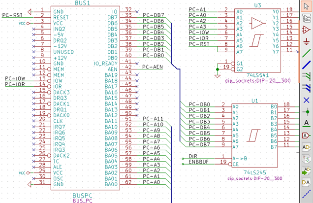
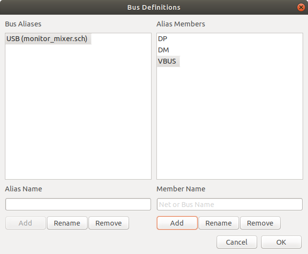
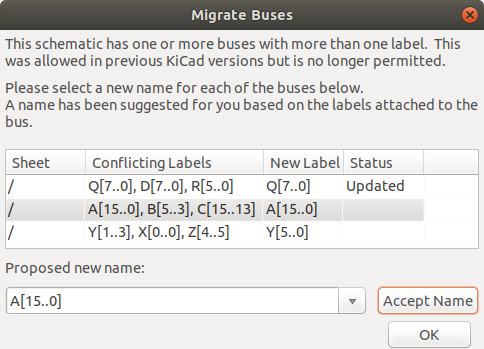

[[schematic-creation-and-editing]]
== Schematic Creation and Editing

=== Introduction

A schematic can be represented by a single sheet, but, if big enough, it
will require several sheets.

A schematic represented by several sheets is hierarchical,
and all its sheets (each one represented by its own file) constitute an
Eeschema project. The manipulation of hierarchical schematics will be
described in the <<hierarchical-schematics,Hierarchical Schematics>>
chapter.

[[general-considerations]]
=== General considerations

A schematic designed with Eeschema is more than a simple graphic
representation of an electronic device. It is normally the entry point
of a development chain that allows for:

* Validating against a set of rules (<<erc,Electrical Rules Check>>) to detect errors and omissions.
* Automatically generating a bill of materials (<<creating-customized-netlists-and-bom-files,BOM>>).
* <<creating-customized-netlists-and-bom-files,Generating a netlist>> for simulation software such as SPICE.
* <<creating-customized-netlists-and-bom-files,Generating a netlist>> for transferring to PCB layout.

A schematic mainly consists of symbols, wires, labels, junctions,
buses and power ports. For clarity in the schematic, you can place
purely graphical elements like bus entries, comments, and polylines.

[[the-development-chain]]
=== The development chain

image::images/en/dev-chain.png[alt="dev-chain_png",scaledwidth="80%"]

Symbols are added to the schematic from symbol libraries. After
the schematic is made, a netlist is generated, which is later used to
import the set of connections and footprints into PcbNew.

[[component-placement-and-editing]]
=== Symbol placement and editing

[[find-and-place-a-component]]
==== Find and place a symbol

To load a symbol into your schematic you can use the icon
image:images/icons/new_symbol.png[New Symbol icon].
A dialog box allows you to type the name of the symbol to load.

image::images/en/dialog_choose_component.png[alt="Choose Component dialog",scaledwidth="60%"]

The Choose Symbols dialog will filter symbols by name, keywords,
and description according to what you type into the search field. Advanced
filters can be used just by typing them:

* *Wildcards:* use the characters `?` and `*` respectively to mean "any
  character" and "any number of characters".
* *Relational:* if a library part's description or keywords contain a tag
  of the format "Key:123", you can match relative to that by typing
  "Key>123" (greater than), "Key<123" (less than), etc. Numbers may include
  one of the following case-insensitive suffixes:
+
[width="100%"]
|===
| p | n | u | m | k | meg | g | t
| 10^-12^ | 10^-9^ | 10^-6^ | 10^-3^ | 10^3^ | 10^6^ | 10^9^ | 10^12^
|===
+
[width="50%"]
|===
| ki | mi | gi | ti
| 2^10^ | 2^20^ | 2^30^ | 2^40^
|===

* *Regular expression:* if you're familiar with regular expressions, these
  can be used too. The regular expression flavor used is the
  http://docs.wxwidgets.org/3.0/overview_resyntax.html[wxWidgets
  Advanced Regular Expression style], which is similar to Perl regular
  expressions.

Before placing the symbol in the schematic, you can rotate it, mirror
it, and edit its fields, by either using the hotkeys or the right-click
context menu. This can be done the same way after placement.

Here is a symbol during placement:

image::images/en/component_during_placement.png[alt="component during placement",scaledwidth="95%"]

[[power-ports]]
==== Power ports

A power port symbol is a symbol (the symbols are grouped in the
“power” library), so they can be placed using the symbol chooser.
However, as power placements are frequent, the
image:images/icons/add_power.png[Add Power icon]
tool is available. This tool is similar, except
that the search is done directly in the ``power'' library.

[[component-editing-and-modification-already-placed-component]]
==== Symbol Editing and Modification (already placed component)

There are two ways to edit a symbol:

* Modification of the symbol itself: position, orientation, unit selection on a multi-unit symbol.
* Modification of one of the fields of the symbol: reference, value, footprint, etc.

When a symbol has just been placed, you may have to modify its value
(particularly for resistors, capacitors, etc.), but it is useless to
assign to it a reference number right away, or to select the unit
(except for components with locked units, which you have to assign
manually). This can be done automatically by the annotation function.

[[component-modification]]
===== Symbol modification

To modify some feature of a symbol, position the cursor on the
symbol, and then either:

* Double-click on the symbol to open the full editing dialog.
* Right-click to open the context menu and use one of the
  commands: Move, Orientation, Edit, Delete, etc.

[[text-fields-modification]]
===== Text fields modification

You can modify the reference, value, position, orientation, text size and
visibility of the fields:

* Double-click on the text field to modify it.
* Right-click to open the context menu and use one of the
  commands: Move, Rotate, Edit, Delete, etc.

For more options, or in order to create fields,
double-click on the symbol to open the Symbol Properties
dialog.

image::images/en/dialog_component_properties.png[alt="Component Properties dialog",scaledwidth="70%"]

Each field can be visible or hidden, and displayed horizontally or
vertically. The displayed position is always indicated
for a normally displayed symbol (no rotation or mirroring) and is relative
to the anchor point of the symbol.

The option “Reset to Library Defaults” sets the symbol to the original
orientation, and resets the options, size and position of each field.  However,
texts fields are not modified because this could break the schematic.

[[wires-buses-labels-power-ports]]
=== Wires, Buses, Labels, Power ports

[[introduction-1]]
==== Introduction

All these drawing elements can also be placed with the tools on the
vertical right toolbar.

These elements are:

* *Wires:* most connections between symbols.
* *Buses:* to graphically join bus labels
* *Polylines:* for graphic presentation.
* *Junctions:* to create connections between crossing wires or buses.
* *Bus entries:* to show connections between wires and buses.
* *Labels:* for labeling or creating connections.
* *Global labels:* for connections between sheets.
* *Texts:* for comments and annotations.
* *"No Connect" flags:* to terminate a pin that does not need any connection.
* **Hierarchical sheets**, and their connection pins.

[[connections-wires-and-labels]]
==== Connections (Wires and Labels)

There are two ways to establish connection:

* Pin to pin wires.
* Labels.

The following figure shows the two methods:

image::images/wires_labels.png[alt="Wires labels",scaledwidth="90%"]

*Note 1:*

The point of “contact” of a label is the lower left
corner of the first letter of the label. This point is displayed with
a small square when not connected.

This point must thus be in contact with the wire, or be superimposed at
the end of a pin so that the label is seen as connected.

*Note 2:*

To establish a connection, a segment of wire must be connected by its
ends to an another segment or to a pin.

If there is overlapping (if a wire passes over a pin, but without being
connected to the pin end) there is no connection.

*Note 3:*

Wires that cross are not implicitly connected. It is necessary to
join them with a junction dot if a connection is desired.

The previous figure (wires connected to DB25FEMALE pins 22, 21, 20, 19)
shows such a case of connection using a junction symbol.

*Note 4:*

A signal can only have one name.  If two different labels are placed on
the same wire (or connected wires), an ERC error will be generated.

[[connections-buses]]
==== Connections (Buses)

In the following schematic, many pins are connected to buses.

[[bus-members]]
===== Bus members

Buses are a way to group related signals in the schematic in order to
simplify complicated designs.  Buses can be drawn like wires using the
bus tool, and are named using labels the same way signal wires are.
There are two types of bus in KiCad 6.0 and later: vector buses and
group buses.

A *vector bus* is a collection of signals that start with a common prefix
and end with a number.  Vector buses are named `<PREFIX>[M..N]` where
`PREFIX` is any valid signal name, `M` is the first suffix number, and `N`
is the last suffix number.  For example, the bus `DATA[0..7]` contains the
signals `DATA0`, `DATA1`, and so on up to `DATA7`.  It doesn't matter which
order `M` and `N` are specified in, but both must be non-negative.

A *group bus* is a collection of one or more signals and/or vector buses.
Group buses can be used to bundle together related signals even when they
have different names.  Group buses use a special label syntax:

`<OPTIONAL_NAME>{SIGNAL1 SIGNAL2 SIGNAL3}`

The members of the group are listed inside curly braces (`{}`) separated
by space characters.  An optional name for the group goes before the opening
curly brace.  If the group bus is unnamed, the resulting nets on the PCB
will just be the signal names inside the group.  If the group bus has a
name, the resulting nets will have the name as a prefix, with a period (`.`)
separating the prefix from the signal name.

For example, the bus `{SCL SDA}` has two signal members, and in the netlist
these signals will be `SCL` and `SDA`.  The bus `USB1{DP DM}` will generate
nets called `USB1.DP` and `USB1.DM`.  For designs with larger buses that are
repeated across several similar circuits, using this technique can save time.

Group buses can also contain vector buses.  For example, the bus
`MEMORY{A[7..0] D[7..0] OE WE}` contains both vector buses and plain signals,
and will result in nets such as `MEMORY.A7` and `MEMORY.OE` on the PCB.

Bus wires can be drawn and connected in the same manner as signal wires,
including using junctions to create connections between crossing wires.
Like signals, buses cannot have more than one name -- if two conflicting
labels are attached to the same bus, an ERC error will be generated.

[[connections-between-bus-members]]
===== Connections between bus members

Pins connected between the same members of a bus must be connected by
labels. It is not possible to connect a pin directly to a bus; this
type of connection will be ignored by Eeschema.

In the example above, connections are made by the labels placed on wires
connected to the pins. Bus entries (wire segments at 45
degrees) to buses are graphical only, and are not necessary to form
logical connections.

In fact, using the repetition command (__Insert__ key), connections can
be very quickly made in the following way, if component pins are aligned
in increasing order (a common case in practice on components such as
memories, microprocessors...):

* Place the first label (for example PCA0)
* Use the repetition command as much as needed to place members.
  Eeschema will automatically create the next labels (PCA1, PCA2...)
  vertically aligned, theoretically on the position of the other pins.
* Draw the wire under the first label. Then use the repetition command
  to place the other wires under the labels.
* If needed, place the bus entries by the same way (Place the first
  entry, then use the repetition command).

[NOTE]
====
In the Preferences/Options menu, you can set the repetition parameters:

* Vertical step.
* Horizontal step.
* Label increment (which can thus be incremented by 2, 3. or
  decremented).
====

[[bus-unfolding]]
===== Bus unfolding

The unfold tool allows you to quickly break out signals from a bus.
To unfold a signal, right-click on a bus object (a bus wire, etc) and
choose `Unfold Bus`.  Alternatively, use the `Unfold Bus` hotkey (default: `D`)
when the cursor is over a bus object.  The menu allows you to select which
bus member to unfold.

After selecting the bus member, the next click will place the bus member
label at the desired location.  The tool automatically generates a bus entry
and wire leading up to the label location.  After placing the label, you
can continue placing additional wire segments (for example, to connect to a
component pin) and complete the wire in any of the normal ways.

[[bus-aliases]]
===== Bus aliases

Bus aliases are shortcuts that allow you to work with large group buses
more efficiently.  They allow you to define a group bus and give it a short
name that can then be used instead of the full group name across the schematic.

To create bus aliases, open the `Bus Definitions` dialog in the `Tools` menu.

An alias may be named any valid signal name.  Using the dialog, you can add
signals or vector buses to the alias.  As a shortcut, you can type or paste
in a list of signals and/or buses separated by spaces, and they will all be
added to the alias definition.  In this example, we define an alias called
`USB` with members `DP`, `DM`, and `VBUS`.

After defining an alias, it can be used in a group bus label by putting the
alias name inside the curly braces of the group bus: `{USB}`.  This has the
same effect as labeling the bus `{DP DM VBUS}`.  You can also add a prefix
name to the group, such as `USB1{USB}`, which results in nets such as
`USB1.DP` as described above.  For complicated buses, using aliases can
make the labels on your schematic much shorter.  Keep in mind that the aliases
are just a shortcut, and the name of the alias is not included in the netlist.

Bus aliases are saved in the schematic file.  Any aliases created in a given
schematic sheet are available to use in any other schematic sheet that is in
the same hierarchical design.

[[bus-migration]]
===== Buses with more than one label

KiCad 5.0 and earlier allowed the connection of bus wires with different labels
together, and would join the members of these buses during netlisting. This
behavior has been removed in KiCad 6.0 because it is incompatible with group
buses, and also leads to confusing netlists because the name that a given signal
will receive is not easily predicted.

If you open a design that made use of this feature in a modern version of KiCad,
you will see the Migrate Buses dialog which guides you through updating the
schematic so that only one label exists on any given set of bus wires.

For each set of bus wires that has more than one label, you must choose the
label to keep.  The drop-down name box lets you choose between the labels that
exist in the design, or you can choose a different name by manually entering it
into the new name field.

[[power-ports-connection]]
==== Power ports connection

When the power pins of the symbols are visible, they must be
connected, as for any other signal.

Symbols such as gates and flip-flops may have invisible power pins.
Care must be taken with these because:

* You cannot connect wires, because of their invisibility.
* You do not know their names.

And moreover, it would be a bad idea to make them visible and to connect
them like the other pins, because the schematic would become unreadable
and not in accordance with usual conventions.

[NOTE]
If you want to enforce the display of these invisible power pins, you
must check the option ``Show invisible power pins'' in the
Preferences/Options dialog box of the main menu, or the icon
image:images/icons/hidden_pin.png[]
on the left (options) toolbar.

Eeschema automatically connects invisible power pins of the same name
to the power net of that name. It may be necessary to join power nets
of different names (for example, "GND" in TTL components and "VSS" in
MOS components); use power ports for this.

It is not recommended to use labels for power connection. These only have
a “local” connection scope, and would not connect the invisible power pins.

The figure below shows an example of power port connections.

image::images/en/power_ports_example.png[alt="Power ports example",scaledwidth="90%"]

In this example, ground (GND) is connected to power port VSS, and power
port VCC is connected to VDD.

Two PWR_FLAG symbols are visible. They indicate that the two power ports
VCC and GND are really connected to a power source.
Without these two flags, the ERC tool would diagnose: __Warning: power
port not powered__.

All these symbols can be found in the ``power'' symbol library.

[[no-connection-symbols]]
==== ``No Connect'' flag

These symbols are very useful to avoid undesired ERC warnings.
The electrical rules check ensures that no connection has been
accidentally left unconnected.

If pins must really remain unconnected, it is necessary to place
a "No Connect" flag (tool image:images/icons/noconn.png[No connection icon])
on these pins. These symbols do not have any influence on the
generated netlists.

[[drawing-complements]]
=== Drawing Complements

[[text-comments]]
==== Text Comments

It can be useful (to aid in understanding the schematic) to place
annotations such as text fields and frames. Text fields (tool
image:images/icons/text.png[])
and Polyline (tool
image:images/icons/add_dashed_line.png[])
are intended for this use, contrary to labels and wires, which are
connection elements.

Here you can find an example of a frame with a textual comment.

image::images/en/frame_example.png[alt="Frame with comment example",scaledwidth="65%"]

[[sheet-title-block]]
==== Sheet title block

The title block is edited with the tool
image:images/icons/sheetset.png[Page Settings tool].

image::images/en/page_settings.png[alt="Page settings dialog",scaledwidth="80%"]

image::images/en/title_block.png[alt="Title block",scaledwidth="80%"]

The sheet number (Sheet X/Y) is automatically updated.

[[rescuing-cached-components]]
=== Rescuing cached symbols

By default, Eeschema loads symbols from the project libraries according to the set paths and
library order. This can cause a problem when loading a very old project: if the symbols in the
library have changed or have been removed or the library no longer exists since they were used
in the project, the ones in the project would be automatically replaced with the new versions.
The new versions might not line up correctly or might be oriented differently leading to a
 broken schematic.

When a project is saved, a cache library with the contents of the current library symbols is
saved along with the schematic. This allows the project to be distributed without the full
libraries. If you load a project where symbols are present both in its cache and in the system
libraries, Eeschema will scan the libraries for conflicts. Any conflicts found will be listed
in the following dialog:

image::images/en/rescue-conflicts.png[alt="Rescue conflicts dialog",scaledwidth="60%"]

You can see in this example that the project originally used a diode with the cathode facing up,
but the library now contains one with the cathode facing down. This change would break the
schematic! Pressing OK here will cause the symbol cache library to be saved into a special
``rescue'' library and all the symbols are renamed to avoid naming conflicts.

If you press Cancel, no rescues will be made, so Eeschema will load all the new components by
default. If you save the schematic at this point, your cache will be overwritten and the old
symbols will not be recoverable.  If you have saved the schematic, you can still go back and
run the rescue function again by selecting "Rescue Cached Components" in the "Tools" menu to
call up the rescue dialog again.

If you would prefer not to see this dialog, you can press "Never Show Again". The default will
be to do nothing and allow the new components to be loaded. This option can be changed back in
the  Libraries preferences.
