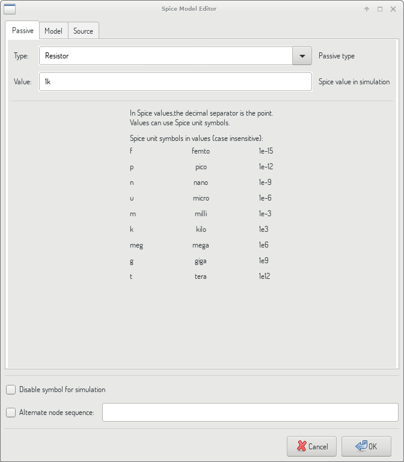
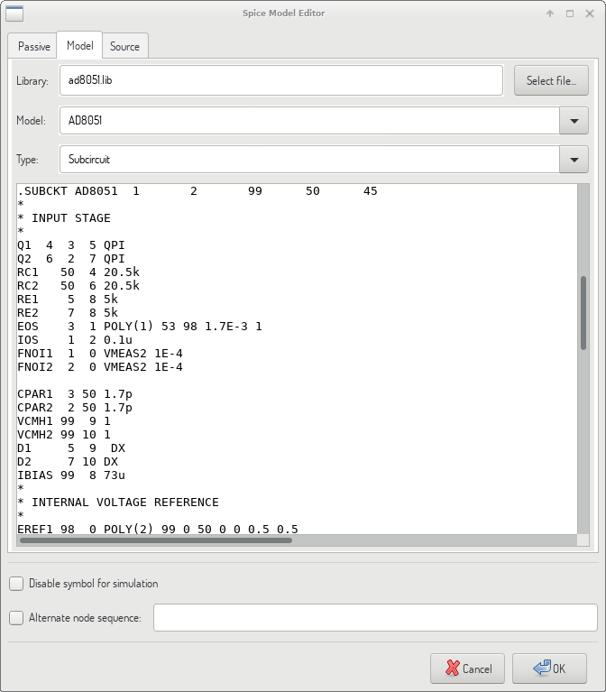
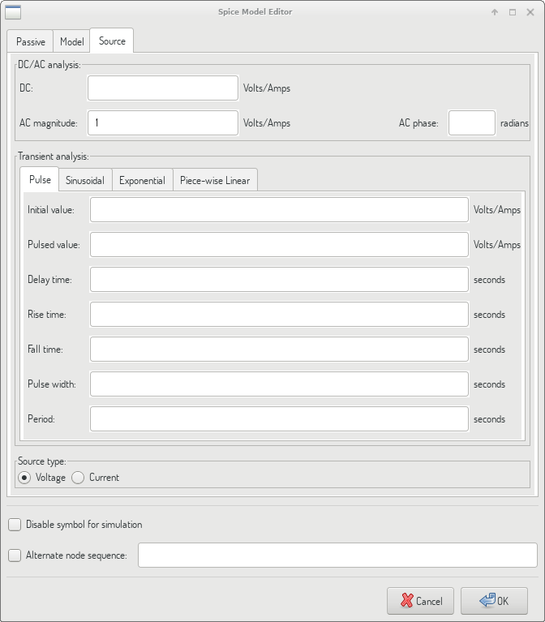
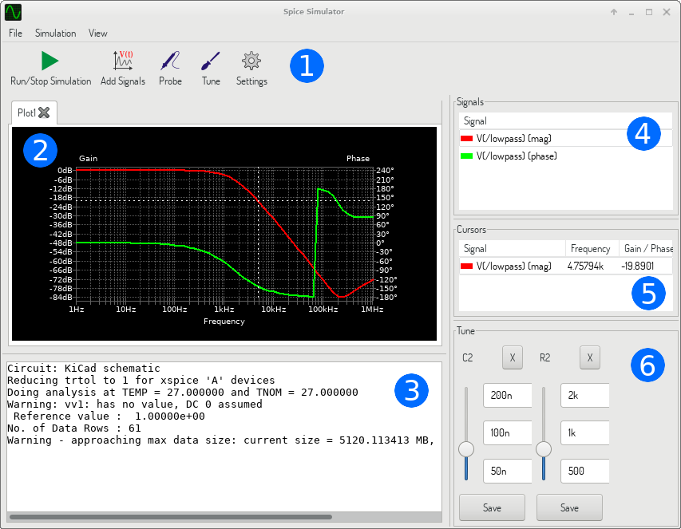
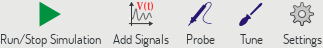
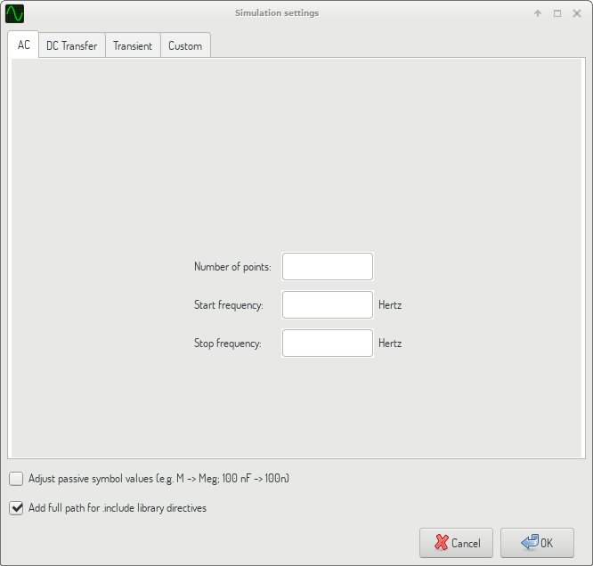

[[simulator]]
== Simulator ==

Eeschema provides an embedded electrical circuit simulator using
http://ngspice.sourceforge.net[ngspice] as the simulation engine.

When working with the simulator, you may find the official _pspice_ library
useful. It contains common symbols used for simulation like voltage/current
sources or transistors with pins numbered to match the ngspice node order
specification.

There are also a few demo projects to illustrate the simulator capabilities.
You will find them in _demos/simulation_ directory.

=== Assigning models

Before a simulation is launched, components need to have Spice model assigned.

Each component can have only one model assigned, even if component
consists of multiple units. In such case, the first unit should have the model
specified.

[[sim-passive-models]] Passive components with reference matching a device
type in Spice notation (_R*_ for resistors, _C*_ for capacitors, _L*_ for
inductors) will have models assigned implicitly and use the value field to
determine their properties.

[NOTE]
Keep in mind that in Spice notation 'M' stands for milli and 'Meg' corresponds
to mega. If you prefer to use 'M' to indicate mega prefix, you may request
doing so in the <<sim-settings, simulation settings dialog>>.

Spice model information is stored as text in symbol fields, therefore you may
either define it in symbol editor or schematics editor. Open symbol properties
dialog and click on _Edit Spice Model_ button to open Spice Model Editor dialog.

Spice Model Editor dialog has three tabs corresponding to different model types.
There are two options common to all model types:

[width="90%",cols="30%a,70%a",]
|====
|Disable symbol for simulation
|When checked the component is excluded from simulation.
|Alternate node sequence
|Allows one to override symbol pin to model node mapping.
To define a different mapping, specify pin numbers in order expected by the model.

'Example:' +
____
`* connections:` +
`* 1: non-inverting input` +
`* 2: inverting input` +
`* 3: positive power supply` +
`* 4: negative power supply` +
`* 5: output` +
`.subckt tl071 1 2 3 4 5`
____

image::images/opamp_symbol.png[alt="Generic operational amplifier symbol"]

To match the symbol pins to the Spice model nodes shown above, one needs to use
an alternate node sequence option with value: "1{nbsp}3{nbsp}5{nbsp}2{nbsp}4".
It is a list of pin numbers corresponding to the Spice model nodes order.
|====

==== Passive

_Passive_ tab allows the user to assign a passive device model (resistor, capacitor or
inductor) to a component. It is a rarely used option, as normally passive components
have models assigned <<sim-passive-models,implicitly>>, unless component reference
does not match the actual device type.

[NOTE]
Explicitly defined passive device models have priority over the ones assigned
implicitly. It means that once a passive device model is assigned, the reference
and value fields are not taken into account during simulation. It may lead to a
confusing situation when assigned model value does not match the one displayed
on a schematic sheet.

[width="90%",cols="30%a,70%a",]
|====
|Type
|Selects the device type (resistor, capacitor or inductor).
|Value
|Defines the device property (resistance, capacitance or inductance). The value
may use common Spice unit prefixes (as listed below the text input field) and
should use point as the decimal separator. Note that Spice does not correctly
interpret prefixes intertwined in the value (e.g. 1k5).
|====

==== Model

_Model_ tab is used to assign a semiconductor or a complex model defined in an
external library file. Spice model libraries are often offered by device
manufacturers.

The main text widget displays the selected library file contents. It is a common
practice to put models description inside library files, including the node order.

[width="90%",cols="30%a,70%a",]
|====================
|File
|Path to a Spice library file. This file is going to be used by the simulator,
as it is added using _.include_ directive.
|Model
|Selected device model. When a file is selected, the list is filled with available
models to choose from.
|Type
|Selects model type (subcircuit, BJT, MOSFET or diode). Normally it is set
automatically when a model is selected.
|====================

==== Source

_Source_ tab is used to assign a power or signal source model. There are two
sections: _DC/AC analysis_ and _Transient analysis_. Each defines source
parameters for the corresponding simulation type.

_Source type_ option applies to all simulation types.

Refer to the
http://ngspice.sourceforge.net/docs/ngspice-27-manual.pdf[ngspice
documentation], chapter 4 (Voltage and Current Sources) for more details about
sources.

[[sim-directives]]
=== Spice directives

It is possible to add Spice directives by placing them in text fields on a
schematic sheet. This approach is convenient for defining the default
simulation type. This functionality is limited to Spice directives starting
with a dot (e.g. ".tran 10n 1m"), it is not possible to place additional
components using text fields.

=== Simulation

To launch a simulation, open _Spice Simulator_ dialog by selecting menu
_Tools->Simulator_ in the schematics editor window.

The dialog is divided into several sections:

* <<sim-toolbar,Toolbar>>
* <<sim-plot-panel,Plot panel>>
* <<sim-output-console,Output console>>
* <<sim-signals-list,Signals list>>
* <<sim-cursors-list,Cursors list>>
* <<sim-tune-panel,Tune panel>>

==== Menu

[[sim-menu-file]]
===== File
[width="90%",cols="30%,70%",]
|====
|New Plot | Create a new tab in the plot panel.
|Open Workbook | Open a list of plotted signals.
|Save Workbook | Save a list of plotted signals.
|Save as image | Export the active plot to a .png file.
|Save as .csv file | Export the active plot raw data points to a .csv file.
|Exit Simulation | Close the dialog.
|====

[[sim-menu-simulation]]
===== Simulation
[width="90%",cols="30%,70%",]
|====
|Run Simulation | Perform a simulation using the current settings.
|Add signals... | Open a dialog to select signals to be plotted.
|Probe from schematics | Start the schematics <<sim-probe-tool,Probe>> tool.
|Tune component value | Start the <<sim-tuner-tool,Tuner>> tool.
|Show SPICE Netlist... | Open a dialog showing the generated netlist for the
simulated circuit.
|Settings... | Open the <<sim-settings,simulation settings dialog>>.
|====

[[sim-menu-view]]
===== View
[width="90%",cols="30%,70%",]
|====
|Zoom In | Zoom in the active plot.
|Zoom Out | Zoom out the active plot.
|Fit on Screen | Adjust the zoom setting to display all plots.
|Show grid | Toggle grid visibility.
|Show legend | Toggle plot legend visibility.
|====

[[sim-toolbar]]
==== Toolbar

The top toolbar provides access to the most frequently performed actions.

[width="90%",cols="30%,70%",]
|====
|Run/Stop Simulation | Start or stop the simulation.
|Add Signals | Open a dialog to select signals to be plotted.
|Probe | Start the schematics <<sim-probe-tool,Probe>> tool.
|Tune | Start the <<sim-tuner-tool,Tuner>> tool.
|Settings | Open the <<sim-settings,simulation settings dialog>>.
|====

[[sim-plot-panel]]
==== Plot panel
Visualizes the simulation results as plots. One can have multiple plots opened
in separate tabs, but only the active one is updated when a simulation is
executed. This way it is possible to compare simulation results for different
runs.

Plots might be customized by toggling grid and legend visibility using
<<sim-menu-view,View>> menu. When a legend is visible, it can be dragged to
change its position.

Plot panel interaction:

* scroll mouse wheel to zoom in/out
* right click to open a context menu to adjust the view
* draw a selection rectangle to zoom in the selected area
* drag a cursor to change its coordinates

[[sim-output-console]]
==== Output console
Output console displays messages from the simulator. It is advised to check
the console output to verify there are no errors or warnings.

[[sim-signals-list]]
==== Signals list
Shows the list of signals displayed in the active plot.

Signals list interaction:

* right click to open a context menu to hide signal or toggle cursor
* double click to hide signal

[[sim-cursors-list]]
==== Cursors list
Shows the list of cursors and their coordinates. Each signal may have one
cursor displayed. Cursors visibility is set using the
<<sim-signals-list,Signals>> list.

[[sim-tune-panel]]
==== Tune panel
Displays components picked with the <<sim-tuner-tool,Tuner>> tool. Tune panel
allows the user to quickly modify component values and observe their influence
on the simulation results - every time a component value is changed, the
simulation is rerun and plots are updated.

For each component there a few controls associated:

* The top text field sets the maximum component value.
* The middle text field sets the actual component value.
* The bottom text field sets the minimum component value.
* Slider allows the user to modify the component value in a smooth way.
* _Save_ button modifies component value on the schematics to the one
  selected with the slider.
* _X_ button removes component from the Tune panel and restores its original
  value.

The three text fields recognize Spice unit prefixes.

[[sim-tuner-tool]]
==== Tuner tool
Tuner tool lets the user pick components for tuning.

To select a component for tuning, click on one in the schematics editor when
the tool is active. Selected components will appear in the
<<sim-tune-panel,Tune>> panel. Only passive components might be tuned.

[[sim-probe-tool]]
==== Probe tool
Probe tool provides an user-friendly way of selecting signals for plotting.

To add a signal to plot, click on a corresponding wire in the schematics
editor when the tool is active.

[[sim-settings]]
==== Simulation settings

Simulation settings dialog lets the user set the simulation type and
parameters. There are four tabs:

* AC
* DC Transfer
* Transient
* Custom

The first three tabs provide forms where simulation parameters might be
specified. The last tab allows the user to type in custom Spice directives to
set up a simulation. You can find more information about simulation types and
parameters in the
http://ngspice.sourceforge.net/docs/ngspice-27-manual.pdf[ngspice
documentation], chapter 1.2.

An alternative way to configure a simulation is to type <<sim-directives,Spice
directives>> into text fields on schematics. Any text field directives
related to simulation type are overridden by the settings selected
in the dialog. It means that once you start using the simulation dialog, the
dialog overriddes the schematics directives until the simulator is reopened.

There are two options common to all simulation types:
[width="90%",cols="30%,70%",]
|====
|Adjust passive symbol values | Replace passive symbol values to convert common
component values notation to Spice notation.
|Add full path for .include library directives | Prepend Spice model library
file names with full path. Normally full path is required by ngspice to access
a library file.
|====
