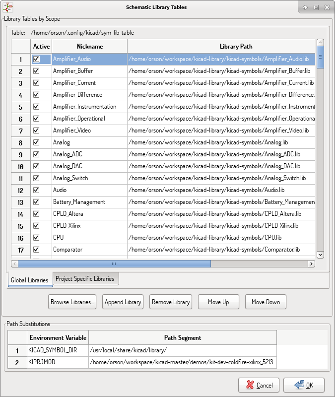

== Manage Symbol Libraries

Symbol libraries hold collections of symbols used when creating schematics. Each symbol
in a schematic is uniquely identified by a full name that is composed of a library nickname
and a symbol name. An example is `Audio:AD1853`.

=== Symbol Library Table

The symbol library table holds a list of all library files KiCad knows about.
The symbol library table is constructed from the global symbol library table
file and the project specific symbol library table file.

When a symbol is loaded, Eeschema uses the library nickname, `Audio` in our example, to lookup
the library location in the symbol library table.

The image below shows the symbol library table editing dialog which
can be opened by invoking the ``Manage Symbol Library Tables'' entry
in the ``Preferences'' menu.

==== Global Symbol Library Table

The global symbol library table contains the list of libraries that are
always available regardless of the currently loaded project file. The
table is saved in the file sym-lib-table in the user's home folder. The
location of this folder is dependent upon the operating system being used.

==== Project Specific Symbol Library Table

The project specific symbol library table contains the list of
libraries that are available specifically for the currently loaded
project file. The project specific symbol library table can only be
edited when it is loaded along with the project file. If no project
file is loaded or there is no symbol library table file in the current
project path, an empty table is created which can be edited and
later saved along with the project file.

==== Initial Configuration

The first time Eeschema is run and the global symbol table file
*sym-lib-table* is not found in the user's home folder, Eeschema
will attempt to copy the default symbol table file sym-lib-table
stored in the system's KiCad template folder to the file sym-lib-table
in the user's home folder. If the default template sym-lib-table
file cannot be found, a dialog will prompt for an alternate location
for the sym-lib-table file. If no sym-lib-table is found or the dialog
is dismissed, an empty symbol library table will be created in the
user's home folder. If this happens, the user can either copy
sym-lib-table manually or configure the table by hand.

[NOTE]
====
The default symbol library table includes all of the symbol libraries
that are installed as part of KiCad.  This may or may not be desirable
depending on usages and the speed of the system.  The amount of time
required to load the symbol libraries is proportional to the number
of libraries in the symbol library table.  If symbol library load times
are excessive, remove rarely and/or never used libraries from the global
library table and add them to the project library table as required.
====

==== Adding Table Entries

In order to use a symbol library, it must first be added to either
the global table or the project specific table. The project specific
table is only applicable when you have a project file open.

*Each library entry must have a unique nickname.*

This does not have to be related in any way to the actual library file
name or path. The colon ':'  and '/' characters cannot be used anywhere
in the library nickname. Each library entry must have a valid path and/or
file name depending on the type of library. Paths can be defined as absolute,
relative, or by environment variable substitution (see section below).

The appropriate plug in type must be selected in order for the library
to be properly read. KiCad currently supports only legacy symbol library
files plug-in.

There is also a description field to add a description of the library
entry. The option field is not used at this time so adding options will
have no effect when loading libraries.

- Please note that you cannot have duplicate library nicknames in the
  same table. However, you can have duplicate library nicknames in both
  the global and project specific symbol library table.
- The project specific table entry will take precedence over the global
  table entry when duplicate nicknames occur.
- When entries are defined in the project specific table, a sym-lib-table
  file containing the entries will be written into the folder of the currently
  open project file.

==== Environment Variable Substitution

One of the most powerful features of the symbol library table is
environment variable substitution. This allows for definition of
custom paths to where symbol libraries are stored in environment
variables. Environment variable substitution is supported by using
the syntax +$\{ENV_VAR_NAME\}+ in the library path.

By default, at run time KiCad defines **two environment variables**:

* the *+KIPRJMOD+* environment variable that always points to the
  currently open project directory.  *+KIPRJMOD+* cannot be modified.

* the *+KICAD_SYMBOL_DIR+* environment variable. This points to the path
  where the default symbol libraries that were installed with KiCad.

You can override +KICAD_SYMBOL_DIR+ by defining it yourself in preferences/
Configure Path which allows you to substitute your own libraries in place of
the default KiCad symbol libraries.

*+KIPRJMOD+* allows you to store libraries in the project path without
having to define the absolute path (which is not always known) to the
library in the project specific symbol library table.

==== Usage Patterns

Symbol libraries can be defined either globally or specifically to
the currently loaded project. Symbol libraries defined in the user's
global table are always available and are stored in the sym-lib-table
file in the user's home folder. The project specific symbol library
table is active only for the currently open project file.

There are advantages and disadvantages to each method. Defining all
libraries in the global table means they will always be available when
needed. The disadvantage of this is that load time will increase.

Defining all symbol libraries on a project specific basis means that
you only have the libraries required for the project which decreases
symbol library load times. The disadvantage is that you always have
to remember to add each symbol library that you need for every
project.

One usage pattern would be to define commonly used libraries globally
and the libraries only required for the project in the project specific
library table. There is no restriction on how to define libraries.

==== Legacy Project Remapping

When loading a schematic created prior to the symbol library table
implementation, Eeschema will attempt to remap the symbol library
links in the schematic to the appropriate library table symbols.
The success of this process is dependent on several factors:

- the original libraries used in the schematic are still available
  and unchanged from when the symbol was added to the schematic.

- all rescue operations were performed when detected to create a
  rescue library or keep the existing rescue library up to date.

- the integrity of the project symbol cache library has not been
  corrupted.

[WARNING]
====
The remapping will make a back up of all the files that are changed
during remapping in the rescue-backup folder in the project folder.
Always make a back up of your project before remapping just in case
something goes wrong.
====

[WARNING]
====
The rescue operation is performed even if it has been disabled to
ensure the correct symbols are available for remapping.  Do not
cancel this operation or the remapping will fail to correctly
remap schematics symbols.  Any broken symbol links will have to
be fixed manually.
====

[NOTE]
====
If the original libraries have been removed and the rescue was not
performed, the cache library can be used as a recovery library as a
last resort. Copy the cache library to a new file name and add the
new library file to the top of the library list using a version of
Eeschema prior to the symbol library table implementation.
====
