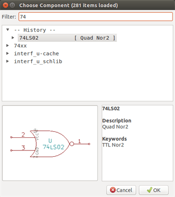
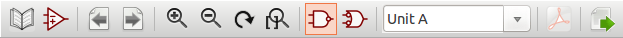
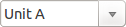

[[viewlib]]
== Viewlib

=== Introduction

Viewlib allows you to quickly examine the content of libraries. Viewlib
is called by the tool
image:images/icons/library_browse.png[icons/library_browse_png]
or by the "place component" tool available from the right-hand side
toolbar.

[[viewlib---main-screen]]
=== Viewlib - main screen

image::images/eeschema_viewlib_select_library.png[alt="eeschema_viewlib_select_library_png",scaledwidth="95%"]

To examine the library content you need to select the wanted library
from the list on the left-hand side. Available components will then
appear in the second list which allow you to select a component.

image::images/eeschema_viewlib_select_component.png[alt="eeschema_viewlib_select_component_png",scaledwidth="95%"]

[[viewlib-top-toolbar]]
=== Viewlib top toolbar

The top tool bar in Viewlib is shown below.

The available commands are.

[width="100%",cols="20%,80%",]
|=======================================================================
|image:images/icons/library.png[icons/library_png]
|Selection of the desired library which can be also selected in the
displayed list.

|
|Selection of the component which can be also selected in the displayed
list.

|image:images/icons/lib_previous.png[icons/lib_previous_png]
|Display previous component.

|image:images/icons/lib_next.png[icons/lib_next_png]
|Display next component.

|image:images/icons/zoom_in.png[] image:images/icons/zoom_out.png[]
image:images/icons/zoom_redraw.png[] image:images/icons/zoom_fit_in_page.png[]
|Zoom tools.

|image:images/icons/morgan1.png[] image:images/icons/morgan2.png[]
|Selection of the representation (normal or converted) if exist.

|
|Selection of the part, only for multi-part components.

|image:images/icons/datasheet.png[icons/datasheet_png]
|If it exist, display the associated documents. Exists only when called
by the place component dialog frame from Eeschema.

|image:images/icons/export.png[icons/export_png]
|Close Viewlib and place the selected component in Eeschema.
This icon is only displayed when Viewlib has been called from Eeschema (click on a symbol in the component chooser).
|=======================================================================
