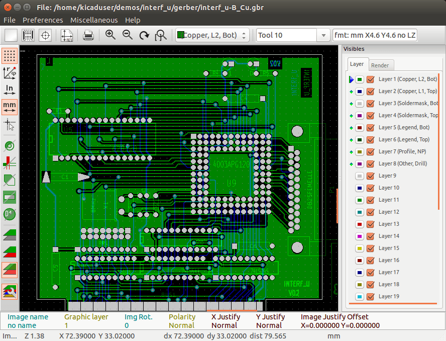
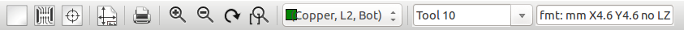
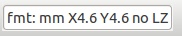
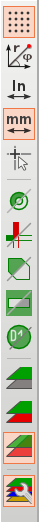
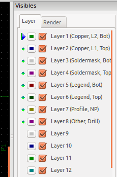
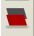
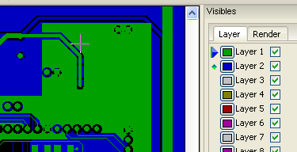

:author: The KiCad Team
:doctype: article
:toc:
:ascii-ids:

= GerbView

_Reference manual_

[[copyright]]
*Copyright*

This document is Copyright (C) 2010-2015 by it's contributors as listed
below. You may distribute it and/or modify it under the terms of either
the GNU General Public License (http://www.gnu.org/licenses/gpl.html),
version 3 or later, or the Creative Commons Attribution License
(http://creativecommons.org/licenses/by/3.0/), version 3.0 or later.

All trademarks within this guide belong to their legitimate owners.

[[contributors]]
*Contributors*

The KiCad Team.

[[feedback]]
*Feedback*

Please direct any comments or suggestions about this document to the
KiCad mailing list: _https://launchpad.net/~kicad-developers_

[[publication_date_and_software_version]]
*Publication date and software version*

Published on February 14, 2015.

//Since docbook "article" is more compact, I have to separate this page
<<<<

== Introduction to GerbView

GerbView is a Gerber file viewer (RS 274 X format), and is also able
to display drill files from Pcbnew (in Excellon format).

It accepts up to 32 files (Gerber and/or Drill files)

Files can be displayed using a transparency mode or stacked mode.

For more information about the Gerber file format please have a read
at the specification in
http://www.ucamco.com/files/downloads/file/81/the_gerber_file_format_specification.pdf[The Gerber File Format Specification - Ucamco].

== Main Screen

== Upper toolbar

[width="100%",cols="41%,59%",]
|=======================================================================
|image:images/02300000024FBC55C9F.png[02300000024FBC55C9F_png]
|Clear all layers

|image:images/0200000002457CCFCE9.png[0200000002457CCFCE9_png]
|Load Gerber files

|image:images/02100000024EB14912C.png[02100000024EB14912C_png]
|Load drill files (Excellon format from Pcbnew)

|image:images/02200000024BE5ADAA7.png[02200000024BE5ADAA7_png]
|Set page size for printing and show/hide page limits

|image:images/02400000024A913E3D7.png[02400000024A913E3D7_png]
|Open print dialog

|image:images/045000000244408D83B.png[045000000244408D83B_png]
|Zoom in and out

|image:images/01F00000024DD76E9AF.png[01F00000024DD76E9AF_png]
|Refresh screen

|image:images/0220000002491A62928.png[0220000002491A62928_png]
|Zoom fit in page

|image:images/09900000024E535CABE.png[09900000024E535CABE_png]
|Layer selection

|image:images/098000000245059DA89.png[098000000245059DA89_png]
|D Code selection (hight light items that use this dcode)

|
|Info about Gerber file options loaded in the current layer
|=======================================================================

== Left toolbar

=== Options

[width="100%",cols="5%,5%,90%",]
|=======================================================================
.10+^.^|
|image:images/0230000002297132A4B.png[0230000002297132A4B_png]
|Grid on / off

|image:images/02200000024A5DABF2F.png[02200000024A5DABF2F_png]
|Display polar coordinates on / off

|image:images/02200000040EBBD93BF.png[02200000040EBBD93BF_png]
|Units selection to display coordinates

|image:images/02200000021210A7A5E.png[02200000021210A7A5E_png]
|On grid cursor shape selection

|image:images/0220000002219346E01.png[0220000002219346E01_png]
|Display mode selection (solid or outlines) for flashed items

|image:images/02200000021B60BCA1E.png[02200000021B60BCA1E_png]
|Display mode selection (solid or outlines) for lines

|image:images/022000000210325F1DA.png[022000000210325F1DA_png]
|Display mode selection (solid or outlines) for polygons

|image:images/022000000227C688616.png[022000000227C688616_png]
|Show / hide D Codes values (for items using a dcode)

|image:images/02200000064732E80FB.png[02200000064732E80FB_png]
|Mode used by Gerbview to show layers.

|image:images/02100000024D9139755.png[02100000024D9139755_png]
|Show / hide the layer manager

|=======================================================================

=== Layer Manager

[width="100%",cols="31%,69%",]
|=======================================================================
|
|The layer manager has 2 purposes:

* Select the active layer
* Show/hide layers

The active layer is drawn after the other layers.

When loading a new file, the active layer is used (the new data replace
the previous data)

Note:

* Mouse left click on a line: select the active layer
* Mouse right click on the layer manager: show/hide all layers
* Mouse middle click on a icon: select the layer color.

|=======================================================================

=== Modes to show Gerber layers

[width="100%",cols="5%,35%,60%",]
|=======================================================================
|
|*Raw* mode.

Each gerber file and each item in files are drawn in the order files are
loaded.

However the *active layer* is draw last.

When Gerber files have negative items (drawn in black) artefacts are
visible on already drawn layers

|image:images/1E300000128112D054B.png[1E300000128112D054B_png]

|image:images/0220000001F3490EB21.png[0220000001F3490EB21_png]
|*Stacked* mode.

Each gerber file is drawn in the order files are loaded.

The *active layer* is draw last.

When Gerber files have negative items (drawn in black) there are no
artefacts on already drawn layers, because this mode draws each file in
a local buffer before it is shown on screen. Negative items do not create
artefacts.

|image:images/1E300000128112D054B.png[1E300000128112D054B_png]

|image:images/02200000020BC136BD9.png[02200000020BC136BD9_png]
|Transparency mode
|image:images/1E5000001173F9F077E.png[1E5000001173F9F077E_png]
|=======================================================================

=== Effect of layer selection for drawings

This effect is visible only in raw or stacked mode.

[width="100%",cols="43%,57%",]
|=======================================================================
|
|The layer 1 (green layer) is drawn after the layer 2

|image:images/1AC000000DFCC4C960B.png[1AC000000DFCC4C960B_png]
|The layer 2 (blue layer) is drawn after the layer 1
|=======================================================================

== Print layers

=== Print dialog access

To print layers, use the
image:images/02400000024A913E3D7.png[02400000024A913E3D7_png]
tool, or the main menu (files)

=== Caution

But be sure items are inside the printable area (select by
image:images/02200000024BE5ADAA7.png[02200000024BE5ADAA7_png]
a suitable page format).

Do not forget photoplotters can use a large plottable area, much bigger than the page
sizes used by printers)

Moving (by block move command) the entire layers is often needed.

=== Move block command

You can move items by selecting them (drag the mouse with left button down) and then
moving the selected area on screen.

Click the left button to finally place the area you are moving.

== Commands in menu bar

=== Menu Files

image:images/gerbview-file-menu.png[gerbview-file-menu_png]

It is possible to load gerber and drill files into Gerbview. There is
also an auxiliary option to export gerbers to pcbnew. Previously (a long
time ago) it was also possible to load so called Dcodes, but those are
now obsolete and is therefore not possible anymore.

=== Export to Pcbnew

GerbView has a limited capability to export Gerber files to Pcbnew.

The final result depends on what features of RS 274 X format are used in
Gerber Files.

RS 274 X format has raster oriented features that cannot be converted
(mainly all features relative to negative objects).

Flashed items are converted to vias.

Lines items are converted to track segments (or graphic lines for non
copper layers)

So the usability of the converted file is very dependent upon the way
each Gerber file was built by the original Pcb tool.

=== Preference menu

image:images/0A1000000964D11366E.png[0A1000000964D11366E_png]

Gives access to the hot keys editor, and some options to display items.

=== Miscellaneous menu

image:images/07C000000A353743B55.png[07C000000A353743B55_png]

* List Dcodes shows the Dcodes in use and some of Dcode parameters.
* Show Source displays the Gerber file contents of the active layer in a
  text editor.
* Clear Layer erases the contents of the active layer.

