:author: The KiCad Team
:doctype: article
:toc:
:ascii-ids:

= GerbView

_Reference manual_

[[copyright]]
*Copyright*

This document is Copyright (C) 2010-2018 by it's contributors as listed
below. You may distribute it and/or modify it under the terms of either
the GNU General Public License (https://www.gnu.org/licenses/gpl.html),
version 3 or later, or the Creative Commons Attribution License
(https://creativecommons.org/licenses/by/3.0/), version 3.0 or later.

All trademarks within this guide belong to their legitimate owners.

[[contributors]]
*Contributors*

The KiCad Team.

[[feedback]]
*Feedback*

Please direct any bug reports, suggestions or new versions to here:

- About KiCad document: https://github.com/KiCad/kicad-doc/issues

- About KiCad software: https://bugs.launchpad.net/kicad

- About KiCad software i18n: https://github.com/KiCad/kicad-i18n/issues

[[version_info]]
*Version info*

include::../../version_info.txt[]

//Since docbook "article" is more compact, I have to separate this page
<<<<

== Introduction to GerbView

GerbView is a Gerber file (RS-274X format) and Excellon drill file
viewer. Up to 32 files can be displayed at once.

For more information about the Gerber file format please read
http://www.ucamco.com/files/downloads/file/81/the_gerber_file_format_specification.pdf[the Gerber File Format Specification].
Details about drill file format can be found at
http://web.archive.org/web/20071030075236/http://www.excellon.com/manuals/program.htm[the Excellon format description].

== Interface

=== Main window

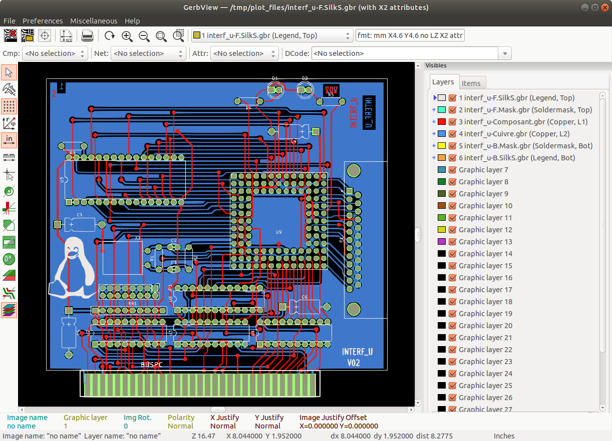

<<<<<

=== Top toolbar

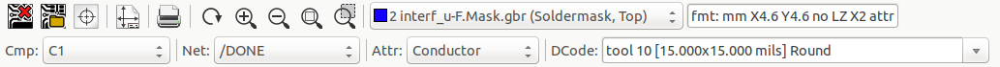

[width="100%",cols="41%,59%",]
|=======================================================================
|
|Clear all layers

|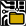
|Load Gerber files

|
|Load Excellon drill files

|image:images/icons/sheetset.png[sheetset_png]
|Set page size

|image:images/icons/print_button.png[print_button_png]
|Print

|
|Redraw view

| 
|Zoom in or out

|image:images/icons/zoom_fit_in_page.png[zoom_fit_in_page_png]
|Zoom auto (zoom fit)

|
|Zoom to selection

|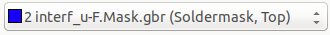
|Select active layer

|image:images/gerbview_top_info.png[scaledwidth="70%",alt="gerbview_top_info_png"]
|Display info about active layer

|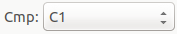
|Highlight items belonging to selected component (Gerber X2)

|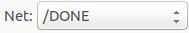
|Highlight items belonging to selected net (Gerber X2)

|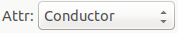
|Highlight items with the selected attribute (Gerber X2)

|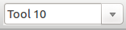
|Highlight items of selected D Code on the active layer
|=======================================================================

<<<<<

=== Left toolbar

[width="100%",cols="10%,5%,85%",]
|=======================================================================
.14+^.^|
|
|Select items

|
|Measure between two points

|
|Toggle grid visibility

|image:images/icons/polar_coord.png[polar_coord_png]
|Toggle polar coordinates display

|image:images/icons/unit_inch.png[unit_inch_png] 
|Select inch or millimeter units

|image:images/icons/cursor_shape.png[cursor_shape_png]
|Toggle full-screen cursor

|
|Display flashed items in sketch (outline) mode

|image:images/icons/track_sketch.png[track_sketch_png]
|Display lines in sketch (outline) mode

|
|Display polygons in sketch (outline) mode

|image:images/icons/gerbview_show_negative_objects.png[gerbview_show_negative_objects_png]
|Show negative objects in ghost color

|image:images/icons/show_dcodenumber.png[show_dcodenumber_png]
|Show/hide D Codes

|image:images/icons/gbr_select_mode2.png[gbr_select_mode2_png]
|Display layers in diff(compare) mode

|
|Display current layer in high-contrast mode

|
|Show/hide layer manager

|=======================================================================

<<<<<

=== Layers Manager

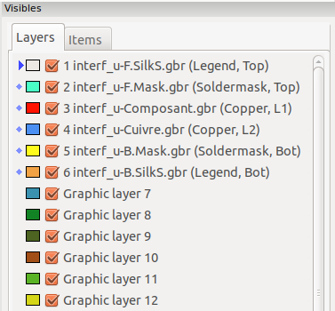

The Layers Manager controls and displays visibility of all layers. An arrow
indicates the active layer, and each layer can be shown or hidden with
the checkboxes.

Mouse button assignments:

* Left click: select the active layer
* Right click: show/hide/sort layers options
* Middle click or double click (on color swatch): select the layer color

The Layers tab allows you to control the visibility and color of all loaded
Gerber and drill layers.  The Items tab allows you to control the color and
display of the grid, D Codes, and negative objects.

== Commands in menu bar

=== File menu

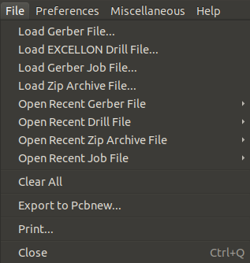

* *Export to Pcbnew* is a limited capability to export Gerber files into
  Pcbnew. The final result depends on what features of the RS-274X format
  are used in the original Gerber files: rasterized items cannot be converted
  (typically negative objects), flashed items are converted to vias, lines are
  converted to track segments (or graphic lines for non-copper layers).

=== Preferences menu

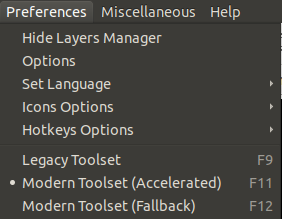

==== Toolsets

GerbView now supports the modern graphics toolset that is available in PcbNew.
Enabling the modern toolset brings new features and better performance.  You can
select which toolset to use in the preferences menu.  Using the Modern (Accelerated)
toolset is recommended if your graphics card supports it (requires OpenGL 2.0).
If your graphics card does not support the Accelerated toolset, you can still use
the new features by selecting the Modern (Fallback) toolset.

Using the Legacy toolset is only recommended if you notice that the Modern
toolset does not support a feature you need or if it does not render a Gerber
file correctly.  If you notice such a problem, please notify the KiCad developers
so that it can be fixed in a future release.

The Legacy toolset will be removed in a future version of GerbView.

=== Miscellaneous menu

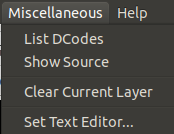

* *List DCodes* shows the D Code information for all layers.
* *Show Source* displays the Gerber file contents of the active layer in a
  text editor.
* *Clear Current Layer* erases the contents of the active layer.
* *Set Text Editor...* allows you to choose which program to show source with.

== Display modes

GerbView has three display modes which are useful for different
situations or requirements.

NOTE: Stacked mode and Transparency mode provide a better graphical
experience, but may be slower then Raw mode on some computers.

=== Raw mode

This mode is selected by
.
Each file and each item in the file are drawn in the order files are
loaded. However, the active layer is drawn last.

When Gerber files have negative items (drawn in black), artifacts may be
visible on already-drawn layers.

image::images/gerbview_mode_raw_stack.png[scaledwidth="60%",alt="gerbview_mode_raw_stack_png"]

=== Stacked mode

Invoked by image:images/icons/gbr_select_mode1.png[gbr_select_mode1_png],
each file is drawn in the order files are loaded. Again, the active
layer is drawn last.

When Gerber files have negative items (drawn in black) there are no
artifacts on already-drawn layers because this mode draws each file in
a local buffer before it is shown on screen.

image::images/gerbview_mode_raw_stack.png[scaledwidth="60%",alt="gerbview_mode_raw_stack_png"]

=== Transparency mode

Use image:images/icons/gbr_select_mode2.png[gbr_select_mode2_png] to display in this
mode, where no artifacts are present and layers are blended together with the active
layer on top.

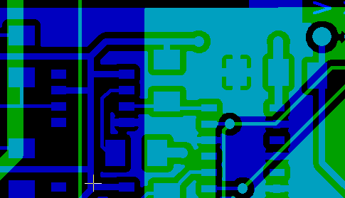

=== Layer occlusion

In raw or stacked mode, the active layer will be on top of other layers
and hide items below it.

Here, layer 1 (green) is the active layer (note the triangle next to it)
and so it is drawn on top of layer 2 (blue):

image::images/gerbview_layer_select_1.png[scaledwidth="60%",alt="gerbview_layer_select_1_png"]

Making layer 2 (blue) the active layer brings it to the top:

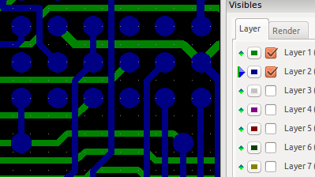

== Moving items

When using the legacy toolset, items may be selected by holding down the left
mouse button and drawing a rectangle. Releasing the button picks up the items.
A click of the left mouse button places the items.

This behavior is deprecated and not available in the modern toolsets.

== Printing

To print layers, use the
image:images/icons/print_button.png[print_button_png]
icon or the *File -> Print* menu.

[CAUTION]
========================================
Be sure items are inside the printable area. Use
image:images/icons/sheetset.png[sheetset_png] to select a
suitable page format.

Note that many photoplotters support a large plottable area, much
bigger than the page sizes used by most printers. Moving the entire
layer set may be required.

========================================
