:author: The KiCad Team
:doctype: book
:toc:
:ascii-ids:

= Getting Started in KiCad

_Essential and concise guide to mastering KiCad for the successful
development of sophisticated electronic printed circuit boards._

[[copyright]]
*Copyright*

This document is Copyright (C) 2010-2018 by its contributors as listed
below. You may distribute it and/or modify it under the terms of either
the GNU General Public License (http://www.gnu.org/licenses/gpl.html),
version 3 or later, or the Creative Commons Attribution License
(http://creativecommons.org/licenses/by/3.0/), version 3.0 or later.

All trademarks within this guide belong to their legitimate owners.

[[contributors]]
*Contributors*

David Jahshan, Phil Hutchinson, Fabrizio Tappero, Christina Jarron, Melroy van den Berg.

[[feedback]]
*Feedback*

Please direct any bug reports, suggestions or new versions to here:

- About KiCad document: https://github.com/KiCad/kicad-doc/issues

- About KiCad software: https://bugs.launchpad.net/kicad

- About KiCad software internationalization (i18n): https://github.com/KiCad/kicad-i18n/issues

[[publication_date]]
*Publication date*

2015, May 16.

[[introduction-to-kicad]]
== Introduction to KiCad

KiCad is an open-source software tool for the creation of electronic
schematic diagrams and PCB artwork. Beneath its singular surface, KiCad
incorporates an elegant ensemble of the following stand-alone software
tools:

[cols=",,",options="header",]
|===================================
|Program name|Description|File extension
|KiCad |Project manager|+*.pro+
|Eeschema |Schematic and component editor|+*.sch, *.lib, *.net+
|Pcbnew |Circuit board and footprint editor|+*.kicad_pcb, *.kicad_mod+
|GerbView |Gerber and drill file viewer|+\*.g\*, *.drl, etc.+
|Bitmap2Component |Convert bitmap images to components or footprints|+*.lib, *.kicad_mod, *.kicad_wks+
|PCB Calculator |Calculator for components, track width, electrical spacing, color codes, and more...|None
|Pl Editor |Page layout editor|+*.kicad_wks+
|===================================
 
NOTE: The file extension list is not complete and only contains a
subset of the files that KiCad supports. It is useful for the basic
understanding of which files are used for each KiCad application.

KiCad can be considered mature enough to be used
for the successful development and maintenance of complex electronic
boards.

KiCad does not present any board-size limitation and it can easily handle
up to 32 copper layers, up to 14 technical layers and up to 4 auxiliary layers.
KiCad can create all the files necessary for building printed boards,
Gerber files for photo-plotters, drilling files, component location
files and a lot more.

Being open source (GPL licensed), KiCad represents the ideal tool for
projects oriented towards the creation of electronic hardware with an
open-source flavour.

On the Internet, the homepage of KiCad is:

http://www.kicad-pcb.org/

[[download-and-install-kicad]]
=== Downloading and installing KiCad

KiCad runs on GNU/Linux, Apple macOS and Windows.
You can find the most up to date instructions and download links at:

http://www.kicad-pcb.org/download/

IMPORTANT: KiCad stable releases occur periodically per the
http://ci.kicad-pcb.org/job/kicad-doxygen/ws/Documentation/doxygen/html/md_Documentation_development_stable-release-policy.html[KiCad
Stable Release Policy]. New features are continually being added to the
development branch. If you would like to take advantage of these new
features and help out by testing them, please download the latest
nightly build package for your platform. Nightly builds may introduce
bugs such as file corruption, generation of bad Gerbers, etc., but it
is the goal of the KiCad Development Team to keep the development
branch as usable as possible during new feature development.

[[under-linux]]
==== Under GNU/Linux

Stable releases of KiCad can be found in most distribution's package
managers as kicad and kicad-doc. If your distribution does not provide
latest stable version, please follow the instruction for unstable builds
and select and install the latest stable version.

Under Ubuntu, the easiest way to install an unstable nightly build of KiCad is
via _PPA_ and __Aptitude__. Type the following into your Terminal:
__________________________________________________
sudo add-apt-repository ppa:js-reynaud/ppa-kicad

sudo aptitude update && sudo aptitude safe-upgrade

sudo aptitude install kicad kicad-doc-en
__________________________________________________

Under Fedora the easiest way to install an unstable nightly build is via __copr__.
To install KiCad via copr type the following in to copr:
__________________________________________________
sudo dnf copr enable mangelajo/kicad

sudo dnf install kicad
__________________________________________________

Alternatively, you can download and install a pre-compiled version of
KiCad, or directly download the source code, compile and install KiCad.

[[under-apple-os-x]]
==== Under Apple macOS

Stable builds of KiCad for macOS can be found at:
http://downloads.kicad-pcb.org/osx/stable/

Unstable nightly development builds can be found at:
http://downloads.kicad-pcb.org/osx/

[[under-Windows]]
==== Under Windows

Stable builds of KiCad for Windows can be found at:
http://downloads.kicad-pcb.org/windows/stable/

For Windows you can find nightly development builds at:
http://downloads.kicad-pcb.org/windows/

[[support]]
=== Support
If you have ideas, remarks or questions, or if you just need help:

* https://forum.kicad.info/[Visit the forum]
* Join the http://webchat.freenode.net/?channels=kicad[#kicad IRC channel] on Freenode
* http://www.kicad-pcb.org/help/tutorials/[Watch tutorials]

[[kicad-work-flow]]
== KiCad Workflow

Despite its similarities with other PCB design software, KiCad is
characterised by a unique workflow in which schematic components
and footprints are separate. Only after creating a
schematic are footprints assigned to the components.

[[kicad-work-flow-overview]]
=== Overview

The KiCad workflow is comprised of two main tasks: drawing the schematic
and laying out the board. Both a schematic component library and a
PCB footprint library are necessary for these two tasks. KiCad includes
many components and footprints, and also has the tools to create new ones.

In the picture below, you see a flowchart representing the KiCad workflow.
The flowchart explains which steps you need to take, and in which order.
When applicable, the icon is added for convenience.

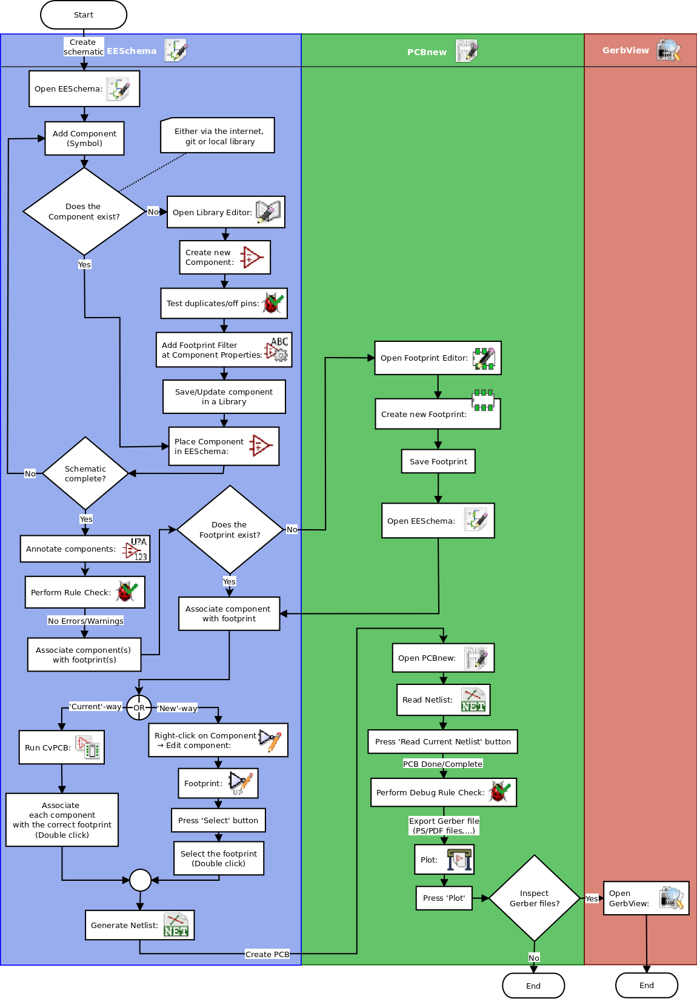

For more information about creating a component, read
<<make-schematic-symbols-in-kicad,Making schematic symbols>>.
And for information about how to create a new footprint, see
<<make-component-footprints,Making component footprints>>.

http://kicad.rohrbacher.net/quicklib.php[Quicklib] is a tool that
allows you to quickly create KiCad library components with a web-based
interface. For more information about Quicklib, refer to
<<make-schematic-components-with-quicklib,Making Schematic Components
With Quicklib>>.

[[forward-and-backward-annotation]]
=== Forward and backward annotation

Once an electronic schematic has been fully drawn, the next step is to
transfer it to a PCB. Often, additional components might need to be
added, parts changed to a different size, net renamed, etc. This can be
done in two ways: Forward Annotation or Backward Annotation.

Forward Annotation is the process of sending schematic information to a
corresponding PCB layout. This is a fundamental feature because you 
must do it at least once to initially import the schematic into the PCB.
Afterwards, forward annotation allows sending incremental schematic
changes to the PCB. Details about Forward Annotation are discussed in
the section <<forward-annotation-in-kicad,Forward Annotation>>.

Backward Annotation is the process of sending a PCB layout change back
to its corresponding schematic. Two common causes for Backward Annotation
are gate swaps and pin swaps. In these situations, there are gates or pins
which are functionally equivalent, but it may only be during layout that
there is a strong case for choosing the exact gate or pin. Once the choice
is made in the PCB, this change is then pushed back to the schematic.

[[using-kicad]]
== Using KiCad

=== Shortcut keys

KiCad has two kinds of related but different shortcut keys: accelerator keys and
hotkeys. Both are used to speed up working in KiCad by using the keyboard instead
of the mouse to change commands.

==== Accelerator keys
Accelerator keys have the same effect as clicking on a menu or toolbar icon:
the command will be entered but nothing will happen until the left mouse button
is clicked. Use an accelerator key when you want to enter a command mode but do not
want any immediate action.

Accelerator keys are shown on the right side of all menu panes:

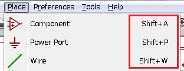

==== Hotkeys
A hotkey is equal to an accelerator key plus a left mouse click. Using a
hotkey starts the command immediately at the current cursor location. Use
a hotkey to quickly change commands without interrupting your workflow.

To view hotkeys within any KiCad tool go to *_Help -> List Hotkeys_*
or press Ctrl+F1:

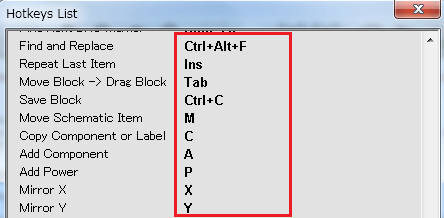

You can edit the assignment of hotkeys, and import or export them, from the
*_Preferences -> Hotkeys Options_* menu.

NOTE: In this document, hotkeys are expressed with brackets like this: [a].
If you see [a], just type the "a" key on the keyboard.

==== Example
Consider the simple example of adding a wire in a schematic.

To use an accelerator key, press "Shift + W" to invoke the "Add wire" command
(note the cursor will change). Next, left click on the desired wire start
location to begin drawing the wire.

With a hotkey, simply press [w] and the wire will immediately start from the
current cursor location.

[[draw-electronic-schematics]]
== Draw electronic schematics

In this section we are going to learn how to draw an electronic
schematic using KiCad.

[[using-eeschema]]
=== Using Eeschema

1.  Under Windows run kicad.exe. Under Linux type 'kicad' in your
    Terminal. You are now in the main window of the KiCad project
    manager.  From here you have access to eight stand-alone software
    tools: __Eeschema__, __Schematic Library Editor__, __Pcbnew__,
    __PCB Footprint Editor__, __GerbView__, __Bitmap2Component__,
    __PCB Calculator__ and __Pl Editor__. Refer to the work-flow chart
    to give you an idea how the main tools are used.
+
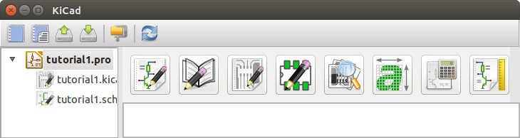

2.  Create a new project: *File* -> **New** -> **Project**.
    Name the project file 'tutorial1'. The project file will automatically
    take the extension ".pro". The exact appearance of the dialog depends
    on the used platform, but there should be a checkbox for creating a new
    directory. Let it stay checked unless you already have a dedicated directory.
    All your project files will be saved there.

3.  Let's begin by creating a schematic. Start the schematic editor
    __Eeschema__, 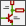. It is the first
    button from the left.

4.  Click on the 'Page Settings' icon
     on the top
    toolbar. Set the appropriate 'paper size' ('A4','8.5x11' etc.)
    and enter the Title as 'Tutorial1'.
    You will see that more information can be entered here if
    necessary. Click OK. This information will populate the schematic
    sheet at the bottom right corner. Use the mouse wheel to zoom in.
    Save the whole schematic: *File* -> **Save**

5.  We will now place our first component. Click on the 'Place
    symbol' icon image:images/icons/add_component.png[Add component Icon]
    in the right toolbar. You may also press the 'Add Symbol' hotkey [a].

6.  Click on the middle of your schematic sheet. A __Choose Symbol__
    window will appear on the screen.
    We're going to place a resistor. Search / filter on the 'R' of
    **R**esistor.
    You may notice the 'Device' heading above the Resistor. This
    'Device' heading is the name of the library where the component is
    located, which is quite a generic and useful library.
+
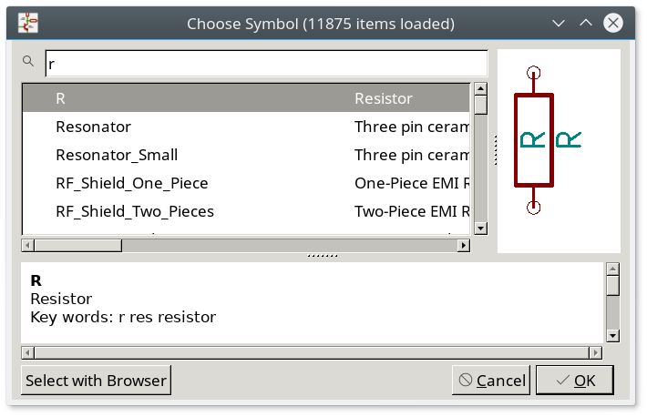

7.  Double click on it. This will close the 'Choose Symbol' window.
    Place the component in the schematic sheet by clicking where you
    want it to be.

8.  Click on the magnifier icon to zoom in on the component.  Alternatively,
    use the mouse wheel to zoom in and zoom out. Press the wheel (central)
    mouse button to pan horizontally and vertically.

9.  Try to hover the mouse over the component 'R' and press [r]. The
    component should rotate. You do not need to actually click on the component
    to rotate it.
+
NOTE: If your mouse was also over the _Field Reference_ ('R') or the _Field
Value_ ('R?'), a menu will appear. You will see the 'Clarify Selection' menu
often in KiCad; it allows working on objects that are on top of each other. In
this case, tell KiCad you want to perform the action on the 'Symbol
...R...'.

10. Right click in the middle of the component and select *Properties* ->
    **Edit Value**. You can achieve the same result by hovering
    over the component and pressing [v]. Alternatively, [e] will
    take you to the more general Properties window. Notice how the right-click
    menu below shows the hotkeys for all available actions.
+
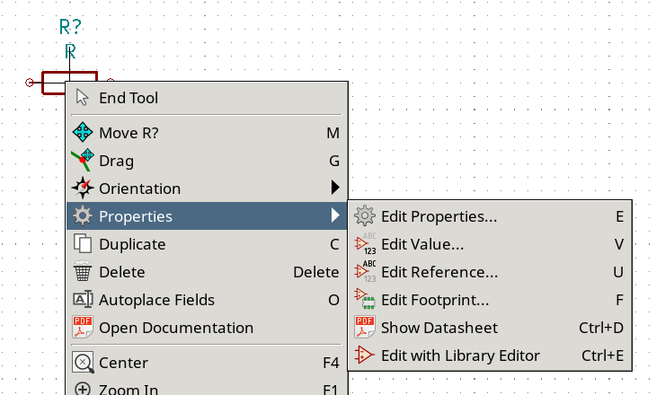

11. The Edit Value Field window will appear. Replace the current value
    'R' with '1 k'. Click OK.
+
NOTE: Do not change the Reference field (R?), this will be done automatically
later on. The value inside the resistor should now be '1 k'.
+
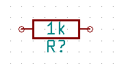

12. To place another resistor, simply click where you want the resistor
    to appear. The symbol selection window will appear again.

13. The resistor you previously chose is now in your history list,
    appearing as 'R'. Click OK and place the component.
+
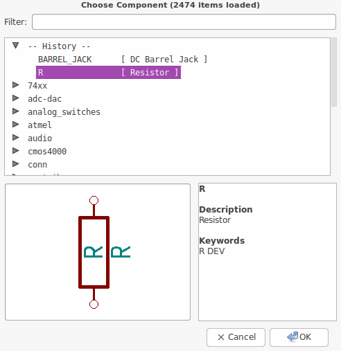

14. In case you make a mistake and want to delete a component, right
    click on the component and click 'Delete'. This will remove
    the component from the schematic. Alternatively, you can hover over the
    component you want to delete and press [Delete].

15. You can also duplicate a component already on your schematic sheet
    by hovering over it and pressing [c]. Click where you want to
    place the new duplicated component.

16. Right click on the second resistor. Select 'Drag'.
    Reposition the component and left click to drop. The same functionality
    can be achieved by hovering over the component and by pressing [g].
    [r] will rotate the component while [x] and [y] will
    flip it about its x- or y-axis.
+
NOTE: *Right-Click* -> *Move* or [m] is also a valuable option
for moving anything around, but it is better to use this only for component
labels and components yet to be connected. We will see later on why this is the case.

17. Edit the second resistor by hovering over it and pressing [v]. Replace
    'R' with '100'. You can undo any of your editing actions with Ctrl+Z.

18. Change the grid size. You have probably noticed that on the
    schematic sheet all components are snapped onto a large pitch grid. You
    can easily change the size of the grid by *Right-Click* -> **Grid**.
    __In general, it is recommended to use a grid of 50.0 mils
    for the schematic sheet__.

19. We are going to add a component from a library that isn't configured in the
    default project. In the menu, choose *Preferences* -> **Manage Symbol Libraries**.
    In the Symbol Libraries window you can see two tabs: Global Libraries and
    Project Specific Libraries. Each one has one sym-lib-table file. For a library
    (.lib file) to be available it must be in one of those sym-lib-table files.
    If you have a library file in your file system and it's not yet available,
    you can add it to either one of the sym-lib-table files with *Browse Libraries*.
    For practise we will now add a library which already is available.

20. You need to find where the official KiCad libraries are installed on your
    computer. Look for a `library` directory containing a hundred of `.dcm` and
    `.lib` files. Try in `C:\Program Files (x86)\KiCad\share\` (Windows) and
    `/usr/share/kicad/library/` (Linux). When you have found the directory,
    choose and add the 'MCU_Microchip_PIC12.lib' library and close the window.
    You will get a warning that the name already exists in the list; add it
    anyways. It will be added to the end of of the list.
    Now click its nickname and change it to 'microchip_pic12mcu'.
    Close the Symbol Libraries window with OK.

21. Repeat the add-component steps, however this time select the
    'microchip_pic12mcu' library instead of the 'Device' library and pick the
    'PIC12C508A-ISN' component.

22. Hover the mouse over the microcontroller component. Notice that [x] and [y]
    again flip the component. Return the component to its original orientation.

23. Repeat the add-component steps, this time choosing the 'Device'
    library and picking the 'LED' component from it.

24. Organise all components on your schematic sheet as shown below.
+
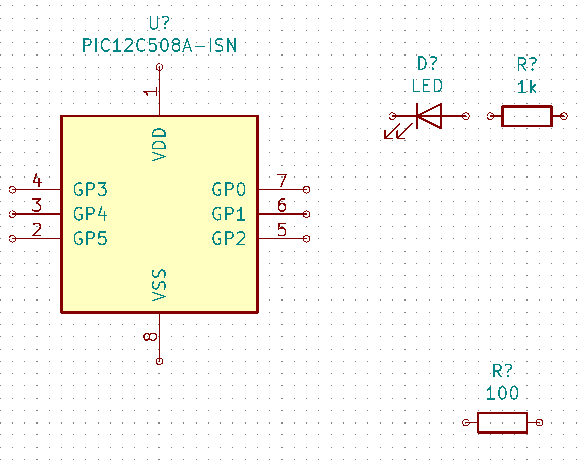

25. We now need to create the schematic component 'MYCONN3' for our
    3-pin connector. You can jump to the section titled
    <<make-schematic-components-in-kicad,Make Schematic Components in KiCad>>
    to learn how to make this component from scratch and then return
    to this section to continue with the board.

26. You can now place the freshly made component. Press [a] and
    pick the 'MYCONN3' component in the 'myLib' library.

27. The component identifier 'J?' will appear under the 'MYCONN3' label.
    If you want to change its position, right click on 'J?' and click on
    'Move Field' (equivalent to [m]). It might be helpful to
    zoom in before/while doing this. Reposition 'J?' under the component as
    shown below. Labels can be moved around as many times as you please.
+
image::images/gsik_myconn3_s.png[gsik_myconn3_s_png]

28. It is time to place the power and ground symbols. Click on the
    'Place power port' button  on
    the right toolbar. Alternatively, press [p]. In the component
    selection window, scroll down and select 'VCC' from the 'power' library.
    Click OK.

29. Click above the pin of the 1 k resistor to place the VCC part. Click
    on the area above the microcontroller 'VDD'. In the 'Component Selection
    history' section select 'VCC' and place it next to the VDD pin. Repeat
    the add process again and place a VCC part above the VCC pin of
    'MYCONN3'.

30. Repeat the add-pin steps but this time select the GND part. Place a
    GND part under the GND pin of 'MYCONN3'. Place another GND symbol on the
    left of the VSS pin of the microcontroller. Your schematic should now
    look something like this:
+
image::images/gsik_tutorial1_020.png[gsik_tutorial1_020_png]

31. Next, we will wire all our components. Click on the 'Place wire'
    icon  on the right
    toolbar.
+
NOTE: Be careful not to pick 'Place bus', which appears directly
beneath this button but has thicker lines. The section
<<bus-connections-in-kicad,Bus Connections in KiCad>> will explain how
to use a bus section.

32. Click on the little circle at the end of pin 7 of the
    microcontroller and then click on the little circle on pin 1 of
    the LED.  You can zoom in while you are placing the connection.
+
NOTE: If you want to reposition wired components, it is important to
use [g] (to grab) and not [m] (to move). Using grab will keep the wires
connected. Review step 24 in case you have forgotten how to move a component.
+
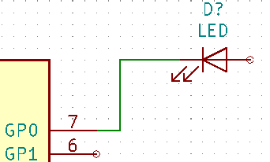

33. Repeat this process and wire up all the other components as shown
    below. To terminate a wire just double-click. When wiring up the
    VCC and GND symbols, the wire should touch the bottom of the VCC
    symbol and the middle top of the GND symbol. See the screenshot
    below.
+
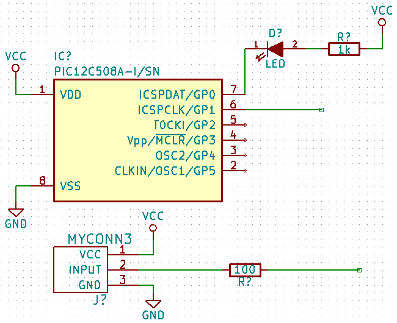

34. We will now consider an alternative way of making a connection
    using labels. Pick a net labelling tool by clicking on the 'Place
    net label' icon image:images/icons/add_line_label.png[add_line_label_png]
    on the right toolbar. You can also use [l].

35. Click in the middle of the wire connected to pin 6 of the
    microcontroller. Name this label 'INPUT'.

36. Follow the same procedure and place another label on line on the
    right of the 100 ohm resistor. Also name it 'INPUT'. The two
    labels, having the same name, create an invisible connection
    between pin 6 of the PIC and the 100 ohm resistor. This is a
    useful technique when connecting wires in a complex design where
    drawing the lines would make the whole schematic messier. To place
    a label you do not necessarily need a wire, you can simply attach
    the label to a pin.

37. Labels can also be used to simply label wires for informative
    purposes. Place a label on pin 7 of the PIC. Enter the name
    'uCtoLED'.  Name the wire between the resistor and the LED as
    'LEDtoR'. Name the wire between 'MYCONN3' and the resistor as
    'INPUTtoR'.

38. You do not have to label the VCC and GND lines because the labels
    are implied from the power objects they are connected to.

39. Below you can see what the final result should look like.
+
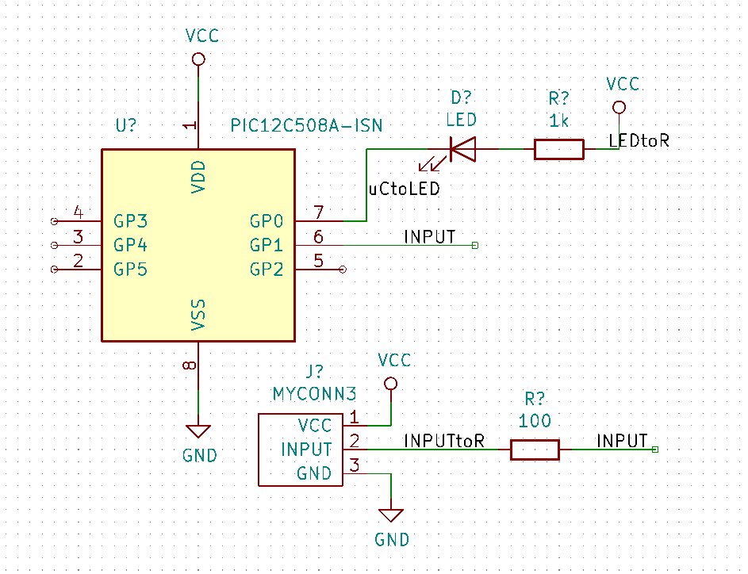

40. Let's now deal with unconnected wires. Any pin or wire that is not
    connected will generate a warning when checked by KiCad. To avoid
    these warnings you can either instruct the program that the
    unconnected wires are deliberate or manually flag each unconnected
    wire or pin as unconnected.

41. Click on the 'Place no connection flag' icon
     on the right toolbar. Click on
    pins 2, 3, 4 and 5. An X will appear to signify that the lack of a
    wire connection is intentional.
+
image::images/gsik_tutorial1_060.png[gsik_tutorial1_060_png]

42. Some components have power pins that are invisible. You can make
    them visible by clicking on the 'Show hidden pins' icon
    image:images/icons/hidden_pin.png[hidden_pin_png] on the left
    toolbar. Hidden power pins get automatically connected if VCC and
    GND naming is respected. Generally speaking, you should try not to
    make hidden power pins.

43. It is now necessary to add a 'Power Flag' to indicate to KiCad
    that power comes in from somewhere. Press [a] and search for
    'PWR_FLAG' which is in 'power' library. Place two of them.
    Connect them to a GND pin and to VCC as shown below.
+
image::images/gsik_tutorial1_070.png[gsik_tutorial1_070_png]
+
NOTE: This will avoid the classic schematic checking warning:
Warning Pin power_in not driven (Net xx)

44. Sometimes it is good to write comments here and there. To add
    comments on the schematic use the 'Place text'
    icon image:images/icons/text.png[text_png] on the right toolbar.

45. All components now need to have unique identifiers. In fact, many
    of our components are still named 'R?' or 'J?'. Identifier
    assignation can be done automatically by clicking on the 'Annotate
    schematic symbols' icon  on the top
    toolbar.

46. In the Annotate Schematic window, select 'Use the entire
    schematic' and click on the 'Annotate' button. Click OK in the
    confirmation message and then click 'Close'. Notice how all the
    '?' have been replaced with numbers. Each identifier is now
    unique. In our example, they have been named 'R1', 'R2', 'U1',
    'D1' and 'J1'.

47. We will now check our schematic for errors. Click on the 'Perform
    electrical rules check' icon image:images/icons/erc.png[erc_png] on the top
    toolbar. Click on the 'Run' button. A report informing you of any errors or
    warnings such as disconnected wires is generated. You should have 0 Errors
    and 0 Warnings. In case of errors or warnings, a small green arrow will
    appear on the schematic in the position where the error or the warning is
    located. Check 'Create ERC file report' and press the 'Run' button again to
    receive more information about the errors.
+
NOTE: If you have a warning with "No default editor found, you must choose it",
try setting the path to `c:\windows\notepad.exe` (windows) or `/usr/bin/gedit`
(Linux).

48. The schematic is now finished. We can now create a Netlist file to
    which we will add the footprint of each component. Click on the
    'Generate netlist' icon  on
    the top toolbar. Click on the 'Generate Netlist' button and save
    under the default file name.

49. After generating the Netlist file, click on the 'Run Cvpcb' icon
    image:images/icons/cvpcb.png[cvpcb_png] on the top
    toolbar. If a missing file error window pops up, just ignore it
    and click OK.

50. _Cvpcb_ allows you to link all the components in your schematic
    with footprints in the KiCad library. The pane on the center shows
    all the components used in your schematic. Here select 'D1'. In
    the pane on the right you have all the available footprints, here
    scroll down to 'LED_THT:LED-D5.0mm' and double click on it. 
// missing image here?

51. It is possible that the pane on the right shows only a selected
    subgroup of available footprints. This is because KiCad is trying
    to suggest to you a subset of suitable footprints. Click on the
    icons ,
     and
    image:images/icons/module_library_list.png[module_library_list_png] to
    enable or disable these filters.

52. For 'U1' select the 'Package_DIP:DIP-8_W7.62mm' footprint.
    For 'J1' select the 'Connector:Banana_Jack_3Pin' footprint.
    For 'R1' and 'R2' select the
    'Resistor_THT:R_Axial_DIN0207_L6.3mm_D2.5mm_P2.54mm_Vertical' footprint.

53. If you are interested in knowing what the footprint you are
    choosing looks like, you can click on the 'View selected footprint' icon
    image:images/icons/show_footprint.png[show_footprint_png] for a preview
    of the current footprint.

54. You are done. You can save the schematic now
    by clicking *File* -> **Save Schematic** or with the button
    'Apply, Save Schematic & Continue'.

55. You can close _Cvpcb_ and go back to the _Eeschema_ schematic
    editor. If you didn't save it in Cvpcb save it now by clicking on
    *File* -> **Save**. Create the netlist again. Your netlist file has now
    been updated with all the footprints. Note that if you are missing
    the footprint of any device, you will need to make your own
    footprints. This will be explained in a later section of this
    document.

56. Switch to the KiCad project manager.

57. The netlist file describes all components and their respective pin
    connections. The netlist file is actually a text file that you can
    easily inspect, edit or script.
+
NOTE: Library files (__*.lib__) are text files too and they are also
easily editable or scriptable.

58. To create a Bill Of Materials (BOM), go to the _Eeschema_ schematic
    editor and click on the 'Generate bill of materials' icon
    image:images/icons/bom.png[bom_png] on the top toolbar.
    By default there is no plugin active. You add one, by clicking on
    *Add Plugin* button. Select the *.xsl file you want to use, in
    this case, we select __bom2csv.xsl__.
+
[NOTE]
=====================================================================
*Linux:*

If xsltproc is missing, you can download and install it with:

 sudo apt-get install xsltproc

for a Debian derived distro like Ubuntu, or

 sudo yum install xsltproc

for a RedHat derived distro. If you use neither of the two kind of distro,
use your distro package manager command to install the xsltproc package.

xsl files are located at: _/usr/lib/kicad/plugins/_.

*Apple OS X:*

If xsltproc is missing, you can either install the Apple Xcode tool from
the Apple site that should contain it, or download and install it with:

 brew install libxslt

xsl files are located at: _/Library/Application Support/kicad/plugins/_.

*Windows:*

xsltproc.exe and the included xsl files will be located at
_＜KiCad install directory＞\bin_ and
_＜KiCad install directory＞\bin\scripting\plugins_, respectively.

*All platforms:*

You can get the latest bom2csv.xsl via:

https://raw.githubusercontent.com/KiCad/kicad-source-mirror/master/eeschema/plugins/xsl_scripts/bom2csv.xsl
=====================================================================
+
.KiCad automatically generates the command, for example:
---------
xsltproc -o "%O" "/home/<user>/kicad/eeschema/plugins/bom2csv.xsl" "%I"
---------
+
.You may want to add the extension, so change this command line to:
---------
xsltproc -o "%O.csv" "/home/<user>/kicad/eeschema/plugins/bom2csv.xsl" "%I"
---------
+
Press Help button for more info.

59. Now press 'Generate'. The file (same name as your project) is
    located in your project folder.  Open the **.csv* file with
    LibreOffice Calc or Excel. An import window will appear, press OK.

You are now ready to move to the PCB layout part, which is presented in
the next section. However, before moving on let's take a quick look at
how to connect component pins using a bus line.

[[bus-connections-in-kicad]]
=== Bus connections in KiCad

Sometimes you might need to connect several sequential pins of component
A with some other sequential pins of component B. In this case you have
two options: the labelling method we already saw or the use of a bus
connection. Let's see how to do it.

1.  Let us suppose that you have three 4-pin connectors that you want
    to connect together pin to pin. Use the label option (press [l])
    to label pin 4 of the P4 part. Name this label 'a1'. Now
    press [Insert] to have the same item automatically
    added on the pin below pin 4 (PIN 3). Notice how the label is
    automatically renamed 'a2'.

2.  Press [Insert] two more times. This key corresponds to the
    action 'Repeat last item' and it is an infinitely useful command
    that can make your life a lot easier.

3.  Repeat the same labelling action on the two other connectors
    CONN_2 and CONN_3 and you are done. If you proceed and make a PCB
    you will see that the three connectors are connected to each
    other. Figure 2 shows the result of what we described. For
    aesthetic purposes it is also possible to add a series of 'Place
    wire to bus entry' using the icon
    image:images/icons/add_line2bus.png[Place wire to bus entry] and bus
    line using the icon image:images/icons/add_bus2bus.png[Place bus to bus
    entry], as shown in Figure 3. Mind, however, that there will be no
    effect on the PCB.

4.  It should be pointed out that the short wire attached to the pins
    in Figure 2 is not strictly necessary. In fact, the labels could
    have been applied directly to the pins.

5.  Let's take it one step further and suppose that you have a fourth
    connector named CONN_4 and, for whatever reason, its labelling
    happens to be a little different (b1, b2, b3, b4). Now we want to
    connect _Bus a_ with _Bus b_ in a pin to pin manner. We want to do
    that without using pin labelling (which is also possible) but by
    instead using labelling on the bus line, with one label per bus.

6.  Connect and label CONN_4 using the labelling method explained
    before. Name the pins b1, b2, b3 and b4. Connect the pin to a
    series of 'Wire to bus entry' using the icon
    image:images/icons/add_line2bus.png[add_line2bus_png] and to a bus line
    using the icon image:images/icons/add_bus.png[add_bus_png]. See Figure
    4.

7.  Put a label (press [l]) on the bus of CONN_4 and name
    it 'b[1..4]'.

8.  Put a label (press [l]) on the previous bus and name
    it 'a[1..4]'.

9.  What we can now do is connect bus a[1..4] with bus b[1..4] using a
    bus line with the button image:images/icons/add_bus.png[add_bus_png].

10. By connecting the two buses together, pin a1 will be automatically
    connected to pin b1, a2 will be connected to b2 and so on. Figure
    4 shows what the final result looks like. 
+
NOTE: The 'Repeat last item' option accessible via [Insert] can
be successfully used to repeat period item insertions. For instance,
the short wires connected to all pins in Figure 2, Figure 3 and Figure 4
have been placed with this option.

11. The 'Repeat last item' option accessible via [Insert] has also
    been extensively used to place the many series of 'Wire to bus entry'
    using the icon image:images/icons/add_line2bus.png[add_line2bus_png].
+
image::images/gsik_bus_connection.png[gsik_bus_connection_png]

[[layout-printed-circuit-boards]]
== Layout printed circuit boards

It is now time to use the netlist file you generated to lay out the PCB.
This is done with the _Pcbnew_ tool.

[[using-pdbnew]]
=== Using Pcbnew

1.  From the KiCad project manager, click on the 'Pcb layout editor' icon
    image:images/icons/pcbnew.png[pcbnew_png]. The 'Pcbnew' window will
    open. If you get an error message saying that a _*.kicad_pcb_ file
    does not exist and asks if you want to create it, just click Yes.

2.  Begin by entering some schematic information. Click on the 'Page
    settings' icon  on the top
    toolbar. Set the appropriate 'paper size' ('A4','8.5x11' etc.)
    and 'title' as 'Tutorial1'.

3.  It is a good idea to start by setting the *clearance* and the
    *minimum track width* to those required by your PCB
    manufacturer. In general you can set the clearance to '0.25' and
    the minimum track width to '0.25'. Click on the *Setup* ->
    *Design Rules* menu. If it does not show already, click on the
    'Net Classes Editor' tab. Change the 'Clearance' field at the top
    of the window to '0.25' and the 'Track Width' field to '0.25' as
    shown below. Measurements here are in mm.
+
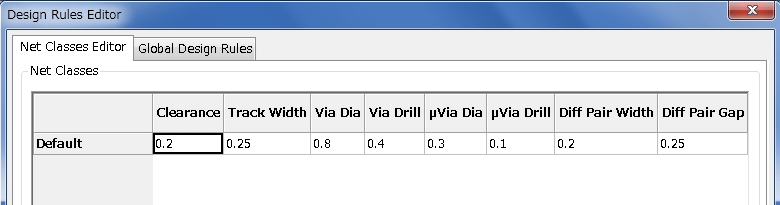

4.  Click on the 'Global Design Rules' tab and set 'Minimum track width' to
    '0.25'. Click the OK button to commit your changes and close the Design
    Rules Editor window.

5.  Now we will import the netlist file. Click on the 'Read netlist'
    icon  on the top
    toolbar. The netlist file 'tutorial1.net' should be selected
    in the 'Netlist file' field if it was created from Eeschema.
    Click on 'Read Current Netlist'. Then click the 'Close' button.

6.  All components should now be visible. They are selected and follow
    the mouse cursor.

7.  Move the components to the middle of
    the board. If necessary you can zoom in and out while you move the
    components. Click the left mouse button.

8.  All components are connected via a thin group of wires called
    __ratsnest__. Make sure that the 'Show/hide board ratsnest' button
     is
    pressed. In this way you can see the ratsnest linking all
    components.

9.  You can move each component by hovering over it and pressing [m].
    Click where you want to place them. Alternatively you can select
    a component by clicking on it and then drag it.
    Press [r] to rotate a component.
    Move all components around until you minimise the number of
    wire crossovers.
+
image::images/gsik_tutorial1_080.png[gsik_tutorial1_080_png]

10. Note how one pin of the 100 ohm resistor
    is connected to pin 6 of the PIC component. This is the result of
    the labelling method used to connect pins. Labels are often
    preferred to actual wires because they make the schematic much
    less messy.

11. Now we will define the edge of the PCB. Select the 'Edge.Cuts' layer from
    the drop-down menu in the top toolbar. Click on the 'Add graphic
    lines' icon
    image:images/icons/add_dashed_line.png[add_dashed_line_png] on the right
    toolbar. Trace around the edge of the board, clicking at each
    corner, and remember to leave a small gap between the edge of the
    green and the edge of the PCB.
+
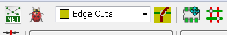

12. Next, connect up all the wires except GND. In fact, we will
    connect all GND connections in one go using a ground plane placed
    on the bottom copper (called __B.Cu__) of the board.

13. Now we must choose which copper layer we want to work on. Select
    'F.Cu (PgUp)' in the drop-down menu on the top toolbar. This is the
    front top copper layer.
+
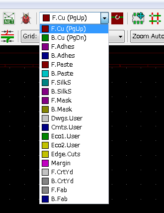

14. If you decide, for instance, to do a 4 layer PCB instead, go to
    *Setup* -> *Layers Setup* and change 'Copper Layers' to 4. In
    the 'Layers' table you can name layers and decide what they can be
    used for.  Notice that there are very useful presets that can be
    selected via the 'Preset Layer Groupings' menu.

15. Click on the 'Route tracks' icon
     on the right
    toolbar. Click on pin 1 of 'J1' and run a track to pad
    'R2'. Double-click to set the point where the track will end. The
    width of this track will be the default 0.250 mm. You can change
    the track width from the drop-down menu in the top toolbar. Mind
    that by default you have only one track width available.
+
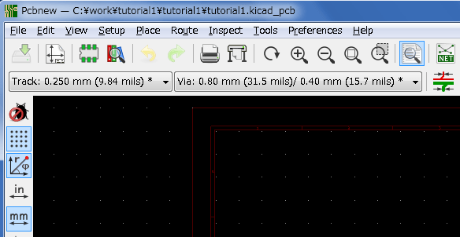

16. If you would like to add more track widths go to: *Setup* ->
    *Design Rules* -> *Global Design Rules* tab and at the bottom right of
    this window add any other width you would like to have available. You
    can then choose the widths of the track from the drop-down menu while
    you lay out your board. See the example below (inches).
+
image::images/custom_tracks_width.png[custom_tracks_width_png]

17. Alternatively, you can add a Net Class in which you specify a set of
    options. Go to *Setup* -> *Design Rules* -> *Net Classes Editor*
    and add a new class called 'power'. Change the track width from 8 mil
    (indicated as 0.0080) to 24 mil (indicated as 0.0240). Next, add
    everything but ground to the 'power' class (select 'default' at left and
    'power' at right and use the arrows).

18. If you want to change the grid size, *Right click* -> **Grid**.
    Be sure to select the appropriate grid size before or after
    laying down the components and connecting them together with tracks.

19. Repeat this process until all wires, except pin 3 of J1, are
    connected. Your board should look like the example below.
+
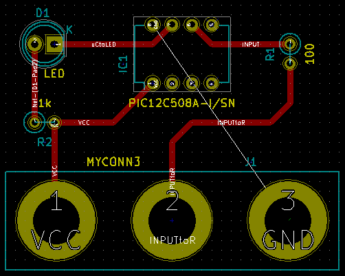

20. Let's now run a track on the other copper side of the PCB. Select
    'B.Cu' in the drop-down menu on the top toolbar. Click on the 'Route tracks'
    icon . Draw a track between
    pin 3 of J1 and pin 8 of U1. This is actually not necessary since
    we could do this with the ground plane. Notice how the colour of
    the track has changed.

21. **Go from pin A to pin B by changing layer**. It is possible to
    change the copper plane while you are running a track by placing a
    via.  While you are running a track on the upper copper plane,
    right click and select 'Place Via' or simply press [v]. This will
    take you to the bottom layer where you can complete your track.
+
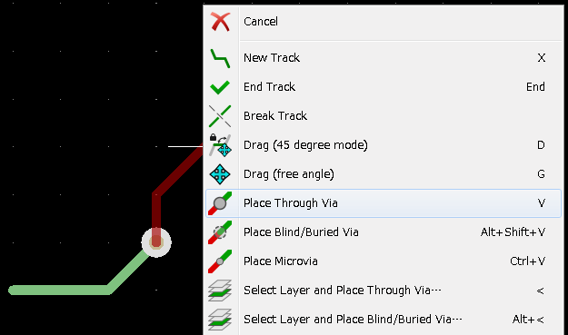

22. When you want to inspect a particular connection you can click on
    the 'Highlight net' icon
    image:images/icons/net_highlight.png[net_highlight_png] on the right
    toolbar.  Click on pin 3 of J1. The track itself and all pads
    connected to it should become highlighted.

23. Now we will make a ground plane that will be connected to all GND
    pins. Click on the 'Add filled zones' icon
     on the right toolbar. We
    are going to trace a rectangle around the board, so click where
    you want one of the corners to be. In the dialogue that appears,
    set 'Default pad connection' to 'Thermal relief' and 'Outline slope' to
    'H,V and 45 deg only' and click OK.

24. Trace around the outline of the board by clicking each corner in
    rotation.  Finish your rectangle by clicking the first corner
    second time. Right click inside the area you have just traced.
    Click on 'Zones'->'Fill or Refill All Zones'. The
    board should fill in with green and look something like this:
+
image::images/gsik_tutorial1_100.png[gsik_tutorial1_100_png]

25. Run the design rules checker by clicking on the 'Perform design
    rules check' icon image:images/icons/drc.png[drc_png] on the top
    toolbar.  Click on 'Start DRC'. There should be no errors. Click
    on 'List Unconnected'. There should be no unconnected items. Click
    OK to close the DRC Control dialogue.

26. Save your file by clicking on *File* -> **Save**. To admire your
    board in 3D, click on *View* -> **3D Viewer**.
+
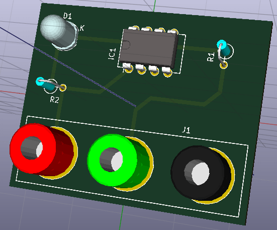

27. You can drag your mouse around to rotate the PCB.

28. Your board is complete. To send it off to a manufacturer you will
    need to generate all Gerber files.

[[generate-gerber-files]]
=== Generate Gerber files

Once your PCB is complete, you can generate Gerber files for each layer
and send them to your favourite PCB manufacturer, who will make the
board for you.

1.  From KiCad, open the _Pcbnew_ board editor.

2.  Click on *File* -> **Plot**. Select 'Gerber' as the 'Plot format'
    and select the folder in which to put all Gerber files.
    Proceed by clicking on the 'Plot' button.

3.  To generate the drill file, from _Pcbnew_ go again to the *File* ->
    *Plot* option. Default settings should be fine.

4.  These are the layers you need to select for making a typical 2-layer
    PCB:

[width="100%",cols="25%,25%,25%,25%",options="header"]
|=========================================================
|Layer |KiCad Layer Name |Default Gerber Extension
    |"Use Protel filename extensions" is enabled
|Bottom Layer |B.Cu |.GBR |.GBL
|Top Layer |F.Cu |.GBR |.GTL
|Top Overlay |F.SilkS |.GBR |.GTO
|Bottom Solder Resist |B.Mask |.GBR |.GBS
|Top Solder Resist |F.Mask |.GBR |.GTS
|Edges |Edge.Cuts |.GBR |.GM1
|=========================================================

[[using-gerbview]]
=== Using GerbView

1.  To view all your Gerber files go to the KiCad project manager and click
    on the 'GerbView' icon.
    On the drop-down menu or in the Layers manager select 'Graphic layer 1'.
    Click on *File* -> *Open Gerber file(s)* or click on the icon
    image:images/icons/gerber_file.png[gerber_file_png]. Select and open all
    generated Gerber files. Note how they all get displayed one on top
    of the other.

2.  Open the drill files with *File* -> *Open Excellon Drill File(s)*.

3.  Use the Layers manager on the right to select/deselect which layer to show.
    Carefully inspect each layer before sending them for production.

4.  The view works similarly to Pcbnew. Right click inside the view and click
    'Grid' to change the grid.

[[automatically-route-with-freerouter]]
=== Automatically route with FreeRouter

Routing a board by hand is quick and fun, however, for a board with lots
of components you might want to use an autorouter. Remember that you
should first route critical traces by hand and then set the autorouter
to do the boring bits. Its work will only account for the unrouted
traces. The autorouter we will use here is FreeRouting.

NOTE: FreeRouting is an open source java application.
Currently FreeRouting exists in several more or less identical
copies which you can find by doing an internet search for "freerouting".
It may be found in source only form or as a precompiled java package.

1.  From _Pcbnew_ click on *File* -> *Export* -> *Specctra DSN*
    and save the file locally.
    Launch FreeRouter and click on the 'Open Your Own Design'
    button, browse for the _dsn_ file and load it.

2.  FreeRouter has some features that KiCad does not currently have,
    both for manual routing and for automatic routing. FreeRouter
    operates in two main steps: first, routing the board and then
    optimising it. Full optimisation can take a long time, however you
    can stop it at any time need be.

3.  You can start the automatic routing by clicking on the
    'Autorouter' button on the top bar. The bottom bar gives you
    information about the on-going routing process. If the 'Pass'
    count gets above 30, your board probably can not be autorouted
    with this router. Spread your components out more or rotate them
    better and try again. The goal in rotation and position of parts
    is to lower the number of crossed airlines in the ratsnest.

4.  Making a left-click on the mouse can stop the automatic routing
    and automatically start the optimisation process. Another
    left-click will stop the optimisation process. Unless you really
    need to stop, it is better to let FreeRouter finish its job.

5.  Click on the *File* -> *Export Specctra Session File* menu and
    save the board file with the _.ses_ extension. You do not really
    need to save the FreeRouter rules file.

6.  Back to __Pcbnew__. You can import your freshly routed board by
    clicking on *File* -> *Import* -> *Spectra Session* and selecting
    your _.ses_ file.

If there is any routed trace that you do not like, you can delete it and
re-route it again, using [Delete] and the routing tool, which is the
'Route tracks' icon  on the
right toolbar.

[[forward-annotation-in-kicad]]
== Forward annotation in KiCad

Once you have completed your electronic schematic, the footprint
assignment, the board layout and generated the Gerber files, you are
ready to send everything to a PCB manufacturer so that your board can
become reality.

Often, this linear work-flow turns out to be not so uni-directional. For
instance, when you have to modify/extend a board for which you or others
have already completed this work-flow, it is possible that you need to
move components around, replace them with others, change footprints and
much more. During this modification process, what you do not want to do
is to re-route the whole board again from scratch. Instead, this is how
you do it:

1.  Let's suppose that you want to replace a hypothetical connector CON1
    with CON2.

2.  You already have a completed schematic and a fully routed PCB.

3.  From KiCad, start __Eeschema__, make your modifications by
    deleting CON1 and adding CON2. Save your schematic project with
    the icon image:images/icons/save.png[Save icon] and c lick on the
    'Netlist generation' icon  on
    the top toolbar.

4.  Click on 'Netlist' then on 'save'. Save to the default file name.
    You have to rewrite the old one.

5.  Now assign a footprint to CON2. Click on the 'Run Cvpcb' icon
    image:images/icons/cvpcb.png[cvpcb] on the top
    toolbar. Assign the footprint to the new device CON2. The rest of
    the components still have the previous footprints assigned to
    them. Close __Cvpcb__.

6.  Back in the schematic editor, save the project by clicking on 'File'
    -> 'Save Whole Schematic Project'. Close the schematic editor.

7.  From the KiCad project manager, click on the 'Pcbnew' icon. The
    'Pcbnew' window will open.

8.  The old, already routed, board should automatically open. Let's
    import the new netlist file. Click on the 'Read Netlist' icon
     on the top toolbar.

9.  Click on the 'Browse Netlist Files' button, select the netlist file
    in the file selection dialogue, and click on 'Read Current Netlist'.
    Then click the 'Close' button.

10. At this point you should be able to see a layout with all previous
    components already routed. On the top left corner you should see
    all unrouted components, in our case the CON2. Select CON2 with
    the mouse.  Move the component to the middle of the board.

11. Place CON2 and route it. Once done, save and proceed with the Gerber
    file generation as usual.

The process described here can easily be repeated as many times as you
need. Beside the Forward Annotation method described above, there is
another method known as Backward Annotation. This method allows you to
make modifications to your already routed PCB from Pcbnew and updates
those modifications in your schematic and netlist file. The Backward
Annotation method, however, is not that useful and is therefore not
described here.

[[make-schematic-symbols-in-kicad]]
== Make schematic symbols in KiCad

Sometimes a symbol that you want to place on your schematic is not 
in a KiCad library. This is quite normal and there is no reason to
worry. In this section we will see how a new schematic symbol can be
quickly created with KiCad. Nevertheless, remember that you can always
find KiCad components on the Internet.

In KiCad, a symbol is a piece of text that starts with 'DEF' and
ends with 'ENDDEF'. One or more symbols are normally placed in a
library file with the extension __.lib__. If you want to add symbols
to a library file you can just use the cut and paste commands of
a text editor.

[[using-component-library-editor]]
=== Using Component Library Editor

1.  We can use the _Component Library Editor_ (part of __Eeschema__)
    to make new components. In our project folder 'tutorial1' let's create
    a folder named 'library'. Inside we will put our new library file
    _myLib.lib_ as soon as we have created our new component.

2.  Now we can start creating our new component. From KiCad, start
    __Eeschema__, click on the 'Library Editor' icon
     and then click on the 'New
    component' icon
    image:images/icons/new_component.png[new_component_png]. The Component
    Properties window will appear. Name the new component 'MYCONN3',
    set the 'Default reference designator' as 'J', and the 'Number of
    units per package' as '1'. Click OK. If the warning appears just
    click yes.
    At this point the component is only made of its labels. Let's add
    some pins. Click on the 'Add Pins' icon
    image:images/icons/pin.png[pin_png]
    on the right toolbar. To place the pin, left click in the centre of
    the part editor sheet just below the 'MYCONN3' label.

3.  In the Pin Properties window that appears, set the pin name to
    'VCC', set the pin number to '1', and the 'Electrical type' to
    'Power input' then click OK.
+
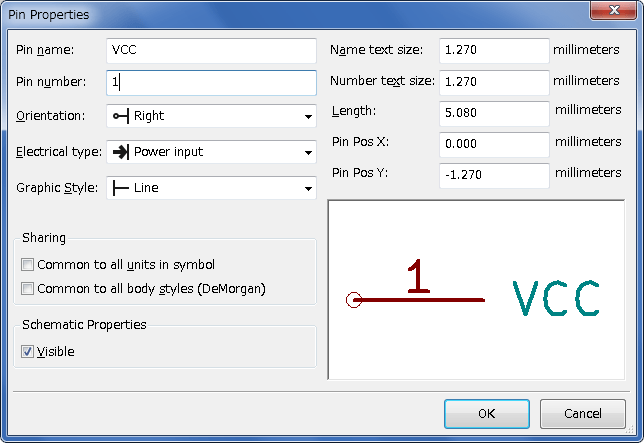

4.  Place the pin by clicking on the location you would like it to go,
    right below the 'MYCONN3' label.

5.  Repeat the place-pin steps, this time 'Pin name' should be
    'INPUT', 'Pin number' should be '2', and 'Electrical Type' should
    be 'Passive'.

6.  Repeat the place-pin steps, this time 'Pin name' should be 'GND',
    'Pin number' should be '3', and 'Electrical Type' should be 'Passive'.
    Arrange the pins one on top of the other. The component
    label 'MYCONN3' should be in the centre of the page (where the
    blue lines cross).

7.  Next, draw the contour of the component. Click on the 'Add
    rectangle' icon
    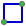. We want
    to draw a rectangle next to the pins, as shown below. To do this,
    click where you want the top left corner of the rectangle to be
    (do not hold the mouse button down). Click again where you want
    the bottom right corner of the rectangle to be.
+
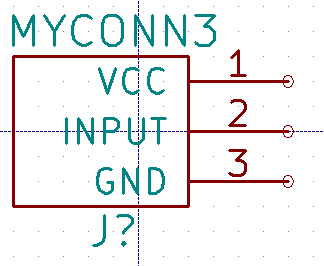

8.  If you want to fill the rectangle with yellow, set the fill colour
    to 'yellow 4' in *Preferences* -> *Select color scheme*, then select
    the rectangle in the editing screen with [e], selecting
    'Fill background'.

9.  Save the component in your library __myLib.lib__. Click on the
    'New Library' icon ,
    navigate into _tutorial1/library/_ folder and save the new library
    file with the name __myLib.lib__.

10. Go to *Preferences* -> *Component Libraries* and add both _tutorial1/library/_ in
    'User defined search path' and _myLib.lib in_ 'Component library files'.

11. Click on the 'Select working library' icon
    . In the Select Library
    window click on _myLib_ and click OK. Notice how the heading of
    the window indicates the library currently in use, which now
    should be __myLib__.

12. Click on the 'Update current component in current library' icon
    image:images/icons/save_part_in_mem.png[save_part_in_mem_png] in the top
    toolbar. Save all changes by clicking on the 'Save current loaded
    library on disk' icon
     in the top
    toolbar. Click 'Yes' in any confirmation messages that appear.
    The new schematic component is now done and available in the
    library indicated in the window title bar.

13. You can now close the Component library editor window. You will
    return to the schematic editor window. Your new component will now
    be available to you from the library __myLib__.

14. You can make any library _file.lib_ file available to you by
    adding it to the library path. From __Eeschema__, go to
    *Preferences* -> *Library* and add both the path to it in 'User
    defined search path' and _file.lib_ in 'Component library files'.

[[export-import-and-modify-library-components]]
=== Export, import and modify library components

Instead of creating a library component from scratch it is sometimes
easier to start from one already made and modify it. In this section we
will see how to export a component from the KiCad standard library
'device' to your own library _myOwnLib.lib_ and then modify it.

1.  From KiCad, start __Eeschema__, click on the 'Library Editor' icon
    , click on the 'Select
    working library' icon  and
    choose the library 'device'. Click on 'Load component to edit from
    the current lib' icon
    image:images/icons/import_cmp_from_lib.png[import_cmp_from_lib_png] and
    import the 'RELAY_2RT'.

2.  Click on the 'Export component' icon
    image:images/icons/export.png[export_png], navigate into the _library/_
    folder and save the new library file with the name _myOwnLib.lib._

3.  You can make this component and the whole library _myOwnLib.lib_
    available to you by adding it to the library path. From
    __Eeschema__, go to *Preferences* -> *Component Libraries* and add both
    _library/_ in 'User defined search path' and _myOwnLib.lib_ in the
    'Component library files'. Close the window.

4.  Click on the 'Select working library' icon
    . In the Select Library
    window click on _myOwnLib_ and click OK. Notice how the heading of
    the window indicates the library currently in use, it should be
    __myOwnLib__.

5.  Click on the 'Load component to edit from the current lib' icon
    image:images/icons/import_cmp_from_lib.png[import_cmp_from_lib_png] and
    import the 'RELAY_2RT'.

6.  You can now modify the component as you like. Hover over the label
    'RELAY_2RT', press [e] and rename it 'MY_RELAY_2RT'.

7.  Click on 'Update current component in current library' icon
    image:images/icons/save_part_in_mem.png[save_part_in_mem_png] in the top
    toolbar. Save all changes by clicking on the 'Save current loaded
    library on disk' icon
     in the top
    toolbar.

[[make-schematic-components-with-quicklib]]
=== Make schematic components with quicklib

This section presents an alternative way of creating the schematic
component for MYCONN3 (see <<myconn3,MYCONN3>> above) using the
Internet tool __quicklib__.

1.  Head to the _quicklib_ web page:
    http://kicad.rohrbacher.net/quicklib.php

2.  Fill out the page with the following information: Component name:
    MYCONN3 Reference Prefix: J Pin Layout Style: SIL Pin Count, N: 3

3.  Click on the 'Assign Pins' icon. Fill out the page with the
    following information: Pin 1: VCC Pin 2: input Pin 3: GND.
    Type : Passive for all 3 pins.

4.  Click on the icon 'Preview it' and, if you are satisfied, click on
    the 'Build Library Component'. Download the file and rename it
    __tutorial1/library/myQuickLib.lib.__. You are done!

5.  Have a look at it using KiCad. From the KiCad project manager, start
    __Eeschema__, click on the 'Library Editor' icon
    , click on the 'Import Component'
    icon image:images/icons/import.png[import_png], navigate to _tutorial1/library/_
    and select _myQuickLib.lib._
+
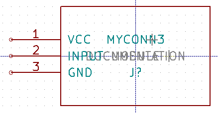

6.  You can make this component and the whole library _myQuickLib.lib_
    available to you by adding it to the KiCad library path. From
    __Eeschema__, go to *Preferences* -> *Component Libraries* and add _library_ in
    'User defined search path' and _myQuickLib.lib_ in 'Component library
    files'.

As you might guess, this method of creating library components can be
quite effective when you want to create components with a large pin
count.

[[make-a-high-pin-count-schematic-component]]
=== Make a high pin count schematic component

In the section titled _Make Schematic Components in quicklib_ we saw how
to make a schematic component using the _quicklib_ web-based tool.
However, you will occasionally find that you need to create a schematic
component with a high number of pins (some hundreds of pins). In KiCad,
this is not a very complicated task.

1.  Suppose that you want to create a schematic component for a device
    with 50 pins. It is common practise to draw it using multiple low
    pin-count drawings, for example two drawings with 25 pins
    each. This component representation allows for easy pin
    connection.

2.  The best way to create our component is to use _quicklib_ to
    generate two 25-pin components separately, re-number their pins
    using a Python script and finally merge the two by using copy and
    paste to make them into one single DEF and ENDDEF component.

3.  You will find an example of a simple Python script below that can
    be used in conjunction with an _in.txt_ file and an _out.txt_ file
    to re-number the line: +X PIN1 1 -750 600 300 R 50 50 1 1 I+ into
    +X PIN26 26 -750 600 300 R 50 50 1 1 I+ this is done for all lines
    in the file __in.txt__.

.Simple script
[source,python]
-------------------------------------------------------------------------------
#!/usr/bin/env python
''' simple script to manipulate KiCad component pins numbering'''
import sys, re
try:
    fin=open(sys.argv[1],'r')
    fout=open(sys.argv[2],'w')
except:
    print "oh, wrong use of this app, try:", sys.argv[0], "in.txt out.txt"
    sys.exit()
for ln in fin.readlines():
    obj=re.search("(X PIN)(\d*)(\s)(\d*)(\s.*)",ln)
if obj:
    num = int(obj.group(2))+25
    ln=obj.group(1) + str(num) + obj.group(3) + str(num) + obj.group(5) +'\n'
    fout.write(ln)
fin.close(); fout.close()
#
# for more info about regular expression syntax and KiCad component generation:
# http://gskinner.com/RegExr/
# http://kicad.rohrbacher.net/quicklib.php
-------------------------------------------------------------------------------

1.  While merging the two components into one, it is necessary to use
    the Library Editor from Eeschema to move the first component so
    that the second does not end up on top of it. Below you will find
    the final .lib file and its representation in __Eeschema__.

.Contents of a *.lib file
----
EESchema-LIBRARY Version 2.3
#encoding utf-8
# COMP
DEF COMP U 0 40 Y Y 1 F N
F0 "U" -1800 -100 50 H V C CNN
F1 "COMP" -1800 100 50 H V C CNN
DRAW
S -2250 -800 -1350 800 0 0 0 N
S -450 -800 450 800 0 0 0 N
X PIN1 1 -2550 600 300 R 50 50 1 1 I

...

X PIN49 49 750 -500 300 L 50 50 1 1 I
ENDDRAW
ENDDEF
#End Library
----

image::images/gsik_high_number_pins.png[gsik_high_number_pins_png]

1.  The Python script presented here is a very powerful tool for
    manipulating both pin numbers and pin labels. Mind, however, that
    all its power comes for the arcane and yet amazingly useful
    Regular Expression syntax: _http://gskinner.com/RegExr/._

[[make-component-footprints]]
== Make component footprints

Unlike other EDA software tools, which have one type of library that
contains both the schematic symbol and the footprint variations, KiCad
_.lib_ files contain schematic symbols and _.kicad_mod_ files contain
footprints. _Cvpcb_ is used to map footprints to symbols.

As for _.lib_ files, _.kicad_mod_ library files are text files that can
contain anything from one to several parts.

There is an extensive footprint library with KiCad, however on occasion
you might find that the footprint you need is not in the KiCad library.
Here are the steps for creating a new PCB footprint in KiCad:

[[using-footprint-editor]]
=== Using Footprint Editor

1.  From the KiCad project manager start the _Pcbnew_ tool. Click on
    the 'Open Footprint Editor' icon
     on the top
    toolbar. This will open the 'Footprint Editor'.

2.  We are going to save the new footprint 'MYCONN3' in the new
    footprint library 'myfootprint'.
    Create a new folder _myfootprint.pretty_ in the _tutorial1/_ project folder.
    Click on the *Preferences* -> **Footprint Libraries Manager** and
    press 'Append Library' button. In the table, enter "myfootprint"
    as Nickname, enter "$\{KIPRJMOD\}/myfootprint.pretty" as Library Path
    and enter "KiCad" as Plugin Type.
    Press OK to close the PCB Library Tables window.
    Click on the 'Select active library' icon
    image:images/icons/open_library.png[open_library_png] on the top toolbar.
    Select the 'myfootprint' library.
[[myconn3]]
3.  Click on the 'New Footprint' icon
     on the top
    toolbar.  Type 'MYCONN3' as the 'footprint name'. In the middle
    of the screen the 'MYCONN3' label will appear. Under the label you
    can see the 'REF*__' label. Right click on 'MYCONN3' and move
    it above 'REF*__'. Right click on 'REF__*', select 'Edit Text'
    and rename it to 'SMD'. Set the 'Display' value to 'Invisible'.

4.  Select the 'Add Pads' icon  on the
    right toolbar. Click on the working sheet to place the pad. Right
    click on the new pad and click 'Edit Pad'. You can also use [e].
+
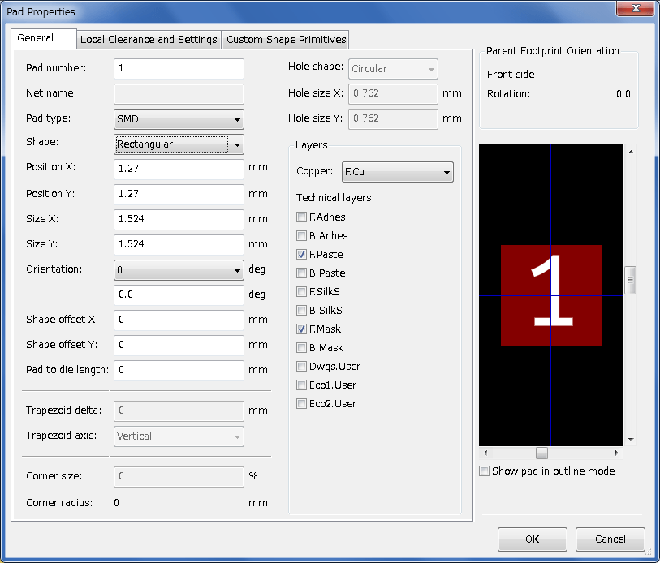

5.  Set the 'Pad Num' to '1', 'Pad Shape' to 'Rect', 'Pad Type' to
    'SMD', 'Shape Size X' to '0.4', and 'Shape Size Y' to '0.8'. Click
    OK.  Click on 'Add Pads' again and place two more pads.

6.  If you want to change the grid size, *Right click* -> **Grid
    Select**. Be sure to select the appropriate grid size before
    laying down the components.

7.  Move the 'MYCONN3' label and the 'SMD' label out of the way so that
    it looks like the image shown above.

8.  When placing pads it is often necessary to measure relative
    distances. Place the cursor where you want the relative coordinate
    point _(0,0)_ to be and press the space bar. While moving the
    cursor around, you will see a relative indication of the position
    of the cursor at the bottom of the page. Press the space bar at
    any time to set the new origin.

9.  Now add a footprint contour. Click on the 'Add graphic line or
    polygon' button image:images/icons/add_polygon.png[add_polygon_png] in
    the right toolbar. Draw an outline of the connector around the
    component.

10. Click on the 'Save Footprint in Active Library' icon
     on the top
    toolbar, using the default name MYCONN3.

[[note-about-portability-of-kicad-project-files]]
== Note about portability of KiCad project files

What files do you need to send to someone so that they can fully load
and use your KiCad project?

When you have a KiCad project to share with somebody, it is important
that the schematic file __.sch__, the board file __.kicad_pcb__, the
project file _.pro_ and the netlist file __.net__, are sent together
with both the schematic parts file _.lib_ and the footprints file
__.kicad_mod__. Only this way will people have total freedom to modify the
schematic and the board.

With KiCad schematics, people need the _.lib_ files that contain the
symbols. Those library files need to be loaded in the _Eeschema_
preferences. On the other hand, with boards (__.kicad_pcb__ files),
footprints can be stored inside the _.kicad_pcb_ file. You
can send someone a _.kicad_pcb_ file and nothing else, and they would
still be able to look at and edit the board. However, when they want
to load components from a netlist, the footprint libraries (__.kicad_mod__
files) need to be present and loaded in the _Pcbnew_ preferences just
as for schematics. Also, it is necessary to load the _.kicad_mod_ files in
the preferences of _Pcbnew_ in order for those footprints to show up in
__Cvpcb__.

If someone sends you a _.kicad_pcb_ file with footprints you would like
to use in another board, you can open the Footprint Editor, load a footprint
from the current board, and save or export it into another footprint
library. You can also export all the footprints from a _.kicad_pcb_ file
at once via *Pcbnew* -> *File* -> *Archive* -> *Footprints* ->
**Create footprint archive**, which will create a new _.kicad_mod_ file with
all the board's footprints.

Bottom line, if the PCB is the only thing you want to distribute, then
the board file _.kicad_pcb_ is enough. However, if you want to give
people the full ability to use and modify your schematic, its
components and the PCB, it is highly recommended that you zip and send
the following project directory:

----------------------
tutorial1/
|-- tutorial1.pro
|-- tutorial1.sch
|-- tutorial1.kicad_pcb
|-- tutorial1.net
|-- library/
|   |-- myLib.lib
|   |-- myOwnLib.lib
|   \-- myQuickLib.lib
|
|-- myfootprint.pretty/
|   \-- MYCONN3.kicad_mod
|
\-- gerber/
    |-- ...
    \-- ...
----------------------

[[more-about-kicad-documentation]]
== More about KiCad documentation

This has been a quick guide on most of the features in KiCad. For more
detailed instructions consult the help files which you can access
through each KiCad module. Click on *Help* -> **Manual**.

KiCad comes with a pretty good set of multi-language manuals for all its
four software components.

The English version of all KiCad manuals are distributed with KiCad.

In addition to its manuals, KiCad is distributed with this tutorial,
which has been translated into other languages. All the different
versions of this tutorial are distributed free of charge with all
recent versions of KiCad. This tutorial as well as the manuals should
be packaged with your version of KiCad on your given platform.

For example, on Linux the typical locations are in the following
directories, depending on your exact distribution:

 /usr/share/doc/kicad/help/en/
 /usr/local/share/doc/kicad/help/en

On Windows it is in:

 <installation directory>/share/doc/kicad/help/en

On OS X:

 /Library/Application Support/kicad/help/en

[[kicad-documentation-on-the-web]]
=== KiCad documentation on the Web

Latest KiCad documentations are available in multiple languages on the Web.

http://kicad-pcb.org/help/documentation/

