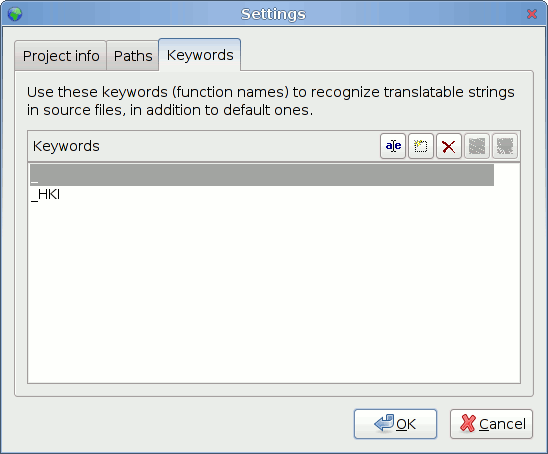
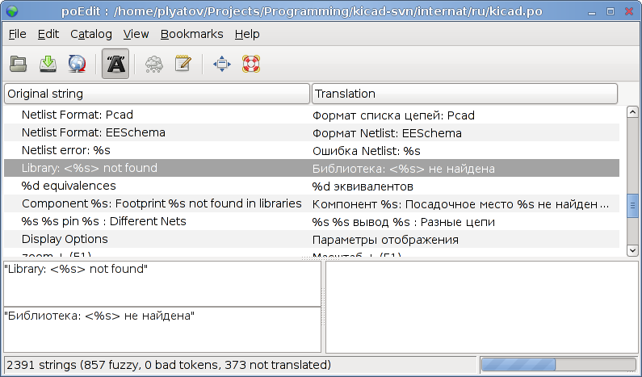

:author: The KiCad Team
:doctype: article
:toc:
:ascii-ids:

= GUI Translation HOWTO

_Reference manual_

[[copyright]]
*Copyright*

This document is Copyright (C) 2010-2015 by it's contributors as listed
below. You may distribute it and/or modify it under the terms of either
the GNU General Public License (https://www.gnu.org/licenses/gpl.html),
version 3 or later, or the Creative Commons Attribution License
(https://creativecommons.org/licenses/by/3.0/), version 3.0 or later.

All trademarks within this guide belong to their legitimate owners.

[[contributors]]
*Contributors*

Jean-Pierre Charras, Fabrizio Tappero, Wayne Stambaugh.

[[feedback]]
*Feedback*

Please direct any bug reports, suggestions or new versions to here:

- About KiCad document: https://github.com/KiCad/kicad-doc/issues

- About KiCad software: https://bugs.launchpad.net/kicad

- About KiCad software i18n: https://github.com/KiCad/kicad-i18n/issues

[[version_info]]
*Version info*

include::../../version_info.txt[]

//Since docbook "article" is more compact, I have to separate this page
<<<<

[[_needed_files_and_tools]]
== Needed files and tools

Creating and/or maintaining translations do not need any skill in C++
programming: *there is no change to do in KiCad files.*

Translations are easy to do with a tool *PoEdit* that locate (in KiCad
sources) sentences to translate and is able to create a dictionary for
KiCad from translations created with this tool. So you need to install
PoEdit, and get latest KiCad sources, and, for existing translations,
get latest translations. Translations can be made under Linux, Window or
MacOSX.

[[_download_poedit]]
=== Download PoEdit

See: https://www.poedit.net/

[[_downloading_kicad_sources]]
=== Downloading KiCad sources

KiCad sources are currently hosted on Launchpad:

https://launchpad.net/kicad

Files can be downloaded from Launchpad by using a tool named "bazaar"
(bzr in commands). So:

* Install, if not already done, the tool named bazaar (easy to install
  under all platforms): see https://bazaar.canonical.com/

* Download KiCad sources using the command bzr branch lp:kicad
  <directory where sources files are copied>

* You'll find this doc about translation and PoEdit configuration in
  Documentation on http://docs.kicad-pcb.org/en/gui_translation_howto.html

[[_download_existing_translations_and_docs]]
=== Download existing translations and docs

KiCad translations and documentations are also hosted on github at:
https://github.com/KiCad/kicad-i18n/

Download translations using command:

  git clone https://github.com/KiCad/kicad-i18n.git

[[_find_sentences_to_translate]]
== Find sentences to translate

The different menus and tool tips in KiCad are internationalized, and
can be easily translated into a local language __without source code
modifications__.

The rules are:

* They are written in English.

* All strings which must be translated are written like: **_("hello
  world")**, and displayed "hello world" but if a dictionary is found
  translated into the locale language before displaying.

* A dictionary English->locale handle translation (one dictionary by
  language).

The easier way to create and maintain the dictionary English->locale is
to use, **poedit**. PoEdit scans KiCad sources and allows you to enter
translations. You must download KiCad sources and set PoEdit in order to
create translations.

[[_kicad_tree_for_translations]]
== KiCad tree for translations

[[_dictionary_tree]]
=== Dictionary tree

The dictionary will be found by KiCad only if it is in a suitable path:

|====================================================================
|image:images/i18n-tree.png[images/i18n-tree.png] a|
The suitable path is **kicad/internat/xx**,

or *kicad/internat/xx_yy*

with: *xx* = normalised locale indicator (short form) like:

* fr = france
* en = english
* es = spanish
* pt = portuguese

or: *xx_yy* = normalized locale indicator (long form) like:

* fr_FR
* en_GB
* en_US

|====================================================================

[[_search_path]]
=== Search path

Dictionaries and on-line help files are searched in this order:

* In the path in normalized locale indicator (long form)
  (kicad/internat/xx_yy)

* In the path in normalized locale indicator (short form)
  (kicad/internat/xx)

And for on-line help files search is made in:

* In the path in normalized locale indicator (long form)
  (kicad/help/xx_yy)

* In the path in normalized locale indicator (short form)
  (kicad/help/xx)

* kicad/help/en

* kicad/help/fr

[NOTE]
====
The main KiCad path in retrieved from the binary path, or (if not
found):

.under windows:
* c:\kicad
* d:\kicad
* c:\Program Files\kicad

.under linux:
* /usr/share/kicad
* /usr/local/share/kicad
* /usr/local/kicad/share/kicad
* /usr/local/kicad
====

=== Files

In each directory there are 2 files **kicad/internat/xx**:

* internat.po (the dictionary file
* internat.mo (the PoEdit work file)

[[_using_poedit]]
== Using poedit

[[_installation]]
=== Installation

Download and install PoEdit (https://www.poedit.net). PoEdit exists on
Windows, Linux and Mac OS X.

Download and unzip KiCad sources.

[[_kicad_preparation]]
=== KiCad preparation

KiCad sources: in this example files are in f:/kicad/. All the strings
to translate are tagged like **_("string to translate")**.

poedit must search the _ (underscore) symbol to locate these strings.

One must add in KiCad the suitable directory for the dictionary
(**kicad/share/internat/xx**). In this example, the directory is
**kicad/share/internat/fr**.

[[_poedit_configuration]]
=== PoEdit Configuration

Run poedit.

Run File/New catalog...

You should see something like:

image:images/poedit-settings.png[images/poedit-settings.png]

[[_project_configuration]]
=== Project Configuration

image:images/poedit-settings-fr.png[images/poedit-settings-fr.png]

The source files are in English, so no need to choose something for
source code.

[[_path_and_files_configuration]]
=== Path and files Configuration

image:images/poedit-settings-paths.png[images/poedit-settings-paths.png]

[[_keyword_configuration]]
=== Keyword Configuration

A couple of keywords to enter here:

- _ (underscore) used as tag in generic source files

- _HKI used as a tag for the hotkeys description translation.

[[_save_the_project]]
=== Save the project

Save the new projet in *kicad/share/internat/xx* with the name
**kicad.po**.

[[_create_or_edit_a_dictionary]]
== Create or edit a dictionary

Run PoEdit and load a project (here: **kicad.po**).

Run the command **Catalog/update from sources**.

New strings (not yet translated) will be displayed on the top of the
window.

[[_adding_a_new_language_entry_in_kicad_source_code_devs_only]]
== Adding a new language entry in KiCad source code (devs only)

This step in NOT required. It is useful only for developers, and for
testing purpose only.

In KiCad we can force the used language.

It is highly recommended to use the default language.

image:images/kicad-settings-language.png[images/kicad-settings-language.png]

But because developers have to test translations, a new entry in the
language list can be useful for testing purposes.

[[_steps]]
=== Steps

[[_adding_a_new_id_in_include_id_h]]
==== Adding a new id in include/id.h.

-> In include/id.h, locate the sequence like:

-----------------------
ID_LANGUAGE_CHOICE,
ID_LANGUAGE_DEFAULT,
ID_LANGUAGE_ENGLISH,
ID_LANGUAGE_FRENCH,
ID_LANGUAGE_SPANISH,
ID_LANGUAGE_GERMAN,
ID_LANGUAGE_RUSSIAN,
ID_LANGUAGE_PORTUGUESE,
-----------------------

and add a new entry in list (which will be used later in menus) like:

ID_LANGUAGE_MY_LANGUAGE before ID_LANGUAGE_CHOICE_END.

[[_adding_a_new_icon_aesthetic_purpose_only]]
==== Adding a new icon (aesthetic purpose only)

-> Create a new icon in SVG (Using Inkscape for instance) format: usually
the country flag. For instance lang_new.svg

Others language icons are in `common/bitmaps_png/source`

[[_editing_bitmaps_png_cmakelists_txt]]
==== Editing bitmaps_png/CMakeLists.txt

-> locate the text:

------------
lang_catalan
lang_chinese
lang_bg
lang_cs
lang_def
lang_de
lang_en
lang_es
lang_fr
lang_fi
lang_gr
lang_hu
lang_it
lang_jp
lang_ko
lang_nl
lang_pl
lang_pt
lang_ru
lang_sl
------------

and add the new filename (without extension): lang_new

[[_editing_include_bitmaps_h]]
==== Editing include/bitmaps.h

-> locate the text:

---------------------------------
EXTERN_BITMAP( lang_bg_xpm )
EXTERN_BITMAP( lang_catalan_xpm )
EXTERN_BITMAP( lang_chinese_xpm )
EXTERN_BITMAP( lang_cs_xpm )
EXTERN_BITMAP( lang_def_xpm )
EXTERN_BITMAP( lang_de_xpm )
EXTERN_BITMAP( lang_en_xpm )
EXTERN_BITMAP( lang_es_xpm )
EXTERN_BITMAP( lang_fr_xpm )
EXTERN_BITMAP( lang_fi_xpm )
EXTERN_BITMAP( lang_gr_xpm )
EXTERN_BITMAP( lang_hu_xpm )
EXTERN_BITMAP( lang_it_xpm )
EXTERN_BITMAP( lang_jp_xpm )
EXTERN_BITMAP( lang_ko_xpm )
EXTERN_BITMAP( lang_nl_xpm )
EXTERN_BITMAP( lang_pl_xpm )
EXTERN_BITMAP( lang_pt_xpm )
EXTERN_BITMAP( lang_ru_xpm )
EXTERN_BITMAP( lang_sl_xpm )
---------------------------------

and add a line to include the new icon name called lang_new_xpm (_xpm
added to the filename).

[[_editing_common_edaappl_cpp]]
==== Editing common/edaappl.cpp

-> Locate:

[source,c]
-----------------------------------------------------------------------------------------------------------------
struct LANGUAGE_DESCR
{
    int           m_WX_Lang_Identifier;                 // wxWidget locale identifier (see wxWidget doc)
    int           m_KI_Lang_Identifier;                 // kicad identifier used in menu selection (see id.h)
    const char**  m_Lang_Icon;                          // the icon used in menus
    const wxChar* m_Lang_Label;                         // Label used in menus
    bool          m_DoNotTranslate;                     // set to true if the m_Lang_Label must not be translated
};

#define LANGUAGE_DESCR_COUNT 14
static struct LANGUAGE_DESCR s_Language_List[LANGUAGE_DESCR_COUNT] =
{
    {
        wxLANGUAGE_DEFAULT,
        ID_LANGUAGE_DEFAULT,
        lang_def_xpm,
        _( "Default" )
    },
    {
        wxLANGUAGE_ENGLISH,
        ID_LANGUAGE_ENGLISH,
        lang_en_xpm,
        wxT( "English" ),
        true;
    },
    {
        wxLANGUAGE_FRENCH,
        ID_LANGUAGE_FRENCH,
        lang_fr_xpm,
        _( "French" )
    },
-----------------------------------------------------------------------------------------------------------------

and add a new entry like:

[source,c]
--------------------------------
    {
        wxLANGUAGE_MY_LANGUAGE,
        ID_LANGUAGE_MY_LANGUAGE,
        lang_new_xpm,
        _( "My_language" )
    },
--------------------------------

_wxLANGUAGE_MY_LANGUAGE_ is the wxWidgets language identifier for the
country (see wxWidget doc).

[[_recompiling]]
==== Recompiling

You should be a PNG Maintainer (see bitmaps_png/CMakeLists.txt file),
i.e compile KiCad with the option MAINTAIN_PNGS on Obviously, this is
the next and last step.

'''''

