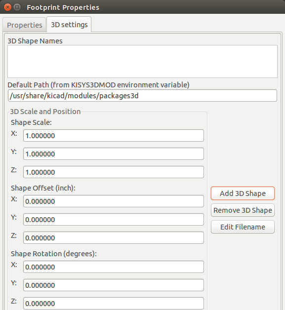
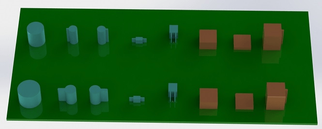

:author: The KiCad Team
:doctype: article
:toc:
:ascii-ids:

= IDF Exporter

_Reference manual_

[[copyright]]
*Copyright*

This document is Copyright (C) 2014-2015 by it's contributors as listed below.
You may distribute it and/or modify it under the terms of either the GNU
General Public License (http://www.gnu.org/licenses/gpl.html), version 3
or later, or the Creative Commons Attribution License
(http://creativecommons.org/licenses/by/3.0/), version 3.0 or later.

All trademarks within this guide belong to their legitimate owners.

[[contributors]]
*Contributors*

Cirilo Bernardo

[[feedback]]
*Feedback*

Please direct any bug reports, suggestions or new versions to here:

- About KiCad document: https://github.com/KiCad/kicad-doc/issues

- About KiCad software: https://bugs.launchpad.net/kicad

- About KiCad software i18n: https://github.com/KiCad/kicad-i18n/issues

[[version_info]]
*Version info*

include::../../version_info.txt[]

//Since docbook "article" is more compact, I have to separate this page
<<<<

== Introduction to the IDFv3 exporter

The IDF exporter exports an IDFv3
footnote:[http://www.simplifiedsolutionsinc.com/images/idf_v30_spec.pdf]
compliant board (.emn) and library (.emp) file for communicating
mechanical dimensions to a mechanical CAD package. The exporter
currently exports the board outline and cutouts, all pad and mounting
thru-holes including slotted holes, and component outlines; this is the
most basic set of mechanical data required for interaction with
mechanical designers. All other entities described in the IDFv3
specification are currently not exported.

== Specifying component models for use by the exporter

The IDF exporter makes use of the 3D model file attribute which was
originally used by the 3D viewer. Since the 3D viewer, IDF, and possible
future mechanical CAD exporters are generally interested in different
types of file format, it is possible to use the 3D model file attribute
to specify models for multiple exporters.

From within the Footprint Editor or Pcbnew, edit the footprint parameters
and click on the 3D settings tab (see link:#figure-1[figure 1]), click on Add 3D
Shape, and select the filter "IDFv3 component files (*.idf)" (see
link:#figure-2[figure 2]). Select the desired outline file and enter any
necessary values for the offset and rotation. Note that only the offset
values and the Z rotation value are used by the IDF exporter; all other
values are ignored. The offsets must be specified using the IDF board
output units (mm or thou) and in the IDF coordinate system, that is a
right-hand coordinate system with +Z moving towards the viewer, +X is to
the viewer's right, and +Y is up. The rotation must be in degrees and a
positive rotation is a counter-clockwise rotation as described in the
IDFv3 specification. Multiple outlines may be combined with appropriate
offsets to represent simple assemblies such as a DIP package in a
socket. [**BUG:** in discussions it has been decided that the unit
of the Z offset should be inches, which is consistent with the
units of the VRML model offset. It may also be useful not to ignore the
(X,Y) offset values. The behavior mentioned here will change at some
point in the future.]

Once models have been specified for all desired components, from within
pcbnew select the *File* menu then *Export* and finally **IDFv3
Export**. A dialog box will pop up (see link:#figure-3[figure 3]) which
allows the output filename and IDF output units (mm or mils) to be set.
The exported IDF files can be viewed in the free mechanical CAD software
http://www.freecadweb.org/[FreeCAD] or converted to VRML using the
idf2vrml tool and viewed with any suitable VRML viewer.

[[figure-1]]
.Footprint properties, 3D settings

[[figure-2]]
.IDF component outline selection
image::images/idf_select.png[scaledwidth="70%",alt="IDF component outline selection"]

[[figure-3]]
.IDF output settings
image::images/idf_export.png[scaledwidth="70%",alt="IDF output settings"]

== Creating a component outline file

The component outline file (*.idf) consists of a single .ELECTRICAL or .MECHANICAL
section as described in the specification document. The
section may be preceded by any number of comment lines; the comment
lines are copied by the exporter into the library file and can be used
to track metadata such as references to the documents used to determine
the component's outline and dimensions.

The component outline section contains fields which are strings,
integers, or floating point numbers. A string is a combination of
characters which may include spaces; if a string contains spaces then it
must be quoted. Quotation marks must not appear within a string.
Floating point numbers may be represented using decimal or exponential
notations but decimal notation is preferred for human readability. The
decimal point must be a dot and not a comma. The IDF file must consist
only of 7-bit ASCII characters; use of 8-bit characters will result in
undefined behavior.

An IDF file consists of SECTIONS which consist of RECORDS which consist
of FIELDS. For the IDF outline files only one type of section may exist
and must be one of .ELECTRICAL or .MECHANICAL. A record is a single line
of text and may contain one or more fields. Fields are sequences of
characters separated by one or more spaces which do not appear between
quotation marks. All fields of a record must appear on a single line;
records may not span lines.

The section heading (.ELECTRICAL or .MECHANICAL) is considered the first
record (Record 1) of the section. Record 1 must be followed by Record 2
which has four fields:

1.  Geometry Name: a string which in combination with the Part Number
    must form a unique identifier for the component outline. For
    standardized packages, the package name is a good value for the
    geometry name, for example "SOT-23". For unique packages the
    manufacturer's part number is a good choice for the geometry name.

2.  Part Number: although obviously intended for the part number, for
    example BS107, it is better to use this string to help describe the
    package. For example if the geometry name is "TO-92", the part number
    entry may be used to describe the layout of the pads or the
    orientation of this particular TO-92 outline file.

3.  IDF Unit: this must be one of MM or THOU and it applies only to the
    units describing this single component outline.

4.  Height: this is a floating point number representing the nominal
    height of the component using units specified in Field 3.

Record 2 must be followed by a number of Record 3 entries which specify
the outline of the component. Record 3 consists of four fields:

1.  Loop Index: 0 (outline points are specified in counter-clockwise
    order) or 1 (outline points are specified in clockwise order)

2.  X coordinate: a floating point number

3.  Y coordinate: a floating point number

4.  Included Angle: a floating point number. If the value is 0 then a
    straight line segment is drawn from the previous point to this point.
    If the value is 360 then the previous point specifies the center of a
    circle and this point specifies a point on the circle; never specify
    a circle using a value of -360 as at least one major mechanical CAD
    package does not behave well in that situation. If the value is
    negative then a clockwise arc is drawn from the previous point to
    this point and if the value is positive then a counter-clockwise
    arc is drawn.

Only one closed loop is permitted and it is not possible to specify a
cutout. The last point specified must be the same as the first point
unless the outline is a circle.

Example IDF File 1:

--------------------------------------------------------------------
# a simple cylinder - this could represent an electrolytic capacitor
.ELECTRICAL
    "cylinder" "5mm OD, 5mm height" MM 5
    0 0 0 0
    0 2.5 0 360
.END_ELECTRICAL
--------------------------------------------------------------------

Example IDF File 2:

-------------------------------------------------
# an upside-down T
# a comment added for the sake of adding comments
.ELECTRICAL
    "Capital T" "5x8x10mm, upside down" MM 10
    0 -0.5 8 0
    0 -0.5 0.5 0
    0 -2.5 0.5 0
    0 -2.5 -0.5 180
    0 2.5 -0.5 0
    0 2.5 0.5 180
    0 0.5 0.5 0
    0 0.5 8 0
    0 -0.5 8 180
.END_ELECTRICAL
-------------------------------------------------

== Guidelines for creating outlines

When creating outlines, and especially when sharing the work with
others, consistency in the design and naming of files helps people
locate files quicker and place the components with minimal hassles.

=== Package naming

Try to make some information about the outline available in the filename
to give the user a general idea of what the outline is. For example
axial leaded cylindrical packages may represent some types of capacitors
as well as some types of resistors, so it makes sense to identify an
outline as a horizontal or vertical axial leaded device and to add some
extra information on the relevant dimensions: diameter, length, and
pitch are the most important. If a device has a unique outline, the
manufacturer's part number and a prefix to indicate the class of device
are adequate.

=== Comments

Use comments in the IDF file to give users more information about the
outline, for example a reference to the source used for dimensional
information.

=== Geometry and Part Number entries

Think carefully about the values to give to the Geometry and Part Number
entries. Taken together, these strings act as a unique identifier for
the MCAD system. The values of the strings will ideally have some
meaning to a user, but this is not necessary: the values are primarily
intended for the MCAD system to use as a unique ID. Ideally the values
chosen will be unique within any large collection of outlines; choosing
values well will result in fewer clashes especially in complex boards.

=== Pin orientation and positioning

For through-hole components there are no widely accepted schemes for
determining the pin orientation and component center in 3D models. For
consistency, if there are only 2 pins they must be in a horizontal
arrangement (see link:#figure-4[figure 4]) along the X axis and for 3
pins try to keep 2 in a horizontal arrangement on the X axis. Polarized
devices such as electrolytic or tantalum capacitors must have the
positive lead on Pin 1 and diodes must have the cathode on Pin 1; this is
to maintain compatibility of the schematic symbols with the orientation
defined for SMT devices; however, note that many existing KiCad
schematics and footprints place the anode at Pin 1.

[NOTE]
In the latest revision of the KiCad footprints on github the anode
is now Pin 2 for THT as well as SMT components.

For DIP devices the center of the outline must be at the center of the
rectangle described by the pin locations and Pin 1 is preferably at the
top left corner; this will maintain some consistency with the
standardized orientation of SMT components; however, such a model will
be rotated -90 degrees relative to most existing KiCad component
footprints and VRML models. For items such as a horizontal radial leaded
capacitor or a horizontal TO-220 package, prefer to place the leads in a
row on the X axis and with the body of the device extending upwards (see
link:#figure-4[figure 4]). Non-polarized vertical axial leaded components must
have the wire on the right hand side; polarized vertical axial leaded
components may have the wire on either side, depending on whether Pin 1
is on the lower end (wire on right) or on the upper end (wire on left).

[NOTE]
In the current revision of the KiCad footprint modules the
THT components are being organized with pins along the Y axis
rather than the X axis and Pin 1 of the device is at the origin rather
than at the center of the package. Orient and position the component outline
to suit your specific footprints; this will avoid the need to specify a
non-zero rotation for the IDF component outlines. Since the IDF
exporter currently ignores the (X,Y) offset values it is vital that
you use the correct origin in the IDF component outline.

For SMT components the orientation, package center, and outline are
defined by various standards. Use the standard appropriate to your work.
Also keep in mind that many devices do not conform to any standard; in
such cases the offending device is probably best identified by using the
manufacturer's part number in the outline file name. In general, an SMT
outline is a rectangle encompassing the component package and including
the leads; the package is oriented such that Pin 1 is as close as
possible to the top left corner and the top left corner is usually
chamfered for visual reference.

[[figure-4]]
.Sample outlines generated by the programs idfcyl and idfrect and rendered by SolidWorks.

From left to right are (a) vertical radial leaded cylinder, (b) vertical
axial leaded cylinder with wire on left, (c) vertical axial leaded
cylinder with wire on right, (d) horizontal axial leaded cylinder, (e)
horizontal radial leaded cylinder, (f) square outline, plain, (g) square
outline with chamfer, (h) square outline with axial lead on right. The
top outlines were specified in units of millimeters while the bottom
outlines were specified in units of inches.

=== Tips on dimensions

The purpose served by the extruded outlines is to give the mechanical
designer some idea of the location and physical space occupied by each
component. In a typical scenario the mechanical designer will replace
some of the crude outlines with more detailed mechanical models, for
example when checking to ensure that a right-angle mounted LED will fit
into a hole on a panel. In most situations the accuracy of an outline
doesn't matter, but it is good practice to create outlines which convey
the best mechanical information possible. In a few instances a user may
wish to fit the component into a case with very little excess space, for
example in a portable music player. In such a situation, if most
extruded outlines are a good enough representation of components then
the mechanical designer may only have to replace very few models while
designing the case. If the outlines are not a reliable reflection of
reality then the mechanical designer will waste a lot of time replacing
models to ensure a good fit. After all, if you put garbage in you can
expect garbage to come out. If you put in good information, you can be
confident of good results.

== IDF Component Outline Tools

A number of command-line tools are available to help generate IDF
component outlines. The tools are:

1.  *idfcyl:* creates an outline of a cylinder in vertical or horizontal
    orientation and with axial or radial leads

2.  *idfrect:* creates an outline of a rectangle which may have either
    an axial lead or a chamfer in the top left corner

3.  *dxf2idf:* converts a drawing in DXF format into an IDF component
    outline

=== idfcyl

When *idfcyl* is invoked with no arguments it prints out a usage note
and a summary of its inputs:

------------------------------------
idfcyl: This program generates an outline for a cylindrical component.
    The cylinder may be horizontal or vertical.
    A horizontal cylinder may have wires at one or both ends.
    A vertical cylinder may have at most one wire which may be
    placed on the left or right side.

Input:
    Unit: mm, in (millimeters or inches)
    Orientation: V (vertical)
    Lead type: X, R (axial, radial)
    Diameter of body
    Length of body
    Board offset
    *   Wire diameter
    *   Pitch
    **  Wire side: L, R (left, right)
    *** Lead length
    File name (must end in *.idf)

    NOTES:
        *   only required for horizontal orientation or
            vertical orientation with axial leads

        **  only required for vertical orientation with axial leads

        *** only required for horizontal orientation with radial leads
------------------------------------

The notes can be suppressed by entering any arbitrary argument on the
command line. A user can manually enter information at the command line
or create scripts to generate outlines. The following script creates a
single cylinder axial leaded outline with the lead on the right hand side:

[source,bash]
----------------------------------------------------------------
#!/bin/bash
# Generate a cylindrical IDF outline for test purposes
# vertical 5mm cylinder,  nominal length 8mm + 3mm board offset,
# axial wire on right,  0.8mm wire dia., 3.5mm pitch
idfcyl - 1 > /dev/null <<  _EOF
mm
v
x
5
8
3
0.8
3.5
r
cylvmm_1R_D5_L8_Z3_WD0.8_P3.5.idf
_EOF
----------------------------------------------------------------

=== idfrect

When *idfrect* is invoked with no arguments it prints out a usage note
and a summary of its inputs:

-----------------------------------------------------------------------
idfrect: This program generates an outline for a rectangular component.
    The component may have a single lead (axial) or a chamfer on the
    upper left corner.
Input:
    Unit: mm, in (millimeters or inches)
    Width:
    Length:
    Height:
    Chamfer: length of the 45 deg. chamfer
    *  Leaded: Y,N (lead is always to the right)
    ** Wire diameter
    ** Pitch
    File name (must end in *.idf)

    NOTES:
        *   only required if chamfer = 0

        **  only required for leaded components
-----------------------------------------------------------------------

The notes can be suppressed by entering any arbitrary argument on the
command line. A user can manually enter information at the command line
or create scripts to generate outlines. The following script creates a
chamfered rectangle and an axial leaded outline:

[source,bash]
-------------------------------------------------------------
#!/bin/bash
# Generate various rectangular IDF outlines for test purposes
# 10x10, 1mm chamfer, 2mm height
idfrect - 1 > /dev/null <<  _EOF
mm
10
10
2
1
rectMM_10x10x2_C0.5.idf
_EOF
# 10x10x12,  0.8mm lead on 6mm pitch
idfrect - 1 > /dev/null <<  _EOF
mm
10
10
12
0
Y
0.8
6
rectLMM_10x10x12_D0.8_P6.0.idf
_EOF
-------------------------------------------------------------

=== dxf2idf

The DXF file used to specify the component outline can be prepared with
the free software http://librecad.org/[LibreCAD] for best compatibility.
When *dxf2idf* is invoked with no arguments it prints out a usage note
and a summary of its inputs:

------------------------------------------------------------------
dxf2idf: this program takes line, arc, and circle segments
    from a DXF file and creates an IDF component outline file.

Input:
    DXF filename: the input file, must end in '.dxf'
    Units: mm, in (millimeters or inches)
    Geometry Name: string, as per IDF version 3.0 specification
    Part Name: as per IDF version 3.0 specification of Part Number
    Height: extruded height of the outline
    Comments: all non-empty lines are comments to be added to
        the IDF file. An empty line signifies the end of
        the comment block.
    File name: output filename, must end in '.idf'
------------------------------------------------------------------

The notes can be suppressed by entering any arbitrary argument on the
command line. A user can manually enter information at the command line
or create scripts to generate outlines. The following script creates a
5mm high outline from a DXF file 'test.dxf':

[source,bash]
---------------------------------------------------------------
#!/bin/bash
# Generate an IDF outlines from a DXF file
dxf2idf - 1 > /dev/null << _EOF
test.dxf
mm
DXF TEST GEOMETRY
DXF TEST PART
5
This is an IDF test file produced from the outline 'test.dxf'
This is a second IDF comment to demonstrate multiple comments

test_dxf2idf.idf
_EOF
---------------------------------------------------------------

== idf2vrml

The idf2vrml tool reads a set of one IDF Board (.emn) and one IDF
Component file (.emp) and produces a VRML file which can be viewed
with a VRML viewer. This feature is useful for visualization of the
board assembly in cases where the user does not have access to MCAD
software. Invoking idf2vrml without any arguments will result in the
display of a usage message:

----------------------------------------------------------------------------------
>./idf2vrml
Usage: idf2vrml -f input_file.emn -s scale_factor {-k} {-d} {-z} {-m}
flags:
   -k: produce KiCad-friendly VRML output; default is compact VRML
   -d: suppress substitution of default outlines
   -z: suppress rendering of zero-height outlines
   -m: print object mapping to stdout for debugging purposes
example to produce a model for use by KiCad: idf2vrml -f input.emn -s 0.3937008 -k
>
----------------------------------------------------------------------------------

[**BUG:** The idf2vrml tool currently does not correctly render *OTHER_OUTLINE*
entities in an emn file if that entity is specifies on the back layer
of the PCB; however you will not notice this bug using files exported
by KiCad since there is no mechanism to specify such an entity.
Essentially this bug is only an issue in rare instances where you might
render a third party emn file which does employ the entity on the back
side of a board.]
