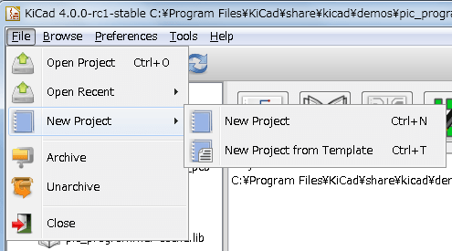

:author: The KiCad Team
:doctype: book
:toc:
:ascii-ids:

= KiCad

_Reference manual_

[[copyright]]
*Copyright*

This document is Copyright (C) 2010-2015 by its contributors as listed
below. You may distribute it and/or modify it under the terms of either
the GNU General Public License  (http://www.gnu.org/licenses/gpl.html),
version 3 or later, or the Creative Commons Attribution License
(http://creativecommons.org/licenses/by/3.0/), version 3.0 or later.

All trademarks within this guide belong to their legitimate owners.

[[contributors]]
*Contributors*

Jean-Pierre Charras, Fabrizio Tappero.

[[feedback]]
*Feedback*

Please direct any bug reports, suggestions or new versions to here:

- About KiCad document: https://github.com/KiCad/kicad-doc/issues

- About KiCad software: https://bugs.launchpad.net/kicad

- About KiCad software i18n: https://github.com/KiCad/kicad-i18n/issues

[[publication_date_and_software_version]]
*Publication date and software version*

2015, may 21.

== Introduction

=== KiCad

KiCad is an open-source software tool for the creation of electronic
schematic diagrams and PCB artwork. Beneath its singular surface, KiCad
incorporates an elegant ensemble of the following software tools:

* *KiCad* : project manager
* *Eeschema* : schematic editor and component editor
* *CvPcb* : footprint selector helper (always run from Eeschema)
* *Pcbnew* : circuit board layout editor and footprint editor
* *GerbView* : Gerber viewer

3 utilities are included

* *Bitmap2Component*: component maker for logos. It creates a schematic
  component or a footprint from a bitmap picture.
* *PcbCalculator*: A calculator that is helpful to calculate
  components for regulators, track width versus current, transmission
  lines...
* *PlEditor*: Page Layout Editor.

These tools are usually run from the project manager, but can be also run
as stand-alone tools.

At the time of writing, KiCad is considered mature and can be used for
the successful development and maintenance of complex electronic boards.

KiCad does not present any board-size limitation and it can
handle up to 32 copper layers, 14 technical layers and 4 auxiliary layers.

KiCad can create all the files necessary for building printed boards:

* Gerber files for photo-plotters
* drilling files
* component location files
* and a lot more.

Being open source (GPL licensed), KiCad represents the ideal tool for
projects oriented towards the creation of electronic hardware with an
open-source flavour.

KiCad is available for Linux, Windows and Apple OS X (still experimental, but is now working well).

=== KiCad files and folders

KiCad creates and uses files with the following specific file extensions (and folders)
for schematic and board editing.

*Project manager file:*
[width="100%",cols="20%,80%",]
|=================================================================
|*.pro |Small file containing a few parameters for the current project, including the component library list.
|=================================================================

*Schematic editor files:*
[width="100%",cols="20%,80%",]
|=================================================================
|*.sch |Schematic files, which do not contain the components themselves.
|*.lib |Schematic component library files, containing the component descriptions: graphic shape, pins, fields.
|*.dcm |Schematic component library documentation, containing some component descriptions:
comments, keywords, reference to data sheets.
|*_cache.lib |Schematic component library cache file, containing a copy of the components used in the schematic project.
|=================================================================

*Board editor files and folders:*
[width="100%",cols="20%,80%",]
|=================================================================
|*.kicad_pcb |Board file containing all info but the page layout.
|*.pretty |Footprint **library folders**. The folder itself is the library.
|*.kicad_mod |Footprint files, containing one footprint description each.
|*.brd |Board file in the legacy format.
Can be read, but not written by the board editor.
|*.mod |Footprint library in the legacy format.
Can be read by the footprint or the board editor, but not written.
|fp-lib-table |Footprint library list (_footprint libraries table_):
list of footprint libraries (various formats) which are loaded
by the board or the footprint editor or CvPcb.
|=================================================================

*Common files:*
[width="100%",cols="20%,80%",]
|=================================================================
|*.kicad_wks |The page layout description files, for people who want a worksheet
with a custom look.
|*.net |Netlist file created by the schematic, and read by the board editor.
This file is associated to the .cmp file, for users who prefer a separate file
for the component/footprint association.
|=================================================================

*Special file:*
[width="100%",cols="20%,80%",]
|=================================================================
|*.cmp |Stores the association between components used in the schematic and their footprints.

It can be created by Pcbnew, and imported by Eeschema.

The purpose is a back import from Pcbnew to Eeschema, for users
who change footprints inside Pcbnew (for instance using _Exchange Footprints_ command)
and want to import these changes in schematic.
|=================================================================

*Other files:*

They are generated by KiCad for fabrication or documentation.
[width="100%",cols="20%,80%",]
|=================================================================
|*.gbr |Gerber files, for fabrication
|*.drl |Drill files (Excellon format), for fabrication.
|*.pos |Position files (ascii format), for automatic insertion machines.
|*.rpt |Report files (ascii format), for documentation.
|*.ps |Plot files (postscript), for documentation.
|*.pdf |Plot files (pdf format), for documentation.
|*.svg |Plot files (svg format), for documentation.
|*.dxf |Plot files (dxf format), for documentation.
|*.plt |Plot files (HPGL format), for documentation.
|=================================================================

== Installation and configuration

=== Display options

Pcbnew needs the support of OpenGL v2.1 or more.

=== Initialization of the default configuration

A default configuration file named _kicad.pro_ is supplied in
kicad/template. It serves as a template for any new project.

If an other default configuration file named _fp-lib-table_ exists,
it will be used only once to create a footprint library list.
(or else, this list will be created from scratch)

*The default file _kicad.pro_ can be freely modified if necessary,
mainly to set the list of library files loaded by Eeschema.*

A few other parameters (default text size, default line thickness, mainly
for Pcbnew) are stored here.

Verify that you have write access to kicad/template/kicad.pro

Run KiCad and load _kicad.pro_ project.

Run Eeschema via KiCad.
Modify and update the Eeschema configuration,
and mainly the list of libraries you want to use each
time you create new projects.

Run Pcbnew via KiCad.
Modify and update the Pcbnew configuration, especially the footprint library list.
Pcbnew will create or update a library list file called **footprint library table**.
There are 2 library list files (named fp-lib-table).
The first (located in the user home directory) is global for all projects.
The second, if it exists (located in the project directory) is specific to the project.

=== Initialization of some options and utilities

When using KiCad, a text editor and a PDF viewer are useful.
Setting them is a good idea.

These settings are accessible from the Preference menu

image::images/preferences_menu.png[scaledwidth="80%"]

3 options are especially important:

* Configure Paths
* PDF Viewer
* Set Text Editor

=== Configuration of paths
In KiCad, one can define some paths using an __environment variable__.
A few environment variables are internally defined by KiCad,
and can be used to define paths (for libraries, 3D shapes, etc).

This is useful when absolute paths are not known or are subject to change.
This is the case for ``official'' libraries built for KiCad:

* for the path of these libraries, when installed on your disk
* for the path of 3D shapes files used in footprint definitions.

For instance, the full path of _connect.pretty_ footprint library is
defined like this, when using the KISYSMOD environment variable to define
the full path:
${KISYSMOD}/connect.pretty

Obviously, one can use a usual full path definition, if this full path is
well known, and never changes.

This option allows you to define some paths from an environment variable,
and add your own environment variables, to define personal paths, if needed.

[width="100%",cols="20%,80%",]
|=================================================================
|KIGITHUB |frequently used in footprint lib tables examples.
If you are using this variable, it must be defined.
|KISYS3DMOD |default base path of 3D shapes files,
and must be defined, because an absolute path is not usually used.
|KISYSMOD |default base path of footprint library folders,
and must be defined, if an absolute path is not used in footprint library names.
|=================================================================

image::images/configure_path_dlg.png[scaledwidth="80%"]

_Note also the environment variable_

* *KIPRJMOD*

is *always* internally defined by KiCad, and is the **current project absolute path**.

For instance, *_$\{KIPRJMOD\}/connect.pretty_* is always the *_connect.pretty_*
folder (the pretty footprint library) found **_inside the current project folder_**.

* *If you modify the configuration of paths, please quit and rerun KiCad,
  to avoid any issues in path handling.*

=== Initialization of the text editor
Before using a text editor to browse/edit files in the current project,
you have to choose the text editor you want to use. The menu:

_Preferences/SetText Editor_

allows you to set the text editor to use.

=== Initialization of the PDF viewer
You can use the default PDF viewer or choose your own PDF viewer

Select _Preferences/PDF Viewer/Favourite PDF Viewer_ to choose your favourite (default) PDF Viewer.

Your own (non default) viewer is chosen by using the _Preferences/PDF Viewer/SetPDF Viewer_ menu.

On Linux, the default PDF viewer is known to be sometimes strange,
so using _Favourite PDF Viewer_ after selecting a suitable PDF viewer
is mandatory.

=== KiCad: principles of use

In order to manage a KiCad project: schematic files, printed circuit
board files, supplementary libraries, manufacturing files for
photo-tracing, drilling and automatic component placement files, it is
recommended to create a project as follows:

* *Create a working directory for the project* (using KiCad or by other
  means).
* *In this directory, use KiCad to create a project file* (file with
  extension .pro) via the "Create a new project"
  or "Create a new project from template" icon.

[WARNING]
It is recommended to use a unique directory for each KiCad project.
Do not combine multiple projects into a single directory.

KiCad creates a file with a .pro extension that maintains a number of
parameters for project management (such as the list of libraries
used in the schematic). Default names of both main schematic file
and printed circuit board file are
derived from the name of the project. Thus, if a project called
_example.pro_ was created in a directory called _example_ , the default
files will be created:

[width="100%",cols="27%,73%",]
|=================================================================
|example.pro |project management file.
|example.sch |main schematic file.
|example.kicad_pcb |printed circuit board file.
|example.net |netlist file.
|example.xxx |various files created by the other utility programs.
|example-cache.lib|library file automatically created and used by the
schematic editor.
(It contains a backup of the components used in the schematic).
|=================================================================

== Use KiCad Manager

The KiCad Manager (kicad or kicad.exe file) is a tool which can easily run the other tools
(editors, gerber viewer and utility tools) when creating a design.

Running the other tools from KiCad manager has some advantages:

* cross probing between schematic editor and board editor.

* cross probing between schematic editor and footprint selector (CvPcb).

But you can only edit the current project files.

(When these tools are run in _stand alone_ mode, you can open any file in any project
but cross probing between tools can give strange results)

=== Main window

image::images/main_window.png[scaledwidth="90%"]

The main KiCad window is composed of a project tree view, a launch pane
containing buttons used to run the various software tools, and a message
window. The menu and the toolbar can be used to create, read and save
project files.

=== Utility launch pane

KiCad allows you to run all stand alone software tools that come with
it.

The launch pane is made of the 8 buttons below that correspond to the
following commands (1 to 8, from left to right):

image::images/launch_pane.png[scaledwidth="80%"]

[width="100%",cols="4%,20%,76%",]
|=======================================================================
|1 |*Eeschema* |The schematic editor.
|2 |*LibEdit* |The component editor and component library manager.
|3 |*Pcbnew* |The board layout editor.
|4 |*FootprintEditor* |The footprint editor and footprint library manager.
|5 |*Gerbview* |A GERBER file viewer. It can also show drill files.
|6 |*Bitmap2component* |A tool to build a footprint or a component from
a B&W bitmap image to create logos.
|7 |*Pcb Calculator* |A tool to calculate track widths, and many other
things.
|8 |*Pl Editor* |The Page Layout editor, to create/customize frame
references.
|=======================================================================

=== Project tree view

image::images/project_tree.png[scaledwidth="35%"]

*   Double-clicking on the Eeschema icon runs the schematic editor which in
    this case will open the file pic_programmer.sch.

*   Double-clicking on the Pcbnew icon runs the layout editor, in this case
    opening the file pic_programmer.kicad_pcb.

*   Right clicking on any of the files in the project tree allows generic
    file manipulation.

=== Top toolbar

image::images/main_toolbar.png[scaledwidth="40%"]

KiCad top toolbar allows for some basic files operation (from left to
right).

[width="100%",cols="26%,74%",]
|=======================================================================
|image:images/icons/new_project.png[]
|Create a project file. If the template kicad.pro is found in
kicad/template, it is copied into the working directory.
|image:images/icons/new_project_with_template.png[]
|Create a project from a template.
|image:images/icons/open_project.png[]
|Open an existing project.
|image:images/icons/save_project.png[]
|Update and save the current project tree.
|image:images/icons/zip.png[]
|Create a zip archive of the whole project. This includes schematic
files, libraries, pcb, etc.
|image:images/icons/reload.png[]
|Rebuild and redraw the tree list, sometimes needed after a tree change.
|=======================================================================

== Using templates

=== Definitions

A template is a directory of files, which includes a directory of
metadata.

The template system name (SYSNAME) is the directory name under which the
template files are stored. The metadata directory (METADIR) contains
pre-defined files which provide information about the template.

All files and directories in a template are copied to the new project
path when a project is created using a template, except METADIR.

All files and directories which start with SYSNAME will have SYSNAME
replaced by the new project file name, excluding the file extension.

=== Templates

They facilitate the easy setup of projects which have common attributes
such as pre-defined board outlines, connector positions, schematic
elements, design rules, etc. .

==== Metadata

A template's METADIR must contain the required files, and might
optionally contain any of the optional files.

==== Required Files:

*meta/info.html*

Contains html formatted information about the template which is used by
the user to determine if the template is what they are after. The
<title> tag determines the actual name of the template that is exposed
to the user for template selection.

Using html to format this document means that images can be in-lined
without having to invent a new scheme.

Only a basic HTML language can be used to format this document.

==== Optional Files:

*meta/icon.png*

A 64 x 64 pixels PNG icon file which is used as a clickable icon in the
template selection dialog.

==== Example:

Here is a template for a raspberrypi-gpio board:

image::images/template_tree.png[scaledwidth="70%"]

And the meta data info:

image::images/template_tree_meta.png[scaledwidth="70%"]

brd.png is an optional file

Here is an info.html file sample:

[source,html]
----------------------------------------------------------------
<!DOCTYPE HTML PUBLIC "-//W3C//DTD HTML 4.0 Transitional//EN">
<HTML>
<HEAD>
<META HTTP-EQUIV="CONTENT-TYPE" CONTENT="text/html;
charset=windows-1252">
<TITLE>Raspberry Pi - Expansion Board</TITLE>
<META NAME="GENERATOR" CONTENT="LibreOffice 3.6 (Windows)">
<META NAME="CREATED" CONTENT="0;0">
<META NAME="CHANGED" CONTENT="20121015;19015295">
</HEAD>
<BODY LANG="fr-FR" DIR="LTR">

This project template is the basis of an expansion board for the
<A HREF="http://www.raspberrypi.org/" TARGET="blank">Raspberry Pi $25
ARM board.</A>   This base project includes a PCB edge defined
as the same size as the Raspberry-Pi PCB with the connectors placed
correctly to align the two boards. All IO present on the Raspberry-Pi
board is connected to the project through the 0.1&quot; expansion
headers.   The board outline looks like the following:

    

(c)2012 Brian Sidebotham (c)2012 KiCad Developers

</BODY>
</HTML>
----------------------------------------------------------------

==== Operation

The KiCad File menu New shows 2 option:

- *Blank Project* Create a blank project by just copying
  template/kicad.pro to the current folder.
- *Project from Template* Opens the template selection dialog. The
  template selection dialog has a list of icons, and a display window. A
  single click on a template's icon on the top will load that templates
  info.html metadata file and display it in the display window. A click on
  the OK button starts the new project creation. The template will be
  copied to the new project location (excluding METADIR as mentioned
  earlier) and any files that match the string replacement rules will be
  renamed to reflect the new project's name.

image::images/template_selector.png[scaledwidth="80%"]

After selection of a template:

image::images/template_selected.png[scaledwidth="80%"]

==== Templates Location:

The list of available templates are gathered from the following sources:

- For system templates:
  <kicad bin dir>/../share/template/

- For user templates:

  ** on Unix:
     ~/kicad/templates/

  ** on Windows:
     C:\Documents and Settings\username\My Documents\kicad\templates

  ** on Mac:
     ~/Documents/kicad/templates/

- When the environment variable KICAD_PTEMPLATES is defined, there is a
  third page: Portable Templates, which lists templates found in
  KICAD_PTEMPLATES path.

