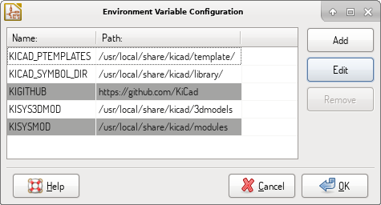
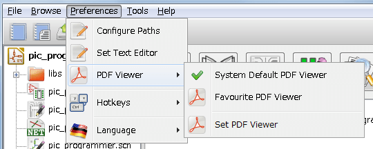
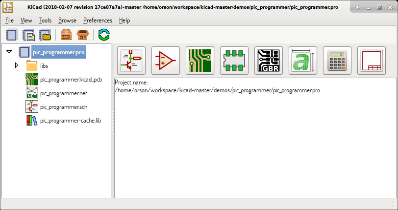
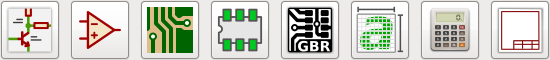
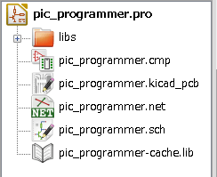
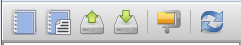
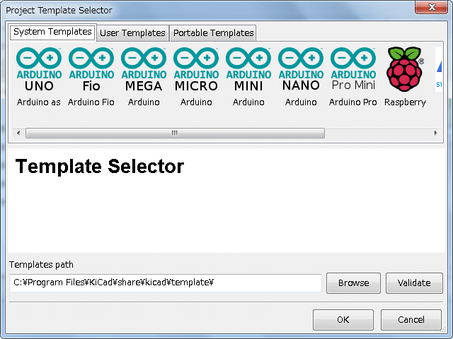
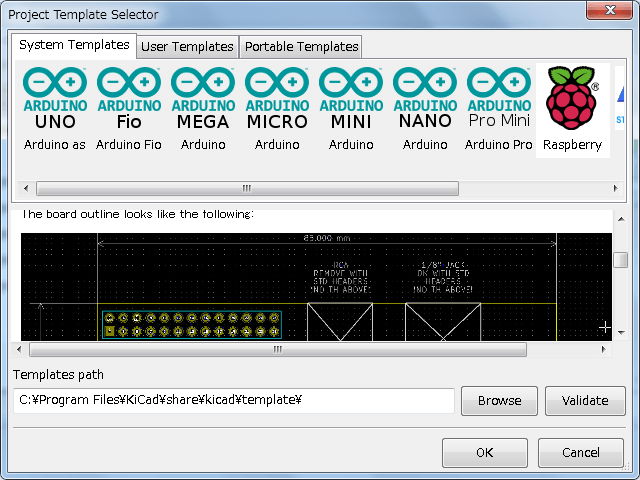
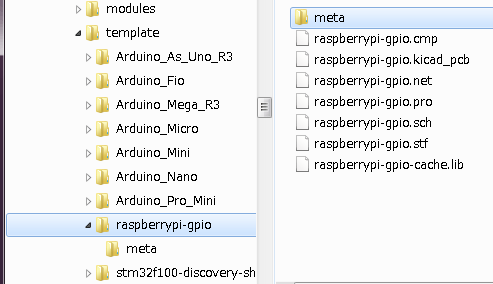
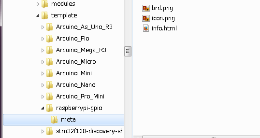

:author: The KiCad Team
:doctype: book
:toc:
:ascii-ids:

= KiCad

_Reference manual_

[[copyright]]
*Copyright*

This document is Copyright (C) 2010-2018 by its contributors as listed
below. You may distribute it and/or modify it under the terms of either
the GNU General Public License  (http://www.gnu.org/licenses/gpl.html),
version 3 or later, or the Creative Commons Attribution License
(http://creativecommons.org/licenses/by/3.0/), version 3.0 or later.

All trademarks within this guide belong to their legitimate owners.

[[contributors]]
*Contributors*

Jean-Pierre Charras, Fabrizio Tappero.

[[feedback]]
*Feedback*

Please direct any bug reports, suggestions or new versions to here:

- About KiCad document: https://github.com/KiCad/kicad-doc/issues

- About KiCad software: https://bugs.launchpad.net/kicad

- About KiCad translation: https://github.com/KiCad/kicad-i18n/issues

[[publication_date_and_software_version]]
*Publication date and software version*

2015, May 21.

== Introduction

=== KiCad

KiCad is an open-source software tool for the creation of electronic
schematic diagrams and PCB artwork. Beneath its singular surface, KiCad
incorporates an elegant ensemble of the following software tools:

* *KiCad*: Project manager
* *Eeschema*: Schematic editor and component editor
* *Pcbnew*: Circuit board layout editor and footprint editor
* *GerbView*: Gerber viewer

3 utility tools are also included:

* *Bitmap2Component*: Component maker for logos. It creates a schematic
  component or a footprint from a bitmap picture.
* *PcbCalculator*: A calculator that is helpful to calculate
  components for regulators, track width versus current, transmission
  lines, etc.
* *Pl Editor*: Page layout editor.

These tools are usually run from the project manager, but can be also run
as stand-alone tools.

KiCad does not present any board-size limitation and it can
handle up to 32 copper layers, 14 technical layers and 4 auxiliary layers.

KiCad can create all the files necessary for building printed circuit boards, including:

* Gerber files for photo-plotters
* drilling files
* component location files

Being open source (GPL licensed), KiCad represents the ideal tool for
projects oriented towards the creation of electronic hardware with an
open-source flavour.

KiCad is available for Linux, Windows and Apple macOS.

=== KiCad files and folders

KiCad creates and uses files with the following specific file extensions (and folders)
for schematic and board editing.

*Project manager file:*
[width="100%",cols="20%,80%",]
|=================================================================
|*.pro |Small file containing a few parameters for the current project, including the component library list.
|=================================================================

*Schematic editor files:*
[width="100%",cols="20%,80%",]
|=================================================================
|*.sch |Schematic files, which do not contain the components themselves.
|*.lib |Schematic component library files, containing the component descriptions: graphic shape, pins, fields.
|*.dcm |Schematic component library documentation, containing some component descriptions:
comments, keywords, reference to data sheets.
|*_cache.lib |Schematic component library cache file, containing a copy of the components used in the schematic project.
|sym-lib-table |Symbol library list (_symbol library table_):
list of symbol libraries available in the schematic editor.
|=================================================================

*Board editor files and folders:*
[width="100%",cols="20%,80%",]
|=================================================================
|*.kicad_pcb |Board file containing all info but the page layout.
|*.pretty |Footprint library folders. The folder itself is the library.
|*.kicad_mod |Footprint files, containing one footprint description each.
|*.brd |Board file in the legacy format.
Can be read, but not written, by the current board editor.
|*.mod |Footprint library in the legacy format.
Can be read by the footprint or the board editor, but not written.
|fp-lib-table |Footprint library list (_footprint library table_):
list of footprint libraries (various formats) which are loaded
by the board or the footprint editor or CvPcb.
|=================================================================

*Common files:*
[width="100%",cols="20%,80%",]
|=================================================================
|*.kicad_wks |Page layout description files, for people who want a worksheet
with a custom look.
|*.net |Netlist file created by the schematic, and read by the board editor.
This file is associated to the .cmp file, for users who prefer a separate file
for the component/footprint association.
|=================================================================

*Special file:*
[width="100%",cols="20%,80%",]
|=================================================================
|*.cmp |Association between components used in the schematic and their footprints.
It can be created by Pcbnew and imported by Eeschema.
Its purpose is to import changes from Pcbnew to Eeschema, for users
who change footprints inside Pcbnew (for instance using _Exchange Footprints_ command)
and want to import these changes in schematic.
|=================================================================

*Other files:*

They are generated by KiCad for fabrication or documentation.
[width="100%",cols="20%,80%",]
|=================================================================
|*.gbr |Gerber files, for fabrication.
|*.drl |Drill files (Excellon format), for fabrication.
|*.pos |Position files (ASCII format), for automatic insertion machines.
|*.rpt |Report files (ASCII format), for documentation.
|*.ps |Plot files (Postscript), for documentation.
|*.pdf |Plot files (PDF format), for documentation.
|*.svg |Plot files (SVG format), for documentation.
|*.dxf |Plot files (DXF format), for documentation.
|*.plt |Plot files (HPGL format), for documentation.
|=================================================================

== Installation and configuration

=== Display options

Hardware accelerated renderer in Pcbnew and Gerbview requires video card with
support of OpenGL v2.1 or higher.

=== Initialization of the default configuration

The default configuration file named *kicad.pro* is supplied in
kicad/template. It serves as a template for any new project and
is used to set the list of library files loaded by Eeschema.
A few other parameters for Pcbnew (default text size, default line
thickness, etc.) are also stored here.

Another default configuration file named *fp-lib-table* may exist.
It will be used only once to create a footprint library list;
otherwise the list will be created from scratch.

=== Modifying the default configuration

The default *kicad.pro* file can be freely modified, if desired.

Verify that you have write access to kicad/template/kicad.pro

Run KiCad and load *kicad.pro* project.

Run Eeschema via KiCad manager.
Modify and update the Eeschema configuration,
to set the list of libraries you want to use each
time you create new projects.

Run Pcbnew via KiCad manager.
Modify and update the Pcbnew configuration, especially the footprint library list.
Pcbnew will create or update a library list file called **footprint library table**.
There are 2 library list files (named fp-lib-table):
The first (located in the user home directory) is global for all projects and
the second (located in the project directory) is optional and specific to the project.

=== Paths configuration

In KiCad, one can define paths using an __environment variable__.
A few environment variables are internally defined by KiCad,
and can be used to define paths for libraries, 3D shapes, etc.

This is useful when absolute paths are not known or are subject to change (e.g.
when you transfer a project to a different computer), and also when one base
path is shared by many similar items. Consider the following which may be
installed in varying locations:

* Eeschema component libraries
* Pcbnew footprint libraries
* 3D shape files used in footprint definitions

For instance, the path to the *_connect.pretty_* footprint library,
when using the *KISYSMOD* environment variable, would be defined as
*_$\{KISYSMOD\}/connect.pretty_*

This option allows you to define a path using an environment variable,
and add your own environment variables to define personal paths, if needed.

*KiCad environment variables:*
[width="100%",cols="20%,80%",]
|=================================================================
|KICAD_PTEMPLATES |Templates used during project creation.
If you are using this variable, it must be defined.
|KICAD_SYMBOL_DIR |Base path of symbol library files.
|KIGITHUB |Frequently used in example footprint lib tables.
If you are using this variable, it must be defined.
|KISYS3DMOD |Base path of 3D shapes files,
and must be defined because an absolute path is not usually used.
|KISYSMOD |Base path of footprint library folders,
and must be defined if an absolute path is not used in footprint library names.
|=================================================================

Note also the environment variable *KIPRJMOD* is *always* internally
defined by KiCad, and is the **current project absolute path**.

For instance, *_$\{KIPRJMOD\}/connect.pretty_* is always the *_connect.pretty_*
folder (the pretty footprint library) found inside **the current project folder**.

*If you modify the configuration of paths, please quit and restart KiCad
to avoid any issues in path handling.*

=== Initialization of external utilities

You may define your favorite text editor and PDF viewer. These settings are
used whenever you want to open a text or PDF file.

These settings are accessible from the Preference menu:

==== Selection of text editor

Before using a text editor to browse/edit files in the current project,
you must choose the text editor you want to use.

Select *_Preferences -> Set Text Editor_* to set the text editor you want to use.

==== Selection of PDF viewer

You may use the default PDF viewer or choose your own.

To change from the default PDF viewer use
*_Preferences -> PDF Viewer -> Set PDF Viewer_* to choose the PDF viewer program,
then select *_Preferences -> PDF Viewer -> Favourite PDF Viewer_*.

On Linux the default PDF viewer is known to be fragile, so selecting
your own PDF viewer is recommended.

=== Creating a new project

In order to manage a KiCad project consisting of schematic files, printed
circuit board files, supplementary libraries, manufacturing files for
photo-tracing, drilling and automatic component placement files, it is
recommended to create a project as follows:

* *Create a working directory for the project* (using KiCad or by other
  means).
* *In this directory, use KiCad to create a project file* (file with
  extension .pro) via the "Create a new project"
  or "Create a new project from template" icon.

WARNING: Use a unique directory for each KiCad project.
Do not combine multiple projects into a single directory.

KiCad creates a file with a .pro extension that maintains a number of
parameters for project management (such as the list of libraries
used in the schematic). Default names of both main schematic file
and printed circuit board file are
derived from the name of the project. Thus, if a project called
*example.pro* was created in a directory called *example*, the default
files will be created:

[width="100%",cols="27%,73%",]
|=================================================================
|example.pro |Project management file.
|example.sch |Main schematic file.
|example.kicad_pcb |Printed circuit board file.
|example.net |Netlist file.
|example.* |Various files created by the other utility programs.
|example-cache.lib|Library file automatically created and used by the
schematic editor containing a backup of the components used in the schematic.
|=================================================================

=== Importing a foreign project ===

KiCad is able to import files created using other software packages. Currently
only Eagle 6.x or newer (XML format) is supported.

To import a foreign project, you need to select either a schematic or a board file in the import file browser dialog.
Imported schematic and board files should have the same base file name (e.g. project.sch and project.brd).
Once the requested files are selected, you will be asked to select a directory to store the imported files, which are going to be saved as a KiCad project.

== Using KiCad project manager

KiCad project manager (kicad or kicad.exe) is a tool which can easily run the other tools
(schematic and PCB editors, Gerber viewer and utility tools) when creating a design.

Running the other tools from KiCad manager has some advantages:

* cross probing between schematic editor and board editor.

* cross probing between schematic editor and footprint selector (CvPcb).

However, you can only edit the current project files. When these tools are run in
_stand alone_ mode, you can open any file in any project but cross probing between
tools can give strange results.

=== Project manager window

The main KiCad window is composed of a project tree view, a launch pane
containing buttons used to run the various software tools, and a message
window. The menu and the toolbar can be used to create, read and save
project files.

=== Utility launch pane

KiCad allows you to run all standalone software tools that come with
it.

The launch pane is made of the 8 buttons below that correspond to the
following commands (1 to 8, from left to right):

[width="100%",cols="4%,20%,76%",]
|=======================================================================
|1 |*Eeschema* |Schematic editor.
|2 |*LibEdit* |Component editor and component library manager.
|3 |*Pcbnew* |Board layout editor.
|4 |*FootprintEditor* |Footprint editor and footprint library manager.
|5 |*Gerbview* |Gerber file viewer. It can also display drill files.
|6 |*Bitmap2component* |Tool to build a footprint or a component from
a B&W bitmap image to create logos.
|7 |*Pcb Calculator* |Tool to calculate track widths, and many other
things.
|8 |*Pl Editor* |Page layout editor, to create/customize frame
references.
|=======================================================================

=== Project tree view

Double-clicking on the schematic file runs the schematic editor, in
this case opening the file *pic_programmer.sch*.

Double-clicking on the board file runs the layout editor, in this case
opening the file *pic_programmer.kicad_pcb*.

Right clicking on any of the files in the project tree allows generic
file manipulation.

=== Top toolbar

KiCad top toolbar allows for some basic file operations:

[width="100%",cols="26%,74%",]
|=======================================================================
|
|Create a new project. If the default template file (kicad.pro) is found in
*kicad/template*, it is copied into the working directory.
|
|Create a new project from an existing template.
|
|Open an existing project.
|
|Update and save the current project tree.
|
|Create a zip archive of the whole project. This includes schematic
files, libraries, PCB, etc.
|
|Refresh the tree view, sometimes needed after a tree change.
|=======================================================================

== Project templates

Using a project template facilitates setting up a new project with predefined
settings. Templates may contain pre-defined board outlines, connector
positions, schematic elements, design rules, etc. Complete schematics and/or
PCBs used as seed files for the new project may even be included.

=== Using templates

The *_File -> New Project -> New Project from Template_* menu will
open the Project Template Selector dialog:

A single click on a template's icon will display the template information,
and a further click on the OK button creates the new project. The template
files will be copied to the new project location and renamed to reflect
the new project's name.

After selection of a template:

=== Template Locations:

KiCad looks for template files in the following paths:

- System templates:
  <kicad bin dir>/../share/kicad/template/

- User templates:

  ** Unix:
     ~/kicad/templates/

  ** Windows:
     C:\Documents and Settings\username\My Documents\kicad\templates

  ** Mac:
     ~/Documents/kicad/templates/

- When the environment variable KICAD_PTEMPLATES is defined there is a
  third tab, Portable Templates, which lists templates found at the
  KICAD_PTEMPLATES path.

=== Creating templates

The template name is the directory name where the template
files are stored. The metadata directory is a subdirectory
named *meta* containing files describing the template.

All files and directories in a template are copied to the new project
path when a project is created using a template, except *meta*.

When a new project is created from a template, all files and directories
starting with the template name will be renamed with the new project file name,
excluding the file extension.

The metadata consists of one required file, and may contain optional files.
All files must be created by the user using a text editor or previous
KiCad project files, and placed into the required directory structure.

Here is an example showing project files for *raspberrypi-gpio* template:

And the metadata files:

==== Required File:

[width="100%",cols="20%,80%",]
|=================================================================
|meta/info.html |HTML-formatted information describing the template.
|=================================================================

The <title> tag determines the actual name of the template that is exposed
to the user for template selection. Note that the project template name
will be cut off if it's too long. Due to font kerning, typically 7 or 8
characters can be displayed.

Using HTML means that images can be easily in-lined without having to
invent a new scheme. Only basic HTML tags can be used in this document.

Here is a sample *info.html* file:

[source,html]
----------------------------------------------------------------
<!DOCTYPE HTML PUBLIC "-//W3C//DTD HTML 4.0 Transitional//EN">
<HTML>
<HEAD>
<META HTTP-EQUIV="CONTENT-TYPE" CONTENT="text/html;
charset=windows-1252">
<TITLE>Raspberry Pi - Expansion Board</TITLE>
<META NAME="GENERATOR" CONTENT="LibreOffice 3.6 (Windows)">
<META NAME="CREATED" CONTENT="0;0">
<META NAME="CHANGED" CONTENT="20121015;19015295">
</HEAD>
<BODY LANG="fr-FR" DIR="LTR">

This project template is the basis of an expansion board for the
<A HREF="http://www.raspberrypi.org/" TARGET="blank">Raspberry Pi $25
ARM board.</A>   This base project includes a PCB edge defined
as the same size as the Raspberry-Pi PCB with the connectors placed
correctly to align the two boards. All IO present on the Raspberry-Pi
board is connected to the project through the 0.1&quot; expansion
headers.   The board outline looks like the following:

    

(c)2012 Brian Sidebotham (c)2012 KiCad Developers

</BODY>
</HTML>
----------------------------------------------------------------

==== Optional Files:

[width="100%",cols="20%,80%",]
|=================================================================
|meta/icon.png |A 64 x 64 pixel PNG icon file which is used as a
clickable icon in the template selection dialog.
|=================================================================

Any other image files used by *meta/info.html*, such as the image of the
board file in the dialog above, are placed in this folder as well.

include::kicad_upgrading_from_v4_to_v5.adoc[po4a]
