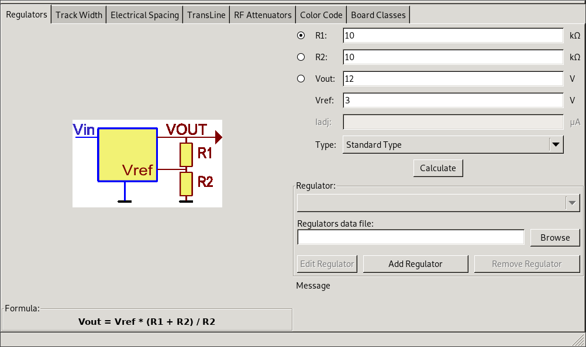
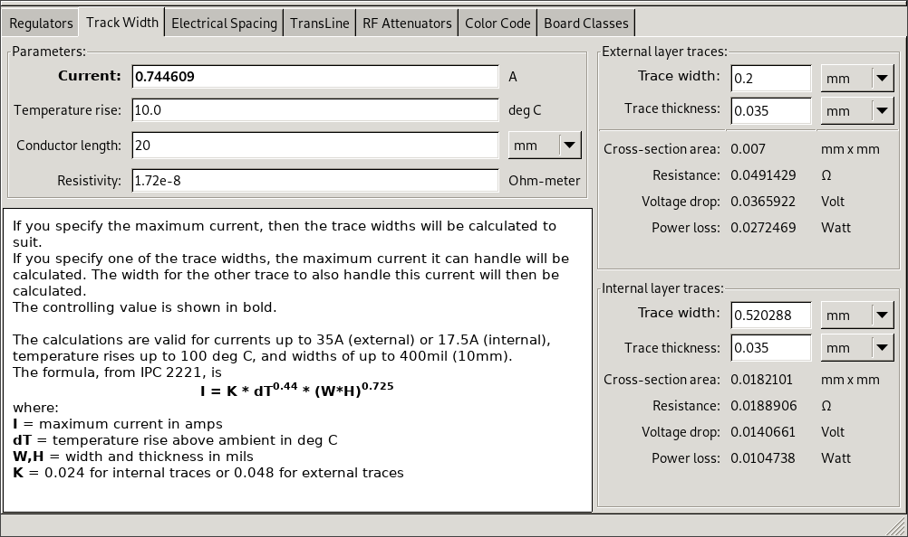
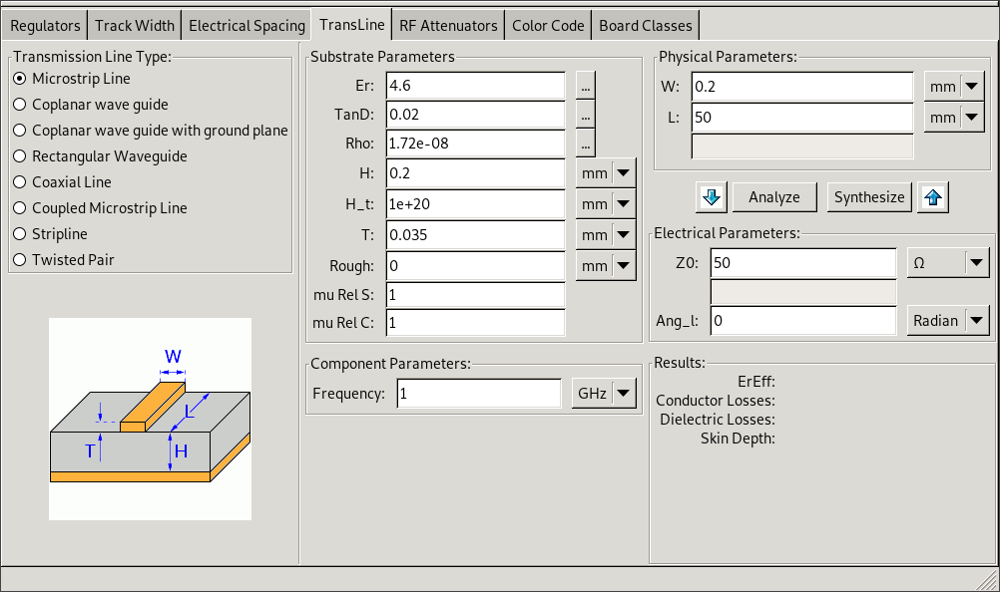
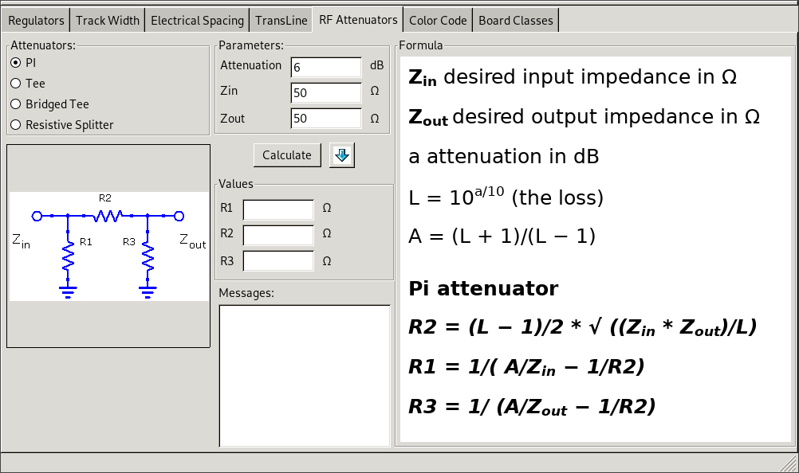
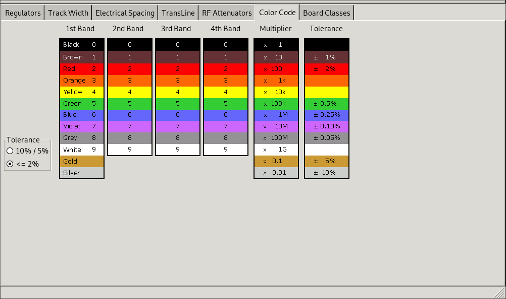
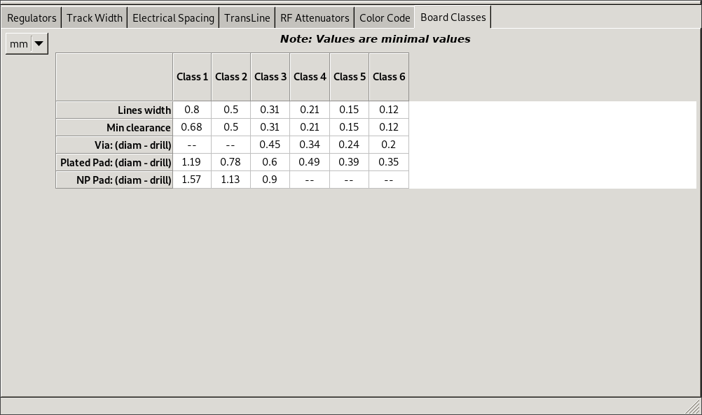

:author: The KiCad Team
:doctype: article
:toc:
:ascii-ids:

= PCB Calculator

_Reference manual_

[[copyright]]
*Copyright*

This document is Copyright (C) 2019 by it's contributors as listed below.
You may distribute it and/or modify it under the terms of either the GNU
General Public License (http://www.gnu.org/licenses/gpl.html),
version 3 or later, or the Creative Commons Attribution License
(http://creativecommons.org/licenses/by/3.0/),
version 3.0 or later.

[[contributors]]
*Contributors*

Heitor de Bittencourt.
Mathias Neumann

[[feedback]]
*Feedback*

Please direct any bug reports, suggestions or new versions to here:

- About KiCad document: https://github.com/KiCad/kicad-doc/issues

- About KiCad software: https://bugs.launchpad.net/kicad

- About KiCad software i18n: https://github.com/KiCad/kicad-i18n/issues

[[publication_date_and_software_version]]
*Publication date and software version*

july 17, 2019

[[introduction]]
== Introduction

The KiCad PCB Calculator is a set of utilities to help you find the values of
components or other paremeters of a layout. The Calculator has the following
tools:

* Regulators
* Track Width
* Electrical Spacing
* Trans Line
* RF Attenuators
* Color Code
* Board Classes

[[calculators]]
== Calculators

[[regulators]]
=== Regulators

This calculator helps with the task of finding the values of the resistors
needed for linear and low-dropout voltage regulators.

For the _Standard Type_, the output voltage Vout as a function of the reference voltage Vref and resistors R1 and R2 is given by:

image::images/Calculation1.png[alt="Regulators",scaledwidth="20%"]

For the _3 terminal type_, there is a correction factor due to the quiescent current Iadj flowing from the adjust pin:

image::images/Calculation2.png[alt="Regulators",scaledwidth="20%"]

This current is typically below 100 uA and can be neglected with caution.

To use this calculator, enter the parameters of the regulator _Type_, _Vref_ and, if needed, _Iadj_, select the field you want to calculate (one of the resistors or the output voltage) and enter the other two values.

[[track-width]]
=== Track-Width

The Track Width tool calculates the trace width for printed circuit board conductors for a given current and temperature rise.
It uses formulas from IPC-2221 (formerly IPC-D-275).

[[electrical-spacing]]
=== Electrical-Spacing

This table helps finding the minimum clearance between conductors.

Each line of the table has a minimum recomended distance between conductors
for a given voltage (DC or AC peaks) range. If you need the values for voltages
higher than 500V, enter the value in the box in the left corner and press
_Update Values_.

image::images/en/electricalspacing.png[alt="Electrical-Spacing",scaledwidth="80%"]

[[transline]]
=== TransLine

Transmission line theory is a cornerstone in the teaching of RF and microwave engineering.

In the calculator you can choose different sorts of Line Types and their special parameters. The models implemented are frequency-dependent, so they disagree with simpler models at high _enough_ frequencies.

This calculator is heavilly based on http://transcalc.sourceforge.net/[Transcalc].

The transmission line types and the reference of their mathematical models are listed below:

* Microstrip line:
** H. A. Atwater, “Simplified Design Equations for Microstrip Line Parameters”, Microwave Journal, pp. 109-115, November 1989.
* Coplanar wave guide.
* Coplanar wave guide with ground plane.
* Rectangular waveguide:
** S. Ramo, J. R. Whinnery and T. van Duzer, "Fields and Waves in Communication Electronics", Wiley-India, 2008, ISBN: 9788126515257.
* Coaxial line.
* Coupled microstrip line:
** H. A. Atwater, “Simplified Design Equations for Microstrip Line Parameters”, Microwave Journal, pp. 109-115, November 1989.
** M. Kirschning and R. H. Jansen, "Accurate Wide-Range Design Equations for the Frequency-Dependent Characteristic of Parallel Coupled Microstrip Lines," in IEEE Transactions on Microwave Theory and Techniques, vol. 32, no. 1, pp. 83-90, Jan. 1984. doi: 10.1109/TMTT.1984.1132616.
** Rolf Jansen, "High-Speed Computation of Single and Coupled Microstrip Parameters Including Dispersion, High-Order Modes, Loss and Finite Strip Thickness", IEEE Trans. MTT, vol. 26, no. 2, pp. 75-82, Feb. 1978.
** S. March, "Microstrip Packaging: Watch the Last Step", Microwaves, vol. 20, no. 13, pp. 83.94, Dec. 1981.
* Stripline.
* Twisted pair.

[[rf-attenuators]]
=== RF-Attenuators

With the RF Attenuator utility you can calculate the values of the resistors
needed for different types of attenuators:

* PI
* Tee
* Bridged Tee
* Resistive Splitter

To use this tool, first select the type of attenuator you need, then enter the
desired attenuation (in dB) and input/output impedances (in Ohms).

[[color-code]]
=== Color-Code

This calculator helps translating the color bars from the resistor to its value. To use it, first select the _tolerance_ of the resistor: 10%, 5% or equal or smaller than 2%. For example:

* Yellow Violet Red Gold: 4 7 x100 ±5% = 4700 Ohm, 5% tolerance
* 1kOhm, 1% tolerance: Brown Black Black Brown Brown

[[board-classes]]
=== Board-Classes

