== Create and modify a board

=== Creating a board

==== Drawing the board outline

It is usually a good idea to define the outline of the board first.
The outline is drawn as a sequence of line segments. Select 'Edge.Cuts'
as the active layer and use the 'Add graphic line or polygon'
tool to trace the edge, clicking at the position of each vertex and
double-clicking to finish the outline. Boards usually have very
precise dimensions, so it may be necessary to use the displayed
cursor coordinates while tracing the outline. Remember that the
relative coordinates can be zeroed at any time using the space bar,
and that the display units can also be toggled using 'Ctrl-U'.
Relative coordinates enable very precise dimensions to be drawn. It
is possible to draw a circular (or arc) outline:

. Select the 'Add graphic circle' or 'Add graphic arc' tool
. Click to fix the circle centre
. Adjust the radius by moving the mouse
. Finish by clicking again.

NOTE: The width of the outline can be adjusted in the
Parameters menu (recommended width = 150 in 1/10 mils) or via the
Options, but this will not be visible unless the graphics are
displayed in other than outline mode.

The resulting outline might look something like this:

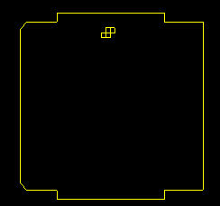

==== Using a DXF drawing for the board outline

As an alternative to drawing the board outline in Pcbnew directly, 
an outline can also be imported from a DXF drawing. 

Using this feature allows for much more complex board shapes 
than is possible with the Pcbnew drawing capabilities.

For example a mechanical CAD package can be used to define a 
board shape that fits a particular enclosure.

===== Preparing the DXF drawing for import into KiCad

The *DXF* import capability in KiCad does not support DXF
features like *POLYLINES* and *ELLIPSIS* and DXF files that use
these features require a few conversion steps to prepare them for
import. 

A software package like LibreCAD can be used for this conversion.

As a first step, any *POLYLINES* need to be split (Exploded) 
into their original simpler shapes. In LibreCAD use the following steps:

. Open a copy of the DXF file.

. Select the board shape (selected shapes are shown with dashed lines).

. In the **Modify** menu, select **Explode**.

. Press ENTER.

As a next step, complex curves like *ELLIPSIS* need to be broken up in
small line segments that 'approximate' the required shape. This happens 
automatically when the DXF file is exported or saved in the older *DXF R12*
file format (as the R12 format does not support complex curve shapes, CAD
applications convert these shapes to line segments. Some CAD applications
allow configuration of the number or the length of the line segments used). 
In LibreCAD the segment length it generally small enough for use in board 
shapes.

In LibreCAD, use the following steps to export to the *DXF R12* file format:

. In the *File* menu, use *Save As...*

. In the *Save Drawing As* dialog, there is a *Save as type:* selection 
  near the bottom of the dialog. Select the option *Drawing Exchange DXF R12*.

. Optionally enter a file name in the *File name:* field.

. Click *Save*

Your DXF file is now ready for import into KiCad.

===== Importing the DXF file into KiCad

The following steps describe the import of the prepared DXF file as a board shape
into KiCad. Note that the import bahaviour is slightly different depending on which
'canvas' is used.

Using the "default" canvas mode:

. In the *File* menu, select *Import* and then the *DXF File* option.

. In the *Import DXF File* dialog use 'Browse' to select the prepared DXF file to be imported.

. In the 'Place DXF origin (0,0) point:' option, select the placement of DXF origin 
  relative to the board coordinates (the KiCad board has (0,0) in the top left corner).
  For the 'User defined position' enter the coordinates in the 'X Position' and 'Y Position' fields.

. In the 'Layer' selection, select the board layer for the import. *Edge.Cuts* is needed
  for the board outline.

. Click 'OK'.

Using the "OpenGL" or "Cairo" canvas modes:

. In the *File* menu, select *Import* and then the *DXF File* option.

. In the *Import DXF File* dialog use 'Browse' to select the prepared DXF file to be imported.

. The 'Place DXF origin (0,0) point:' option setting is ignored in this mode.

. In the 'Layer' selection, select the board layer for the import. *Edge.Cuts* is needed
  for the board outline.

. Click 'OK'.

. The shape is now attached to your cursor and it can be moved around the board area.

. Click to 'drop' the shape on the board.

===== Example imported DXF shape

Here is an example of a DXF import with a board that had several
elliptical segments approximated by a number of short line segments:

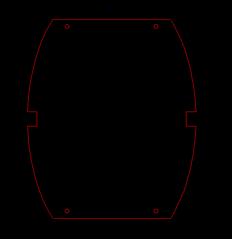

==== Reading the netlist generated from the schematic

Activate the image:images/icons/netlist.png[] icon to display the
netlist dialog window:

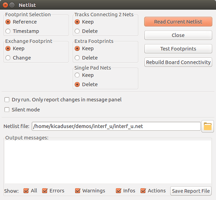

If the name (path) of the netlist in the window title is incorrect,
use the 'Select' button to browse to the desired  netlist. Then
'Read' the netlist. Any footprints not already loaded will appear,
superimposed one upon another (we shall see below how to move them
automatically).

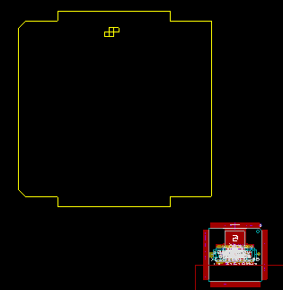

If none of the footprints have been placed, all of the footprints will
appear on the board in the same place, making them difficult to
recognize. It is possible to arrange them automatically (using the
command 'Global Spread and Place' accessed via the right mouse
button). Here is the result of such automatic arrangement:

image::images/Pcbnew_board_outline_with_globally_placed_modules.png[scaledwidth="50%"]

NOTE: If a board is modified by replacing an existing footprint with a
new one (for example changing a 1/8W resistance to 1/2W) in CvPcb,
it will be necessary to delete the existing component before Pcbnew
will load the replacement footprint.  However, if a footprint is to be
replaced by an existing footprint, this is easier to do using the
footprint dialog accessed by clicking the right mouse button over the
footprint in question.

=== Correcting a board

It is very often necessary to correct a board following a
corresponding change in the schematic.

==== Steps to follow

. Create a new netlist from the modified schematic.
. If new components have been added, link these to their corresponding
  footprint in CvPcb.
. Read the new netlist in Pcbnew.

==== Deleting incorrect tracks

Pcbnew is able to automatically delete tracks that have become
incorrect as a result of modifications. To do this, check the
'Delete' option in the 'Unconnected Tracks' box of the netlist
dialog:

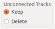

However, it is often quicker to modify such tracks by hand (the DRC
function allows their identification).

==== Deleted components

Pcbnew can delete footprint corresponding to components that have been
removed from the schematic. This is optional.

This is necessary because there are often footprints (holes for
fixation screws, for instance) that are added to the PCB that never
appear in the schematic.

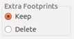

If the "Extra Footprints" option is checked, a footprint
corresponding to a component not found in the netlist will be deleted,
unless they have the option "Locked" active. It is a good idea to
activate this option for "mechanical" footprints:

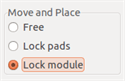

==== Modified footprints

If a footprint is modified in the netlist (using CvPcb), but the footprint
has already been placed, it will not be modified by Pcbnew, unless
the corresponding option of the 'Exchange Footprint' box of the netlist
dialog is checked:

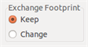

Changing a footprint (replacing a resistor with one of a different
size, for instance) can be effected directly by editing the footprint.

==== Advanced options - selection using time stamps

Sometimes the notation of the schematic is changed, without any
material changes in the circuit (this would concern the references -
like R5, U4...).The PCB is therefore unchanged (except possibly for
the silkscreen markings). Nevertheless, internally, components and
footprints are represented by their reference. In this situation, the
'Timestamp' option of the netlist dialog may be selected before
re-reading the netlist:

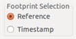

With this option, Pcbnew no longer identifies footprints by their
reference, but by their time stamp instead. The time stamp is
automatically generated by Eeschema (it is the time and date when
the component was placed in the schematic).

WARNING: Great care should be exercised when using this option (save
the file first!). This is because the technique is complicated in
the case of components containing multiple parts (e.g. a 7400 has 4
parts and one case). In this situation, the time stamp is not
uniquely defined (for the 7400 there would be up to four - one for
each part). Nevertheless, the time stamp option usually resolves
re-annotation problems.

=== Direct exchange for footprints already placed on board
Changing a footprint ( or some identical footprints) to another
footprint is very useful, and is very easy:

. Click on a footprint to open the Edit dialog box.
. Activate Change Footprints.

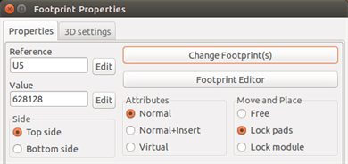

Options for Change Footprint(s):

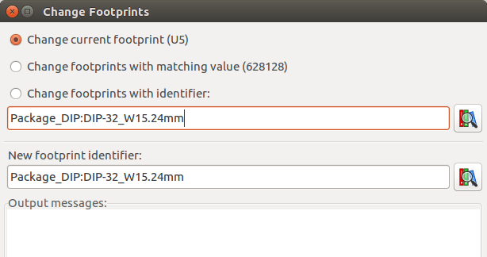

One must choose a new footprint name and use:

* *Change footprint of 'xx'* for the current footprint

* *Change footprints 'yy'* for all footprints like the current footprint.

* *Change footprints having same value* for all footprints like the current
  footprint, restricted to components which have the same value.

* *Update all footprints of the board* for reloading of all footprints on board.

