== Footprint Editor - Creating and Editing Footprints

=== Footprint Editor overview

Footprint Editor is used for editing and creating PCB footprints. This includes:

* Adding and removing pads.
* Changing pad properties (shape, layer), for individual pads or for
  all the pads in a footprint.
* Adding and editing graphic elements (contours, text).
* Editing fields (value, reference, etc.).
* Editing the associated documentation (description, keywords).

=== Footprint elements

A footprint is the physical representation (footprint) of the part to
be inserted in the PCB and it must  be linked to the relative
component in your schematic. Each footprint includes three different
elements:

* The pads.
* Graphical contours and text.
* Fields.

In addition, a number of other parameters must be correctly defined if
the auto-placement function will be used. The same holds for the
generation of auto-insertion files.

==== Pads

Two pad properties are important:

* Geometry (shape, layers, drill holes).
* The pad number, which is constituted by up to four alphanumeric
  characters. Thus, the following are all valid pad numbers: 1, 45 and
  9999, but also AA56 and ANOD. The pad number must be identical to that
  of the corresponding pin number in the schematic, because it defines
  the matching pin and pad numbers that Pcbnew links pins and pads with.

==== Contours

Graphical contours are used to draw the physical shape of the
footprint. Several different types of contour are available: lines,
circles, arcs, and text. Contours have no electrical significance,
they are simply graphical aids.

==== Fields

These are text elements associated with a footprint. Two are obligatory
and always present: the reference field and the value field. These
are automatically read and updated by Pcbnew when a netlist is read
during the loading of footprints into your board. The reference is
replaced by the appropriate schematic reference (U1, IC3, etc.). The
value is replaced by the value of the corresponding part in the
schematic (47K, 74LS02, etc.). Other fields can be added and these
will behave like graphical text.

=== Starting Footprint Editor and selecting a footprint to edit

Footprint Editor can be started in two ways:

* Directly via the image:images/icons/module_editor.png[] icon from the main
  toolbar of Pcbnew. This allows the creation or modification of a footprint in
  the library.
* Double-clicking a footprint will launch the 'Footprint Properties' menu,
  which offers a 'Go to Footprint Editor' button. If this option is used,
  the footprint from the board will be loaded into the editor, for
  modification or for saving.

=== Footprint Editor Toolbars

Calling Footprint Editor will launch a new window that looks like this:

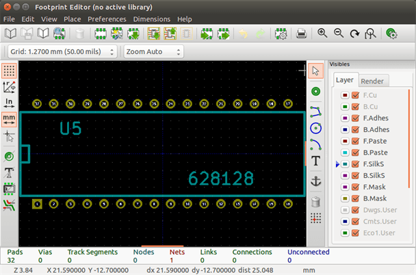

==== Edit toolbar (right-hand side)

This toolbar contains tools for:

* Placing pads.
* Adding graphic elements (contours, text).
* Positioning the anchor.
* Deleting elements.

The specific functions are the following:

[cols="1,4"]
|======
| image:images/icons/cursor.png[]
| No tool.
| image:images/icons/pad.png[]
| Add pads.
| 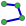
| Draw line segments and polygons.
| 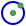
| Draw circles.
| 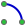
| Draw circular arcs.
| image:images/icons/add_text.png[]
| Add graphical text (fields are not managed by this tool).
| 
| Position the footprint anchor.
| image:images/icons/delete.png[]
| Delete elements.
| 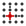
| Grid origin. (grid offset). Useful for placement of pads.
The grid origin can be put on a given location (the first pad to place),
and after the grid size can be set to the pad pitch.
Placing pads is therefore very easy
|======

==== Display toolbar (left-hand side)

These tools manage the display options in Footprint Editor:

[cols="1,4"]
|======
| image:images/icons/grid.png[]
| Display the grid.
| image:images/icons/polar_coord.png[]
| Display polar coordinates.
| image:images/icons/unit_mm.png[] 
| Use units of mm or inch
| 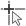
| Toggle cursor crosshair shape
| image:images/icons/pad_sketch.png[]
| Display pad in outline mode.
| 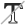
| Display text in outline mode.
| image:images/icons/show_mod_edge.png[]
| Display contours in outline mode.
| image:images/icons/contrast_mode.png[]
| Toggle high-contrast mode
|======

=== Context Menus

The right mouse button calls up menus that depend upon the element
beneath the cursor.

The context menu for editing footprint parameters:

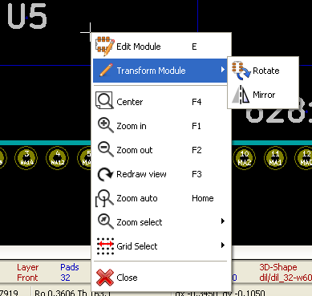

The context menu for editing pads:

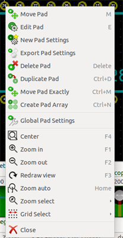

The context menu for editing graphic elements:

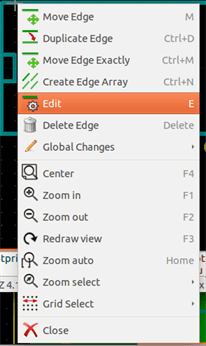

=== Footprint properties dialog

This dialog can be launched when the cursor is over a footprint by
clicking on the right mouse button and then selecting 'Edit Footprint'.

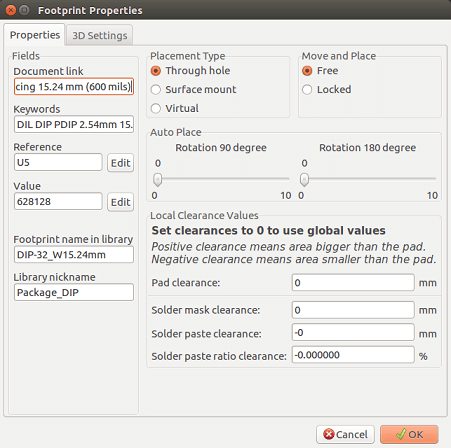

The dialog can be used to define the main footprint parameters.

=== Creating a new footprint

A new footprint can be created via the button
image:images/icons/new_footprint.png[]. The name of the new footprint
will be requested. This will be the name by which the footprint will be
identified in the library.

This text also serves as the footprint value, which is ultimately
replaced by the real value (100uF_16V, 100_0.5W, ...).

The new footprint will require:

* Contours (and possibly graphic text).
* Pads.
* A value (hidden text that is replaced by the true value when used).

Alternative method:

When a new footprint is similar to an existing footprint in a library or a
circuit board, an alternative and quicker method of creating the new
footprint is as follows:

* Load the similar footprint (,
  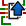 or
  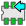).
* Modify the "Footprint Name in Library" field in order to generate a new identifier (name).
* Edit and save the new footprint.

=== Adding and editing pads

Once a footprint has been created, pads can be added, deleted or
modified. Modification of pads can be local, affecting only the pad
under the cursor, or global, affecting all pads of the footprint.

==== Adding pads

Select the image:images/icons/pad.png[] icon from the right hand
toolbar. Pads can be added by clicking in the desired position with
the left mouse button. Pad properties are predefined in the pad
properties menu.

Do not forget to enter the pad number.

==== Setting pad properties

This can be done in three different ways:

* Selecting the  icon from the
  horizontal toolbar.
* Clicking on an existing pad and selecting 'Edit Pad'. The pad's
  settings can then be edited.
* Clicking on an existing pad and selecting 'Export Pad Settings'.
  In this case, the geometrical properties of the selected pad will
  become the default pad properties.

In the first two cases, the following dialog window will be displayed:

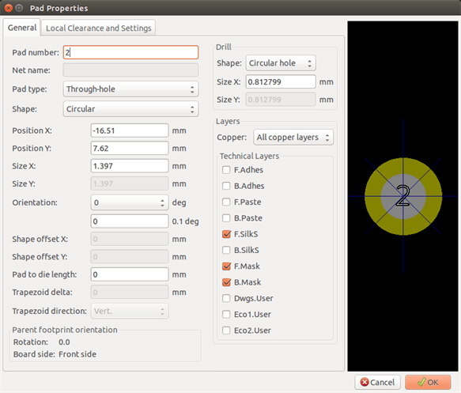

Care should be taken to define correctly the layers to which the pad
will belong. In particular, although copper layers are easy to
define, the management of non-copper layers (solder mask, solder
pads...) is equally important for circuit manufacture and
documentation.

The Pad Type selector triggers an automatic selection of layers that
is generally sufficient.

===== Rectangular pads

For SMD footprints of the VQFP/PQFP type which have rectangular pads on
all four sides (both horizontal and vertical) it is recommended to
use just one shape (for example, a horizontal rectangle) and to
place it with different orientations (0 for horizontal and 90
degrees for vertical). Global resizing of pads can then be done in a
single operation.

===== Rotate pads

Rotations of -90 or -180 are only required for trapezoidal pads used
in microwave footprints.

===== Non-plated through hole pads

Pads can be defined as Non-Plated Through Hole pads (NPTH pads).

These pads must be defined on one or all copper layers (obviously,
the hole exists on all copper layers).

This requirement allows you to define specific clearance parameters
( for instance clearance for a screw).

When the pad hole size is the same as the pad size,  for a round or
oval pad,  this pad is NOT plotted on copper layers in GERBER files.

These pads are used for mechanical purposes, therefore no pad name
or net name is allowed. A connection to a net is not possible.

===== Pads not on copper layers

These are unusual pads. This option can be used to create fiducials
or masks on technical layers.

===== Offset parameter

Pad 3 has an offset Y = 15 mils:

image::images/Modedit_pad_offset_example.png[scaledwidth="80%"]

===== Delta Parameter (trapezoidal pads)

Pad 1 has its parameter Delta X  = 10 mils

image::images/Modedit_pad_delta_example.png[scaledwidth="58%"]

==== Setting clearance for solder mask and solder paste mask layers

Setting a clearance can be made at 3 levels:

* Global level.
* Footprint level.
* Pad level.

Pcbnew uses the following to calculate clearances:

* Pad settings. If null,
* Footprint settings. If null,
* Global settings.

===== Remarks

The solder mask pad shape is usually bigger than the pad itself. So the
clearance value is positive. The solder paste mask pad shape is usually
smaller than the pad itself. So the clearance value is negative.

===== Solder paste mask parameters

For solder paste mask there are two parameters:

* A fixed value.
* A percentage of the pad size.

The real value is the sum of these two values.

Footprint level settings:

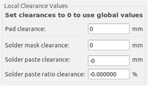

Pad level settings:

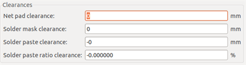

=== Fields Properties

There are at least two fields: reference and value.

Their parameters (attribute, size, width) must be updated. You can
access the dialog box from the pop-up menu, by double clicking on
the field, or by the footprint properties dialog box:

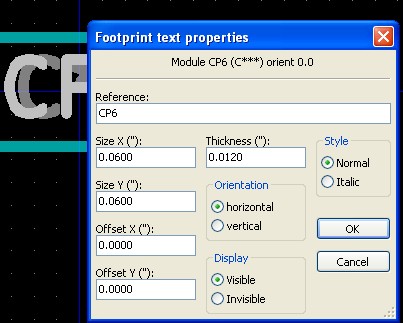

=== Automatic placement of a footprint

If the user wishes to exploit the the full capabilities of the
auto-placement functions, it is necessary to define the allowed
orientations of the footprint (Footprint Properties dialog).

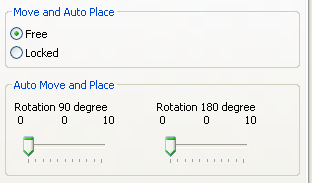

Usually, rotation of 180 degrees is permitted for resistors,
non-polarized capacitors and other symmetrical elements.

Some footprints (small transistors, for example) are often permitted to
rotate by +/- 90 or 180 degrees. By default, a new footprint will have
its rotation permissions set to zero. This can be adjusted according
to the following rule:

A value of 0 makes rotation impossible, 10 allows it completely, and
any intermediate value represents a limited rotation. For example, a
resistor might have a permission of 10 to rotate 180 degrees
(unrestrained) and a permission of 5 for a +/- 90 degree rotation
(allowed, but discouraged).

=== Attributes

The attributes window is the following:

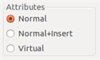

* Normal is the standard attribute.
* Normal+Insert indicates that the footprint must appear in the automatic
  insertion file (for automatic insertion machines). This attribute is
  most useful for surface mount components (SMDs).
* Virtual indicates that a component is directly formed by the circuit
  board. Examples would be edge connectors or inductors created by a
  particular track shape (as sometimes seen in microwave footprints).

=== Documenting footprints in a library

It is strongly recommended to document newly created footprints, in
order to facilitate their rapid and accurate retrieval. Who is able
to recall the multiple pin-out variants of a TO92 footprint?

The Footprint Properties dialog offers a simple and yet powerful means
for documentation generation.

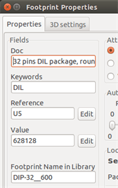

This menu allows:

* The entry of a comment line (description).
* Multiple keywords.

The comment line is displayed with the component list in CvPcb and
in the footprint selection menus in Pcbnew. The keywords can be used to
restrict searches to those parts possessing the given keywords.

Thus, while using the load footprint command (icon  in the right-hand
toolbar in Pcbnew), it is possible to type the text `=TO220` into
the dialog box to have Pcbnew display a list of the footprints
possessing the keyword `TO220`

=== 3-dimensional visualisation

A footprint may have been associated with a file containing a
three-dimensional representation of itself. In order to associate
such a file with a footprint, select the 3D Settings tab. The options
panel is the following:

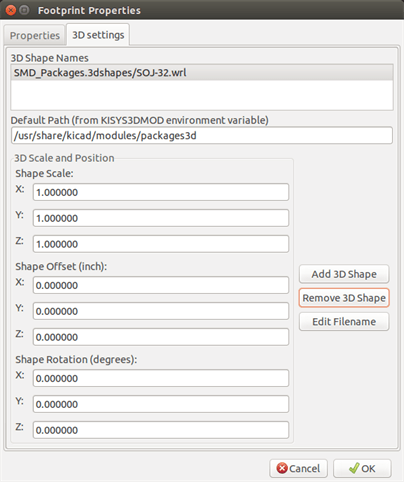

The data information should be provided:

* The file containing the 3D representation (created by the 3D modeler
  Wings3D, in vrml format, via the export to vrml command).
* The default path is kicad/modules/package3d. In the example, the file
  name is discret/to_220horiz.wrl, using the default path)
* The x, y and z scales.
* The offset with respect to the anchor point of the footprint (usually
  zero).
* The initial rotation in degrees about each axis (usually zero).

Setting scale allows:

* To use the same 3D file for footprints which have similar shapes but different sizes (resistors, capacitors, SMD components...)
* For small (or very large) packages, a better use of the Wings3D grid
  is to scale *0.1 inch in Pcbnew = 1 grid unit* in Wings3D.

If such a file has been specified, it is possible to view the
component in 3D.

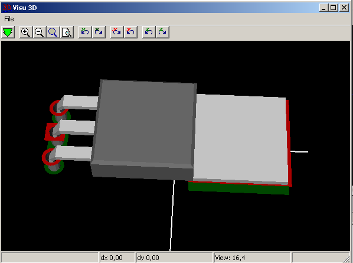

The 3D model will automatically appear in the 3D representation of the printed circuit board.

=== Saving a footprint into the active library

The save command (modification of the file of the active library) is activated by the 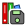 button.

If a footprint of the same name exists (an older version), it will be overwritten. Because it is important to be able to have confidence in the library footprints, it is worth double-checking the footprint for errors before saving.

Before saving, it is also recommended to change the reference or value of the footprint to be equal to the library name of the footprint.

=== Saving a footprint to the board

If the edited footprint comes from the current board, the button
 will update this footprint on
the board.
