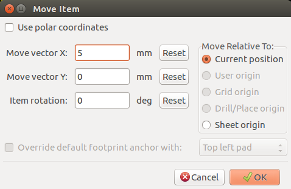
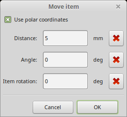
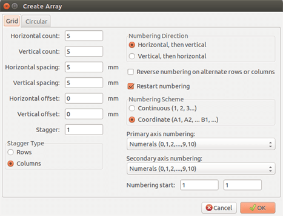
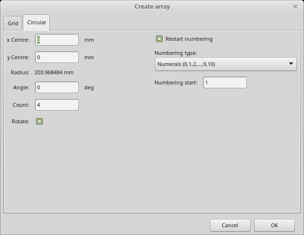
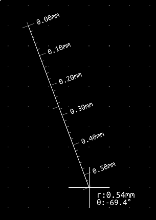

== Advanced PCB editing tools

There are some more advanced editing tools available in Pcbnew and
Footprint Editor, which can help you to efficiently lay out
components on the canvas.

=== Duplicating items

Duplication is a method to clone an item and pick it up in the same
action. It is broadly similar to copy-and-pasting, but it allows you to
"sprinkle" components over the PCB and it allows you to manually lay out
components using the "Move Exact" tool (see below) more easily.

Duplication is done by using the hotkey (which defaults to Ctrl-D) or
the duplicate item option in the context menu, icon
.

=== Moving items exactly

The "Move Exact" tool allows you to move an item (or group of items) by a
certain amount, which can be entered in Cartesian or polar formats and which
can be entered in any supported units. This is useful when it would
otherwise be cumbersome to switch to a different grid, or when a feature
is not spaced according to any existing grids.

To use this tool, select the items you wish to move and then use either the hotkey
(defaults to Ctrl-M) or the context menu items to invoke the dialog. You
can also invoke the dialog with the hotkey when moving or duplicating
items, which can make it easy to repeatedly apply an offset to multiple
components.

Move exact with Cartesian move vector entry

Move exact with polar move vector entry

The checkbox allows you to switch between Cartesian and polar
co-ordinate systems. Whatever is currently in the form will be converted
automatically to the other system.

Then you enter the desired move vector. You can use the units indicated
by the labels ("mm" in the images above) or you can specify the units
yourself (e.g. "1 in" for an inch, or "2 rad" for 2 radians).

Pressing OK will apply the translation to the selection, and cancel will
close the dialog and the items will not be moved. If OK is pressed, the
move vector will be saved and pre-filled next time the dialog is opened,
which allows repeated application of the same vector to multiple
objects.

=== Array tools

Pcbnew and the Footprint Editor both have assistants for creating arrays of
features and components, which can be used to easily and accurately lay
out repetitive elements on PCBs and in footprints.

==== Activating the array tool

The array tool acts on the component under the cursor, or, in GAL mode,
on a selection. It can be accessed either via the context menu, icon
 for the selection or by a keyboard
shortcut (defaults to Ctrl-N).

The array tool is presented as a dialog window, with a pane for the
types of arrays. There are two types of arrays supported so far: grid, and
circular.

Each type of array can be fully specified on the respective panes.
Geometric options (how the grid is laid out) go on the left; numbering
options (including how the numbers progress across the grid) on the
right.

==== Grid arrays

Grid arrays are arrays that lay components out according to a
2-dimensional square grid. This kind of array can also produce a linear
array by only laying out a single row or column.

The settings dialog for grid arrays look like this:

===== Geometric options

The geometric options are as follow:

* *Horizontal count*: the number of "columns" in the grid.
* *Vertical count*: the number of "rows" in the grid.
* *Horizontal spacing*: the horizontal distance from item to the item in the same row
  and next column. If this is negative, the grid progresses from right to left.
* *Vertical spacing*: the vertical distance from one item to the item in the same
  column and the next row. If this is negative, the grid progress bottom to
  top.
* *Horizontal offset*: start each row this distance to the right of the previous
  one
* *Vertical offset*: start each column this distance below the previous one

.3x3 grid with x and y offsets
image::images/Pcbnew_array_grid_offsets.png[scaledwidth="40%"]

* *Stagger*: add an offset to every set of "n" rows/columns, with each row
  progressing by 1/n'th of the relevant spacing dimension:

.3x3 grid with a row stagger of 2
image::images/Pcbnew_array_grid_stagger_rows_2.png[scaledwidth="40%"]

.4x3 grid with a column stagger of 3
image::images/Pcbnew_array_grid_stagger_cols_3.png[scaledwidth="40%"]

===== Numbering options

* *Numbering Direction*: Determines whether numbers proceed along rows and then
  moves to the next row, or down columns and then to the next column. Note that
  the direction on numbering is defined by the sign of the spacing: a negative
  spacing will result in right-to-left or bottom-to-top numbering.

* *Reverse numbering on alternate rows or columns*: If selected, the numbering order
  (left-to-right or right-to-left, for example) on alternate rows or columns.
  Whether rows or columns alternate depends on the numbering direction. This
  option is useful for packages like DIPs where the numbering proceeds up one
  side and down the other.

* *Restart numbering*: if laying out using items that already have numbers,
  reset to the start, otherwise continue if possible from this item's number

* *Numbering Scheme*

** *Continuous*: the numbering just continues across a row/column break - if
   the last item in the first row is numbered "7", the first item in the second
   row will be "8".

** *Coordinate*: the numbering uses a two-axis scheme where the
   number is made up of the row and column index. Which one comes first
   (row or column) is determined by the numbering direction.

* *Axis numberings*: what "alphabet" to use to number the axes. Choices are

** *Numerals* for normal integer indices

** *Hexadecimal* for base-16 indexing

** *Alphabetic, minus IOSQXZ*, a common scheme for electronic components,
   recommended by ASME Y14.35M-1997 sec. 5.2 (previously MIL-STD-100 sec. 406.5)
   to avoid confusion with numerals.

** *Full alphabet* from A-Z.

==== Circular arrays

Circular arrays lay out items around a circle or a circular arc. The circle is
defined by the location of the selection (or the centre of a selected group)
and a centre point that is specified. Below is the circular array configuration
dialog:

===== Geometric options

* *Horizontal center*, *Vertical center*: The centre of the circle. The radius
  field below will update automatically when you adjust these.
* *Angle*: The angular difference between two adjacent items in the
  array. Set this to zero to evenly divide the circle with "count" elements.
* *Count*: Number of items in the array (including the original item)
* *Rotate*: Rotate each item around its own location. Otherwise, the
  item will be translated but not rotated (for example, a square pad
  will always remain upright if this option is not set).

===== Numbering options

Circular arrays have only one dimension and a simpler geometry than
grids. The meanings of the available options are the same as for grids.
Items are numbered clockwise - for an anticlockwise array, specify a
negative angle.

=== Measurement (ruler) tool

The measurement tool is a linear ruler that can be used to visually
check sizes and spacings on a PCB.

It is accessible via the calipers icon 
in the right hand toolbar, in the "Dimension" menu and with the hotkey
(Ctrl-Shift-M by default).

When active, you can draw a temporary ruler over the canvas, which will
be marked with the current units. You can snap to 45-degree angles
by holding the Ctrl key. Units can be changed without leaving the tool
using the ususal hotkey (Ctrl-U by default).

