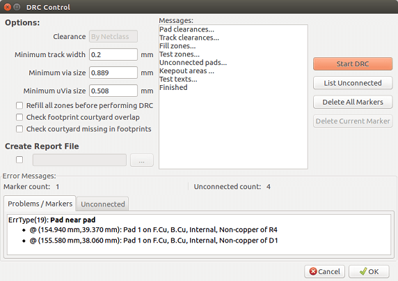
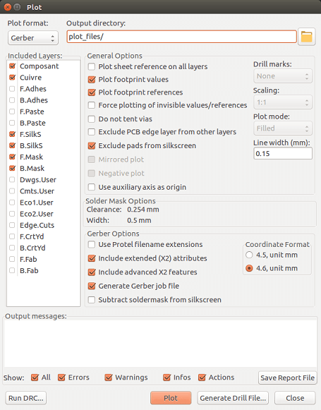
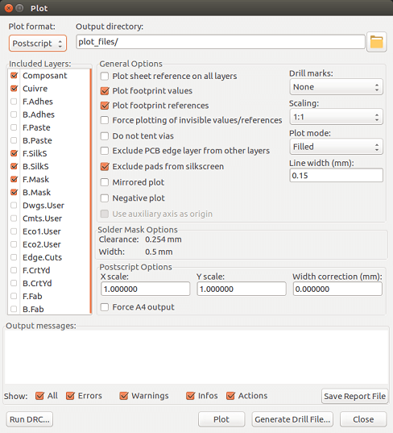
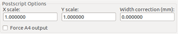
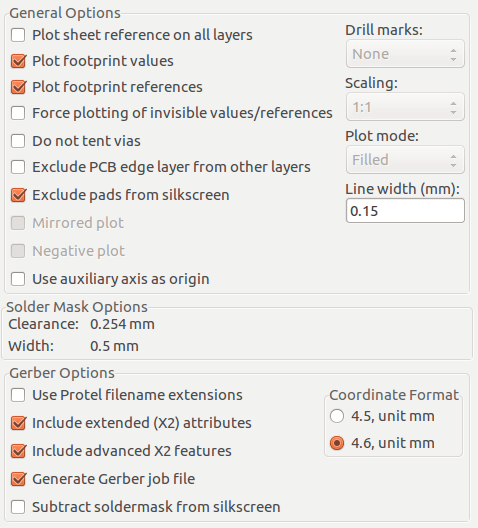
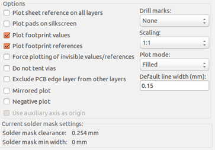
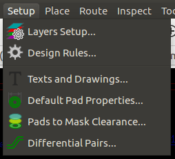
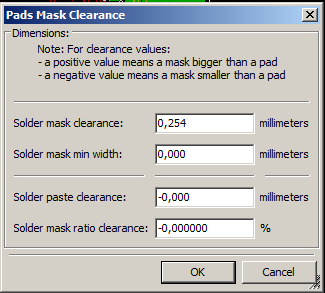
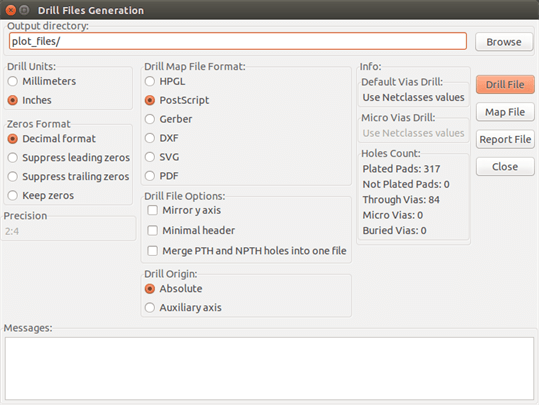
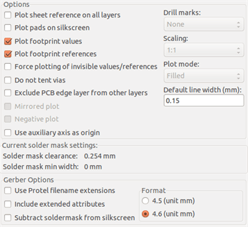

== Files for circuit fabrication

Let us see now what the steps are for the creation of the necessary files
for the production of your printed circuit board.

All files generated by KiCad are placed in the working directory which is
the same directory that contains the xxxx.brd file for the printed
circuit board.

=== Final preparations

The generation of the necessary files for the production of your printed
circuit board includes the following preparatory steps.

* Mark any layer (e.g., 'top or front' and 'bottom or back') with the
  project name by placing appropriate text upon each of the layers.

* All text on copper layers (sometimes called 'solder' or 'bottom') must
  be mirrored.

* Create any ground planes, modifying traces as required to ensure they
  are contiguous.

* Place alignment crosshairs and possibly the dimensions of the board
  outline (these are usually placed on one of the general purpose layers).

Here is an example showing all of these elements, except ground planes,
which have been omitted for better visibility:

image::images/Pcbnew_final_preparation_example_board.png[scaledwidth="70%"]

A color key for the 4 copper layers has also been included:
image:images/Pcbnew_layer_colour_key.png[]

=== Final DRC test

Before generating the output files, a global DRC test is very
strongly recommended.

Zones are filled or refilled when starting a DRC. Press the button

to launch the following DRC dialog:

Adjust the parameters accordingly and then press the "Start DRC" button.

This final check will prevent any unpleasant surprises.

=== Setting coordinates origin

Set the coordinates origin for the photo plot and drill files, one
must place the auxiliary axis on this origin. Activate the icon
. Move the auxiliary axis by
left-clicking on the chosen location.

image::images/Pcbnew_setting_pcb_origin.png[scaledwidth="60%"]

=== Generating files for photo-tracing

This is done via the Files/Plot menu option and invokes the following
dialog:

Usually, the files are in the GERBER format. Nevertheless, it is
possible to produce output in both HPGL and POSTSCRIPT formats. When
Postscript format is selected, this dialog will appear.

In these formats, a fine scale adjust can be used to compensate for
the plotter accuracy and to have a true scale of 1 for the output:

==== GERBER format

For each layer, Pcbnew generates a separate file following the
GERBER 274X standard, by default in 4.6 format (each coordinate in
the file is represented by 10 digits, of which 4 are before the
decimal point and 6 follow it), units in inches, and a scale
of 1.

It is normally necessary to create files for all of the copper
layers and, depending on the circuit, for the silkscreen, solder mask,
and solder paste layers. All of these files can be produced in one
step, by selecting the appropriate check boxes.

For example, for a double-sided circuit with silkscreen, solder mask
and solder paste (for SMD components), 8 files should be generated
('xxxx' represents the name of the .brd file).

* xxxx-F_Cu.gbr for the component side.
* xxxx-B_Cu.gbr for the copper side.
* xxxx-F_SilkS.gbr for the component-side silkscreen markings.
* xxxx-B_SilkS.gbr for the copper-side silkscreen markings.
* xxxx-F_Paste.gbr for the component-side solder paste.
* xxxx-B_Paste.gbr for the copper-side solder paste.
* xxxx-F_Mask.gbr for the component-side solder mask.
* xxxx-B_Mask.gbr for the copper-side solder mask.

GERBER file format:

The format used by Pcbnew is RS274X format 4.6, Imperial, Leading
zero omitted, Abs format. These are very usual settings.

==== POSTSCRIPT format

The standard extension for the output files is .ps in the case of
postscript output. As for HPGL output, the tracing can be at
user-selected scales and can be mirrored. If the Org = Centre option
is active, the origin for the coordinates of the tracing table is
assumed to be in the centre of the drawing.

If the Print Sheet Ref option is active, the sheet cartridge is traced.

==== Plot options

Gerber format:

Other formats:

GERBER format specific options:

[cols="1,1"]
|=====
| Use Protel filename extensions
| Use .gbl .gtl .gbs .gts .gbp .gtp .gbo .gto instead of .gbr for file name extensions.
| Include extended attributes
| Output extended attributes to file.
| Subtract soldermask from silkscreen
| Remove all Silk from solder paste areas.
|=====

==== Other formats

The standard extension depends on the output file type.

Some options are not available for some formats.

The plot can be done at user-selected scales and can be mirrored.

The Print Drill Opt list offers the option of pads that are filled,
drilled to the correct diameter or drilled with a small hole (to
guide hand drilling).

If the Print Sheet Ref option is active, the sheet cartridge is traced.

=== Global clearance settings for the solder stop and the solder paste mask

Mask clearance values can be set globally for the solder mask
layers and the solder paste layers. These clearances can be set
at the following levels.

* At pads level.
* At footprint level.
* Globally.

And Pcbnew uses by priority order.

* Pad values. If null:
* Footprint values. If null:
* Global values.

==== Access

The menu option for this is available via the Dimensions menu:

The dialog box is the following:

==== Solder mask clearance

A value near to 0.2 mm is usually good. This value is positive
because the mask is usually bigger than the pad.

One can set a minimum value for the solder mask width, between 2 pads.

If the actual value is smaller than the minimum value, the 2 solder
mask shapes will be merged.

==== Solder paste clearance

The final clearance is the sum of the solder paste clearance and a
percentage of the pad size.

This value is negative because the mask is usually smaller than the
pad.

=== Generating drill files

The creation of a drill file xxxx.drl following the EXCELLON
standard is always necessary.

One can also produce an optional drill report, and an optional drill
map.

* The drill map can be plotted using several formats.
* The drill report is a plain text file.

The generation of these files is controlled via:

* "Create Drill File" button, or
* Files/Fabrication Outputs/Drill file menu selection.

The Drill tools dialog box will be the following:

For setting the coordinate origin, the following dialog box is used:

image::images/Pcbnew_drill_origin_setting.png[scaledwidth="35%"]

* Absolute: absolute coordinate system is used.
* Auxiliary axis: coordinates are relative to the auxiliary axis,
  use the icon (right toolbar) to set it.

=== Generating wiring documentation

To produce wiring documentation files, the component and copper
silkscreen layers can be traced. Usually, just the component-side
silkscreen markings are sufficient for wiring a PCB. If the
copper-side silkscreen is used, the text it contains should be
mirrored in order to be readable.

=== Generation of files for automatic component insertion

This option is accessed via the Postprocess/Create Cmp file menu
option. However, no file will be generated unless at least one
footprint has the Normal+Insert attribute activated (see Editing
Footprints). One or two files will be produced, depending upon whether
insertable components are present on one or both sides of the PCB. A
dialogue box will display the names of the file(s) created.

=== Advanced tracing options

The options described below (part of the Files/Plot dialogue) allow
for fine-grained control of the tracing process. They are
particularly useful when printing the silkscreen markings for
wiring documentation.

The available options are:
[cols="1,2"]
|======
|Plot sheet reference on all layers
|Trace sheet outline and the cartridge.
|Plot pads on silkscreen
|Enables/disables printing of pad outlines on the silkscreen layers (if the pads
have already been declared to appear on these layers). Prevents any pads from
being printed in the disabled mode.
|Plot footprint values
|Enables printing of VALUE text on the silkscreen.
|Plot footprint references
|Enables printing of the REFERENCE text on the silkscreen.
|Force plotting of invisible values/references
|Forces printing of fields (reference, value) declared as invisible.
In combination with 'Plot footprint values' and 'Plot footprint references',
this option enables production of documents for guiding wiring and repair.
These options have proven necessary for circuits using components that are too
small (SMD) to allow readable placement of two separate text fields.
|Do not tent vias
|Delete the mask over the vias.
|Exclude PCB edge layer from other layers
|GERBER format specific.  Do not plot graphic items on edge layer.
|Use Protel filename extensions
|GERBER format specific.
When creating files, use specific extensions for each file.
If disabled the Gerber file extension is .gbr.
|======
