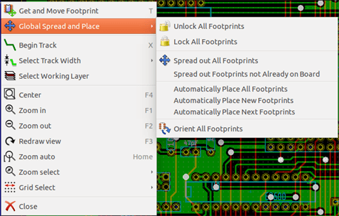
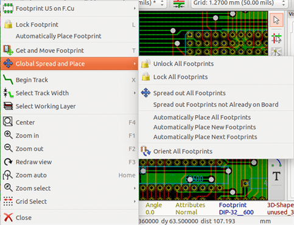

== Footprint placement

=== Assisted placement

Whilst moving footprints the footprint ratsnest (the net connections) can
be displayed to assist the placement. To enable this the icon
image:images/icons/modratsnest.png[] of the left toolbar must be
activated.

=== Manual placement

Select the footprint with the right mouse button then choose the Move
command from the menu. Move the footprint to the required position and
place it with the left mouse button. If required the selected footprint
can also be rotated, inverted or edited. Select Cancel from the menu
(or press the Esc key) to abort.

Here you can see the display of the footprint ratsnest during a move:

image:images/Pcbnew_ratsnest_during_move.png[]

The circuit once all the footprints are placed may be as shown:

image:images/Pcbnew_circuit_after_placement.png[]

=== General re-orientation of footprints

Initially all footprints inherit the same orientation that they had in
the library (normally 0).

If an alternative orientation is required for an individual footprint,
or all footprints (for example all vertical) use the menu option
AutoPlace/Orient All Footprints. This orientation can be selective (for
example to relate only to the footprints whose reference starts with
"IC".

image:images/Pcbnew_footprints_orientation_dialog.png[]

=== Automatic Footprint Distribution

Generally speaking, footprints can only be moved if they have not been
"Fixed".  This attribute can be turned on and off from the pop-up
window (click right mouse button over footprint) whilst in Footprint Mode,
or through the Edit Footprint Menu.

As stated in the last chapter, new
footprints loaded during the reading of the netlist appear piled up at
a single location on the board. Pcbnew allows an automatic
distribution of the footprints to make manual selection and placement
easier.

* Select the option "Footprint Mode" (Icon image:images/icons/mode_module.png[] on the upper toolbar).
* The pop-up window activated by the right mouse button becomes:

If there is a footprint under the cursor:

If there is nothing under the cursor:

In both cases the following commands are available:

* *Spread out All Footprints* allows the automatic distribution of all the
  footprints not Fixed.  This is generally used after the first reading of
  a netlist.

* *Spread out Footprints not Already on Board* allows the automatic
  distribution of the footprints which have not been placed already
  within the PCB outline. This command requires that an outline
  of the board has been drawn to determine which footprints can be
  automatically distributed.

=== Automatic placement of footprints

==== Characteristics of the automatic placer

The automatic placement feature allows the placement of footprints
onto the 2 faces of the circuit board (however switching a footprint
onto the copper layer is not automatic).

It also seeks the best orientation (0, 90, -90, 180 degrees) of the
footprint. The placement is made according to an optimization
algorithm, which seeks to minimize the length of the ratsnest, and
which seeks to create space between the larger footprints with with
many pads. The order of placement is optimized to initially place
these larger footprints with many pads.

==== Preparation

Pcbnew can thus place the footprints automatically, however it is
necessary to guide this placement, because no software can guess
what the user wants to achieve.

Before an automatic placement is carried out one must:

* Create the outline of the board (It can be complex, but it must be
  closed if the form is not rectangular).
* Manually place the components whose positions are imposed (Connectors,
  clamp holes, etc).
* Similarly, certain SMD footprints and critical components (large
  footprints for example) must be on a specific side or position on the
  board and this must be done manually.
* Having completed any manual placement these footprints must be "Fixed" to
  prevent them being moved. With the Footprint Mode icon
  image:images/icons/mode_module.png[] selected right click on the footprint
  and pick "Fix Footprint" on the Pop-up menu. This can also be done through
  the Edit/Footprint Pop-up menu.
* Automatic placement can then be carried out. With the Footprint Mode
  icon selected, right click and select Glob(al) Move and Place - then
  Autoplace All Footprints.

During automatic placement, if required, Pcbnew can optimize the
orientation of the footprints. However rotation will only be attempted
if this has been authorized for the footprint (see Edit Footprint Options).

Usually resistors and non-polarized capacitors are authorized for
180 degrees rotation. Some footprints (small transistors for example)
can be authorized for +/- 90 and 180 degrees rotation.

For each footprint one slider authorizes 90 degree Rot(ation) and a
second slider authorizes 180 degree Rot(ation). A setting of 0
prevents rotation, a setting of 10 authorizes it, and an
intermediate value indicates a preference for/against rotation.

The rotation authorization can be done by editing the footprint once it
is placed on the board. However it is preferable to set the required
options to the footprint in the library as these settings will then be
inherited each time the footprint is used.

==== Interactive auto-placement

It may be necessary during automatic placement to stop (press Esc
key) and manually re-position a footprint. Using the command Autoplace
Next Footprint will restart the autoplacement from the point at which
it was stopped.

The command Autoplace new footprints allows the automatic placement of
the footprints which have not been placed already within the PCB
outline. It will not move those within the PCB outline even if they
are not "fixed".

The command Autoplace Footprint makes it possible to re-place the
footprint pointed to by the mouse, even if its 'fixed' attribute is
active.

==== Additional note

Pcbnew automatically determines the possible zone of placement of
the footprints by respecting the shape of the board outline, which is
not necessarily rectangular (It can be round, or have cutouts, etc).

If the board is not rectangular, the outline must be closed, so that
Pcbnew can determine what is inside and what is outside the outline.
In the same way, if there are internal cutouts, their outline will
have to be closed.

Pcbnew calculates the possible zone of placement of the footprints
using the outline of the board, then passes each footprint in turn over
this area in order to determine the optimum position at which to
place it.
