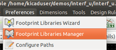
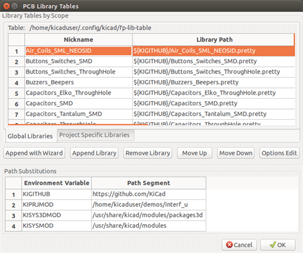
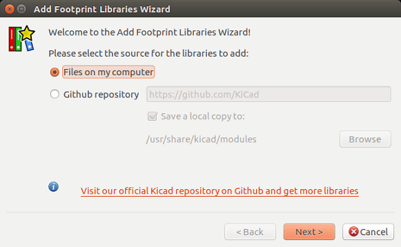
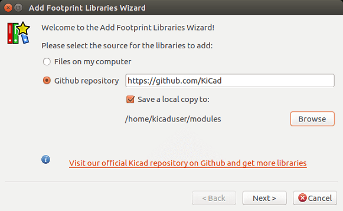
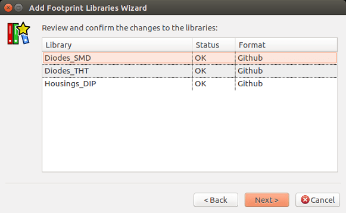
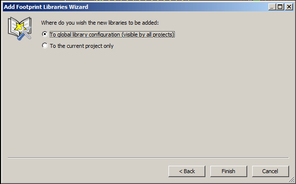
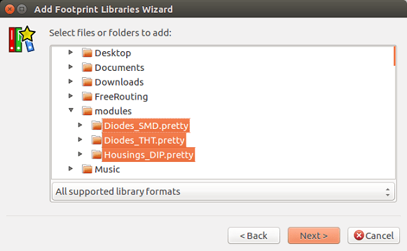
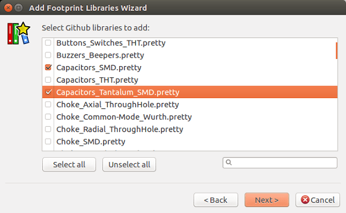

== Installation

=== Installation of the software

The installation procedure is described in the KiCad documentation.

=== Modifying the default configuration

A default configuration file `kicad.pro` is provided in
`kicad/share/template`. This file is used as the initial
configuration for all new projects.

This configuration file can be modified to change the libraries to be
loaded.

To do this:

* Launch Pcbnew using kicad or directly. On Windows it is in
  `C:\kicad\bin\pcbnew.exe` and on Linux you can run
  `/usr/local/kicad/bin/kicad` or `/usr/local/kicad/bin/pcbnew` if the
  binaries are located in `/usr/local/kicad/bin`.
* Select Preferences - Libs and Dir.
* Edit as required.
* Save the modified configuration (Save Cfg) to
  `kicad/share/template/kicad.pro`.

=== Managing Footprint Libraries

As of release 4.0, Pcbnew organises the footprint libraries using
files called "footprint library tables". A footprint library table
contains descriptions of some number of individual footprint libraries,
along with a "nickname" for each library, which is used to refer to
that library when referencing a footprint.

There are several kinds of library supported by Pcbnew, each of
which is supported by a "plugin":

* KiCad - native KiCad footprint libraries stored on a local filesystem
  in the _.pretty_ format (folders containing _.kicad_mod_ files)
* Github - native KiCad footprint libraries in the _.pretty_ format,
  stored online as a Github repository
* Legacy - old-style KiCad footprint libraries (_.mod_ files)
* Eagle - Eagle footprint libraries (folders containing _.fp_ files)
* Geda-PCB - Geda PCB libraries

[NOTE]
====
* You can write only KiCad  _.pretty_ footprint library folders on your
  local disk (and the .kicad_mod files inside these folders).
* All other formats are read only.
====

It is allowed to have footprints with the same name in different
libraries. The footprint will be stored as a combination of library _and_
footprint name, ensuring that the correct footprint is loaded from the
appropriate library.

There are two footprint library tables: the global one and the project
one.

==== Global Footprint Library Table

The global footprint library table contains the list of libraries
that are always available regardless of the currently loaded
project file.  The table is saved in the file `fp-lib-table` in the
user's home folder.  The location of this folder is dependent on the
operating system.

==== Project Specific Footprint Library Table

The project specific footprint library table contains the list of
libraries that are available specifically for the currently loaded
project file.  The project specific footprint library table can only
be edited when it is loaded along with the project board file.  If
no project file is loaded or there is no footprint library table
file in the project path, an empty table is created which can be
edited and later saved along with the board file.

When entries are defined in the project specific table, an
`fp-lib-table file `containing the entries will be
written into the folder of the currently open PCB.

==== Initial Configuration

The first time CvPcb or Pcbnew is run and the global footprint table
file `fp-lib-table` is not found in the user's home folder, Pcbnew
will attempt to copy the default footprint table file
`fp_global_table` stored in the system's KiCad template folder to the
file `fp-lib-table` in the user's home folder.  If `fp_global_table`
cannot be found, an empty footprint library table will be created in
the user's home folder.  If this happens, the user can either copy
`fp_global_table` manually or configure the table by hand.

The default footprint library table includes all of the standard
footprint libraries that are installed as part of KiCad.

[TIP]
====
There are also sample `fp-lib-table` files in the official
https://github.com/KiCad/kicad-library[KiCad library
repository] that you can use as your own starting point:

* All KiCad libraries via Github:
    https://github.com/KiCad/kicad-library/blob/master/template/fp-lib-table.for-github[fp-lib-table.for-github]
* All KiCad libraries, assuming they are on your disk already (you will need to download them if you do not already have them):
    https://github.com/KiCad/kicad-library/blob/master/template/fp-lib-table.for-pretty[fp-lib-table.for-pretty]
* Standard Eagle libraries (for Eagle 6.4.0)
    https://github.com/KiCad/kicad-library/blob/master/template/fp-lib-table.for-eagle-6.4.0[fp-lib-table.for-eagle-6.4.0]
====

The *first thing* to do when configuring KiCad do is to modify this table
(add/remove entries) according to your work and the libraries you need
for your projects.

TIP: It can be time consuming to have many libraries, especially if they
are only found online (such as the Github libraries). If you find
libraries slow to load, try removing ones you don't need.

==== Adding Table Entries using the Libraries Manager

The library table manager is accessible by:

The image below shows the footprint library table editing dialog
which can be opened by invoking the "Footprint Libraries Manager"
entry from the "Preferences" menu.

In order to use a footprint library, it must first be added to
either the global table or the project specific table.  The project
specific table is only applicable when a board file is open.

Each library table entry has a nickname. This _must_ be unique
within that table. The nickname does not have to be
related in any way to the actual library file name or path.

There are some rules for valid library table entries:

* The colon `:` character cannot be used anywhere in the nickname.
* Each library entry must have a valid path and/or file name depending on
  the type of library. Paths can be defined as absolute, relative, or by
  environment variable substitution (see below)
* The appropriate plug in type must be selected in order for the library
  to be properly read.

There is also a description field to add a description of the library
entry.  The option field contains special options that are plugin-specific
and is generally blank.

Although you cannot have duplicate library nicknames in the same table,
you can have duplicate library nicknames in both the global and
project specific footprint library table.  The project specific
table entry will take precedence over the global table entry when
duplicated names occur.

==== Environment Variable Substitution

One of the most powerful features of the footprint library table is
environment variable substitution.  This allows you to define custom
paths to where your libraries are stored in environment variables.

Environment variable substitution is supported by using the syntax
`${ENV_VAR_NAME}` in the footprint library path.

There are some default variables that KiCad defines:

* `$KISYSMOD`: This points to where the default footprint libraries that
  were installed along with KiCad are located.  You can override
  `$KISYSMOD` by defining it yourself which allows you to substitute
  your own libraries in place of the default KiCad footprint libraries.
* When a board file is loaded, `$KPRJMOD` is defined using that board's
  path. This allows you to refer to libraries in the project
  path without having to repeat the absolute path to the library in the
  project specific footprint library table.

==== Adding Table Entries using the Library Wizard

There is an interactive wizard that can assist you adding libraries to
your library tables. It is accessible from the menu:

It can also be launched from the library manager, using the "Append
With Wizard" button.

Here, the local libraries option is selected.

Here, the remote libraries option is selected.

The wizard will then lead you though the steps to adding a library,
which will depend on the type of library you are adding. The process for
each type will be explained below.

After a set of libraries is selected, the next page validates the choice:

If some selected libraries are incorrect (not supported, not a footprint library ...)
they will be flagged as ``INVALID''.

The last choice is the footprint library table to populate either:

* the global table, or
* the project specific table

===== Adding Existing Local Libraries

You might have local libraries already on your computer. For example:

* Previously downloaded KiCad pretty directories
* Legacy KiCad _.mod_ files from older installations
* Geda or Eagle libraries

These can be added with the "Files on my computer" option. You will
be asked for the directory of the library to add and the format:

If you don't select the format, the wizard will try to guess the right format.

===== Adding Libraries from Github

The wizard can also add libraries from Github with the "Github repository"
option.

You need to specify the Github account that contains the repositories
you want to add.

TIP: The offical KiCad library Github account is
    https://github.com/KiCad

You may choose to save a local copy. If you do _not_ save a local
copy, the library will be a _Github_ library, and will resync
on every library reload. If you _do_ save a local copy, the library
will be a _KiCad_ (pretty) library and will not automatically update
in future.

The next page will load a list of _.pretty_ repositories found on that
Github account. You can choose any number to add to the library.

After confirmation,if you opted to save a copy, the footprints will be
downloaded to the specified local location now. If you are using the
Github plugin (no local copy), the footprints are loaded from Github
when needed.

==== Using the KiCad plugin

The KiCad plugin deals with native KiCad libraries that exist on your
computer (or some accessible filesystem).

It is used for pre-installed libraries that are installed along with
KiCad, as well as other KiCad libraries, either from the official
KiCad library collection, 3rd party libraries or your own curated
libraries.

===== Installing KiCad plugin libraries

The Footprint Library Wizard can help you install libraries already
on disk or on Github. However, for libraries on disk, you need to
put them there yourself in the first place.

A KiCad library is a directory that contains some number of
_.kicad_mod_ files.

This is often done by unpacking an archive file, copying a directory
from another location, or cloning a version-controlled repository.

The KiCad plugin does not specify any kind of version control, but Git is
very commonly used to track changes to libraries, which can be critical
to ensuring library data is safely recorded and backed up.

It is easy to track changes and contribute with the offical
KiCad Github libraries. This is done using the Git version control
software. If you want to contribute back, you'll have to
fork the repos on Github so you can send pull requests. If you just want
to update libraries when needed, you don't need to do that, you can clone
the offical KiCad libraries directly and pull as needed.

NOTE: Sending pull requests via Github will allow the automatic
library standards checker to verify your proposed changes. See
https://github.com/KiCad/kicad-library/wiki/Kicad-Library-Convention[KiCad Library Conventions]
for details of the library conventions.

==== Using the GitHub Plugin

The GitHub plugin is a special plugin that provides an interface for
read-only access to a remote GitHub repository consisting of _.pretty_
footprints and optionally provides "Copy-On-Write" (COW) support for
editing footprints read from the GitHub repo and saving them locally.

[IMPORTANT]
====
* The "GitHub" plugin is for *read-only access of remote
  pretty footprint libraries* at https://github.com.
* You will not be told if a remote repository changed since your
  last use of it. Be cautious when using footprint directly from Github.
====

To add a GitHub entry to the footprint library table the "Library Path"
in the footprint library table entry must be set to a valid GitHub URL.

For example:

     https://github.com/liftoff-sr/pretty_footprints

Typically GitHub URLs take the form:

     https://github.com/user_name/repo_name

The "Plugin Type" must be set to "Github".

The table below shows a footprint library table entry with the
default options (no COW support):

[options="header"]
|==============================================================
| Nickname | Library Path | Plugin Type | Options | Description
| github
    | https://github.com/liftoff-sr/pretty_footprints
    | Github
    |
    | Liftoff's GH footprints
|==============================================================

===== Copy-On-Write

To enable the "Copy-On-Write"
feature the option `allow_pretty_writing_to_this_dir` must be
added to the "Options" setting of the footprint library table entry.
This option is the "Library Path" for local storage of modified
copies of footprints read from the GitHub repo.  The footprints
saved to this path are combined with the read-only part of the
GitHub repository to create the footprint library.  If this option
is missing, then the GitHub library is read-only.  If the option is
present for a GitHub library, then any writes to this hybrid library
will go to the local `*.pretty` directory.

The github.com resident portion of this hybrid COW library is
always read-only, meaning you cannot delete anything or modify any
footprint in the specified GitHub repository directly. The aggregate
library type remains "Github" in all further discussions,
but it consists of both the local read/write portion and the
remote read-only portion.

The table below shows a footprint library table entry with the COW
option given.  Note the use of the environment variable `${HOME}` as
an example only.  The github.pretty directory is located in
`${HOME}/pretty/path`.  Anytime you use the option
`allow_pretty_writing_to_this_dir`, you will need to create that
directory manually in advance and it must end with the extension
`.pretty`.

[options="header"]
|==============================================================
| Nickname | Library Path | Plugin Type | Options | Description
| github
    | https://github.com/liftoff-sr/pretty_footprints
    | Github
    | `allow_pretty_writing_to_this_dir=${HOME}/pretty/github.pretty`
    | Liftoff's GH footprints
|==============================================================

Footprint loads will always give precedence to the local footprints
found in the path given by the option
`allow_pretty_writing_to_this_dir`.  Once you have saved a footprint
to the COW library's local directory by doing a footprint save in
the Footprint Editor, no GitHub updates will be seen when loading a
footprint with the same name as one for which you've saved locally.

Always keep a separate local `*.pretty` directory for each GitHub
library, never combine them by referring to the same directory more
than once.  Also, do not use the same COW (`*.pretty`) directory in
a footprint library table entry.  This would likely create a mess.
The value of the option `allow_pretty_writing_to_this_dir` will
expand any environment variable using the `${}` notation to create
the path in the same way as the "Library Path" setting.

===== Using Copy-On-Write to share footprints

What's the point of COW?  If you periodically email your COW pretty
footprint modifications to the GitHub repository maintainer, you can help
update the GitHub copy.  Simply email the individual `*.kicad_mod`
files you find in your COW directories to the maintainer of the
GitHub repository.  After you've received confirmation that your
changes have been committed, you can safely delete your COW file(s)
and the updated footprint from the read-only part of GitHub library
will flow down.  Your goal should be to keep the COW file set as
small as possible by contributing frequently to the shared master
copies at https://github.com.

TIP: You can also contribute to library developement using local
Git clones of the relevant libraries using the _KiCad_ plugin and
submitting pull requests to the library maintainers.

===== Caching Github requests

The Github plugin can be slow, as it must download all the libraries
from the Internet before they can be used.

Nginx can be used as a cache to the github server to speed
up the loading of footprints. It can be installed locally or on a
network server. There is an example configuration in KiCad sources
at `pcbnew/github/nginx.conf`. The most straightforward way to get
this working is to overwrite the default nginx.conf with this one
and `export KIGITHUB=http://my_server:54321/KiCad`, where
`my_server` is the IP or domain name of the machine running nginx.

==== Usage Patterns

Footprint libraries can be defined either globally or specifically
to the currently loaded project.  Footprint libraries defined in the
user's global table are always available and are stored in the
`fp-lib-table` file in the user's home folder.  Global footprint
libraries can always be accessed even when there is no project net
list file opened.  The project specific footprint table is active
only for the currently open net list file.  The project specific
footprint library table is saved in the file `fp-lib-table` in the
path of the currently open board file.  You are free to define
libraries in either table.

There are advantages and disadvantages to each method:

* You can define all of your libraries in the global table which means
  they will always be available when you need them.

** The disadvantage of this is that you may have to search through a lot
   of libraries to find the footprint you are looking for.

* You can define all your libraries on a project specific basis.

** The advantage of this is that you only need to define the libraries
   you actually need for the project which cuts down on searching.
** The disadvantage is that you always have to remember to add each
   footprint library that you need for every project.

* You can also define footprint libraries both globally and project
  specifically.

One usage pattern would be to define your most commonly used
libraries globally and the library only required for the project in
the project specific library table.  There is no restriction on how
you define your libraries.

===== Modifying footprints in a PCB project

When a footprint is added to a PCB, the entire footprint is copied into
the PCB file (_.kicad_pcb_). This means changes to the footprint in the
library do not automatically affect the PCB.

This also means that you can individually edit footprints on the PCB
without affecting other instances of the same footprint (either
on the same PCB or on other PCBs).

However, if you modify the library footprint, the next time you place
an instance, it will not match existing footprints of the same name.

TIP: A common practice is to copy all the footprints you use to a separate
version-controlled location, so that this project is not unexpectedly
affected by changes to system or user libraries. Also, it ensures all
the footprint resources used for the PCB can be easily distributed with
the PCB file.
