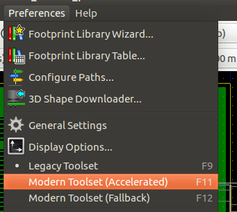
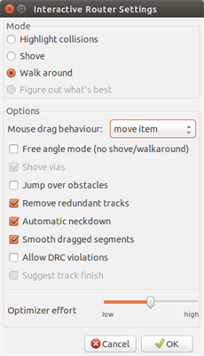

== Interactive Router

The Interactive Router lets you quickly and efficiently route your PCBs by
shoving off or walking around items on the PCB that collide with the
trace you are currently drawing.

Following modes are supported:

* *Highlight collisions*, which highlights all violating objects with a
  nice, shiny green color and shows violating clearance regions.

* *Shove*, attempting to push and shove all items colliding with the
  currently routed track.

* *Walk around*, trying to avoid obstacles by hugging/walking around
  them.

=== Setting up

Before using the Interactive Router, please set up these two things:

* *Clearance settings* To set the clearances, open the _Design Rules_
  dialog and make sure at least the default clearance value looks
  sensible.

image::images/en/rules_editor.png["Rules editor", scaledwidth="70%"]

* *Enable OpenGL mode* By selecting _View->Switch canvas to OpenGL_ menu
  option or pressing **F11**.

=== Laying out tracks

To activate the router tool press the _Interactive Router_ button
image:images/route_icon.png[Interactive Router Button] or the *X* key.
The cursor will turn into a cross and the tool name, will appear in the
status bar.

To start a track, click on any item (a pad, track or a via) or press the
*X* key again hovering the mouse over that item. The new track will use
the net of the starting item. Clicking or pressing *X* on empty PCB
space starts a track with no net assigned.

Move the mouse to define shape of the track. The router will try to
follow the mouse trail, hugging unmovable obstacles (such as pads) and
shoving colliding traces/vias, depending on the mode. Retreating the mouse
cursor will cause the shoved items to spring back to their former
locations.

Clicking on a pad/track/via in the same net finishes routing. Clicking
in empty space fixes the segments routed so far and continues routing
the trace.

In order to stop routing and undo all changes (shoved items, etc.),
simply press **Esc**.

Pressing *V* or selecting _Place Through Via_ from the context menu
while routing a track attaches a via at the end of the trace being
routed. Pressing *V* again disables via placement. Clicking in any spot
establishes the via and continues routing.

Pressing */* or selecting _Switch Track Posture_ from the context menu
toggles the direction of the initial track segment between straight or
diagonal.

NOTE: By default, the router snaps to centers/axes of the items.
Snapping can be disabled by holding *Shift* while routing or selecting
items.

=== Setting track widths and via sizes

There are several ways to pre-select a track width/via size or to change
it during routing:

- Use standard KiCad shortcuts.

- Press *W* or select _Custom Track Width_ 
  from the context menu to type in a custom track width/via size.

- Pick a predefined width from the _Select Track Width_ sub-menu
  of the context menu.

- Select _Use the starting track width_ in the _Select Track Width_
  menu to pick the width from the start item (or the traces already
  connected to it).

=== Dragging

The router can drag track segments, corners and vias. To drag an item,
click on it with *Ctrl* key pressed, hover the mouse and press *G* or
select _Drag Track/Via_ from the context menu. Finish dragging by
clicking again or abort by pressing __Esc__.

=== Options

The router behavior can be configured by pressing _E_ or selecting _Routing
Options_ from the context menu while in the Track mode.
It opens a window like the one below:

The options are:

* *Mode* - select how the router handles DRC violation (shoving, walking
  around, etc.)

* *Shove vias* - when disabled, vias are treated as un-movable objects
  and hugged instead of shoved.

* *Jump over obstacles* - when enabled, the router tries to move
  colliding traces behind solid obstacles (e.g. pads) instead of
  "reflecting" back the collision

* *Remove redundant tracks* - removes loops while routing (e.g. if the
  new track ensures same connectivity as an already existing one, the old
  track is removed). Loop removal works locally (only between the start
  and end of the currently routed trace).

* *Automatic neckdown* - when enabled, the router tries to break out
  pads/vias in a clean way, avoiding acute angles and jagged breakout
  traces.

* *Smooth dragged segments* - when enabled, the router attempts to merge
  several jagged segments into a single straight one (dragging mode).

* *Allow DRC violations* (_Highlight collisions_ mode only) - allows
  to establish a track even if is violating the DRC rules.

* *Optimizer effort* - defines how much time the router shall spend
  optimizing the routed/shoved traces. More effort means cleaner routing
  (but slower), less effort means faster routing but somewhat jagged
  traces.
