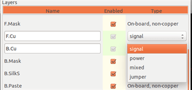
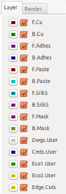
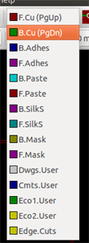
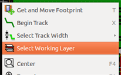
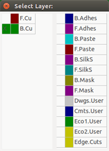
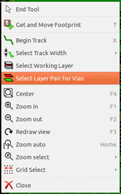
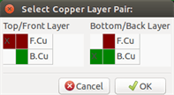
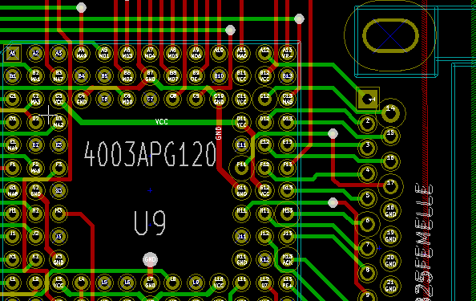

== Layers

=== Introduction

Pcbnew can work with 50 different layers:

* Between 2 and 32 copper layers for routing tracks.
* 14 fixed-purpose technical layers:
    - 12 paired layers (Front/Back): *Adhesive*, *Solder Paste*,
    *Silk Screen*, *Solder Mask*, *Courtyard*, *Fabrication*
    - 2 standalone layers: *Edge Cuts*, *Margin*
* 4 auxiliary layers that you can use any way you want: *Comments*, *E.C.O. 1*, *E.C.O. 2*, *Drawings*

=== Setting up layers

To open the *Layers Setup* from the menu bar, select **Design Rules** -> **Layers Setup**.

The number of copper layers, their names, and their function are configured there.
Unused technical layers can be disabled.

image::images/Pcbnew_layer_setup_dialog.png[scaledwidth="60%"]

=== Layer Description

==== Copper Layers

Copper layers are the usual working layers used to place and re-arrange tracks.
Layer numbers start from 0 (the first copper layer, on Front) and end 
at 31 (Back). Since components cannot be placed in *inner layers* (number 1 to 30),
only layers number 0 and 31 are *component layer*.

The name of any copper layer is editable. Copper layers have
a function attribute that is useful when using the external router _Freerouter_.
Example of default layer names are *F.Cu* and *In0* for layer number 0.

==== Paired Technical Layers

12 technical layers come in pairs: one for the front, one for the back. You can recognize them with the "F." or "B." prefix in their names.
The elements making up a footprint (pad, drawing, text) of one of these layers are automatically mirrored and moved to the complementary layer when the footprint is flipped.

The paired technical layers are:

*Adhesive* (F.Adhes and B.Adhes)::
    These are used in the application of adhesive to stick SMD components
    to the circuit board, generally before wave soldering.

*Solder Paste* (F.Paste and B.Paste)::
    Used to produce a mask to allow solder paste to be placed on the
    pads of surface mount components, generally before reflow soldering.
    Usually only surface mount pads occupy these layers.

*Silk Screen* (F.SilkS and B.SilkS)::
    They are the layers where the drawings of the components appear. That's where you draw things like component polarity, first pin indicator, reference for mounting, ...

*Solder Mask* (F.Mask and B.Mask)::
    These define the solder masks. All pads should appear on one of these layers (SMT) or both (for through hole) to prevent the varnish from covering the pads.

*Courtyard* (F.CrtYd and B.CrtYd)::
    Used to show how much space a component physically takes on the PCB.

*Fabrication* (F.Fab and B.Fab)::
    Footprint assembly (?).

==== Independant Technical Layers

*Edge.Cuts*::
    This layer is reserved for the drawing of circuit board outline. Any
    element (graphic, texts...) placed on this layer appears on all the
    other layers. Use this layer only to draw board outlines.

*Margin*::
    Board's edge setback outline (?).

==== Layers for general use

These layers are for any use. They can be used for text such as
instructions for assembly or wiring, or construction drawings, to be
used to create a file for assembly or machining. Their names are:

* Comments
* E.C.O. 1
* E.C.O. 2
* Drawings

=== Selection of the active layer

The selection of the active working layer can be done in several ways:

* Using the right toolbar (Layer manager).
* Using the upper toolbar.
* With the pop-up window (activated with the right mouse button).
* Using the + and - keys (works on copper layers only).
* By hot keys.

==== Selection using the layer manager

==== Selection using the upper toolbar

This directly selects the working layer.

Hot keys to select the working layer are displayed.

==== Selection using the pop-up window

The Pop-up window opens a menu window which provides a choice for
the working layer.

=== Selection of the Layers for Vias

If the *Add Tracks and Vias* icon is selected on the right hand
toolbar, the Pop-Up window provides the option to change the layer
pair used for vias:

This selection opens a menu window which provides choice of the
layers used for vias.

When a via is placed the working (active) layer is automatically
switched to the alternate layer of the layer pair used for the vias.

One can also switch to an other active layer by hot keys, and if a
track is in progress, a via will be inserted.

=== Using the high-contrast mode

This mode is entered when the tool (in the left toolbar) is activated:
image:images/icons/contrast_mode.png[]

When using this mode, the active layer is displayed like in the
normal mode, but all others layers are displayed in gray color.

There are two useful cases:

==== Copper layers in high-contrast mode

When a board uses more than four layers, this option allows the
active copper layer to be seen more easily:

*Normal mode* (back side copper layer active):

image::images/Pcbnew_copper_layers_contrast_normal.png[scaledwidth="90%"]

*High-contrast mode* (back side copper layer active):

image::images/Pcbnew_copper_layers_contrast_high.png[scaledwidth="90%"]

==== Technical layers

The other case is when it is necessary to examine solder paste
layers and solder mask layers which are usually not displayed.

Masks on pads are displayed if this mode is active.

*Normal mode* (front side solder mask layer active):

*High-contrast mode* (front side solder mask layer active):

image::images/Pcbnew_technical_layers_contrast_high.png[scaledwidth="80%"]
