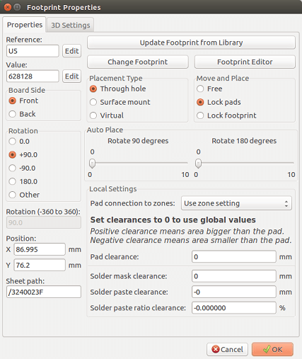
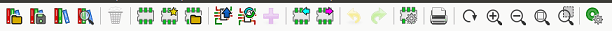
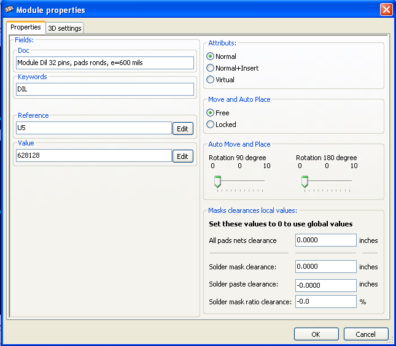
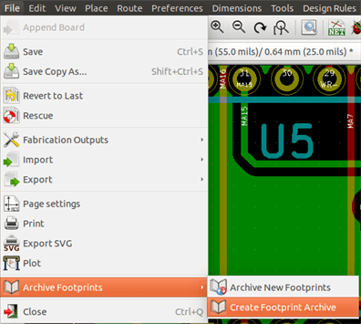

== Footprint Editor - Managing Libraries

=== Overview of Footprint Editor

Pcbnew can simultaneously maintain several libraries. Thus, when a
footprint is loaded, all libraries that appear in the library list are
searched until the first instance of the footprint is found. In what
follows, note that the active library is the library selected within
the Footprint Editor, the program will now be described

Footprint Editor enables the creation and the editing of footprints:

* Adding and removing pads.

* Changing pad properties (shape, layer) for individual pads or
  globally for all pads of a footprint.

* Editing graphic elements (lines, text).

* Editing information fields (value, reference, etc.).

* Editing the associated documentation (description, keywords).

Footprint Editor allows the maintenance of the active library as well by:

* Listing the footprints in the active library.

* Deletion of a footprint from the active library.

* Saving a footprint to the active library.

* Saving all of the footprints contained by a printed circuit.

It is also possible to create new libraries.

The library extension is `.mod`.

=== Accessing Footprint Editor

The Footprint Editor can be accessed in two different ways:

* Directly, via the icon image:images/icons/module_editor.png[]
  in the main toolbar of Pcbnew.
* In the edit dialog for the active footprint (see figure below: accessed
  via the context menu), there is the button Footprint Editor.

In this case, the active footprint of the board will be loaded automatically in Footprint Editor, enabling immediate editing or archiving.

=== Footprint Editor user interface

By calling Footprint Editor the following window will appear:

image::images/Modedit_main_window.png[scaledwidth="80%"]

=== Top toolbar in Footprint Editor

From this toolbar, the following functions are available:

[cols="1,4"]
|======
| image:images/icons/library.png[]
| Select the active library.
| image:images/icons/save_library.png[]
| Save the current footprint to the active library, and write it to disk.
| image:images/icons/new_library.png[]
| Create a new library and save the current footprint in it.
| 
| Open the Footprint Viewer
| image:images/icons/delete.png[]
| Access a dialog for deleting a footprint from the active library.
| image:images/icons/new_footprint.png[]
| Create a new footprint.
| 
| Create a footprint using a wizard
| image:images/icons/load_module_lib.png[]
| Load a footprint from the active library.
| image:images/icons/load_module_board.png[]
| Load (import) a footprint from the printed circuit board.
| image:images/icons/update_module_board.png[]
| Export the current footprint to the printed circuit board. when the
footprint was previously imported from the current board. It will replace
the corresponding footprint on the board (i.e., respecting position and
orientation).
| 
| Export the current footprint to the printed circuit board. It will be
copied on to the printed circuit board at position 0.
| image:images/icons/import_module.png[]
| Import a footprint from a file created by the Export command.
| 
| Export a footprint. This command is essentially identical to that for
creating a library, the only difference being that it creates a library
in the user directory, while creating a library in the standard library
directory (usually kicad/modules).
|  image:images/icons/redo.png[]
| Undo and Redo
| 
| Invokes the footprint properties dialog.
| 
| Call the print dialog.
| image:images/icons/zoom_in.png[]
image:images/icons/zoom_out.png[]
image:images/icons/zoom_redraw.png[]
image:images/icons/zoom_fit_in_page.png[]
| Standard zoom commands.
| image:images/icons/options_pad.png[]
| Call the pad editor.
| 
| Perform a check of footprint correctness
|======

=== Creating a new library

The creation of a new library is done via the button
image:images/icons/new_library.png[], in this case the file is created
by default in the library directory or via the button
, in which case the file is created
by default in your working directory.

A file-choosing dialog allows the name of the library to be specified
and its directory to be changed. In both cases, the library will
contain the footprint being edited.

WARNING: If an old library of the same name exists, it will be
overwritten without warning.

=== Saving a footprint in the active library

The action of saving a footprint (thereby modifying the file of the
active library) is performed using this button
image:images/icons/save_library.png[]. If a footprint of the same name
already exists, it will be replaced. Since you will depend upon the
accuracy of the library footprints, it is worth double-checking the footprint
before saving.

It is recommended to edit either the reference or value field text to
the name of the footprint as identified in the library.

=== Transferring a footprint from one library to another

* Select the source library via the button
  image:images/icons/library.png[].
* Load the footprint via the button
  image:images/icons/load_module_lib.png[].
* Select the destination library via the button
  image:images/icons/library.png[].
* Save the footprint via the button image:images/icons/save_library.png[]

You may also wish to delete the source footprint.

* Reselect the source library with image:images/icons/library.png[]
* Delete the old footprint via the button image:images/icons/delete.png[]

=== Saving all footprints of your board in the active library

It is possible to copy all of the footprints of a given board design to
the active library. These footprints will keep their current library
names. This command has two uses:

* To create an archive or complete a library with the footprints from a
  board, in the event of the loss of a library.
* More importantly, it facilitates library maintenance by enabling the
  production of documentation for the library, as below.

=== Documentation for library footprints

It is strongly recommended to document the footprints you create, in
order to enable rapid and error-free searching.

For example, who is able to remember all of the multiple pin-out
variants of a TO92 package? The Footprint Properties dialog offers a
simple solution to this problem.

This dialog accepts:

* A one-line comment/description.
* Multiple keywords.

The description is displayed with the component list in Cvpcb and,
in Pcbnew, it is used in the footprint selection dialogs.

The keywords enable searches to be restricted to those footprints
corresponding to particular keywords.

When directly loading a footprint (the icon
 of the right-hand Pcbnew toolbar),
keywords may be entered in the dialog box. Thus, entering the
text `=CONN` will cause the display of the list of footprints whose
keyword lists contain the word `CONN`.

=== Documenting libraries - recommended practice

It is recommended to create libraries indirectly, by creating one or
more auxiliary circuit boards that constitute the source of (part
of) the library, as follows: Create a circuit board in A4 format, in
order to be able to print easily to scale (scale = 1).

Create the footprints that the library will contain on this circuit
board. The library itself will be created with the File/Archive
footprints/Create footprint archive command.

The "true source" of the library will thus be the auxiliary circuit
board, and it is on this circuit that any subsequent alterations of
footprints will be made. Naturally, several circuit boards can be saved
in the same library.

It is generally a good idea to make different libraries for
different kinds of components (connectors, discretes,...), since
Pcbnew is able to search many libraries when loading footprints.

Here is an example of such a library source:

image::images/Pcbnew_example_library.png[scaledwidth="80%"]

This technique has several advantages:

* The circuit can be printed to scale and serve as documentation for
  the library with no further effort.
* Future changes of Pcbnew may require regeneration of the
  libraries, something that can be done very quickly if circuit-board
  sources of this type have been used. This is important, because the
  circuit board file formats are guaranteed to remain compatible
  during future development, but this is not the case for the library
  file format.

=== Footprint Libraries Management

The list of footprint libraries in Pcbnew can be edited using the
Footprint Libraries Manager. This allows you to add and remove footprint
libraries by hand, and also allows you to invoke the Footprint Libraries
Wizard by pressing the "Append With Wizard" button.

The Footprint Libraries Wizard can also be invoked through the
Preferences menu, and can automatically add a library (detecting its
type) from a file or from a Github URL. The URL for the official
libraries is: https://github.com/KiCad

More details about footprint library tables and the Manager and Wizard
can be found in the CvPcb Reference Manual in the section
_Footprint Library Tables_.

=== 3D Shapes Libraries Management

The 3D shape libraries can be downloaded by 3D Shape Libraries Wizard.
It can be invoked from the menu Preferences -> 3D Shapes Libraries Downloader.
