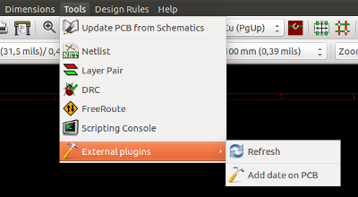

== KiCad Scripting Reference

Scripting allows you to automate tasks within KiCad using the https://www.python.org/[Python] language.

Also see the doxygen documentation on http://ci.kicad-pcb.org/job/kicad-doxygen/ws/build/pcbnew/doxygen-python/html/index.html[Python Scripting Reference].

You can see python module help by typing `pydoc pcbnew` on your terminal.

Using scripting you can create:

- *Plugins*: this type of script is loaded when KiCad starts. Examples:
    * *Footprint Wizards*: To help you build footprints easily filling in parameters. See the dedicated section <<Footprint_Wizards,Footprint Wizards>> below.
    * *File I/O* '(planned)': To let you write plugins to export/import other filetypes
    * *Actions* '(experimental)': Associate events to scripting actions or register new menus or toolbar icons.

- *Command Line Scripts*: scripts that can be used from the command line, load boards or libraries, modify them, and render outputs or new boards.

It shall be noted that the only KiCad application that supports
scripting is Pcbnew. It is also planned for Eeschema in the future.

=== KiCad Objects

The scripting API reflects the internal object structure inside
KiCad/pcbnew. BOARD is the main object, that has a set of properties and
a set of MODULEs, and TRACKs/VIAs, TEXTE_PCB, DIMENSION, DRAWSEGMENT.
Then MODULEs have D_PADs, EDGEs, etc.

- See the BOARD section below.

=== Basic API Reference

All the pcbnew API is provided from the "pcbnew" module in Python.
GetBoard() method will return the current pcb open at editor, useful for
commands written from the integrated scripting shell inside pcbnew or
action plugins.

=== Loading and Saving a Board

- *LoadBoard(filename):*
           loads a board from file returning a BOARD object, using the file format that matches the filename extension.

- *SaveBoard(filename,board):*
           saves a BOARD object to file, using the file format that matches the filename extension.

- *board.Save(filename):*
           same as above, but it's a method of BOARD object.

.Example that loads a board, hides all values, shows all references
[source,python]
----------
#!/usr/bin/env python2.7
import sys
from pcbnew import *

filename=sys.argv[1]

pcb = LoadBoard(filename)
for module in pcb.GetModules():
    print "* Module: %s"%module.GetReference()
    module.Value().SetVisible(False)      # set Value as Hidden
    module.Reference().SetVisible(True)   # set Reference as Visible

pcb.Save("mod_"+filename)
----------

=== Listing and Loading Libraries

.Enumerate library, enumerate modules, enumerate pads
[source,python]
----------
#!/usr/bin/python

from pcbnew import *

libpath = "/usr/share/kicad/modules/Sockets.pretty"
print ">> enumerate footprints, pads of",libpath

# Load the suitable plugin to read/write the .pretty library
# (containing the .kicad_mod footprint files)
src_type = IO_MGR.GuessPluginTypeFromLibPath( libpath );
# Rem: we can force the plugin type by using IO_MGR.PluginFind( IO_MGR.KICAD )
plugin = IO_MGR.PluginFind( src_type )

# Print plugin type name: (Expecting "KiCad" for a .pretty library)
print( "Selected plugin type: %s" % plugin.PluginName() )

list_of_footprints = plugin.FootprintEnumerate(libpath)

for name in list_of_footprints:
    fp = plugin.FootprintLoad(libpath,name)
    # print the short name of the footprint
    print name  # this is the name inside the loaded library
    # followed by ref field, value field, and decription string:
    # Remember ref and value texts are dummy texts, replaced by the schematic values
    # when reading a netlist.
    print "  ->", fp.GetReference(), fp.GetValue(), fp.GetDescription()

    # print pad info: GetPos0() is the pad position relative to the footrint position
    for pad in fp.Pads():
        print "    pad [%s]" % pad.GetPadName(), "at",\
        "pos0", ToMM(pad.GetPos0().x), ToMM(pad.GetPos0().y),"mm",\
        "shape offset", ToMM(pad.GetOffset().x), ToMM(pad.GetOffset().y), "mm"
    print ""
----------

=== BOARD

Board is the basic object in KiCad pcbnew, it's the document.

BOARD contains a set of object lists that can be accessed using the following methods, they will return iterable lists that can be iterated using "for obj in list:"

- *board.GetModules():* This method returns a list of MODULE objects, all the modules available in the board will be exposed here.
- *board.GetDrawings():* Returns the list of BOARD_ITEMS that belong to the board drawings
- *board.GetTracks():* This method returns a list of TRACKs and VIAs inside a BOARD
- *board.GetFullRatsnest():* Returns the list of ratsnest (connections still not routed)
- *board.GetNetClasses():* Returns the list of net classes
- *board.GetCurrentNetClassName():* Returns the current net class
- *board.GetViasDimensionsList():* Returns the list of Via dimensions available to the board.
- *board.GetTrackWidthList():* Returns the list of Track Widths available to the board.

.Board Inspection Example
[source,python]
----------
#!/usr/bin/env python
import sys
from pcbnew import *

filename=sys.argv[1]

pcb = LoadBoard(filename)

ToUnits = ToMM
FromUnits = FromMM
#ToUnits=ToMils
#FromUnits=FromMils

print "LISTING VIAS:"

for item in pcb.GetTracks():
    if type(item) is VIA:

        pos = item.GetPosition()
        drill = item.GetDrillValue()
        width = item.GetWidth()
        print " * Via:   %s - %f/%f "%(ToUnits(pos),ToUnits(drill),ToUnits(width))

    elif type(item) is TRACK:

        start = item.GetStart()
        end = item.GetEnd()
        width = item.GetWidth()

        print " * Track: %s to %s, width %f" % (ToUnits(start),ToUnits(end),ToUnits(width))

    else:
        print "Unknown type    %s" % type(item)

print ""
print "LIST DRAWINGS:"

for item in pcb.GetDrawings():
    if type(item) is TEXTE_PCB:
        print "* Text:    '%s' at %s"%(item.GetText(), item.GetPosition())
    elif type(item) is DRAWSEGMENT:
        print "* Drawing: %s"%item.GetShapeStr() # dir(item)
    else:
        print type(item)

print ""
print "LIST MODULES:"

for module in pcb.GetModules():
    print "* Module: %s at %s"%(module.GetReference(),ToUnits(module.GetPosition()))

print ""
print "Ratsnest cnt:",len(pcb.GetFullRatsnest())
print "track w cnt:",len(pcb.GetTrackWidthList())
print "via s cnt:",len(pcb.GetViasDimensionsList())

print ""
print "LIST ZONES:", pcb.GetAreaCount()

for idx in range(0, pcb.GetAreaCount()):
    zone=pcb.GetArea(idx)
    print "zone:", idx, "priority:", zone.GetPriority(), "netname", zone.GetNetname()

print ""
print "NetClasses:", pcb.GetNetClasses().GetCount(),
---------

=== Examples

==== Change a component pin's paste mask margin

.We only want to change pins from 1 to 14, 15 is a thermal pad that must be kept as it is.
[source,python]
----------
#!/usr/bin/env python2.7
import sys
from pcbnew import *

filename=sys.argv[1]
pcb = LoadBoard(filename)

# Find module U304
u304 = pcb.FindModuleByReference('U304')
pads = u304.Pads()

#  Iterate over pads, printing solder paste margin
for p in pads:
    print p.GetPadName(), ToMM(p.GetLocalSolderPasteMargin())
    id = int(p.GetPadName())
    # Set margin to 0 for all but pad (pin) 15
    if id<15: p.SetLocalSolderPasteMargin(0)

pcb.Save("mod_"+filename)
---------

[[Footprint_Wizards]]
=== Footprint Wizards

The footprint wizards are a collection of python scripts that can be
accessed from the Footprint Editor. If you invoke the footprint
dialog you select a given wizard that allows you to see the footprint
rendered, and you have some parameters you can edit.

If the plugins are not properly distributed to your system package,
you can find the latest versions in the KiCad source tree at
link:https://git.launchpad.net/kicad/tree/pcbnew/python/plugins[launchpad].

They should be located in for example `C:\Program
Files\KiCad\share\kicad\scripting\plugins`.

On linux you can also keep your user plugins in
`$HOME/.kicad_plugins`.

.Build footprints easily filling in parameters.
[source,python]
----------
from __future__ import division
import pcbnew

import HelpfulFootprintWizardPlugin as HFPW

class FPC_FootprintWizard(HFPW.HelpfulFootprintWizardPlugin):

    def GetName(self):
        return "FPC (SMT connector)"

    def GetDescription(self):
        return "FPC (SMT connector) Footprint Wizard"

    def GetValue(self):
        pins = self.parameters["Pads"]["*n"]
        return "FPC_%d" % pins

    def GenerateParameterList(self):
        self.AddParam( "Pads", "n", self.uNatural, 40 )
        self.AddParam( "Pads", "pitch", self.uMM, 0.5 )
        self.AddParam( "Pads", "width", self.uMM, 0.25 )
        self.AddParam( "Pads", "height", self.uMM, 1.6)
        self.AddParam( "Shield", "shield_to_pad", self.uMM, 1.6 )
        self.AddParam( "Shield", "from_top", self.uMM, 1.3 )
        self.AddParam( "Shield", "width", self.uMM, 1.5 )
        self.AddParam( "Shield", "height", self.uMM, 2 )

    # build a rectangular pad
    def smdRectPad(self,module,size,pos,name):
        pad = pcbnew.D_PAD(module)
        pad.SetSize(size)
        pad.SetShape(pcbnew.PAD_SHAPE_RECT)
        pad.SetAttribute(pcbnew.PAD_ATTRIB_SMD)
        pad.SetLayerSet( pad.SMDMask() )
        pad.SetPos0(pos)
        pad.SetPosition(pos)
        pad.SetPadName(name)
        return pad

    def CheckParameters(self):
        p = self.parameters
        self.CheckParamInt( "Pads", "*n" )  # not internal units preceded by "*"

    def BuildThisFootprint(self):
        p = self.parameters
        pad_count       = int(p["Pads"]["*n"])
        pad_width       = p["Pads"]["width"]
        pad_height      = p["Pads"]["height"]
        pad_pitch       = p["Pads"]["pitch"]
        shl_width       = p["Shield"]["width"]
        shl_height      = p["Shield"]["height"]
        shl_to_pad      = p["Shield"]["shield_to_pad"]
        shl_from_top    = p["Shield"]["from_top"]

        offsetX         = pad_pitch * ( pad_count-1 ) / 2
        size_pad = pcbnew.wxSize( pad_width, pad_height )
        size_shld = pcbnew.wxSize(shl_width, shl_height)
        size_text = self.GetTextSize()  # IPC nominal

        # Gives a position and size to ref and value texts:
        textposy = pad_height/2 + pcbnew.FromMM(1) + self.GetTextThickness()
        self.draw.Reference( 0, textposy, size_text )

        textposy = textposy + size_text + self.GetTextThickness()
        self.draw.Value( 0, textposy, size_text )

        # create a pad array and add it to the module
        for n in range ( 0, pad_count ):
            xpos = pad_pitch*n - offsetX
            pad = self.smdRectPad(self.module,size_pad, pcbnew.wxPoint(xpos,0),str(n+1))
            self.module.Add(pad)

        # Mechanical shield pads: left pad and right pad
        xpos = -shl_to_pad-offsetX
        pad_s0_pos = pcbnew.wxPoint(xpos,shl_from_top)
        pad_s0 = self.smdRectPad(self.module, size_shld, pad_s0_pos, "0")
        xpos = (pad_count-1) * pad_pitch+shl_to_pad - offsetX
        pad_s1_pos = pcbnew.wxPoint(xpos,shl_from_top)
        pad_s1 = self.smdRectPad(self.module, size_shld, pad_s1_pos, "0")

        self.module.Add(pad_s0)
        self.module.Add(pad_s1)

        # add footprint outline
        linewidth = self.draw.GetLineThickness()
        margin = linewidth

        # upper line
        posy = -pad_height/2 - linewidth/2 - margin
        xstart = - pad_pitch*0.5-offsetX
        xend = pad_pitch * pad_count + xstart;
        self.draw.Line( xstart, posy, xend, posy )

        # lower line
        posy = pad_height/2 + linewidth/2 + margin
        self.draw.Line(xstart, posy, xend, posy)

        # around left mechanical pad (the outline around right pad is mirrored/y axix)
        yend = pad_s0_pos.y + shl_height/2 + margin
        self.draw.Line(xstart, posy, xstart, yend)
        self.draw.Line(-xstart, posy, -xstart, yend)

        posy = yend
        xend = pad_s0_pos.x - (shl_width/2 + linewidth + margin*2)
        self.draw.Line(xstart, posy, xend, posy)

        # right pad side
        self.draw.Line(-xstart, posy, -xend, yend)

        # set SMD attribute
        self.module.SetAttributes(pcbnew.MOD_CMS)

        # vertical segment at left of the pad
        xstart = xend
        yend = posy - (shl_height + linewidth + margin*2)
        self.draw.Line(xstart, posy, xend, yend)

        # right pad side
        self.draw.Line(-xstart, posy, -xend, yend)

        # horizontal segment above the pad
        xstart = xend
        xend = - pad_pitch*0.5-offsetX
        posy = yend
        self.draw.Line(xstart, posy, xend, yend)

        # right pad side
        self.draw.Line(-xstart, posy,-xend, yend)

        # vertical segment above the pad
        xstart = xend
        yend = -pad_height/2 - linewidth/2 - margin
        self.draw.Line(xstart, posy, xend, yend)

        # right pad side
        self.draw.Line(-xstart, posy, -xend, yend)

# register into pcbnew
FPC_FootprintWizard().register()
---------

[[action_menu]]
=== Action Plugins
Action plugin associate events to scripting actions. Currently only
register a new menu is implemented.

New menu are available inside menu *Tools* => *External plugins*.

- *Refresh*: reload plugins (create new menu if needed)
- *Add date on PCB*: An example plugin.

*Warning*: As all other python scripts, undo/redo function not work
 (yet !).

.Action plugin example: Add date to any text item with content '$date$'
[source,python]
----------
import pcbnew
import re
import datetime

class text_by_date(pcbnew.ActionPlugin):
    """
    test_by_date: A sample plugin as an example of ActionPlugin
    Add the date to any text field of the board where the content is '$date$'
    How to use:
    - Add a text on your board with the content '$date$'
    - Call the plugin
    - Automaticaly the date will be added to the text (format YYYY-MM-DD)
    """

    def defaults(self):
        """
        Method defaults must be redefined
        self.name should be the menu label to use
        self.category should be the category (not yet used)
        self.description should be a comprehensive description
          of the plugin
        """
        self.name = "Add date on PCB"
        self.category = "Modify PCB"
        self.description = "Automaticaly add date on an existing PCB"

    def Run(self):
        pcb = pcbnew.GetBoard()
        for draw in pcb.GetDrawings():
            if draw.GetClass() == 'PTEXT':
                txt = re.sub("\$date\$ [0-9]{4}-[0-9]{2}-[0-9]{2}",
                                 "$date$", draw.GetText())
                if txt == "$date$":
                    draw.SetText("$date$ %s"%datetime.date.today())

text_by_date().register()

----------
