== Setting routing parameters

=== Current settings

==== Accessing the main dialog

The most important parameters are accessed from the following
drop-down menu:

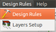

and are set in the Design Rules dialog.

==== Current settings

Current settings are displayed in the top toolbar.

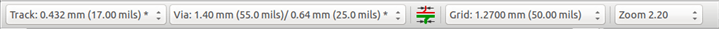

=== General options

The General options menu is available via the top toolbar link Preferences -> General dialog.

image:images/Pcbnew_preferences_menu.png[]

The dialog looks like the following:

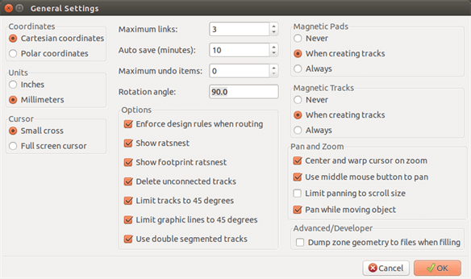

For the creation of tracks the necessary parameters are:

* *Tracks 45 Only*: Directions allowed for track segments are 0, 45 or
  90 degrees.
* *Double Segm Track*: When creating tracks, 2 segments will be
  displayed.
* *Tracks Auto Del*: When recreating tracks, the old one will be
  automatically deleted if considered redundant.
* *Magnetic Pads*: The graphic cursor becomes a pad, centered in the
  pad area.
* *Magnetic Tracks*: The graphic cursor becomes the track axis.

=== Netclasses

Pcbnew allows you to define different routing parameters for each
net. Parameters are defined by a group of nets.

* A group of nets is called a Netclass.
* There is always a netclass called "default".
* Users can add others Netclasses.

A netclass specifies:

* The width of tracks, via diameters and drills.
* The clearance between pads and tracks (or vias).
* When routing, Pcbnew automatically selects the netclass corresponding
  to the net of the track to create or edit, and therefore the routing
  parameters.

==== Setting routing parameters

The choice is made in the menu: Design Rules -> Design Rules.

==== Netclass editor

The Netclass editor allows you to:

* Add or delete Netclasses.
* Set routing parameters values: clearance, track width, via sizes.
* Group nets in netclasses.

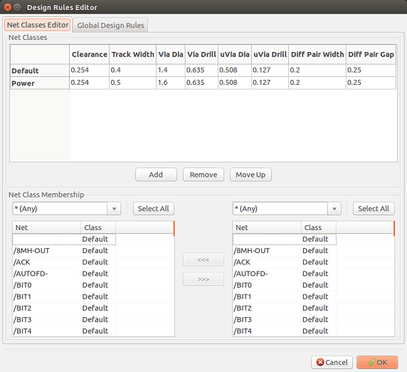

==== Global Design Rules

The global design rules are:

* Enabling/disabling Blind/buried Vias use.
* Enabling/disabling Micro Vias use.
* Minimum Allowed Values for tracks and vias.

A DRC error is raised when a value smaller than the minimum value
specified is encountered. The second dialog panel is:

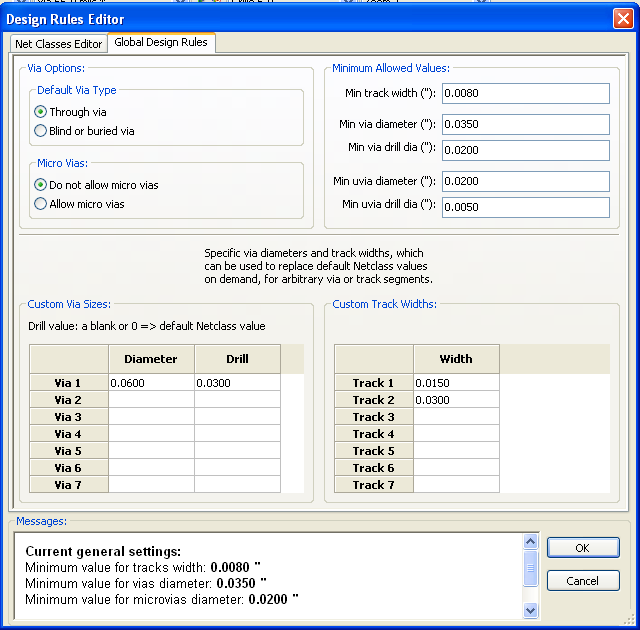

This dialog also allows to enter a "stock" of tracks and vias sizes.

When routing, one can select one of these values to create a track or
via, instead of using the netclass's default value.

Useful in critical cases when a small track segment must have a
specific size.

==== Via parameters

Pcbnew handles 3 types of vias:

* Through vias (usual vias).
* Blind or buried vias.
* Micro Vias, like buried vias but restricted to an external layer to
  its nearest neighbor. They are intended to connect BGA pins to the
  nearest inner layer. Their diameter is usually very small and they are
  drilled by laser.

By default, all vias have the same drill value.

This dialog specifies the smallest acceptable values for via
parameters. On a board, a via smaller than specified here generates
a DRC error.

==== Track parameters

Specify the minimum acceptable track width. On a board, a track
width smaller than specified here generates a DRC error.

==== Specific sizes

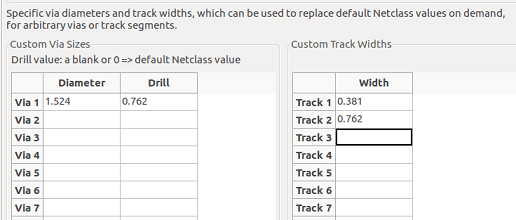

One can enter a set of extra tracks and/or vias sizes. While routing
a track, these values can be used on demand instead of the values
from the current netclass values.

=== Examples and typical dimensions

==== Track width

Use the largest possible value and conform to the minimum sizes given
here.

[options="header"]
|====
| Units | CLASS 1 | CLASS 2 | CLASS 3 | CLASS 4 | CLASS 5
| mm | 0.8 | 0.5 | 0.4 | 0.25 | 0.15
| mils | 31 | 20 | 16 | 10 | 6
|====

==== Insulation (clearance)

[options="header"]
|====
| Units | CLASS 1 | CLASS 2 | CLASS 3 | CLASS 4 | CLASS 5
| mm | 0.7 | 0.5 | 0.35 | 0.23 | 0.15
| mils | 27 | 20 | 14 | 9 | 6
|====

Usually, the minimum clearance is very similar to the minimum track
width.

=== Examples

==== Rustic

* Clearance: 0.35mm (0.0138 inches).
* Track width: 0.8mm (0.0315 inches).
* Pad diameter for ICs and vias: 1.91mm (0.0750  inches ).
* Pad diameter for discrete components: 2.54mm (0.1 inches).
* Ground track width: 2.54mm (0.1 inches).

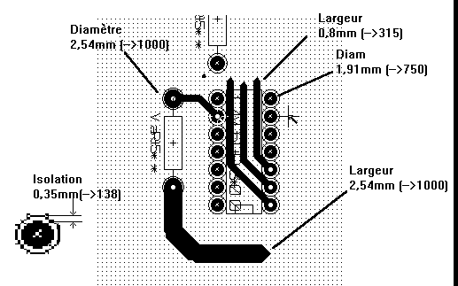

==== Standard

* Clearance: 0.35mm (0.0138  inches).
* Track width: 0.5mm (0.0127  inches).
* Pad diameter for ICs: make them elongated in order to allow tracks to pass between IC pads and yet have the pads offer a sufficient adhesive surface (1.27 x 2.54 mm -->0.05x 0.1 inches).
* Vias: 1.27mm (0.0500  inches).

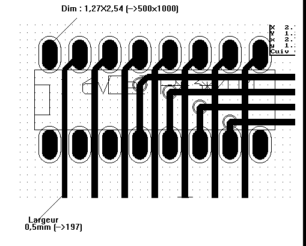

=== Manual routing

Manual routing is often recommended, because it is the only method
offering control over routing priorities. For example, it is
preferable to start by routing power tracks, making them wide and
short and keeping analog and digital supplies well separated. Later,
sensitive signal tracks should be routed. Amongst other problems,
automatic routing often requires many vias. However, automatic
routing can offer a useful insight into the positioning of footprins.
With experience, you will probably find that the automatic router is
useful for quickly routing the 'obvious' tracks, but the remaining
tracks will best be routed by hand.

=== Help when creating tracks

Pcbnew can display the full ratsnest, if the button
 is activated.

The button 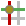 allows one to highlight a
net (click to a pad or an existing track to highlight the corresponding
net).

The DRC checks tracks in real time while creating them. One cannot
create a track which does not match the DRC rules. It is possible to
disable the DRC by clicking on the button. This is, however, not
recommended, use it only in specific cases.

==== Creating tracks

A track can be created by clicking on the button
image:images/icons/add_tracks.png[]. A new track must
start on a pad or on another track, because Pcbnew must know the
net used for the new track (in order to match the DRC rules).

image:images/Pcbnew_creating_new_track.png[]

When creating a new track, Pcbnew shows links to nearest
unconnected pads, link number set in option "Max. Links" in General
Options.

End the track by double-clicking, by the pop-up menu or by its hot key.

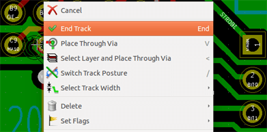

==== Moving and dragging tracks

When the button image:images/icons/add_tracks.png[] is active, the
track where the cursor is positioned can be moved with the hotkey 'M'.
If you want to drag the track you can use the hotkey 'G'.

==== Via Insertion

A via can be inserted only when a track is in progress:

* By the pop-up menu.
* By the hotkey 'V'.
* By switching to a new copper layer using the appropriate hotkey.

=== Select/edit the track width and via size

When clicking on a track or a pad, Pcbnew automatically selects the corresponding Netclass, and the track size and vias dimensions are derived from this netclass.

As previously seen, the Global Design Rules editor has a tool to insert
extra tracks and vias sizes.

* The horizontal toolbar can be used to select a size.
* When the button image:images/icons/add_tracks.png[] is active,
  the current track width can be selected from the pop-up menu
  (accessible as well when creating a track).
* The user can utilize the default Netclasses values or a specified value.

==== Using the horizontal toolbar

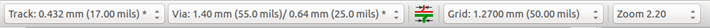

[cols="2,3"]
|=====
| 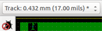
| Track width selection. The symbol * is a mark for default Netclass
value selection.
| 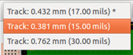
| Selecting a specific track width value.
The first value in list is always the netclass value.
Others values are tracks widths entered from the Global Design Rules editor.
| 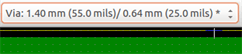
| Via size selection.
The symbol * is a mark for default Netclass value selection.
| 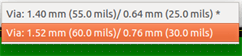
| Selecting a specific via dimension value.
The first value in list is always the netclass value.
Others values are vias dimensions entered from the Global Design Rules editor.
| 
| When enabled: Automatic track width selection.
When starting a track on an existing track, the new track has the same width as the existing track.
| 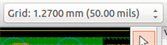
| Grid size selection.
| 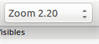
| Zoom selection.
|=====

==== Using the pop-up menu

One can select a new size for routing, or change to a previously created
via or track segment:

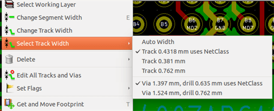

If you want to change many via (or track) sizes, the best way is to
use a specific Netclass for the net(s) that must be edited (see
global changes).

=== Editing and changing tracks

==== Change a track

In many cases redrawing a track is required.

New track (in progress):

image:images/Pcbnew_new_track_in_progress.png[]

When finished:

image:images/Pcbnew_new_track_completed.png[]

Pcbnew will automatically remove the old track if it is redundant.

==== Global changes

Global tracks and via sizes dialog editor is accessible via the
pop-up window by right clicking on a track:

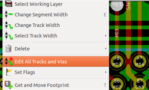

The dialog editor allows global changes of tracks and/or vias for:

* The current net.
* The whole board.

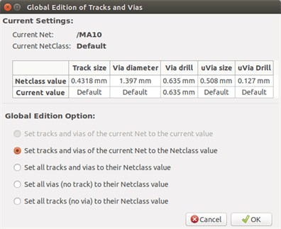
