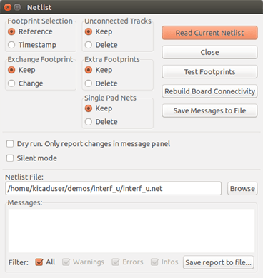
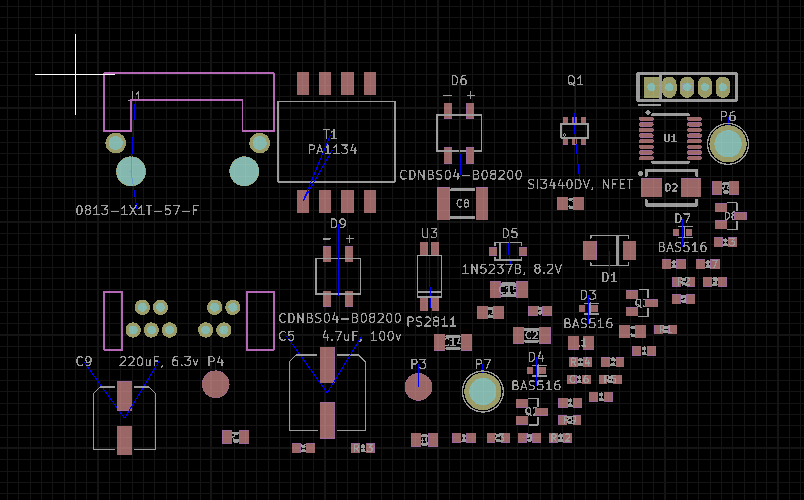
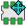
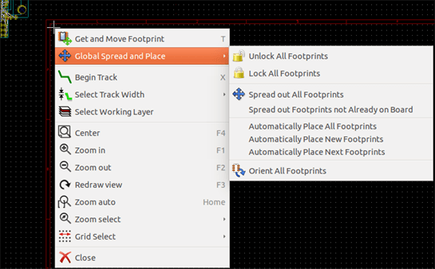

== Schematic Implementation

=== Linking a schematic to a printed circuit board

Generally speaking, a schematic sheet is linked to its printed
circuit board by means of the netlist file, which is normally
generated by the schematic editor used to make the schematic. Pcbnew
accepts netlist files made with Eeschema or Orcad PCB 2. The netlist
file, generated from the schematic is usually missing the footprints
that correspond to the various components. Consequently an
intermediate stage is necessary. During this intermediate process
the association of components with footprints is performed. In KiCad, CvPcb is
used to create this association and a file named `*.cmp` is
produced. CvPcb also updates the netlist file using this information.

CvPcb can also output a "stuff file" `*.stf` which can be back
annotated into the schematic file as the F2 field for each
component, saving the task of re-assigning footprints in each
schematic edit pass. In Eeschema copying a component will also copy
the footprint assignment and set the reference designator as
unassigned for later auto-incremental annotation.

Pcbnew reads the modified netlist file `.net` and, if it exists, the
`.cmp` file. In the event of a footprint being changed directly in Pcbnew
the `.cmp` file is automatically updated avoiding the
requirement to run CvPcb again.

Refer to the figure of "Getting Started in KiCad" manual
in the section _KiCad Workflow_ that illustrates the work-flow of KiCad
and how intermediate files are obtained and used by the different
software tools that comprise KiCad.

=== Procedure for creating a printed circuit board

After having created your schematic in Eeschema:

* Generate the netlist using Eeschema.
* Assign each component in your netlist file to the corresponding footprint
  (often called footprint) used on the printed circuit using Cvpcb.
* Launch Pcbnew and read the modified Netlist. This will also read the
  file with the footprint selections.

Pcbnew will then load automatically all the necessary footprints.
Footprints can now be placed manually or automatically on the board and
tracks can be routed.

=== Procedure for updating a printed circuit board

If the schematic is modified (after a printed circuit board has been
generated), the following steps must be repeated:

* Generate a new netlist file using Eeschema.
* If the changes to the schematic involve new components, the
  corresponding footprints must be assigned using Cvpcb.
* Launch Pcbnew and re-read the modified netlist (this will also re-read
  the file with the footprint selections).

Pcbnew will then load automatically any new footprints, add the new
connections and remove redundant connections. This process is called
forward annotation and is a very common procedure when a PCB is made
and updated.

=== Reading netlist file - loading footprints

==== Dialog box

Accessible from the icon image:images/icons/netlist.png[]

==== Available options

[cols="1,1"]
|====
|Footprint Selection
|Components and corresponding footprints on board link:
normal link is Reference (normal option
Timestamp can be used after reannotation of schematic, if the previous
annotation was destroyed (special option)
|Exchange Footprint:
|If a footprint has changed in the netlist: keep old footprint or
change to the new one.
|Unconnected Tracks
|Keep all existing tracks, or delete erroneous tracks
|Extra Footprints
|Remove footprints which are on board but not in the netlist.
Footprint with attribute "Locked" will not be removed.
|Single Pad Nets
|Remove single pad nets.
|====

==== Loading new footprints

With the GAL backend when new footprints are found in the netlist file,
they will be loaded, spread out, and be ready for you to place as a group where you would like.

With the legacy backend when new footprints are found in the netlist file, they will be
automatically loaded and placed at coordinate (0,0).

image::images/Pcbnew_stacked_footprints.png[scaledwidth="80%"]

New footprints can be moved and arranged one by one. A better way is to automatically move (unstack) them:

Activate footprint mode ()

Move the mouse cursor to a suitable (free of component) area, and
click on the right button:

* Automatically Place New Footprints, if there is already a board with existing footprints.
* Automatically Place All Footprints, for the first time (when creating a board).

The following screenshot shows the results.

image::images/Pcbnew_unstacked_footprints.png[scaledwidth="90%"]
